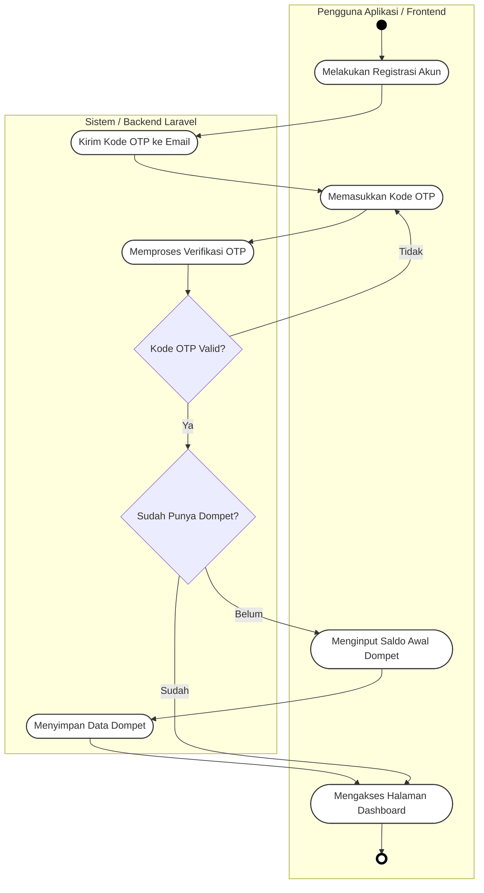
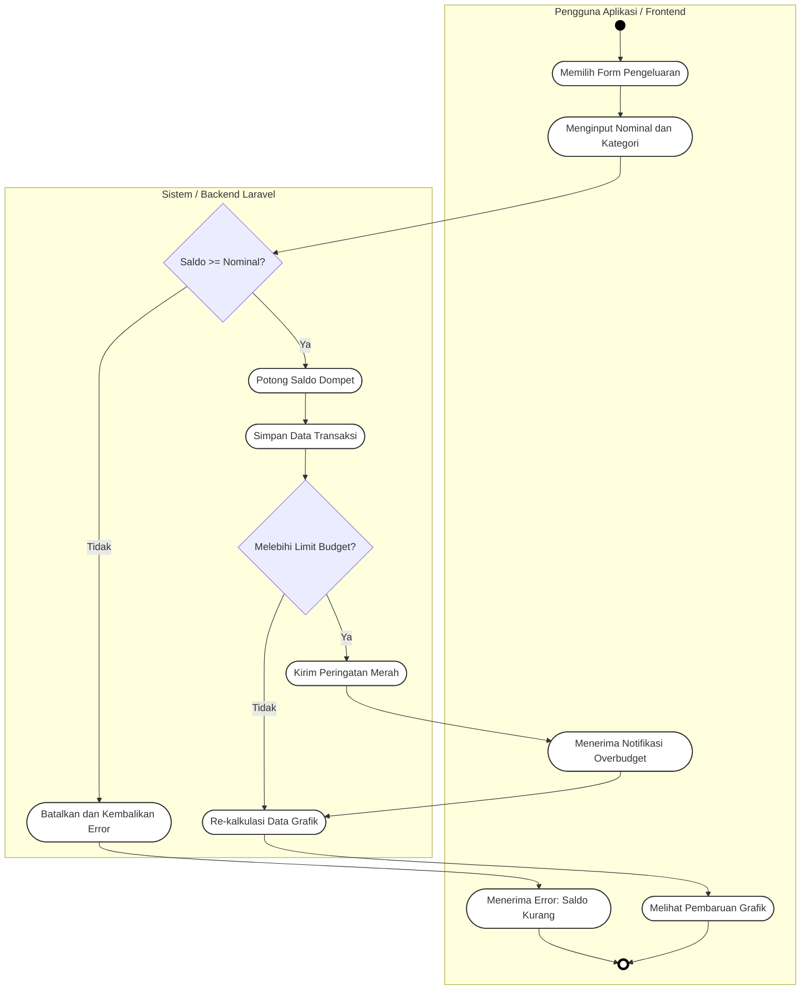
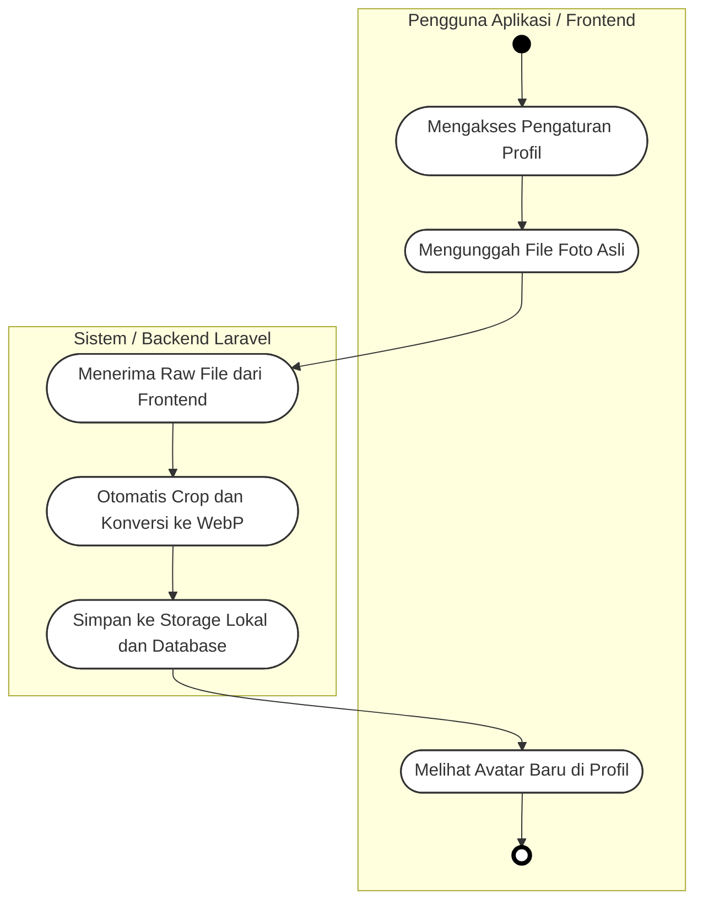

# 3.5.2 Activity Diagram

*Activity Diagram* ini memodelkan aliran kerja dinamis (*dynamic workflow*) dan logika operasional dari sistem **Sapopoe**. Untuk memberikan representasi teknis yang akurat, diagram ini mengimplementasikan arsitektur *Swimlane* (kolom partisi) yang memisahkan batas tanggung jawab antara aktivitas di sisi klien (**Pengguna/Frontend**) dan pemrosesan logika di sisi server (**Sistem/Backend Laravel**).

---

## A. Skenario 1: Registrasi, Verifikasi OTP, dan Inisialisasi Dompet

Skenario ini memetakan alur keamanan awal. Sistem mewajibkan verifikasi identitas (OTP via Gmail) dan memastikan tidak ada pengguna yang dapat mengakses *Dashboard* sebelum mereka mendaftarkan dompet keuangan pertama mereka.

**Penjelasan Alur:**

| Langkah | Aktor | Aktivitas |
|---|---|---|
| 1 | Pengguna | Melakukan registrasi akun baru |
| 2 | Sistem | Mengirimkan kode OTP ke email pengguna |
| 3 | Pengguna | Memasukkan kode OTP yang diterima |
| 4 | Sistem | Memverifikasi kode OTP — jika **tidak valid**, kembali ke langkah 3 |
| 5 | Sistem | Mengecek apakah pengguna sudah memiliki dompet |
| 6 | Pengguna | Jika **belum**, menginput saldo awal dompet pertama |
| 7 | Sistem | Menyimpan data dompet ke database |
| 8 | Pengguna | Mengakses halaman Dashboard |

---

## B. Skenario 2: Pencatatan Pengeluaran & Pengecekan Budget *(Strict Balance)*

Skenario ini menggambarkan alur pencatatan transaksi pengeluaran dengan dua validasi bertingkat: validasi kecukupan saldo dan pengecekan batas anggaran (*budget limit*).

**Penjelasan Alur:**

| Langkah | Aktor | Aktivitas |
|---|---|---|
| 1 | Pengguna | Membuka form dan memilih menu pengeluaran |
| 2 | Pengguna | Menginput nominal dan kategori transaksi |
| 3 | Sistem | Mengecek apakah saldo dompet mencukupi nominal |
| 4a | Sistem | Jika **tidak cukup**: membatalkan transaksi dan mengembalikan pesan error |
| 4b | Pengguna | Menerima notifikasi error saldo kurang → alur selesai |
| 5 | Sistem | Jika **cukup**: memotong saldo dompet |
| 6 | Sistem | Menyimpan data transaksi ke database |
| 7 | Sistem | Mengecek apakah pengeluaran melebihi limit budget kategori |
| 8a | Sistem | Jika **melebihi**: mengirim peringatan visual merah ke frontend |
| 8b | Pengguna | Menerima notifikasi overbudget |
| 9 | Sistem | Re-kalkulasi data grafik (baik overbudget maupun tidak) |
| 10 | Pengguna | Melihat pembaruan grafik di Dashboard |

---

## C. Skenario 3: Manajemen Profil & Pemrosesan Gambar *(WebP)*

Skenario ini memetakan alur pembaruan foto profil pengguna. Sistem secara otomatis melakukan *crop* dan konversi format gambar ke WebP untuk efisiensi penyimpanan sebelum disimpan ke *storage*.

**Penjelasan Alur:**

| Langkah | Aktor | Aktivitas |
|---|---|---|
| 1 | Pengguna | Membuka halaman pengaturan profil |
| 2 | Pengguna | Memilih dan mengunggah file foto dari perangkat |
| 3 | Sistem | Menerima *raw file* yang dikirim dari frontend |
| 4 | Sistem | Secara otomatis melakukan *crop* dan konversi format ke WebP |
| 5 | Sistem | Menyimpan file hasil konversi ke *local storage* dan memperbarui path di database |
| 6 | Pengguna | Melihat avatar baru tampil di halaman profil |

---

## Keterangan Simbol

| Simbol | Nama | Keterangan |
|---|---|---|
| ● (lingkaran hitam penuh) | *Start Point / Initial State* | Titik awal dari alur aktivitas |
| ◎ (lingkaran putih border tebal) | *End Point / End State* | Titik akhir dari alur aktivitas |
| Kotak sudut bulat | *Activity* | Aktivitas atau aksi yang dilakukan aktor/sistem |
| Belah ketupat | *Decision* | Percabangan kondisional (Ya/Tidak) |
| Garis panah | *Transition* | Menunjukkan arah alur dari satu aktivitas ke aktivitas berikutnya |
| Kotak besar berlabel | *Swimlane* | Partisi yang memisahkan tanggung jawab antar aktor |
