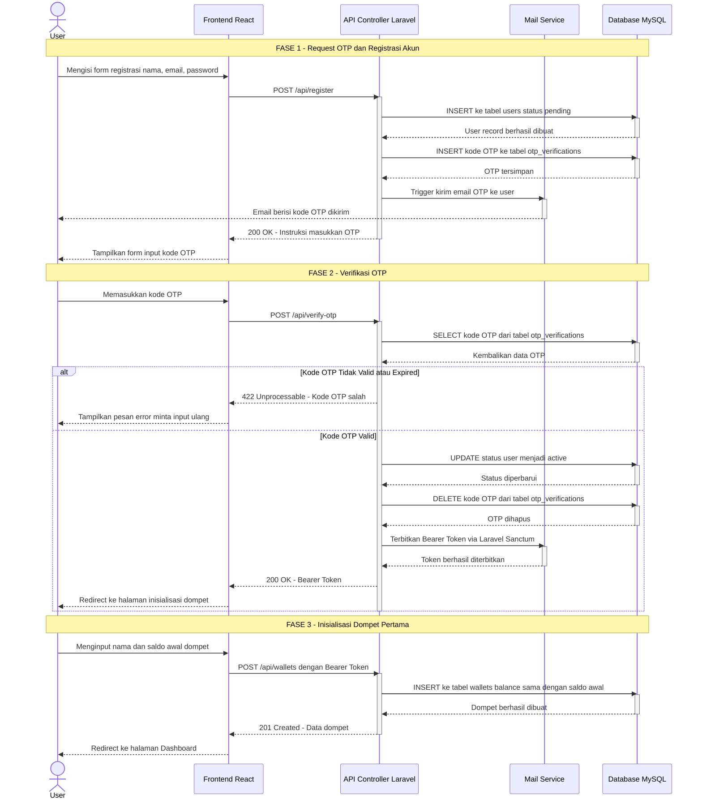
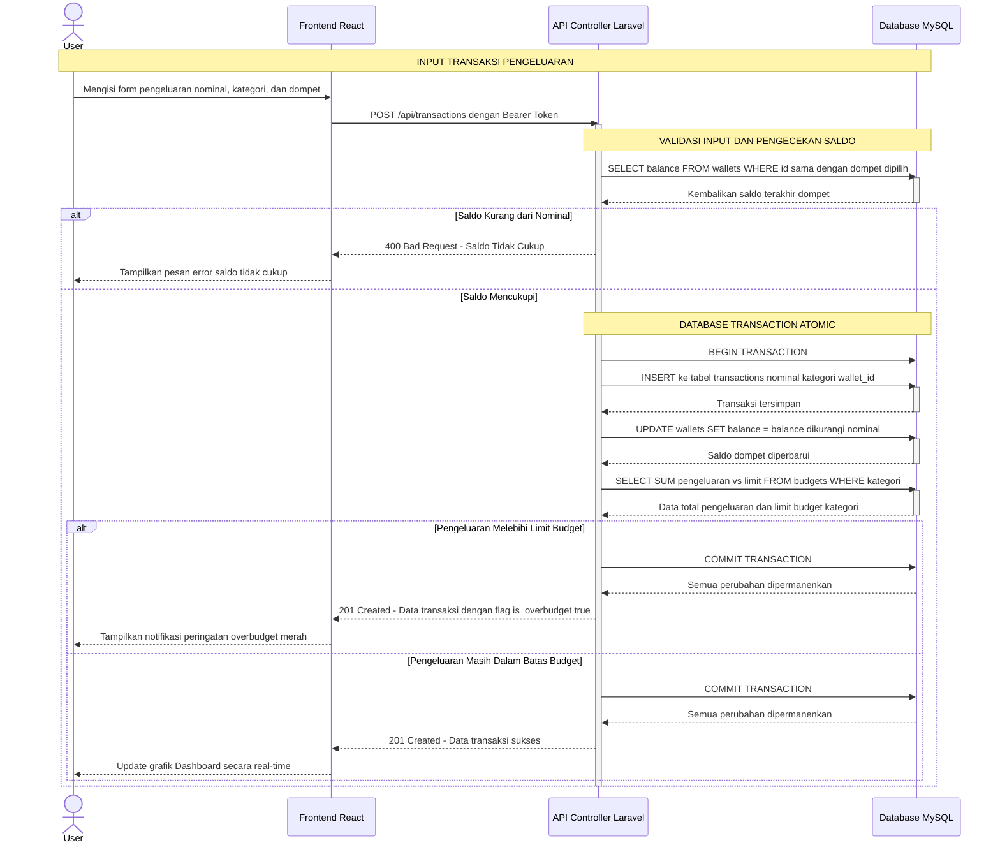
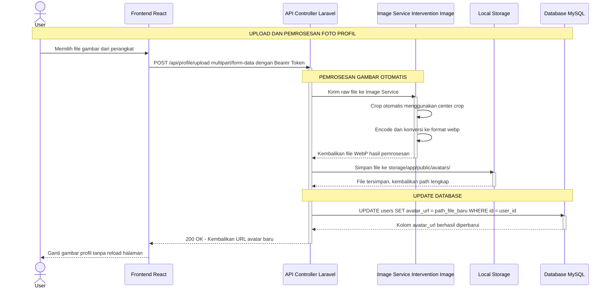
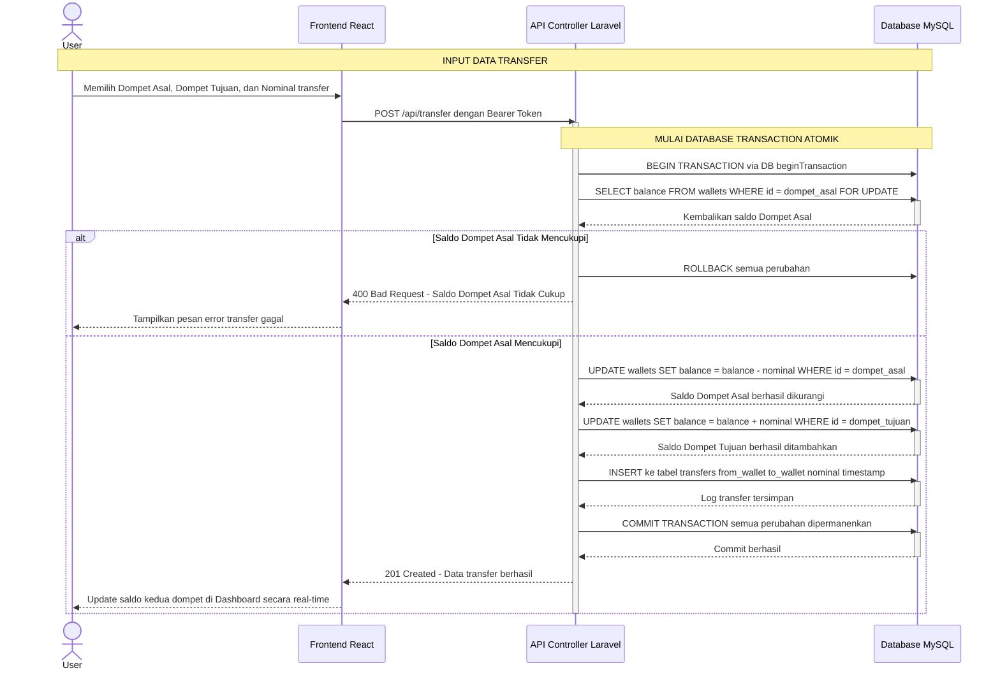

# 3.5.3 Sequence Diagram

*Sequence Diagram* ini menggambarkan interaksi antar objek-objek dalam sistem **Sapopoe** secara terperinci dan berurutan berdasarkan waktu. Diagram ini memiliki dua dimensi: **dimensi vertikal** yang menunjukkan urutan waktu, dan **dimensi horizontal** yang menunjukkan objek-objek yang terlibat.

Objek utama yang terlibat di setiap alur adalah:
- **User** — Aktor utama yang berinteraksi dengan sistem
- **Frontend (React)** — Antarmuka pengguna
- **API Controller (Laravel)** — Pengendali logika bisnis di sisi server
- **Middleware / Service** — Lapisan layanan pendukung (Auth, Mail, Image)
- **Database (MySQL)** — Penyimpanan data permanen

---

## Keterangan Simbol

| Simbol | Nama | Keterangan |
|---|---|---|
| Kotak persegi panjang di atas | **Objek / Lifeline Head** | Merepresentasikan objek atau aktor yang terlibat |
| Garis putus-putus vertikal | **Lifeline** | Menggambarkan keberadaan objek selama interaksi berlangsung |
| Kotak tipis pada lifeline | **Activation Box** | Menunjukkan periode waktu objek sedang aktif memproses |
| Panah solid `->>`  | **Synchronous Message** | Pesan sinkron — pengirim menunggu balasan sebelum lanjut |
| Panah putus `-->>`  | **Return Message** | Pesan balasan dari objek yang dikirimi |
| `alt` | **Alternative Fragment** | Blok kondisional — percabangan jika/maka/selain itu |
| `[kondisi]` | **Guard** | Kondisi penjaga yang harus terpenuhi agar blok dijalankan |

---

## A. Skenario 1: Registrasi, Verifikasi OTP, dan Inisialisasi Dompet

Alur ini memetakan proses keamanan awal sistem. Sistem mewajibkan verifikasi identitas melalui OTP via Gmail dan memastikan pengguna baru mendaftarkan dompet pertama sebelum dapat mengakses Dashboard.

**Penjelasan Alur:**

| # | Objek Pengirim | Objek Penerima | Pesan / Aksi |
|---|---|---|---|
| 1 | User | Frontend | Isi form registrasi (nama, email, password) |
| 2 | Frontend | API Controller | `POST /api/register` |
| 3 | API Controller | Database | `INSERT` data user (status: *pending*) |
| 4 | API Controller | Database | `INSERT` kode OTP ke `otp_verifications` |
| 5 | API Controller | Mail Service | Trigger kirim email OTP |
| 6 | Mail Service | User | Email OTP terkirim ke inbox |
| 7 | User | Frontend | Input kode OTP yang diterima |
| 8 | Frontend | API Controller | `POST /api/verify-otp` |
| 9 | API Controller | Database | Cocokkan kode OTP di database |
| 10 *(alt: gagal)* | API Controller | Frontend | `422` — OTP salah atau expired |
| 10 *(alt: berhasil)* | API Controller | Database | `UPDATE` status → `active`, `DELETE` OTP |
| 11 | API Controller | Mail Service (Sanctum) | Terbitkan Bearer Token |
| 12 | User | Frontend | Input nama dan saldo awal dompet |
| 13 | Frontend | API Controller | `POST /api/wallets` + Bearer Token |
| 14 | API Controller | Database | `INSERT` ke tabel `wallets` |
| 15 | Frontend | User | Redirect ke Dashboard |

---

## B. Skenario 2: Pencatatan Transaksi Pengeluaran *(Strict Balance Flow)*

Alur paling krusial yang melibatkan validasi bertingkat: pengecekan kecukupan saldo sebelum transaksi disimpan, dan evaluasi limit budget setelah transaksi berhasil. Seluruh operasi database bersifat atomik.

**Penjelasan Alur:**

| # | Objek Pengirim | Objek Penerima | Pesan / Aksi |
|---|---|---|---|
| 1 | User | Frontend | Isi form pengeluaran (nominal, kategori, dompet) |
| 2 | Frontend | API Controller | `POST /api/transactions` + Bearer Token |
| 3 | API Controller | Database | `SELECT balance` dari `wallets` |
| 4 *(alt: saldo kurang)* | API Controller | Frontend | `400 Bad Request` — saldo tidak cukup |
| 5 *(alt: saldo cukup)* | API Controller | Database | `BEGIN TRANSACTION` |
| 6 | API Controller | Database | `INSERT` record ke `transactions` |
| 7 | API Controller | Database | `UPDATE` kurangi saldo di `wallets` |
| 8 | API Controller | Database | `SELECT` total pengeluaran vs limit `budgets` |
| 9a *(overbudget)* | API Controller | Frontend | `201` + flag `is_overbudget: true` |
| 9b *(normal)* | API Controller | Frontend | `201` + data transaksi sukses |
| 10 | Frontend | User | Update grafik / tampilkan notifikasi |

---

## C. Skenario 3: Manajemen Profil & Pemrosesan Gambar *(WebP Processing Flow)*

Alur ini menjelaskan bagaimana sistem memproses foto profil yang diunggah pengguna: melakukan *crop* otomatis, konversi format ke WebP, menyimpan file ke storage, dan memperbarui database tanpa memerlukan *reload* halaman.

**Penjelasan Alur:**

| # | Objek Pengirim | Objek Penerima | Pesan / Aksi |
|---|---|---|---|
| 1 | User | Frontend | Pilih file gambar dari perangkat |
| 2 | Frontend | API Controller | `POST /api/profile/upload` multipart/form-data |
| 3 | API Controller | Image Service | Kirim *raw file* untuk diproses |
| 4 | Image Service | Image Service | *Self-message*: crop otomatis (center) |
| 5 | Image Service | Image Service | *Self-message*: encode ke `.webp` |
| 6 | Image Service | API Controller | Kembalikan file WebP hasil proses |
| 7 | API Controller | Local Storage | Simpan ke `storage/app/public/avatars/` |
| 8 | Local Storage | API Controller | Kembalikan path file tersimpan |
| 9 | API Controller | Database | `UPDATE avatar_url` di tabel `users` |
| 10 | API Controller | Frontend | `200 OK` + URL avatar baru |
| 11 | Frontend | User | Tampilkan foto profil baru tanpa reload |

---

## D. Skenario 4: Transfer Antar Dompet *(Atomic Transaction Flow)*

Alur ini menjelaskan pemindahan saldo antar dompet menggunakan mekanisme *database transaction* atomik. Jika salah satu operasi gagal di tengah proses, seluruh transaksi dibatalkan (*rollback*) untuk menjaga konsistensi saldo.

**Penjelasan Alur:**

| # | Objek Pengirim | Objek Penerima | Pesan / Aksi |
|---|---|---|---|
| 1 | User | Frontend | Pilih dompet asal, tujuan, dan nominal |
| 2 | Frontend | API Controller | `POST /api/transfer` + Bearer Token |
| 3 | API Controller | Database | `BEGIN TRANSACTION` |
| 4 | API Controller | Database | `SELECT balance` Dompet Asal (`FOR UPDATE`) |
| 5 *(alt: gagal)* | API Controller | Database | `ROLLBACK` — batalkan semua |
| 5 *(alt: berhasil)* | API Controller | Database | `UPDATE` kurangi saldo Dompet Asal |
| 6 | API Controller | Database | `UPDATE` tambah saldo Dompet Tujuan |
| 7 | API Controller | Database | `INSERT` log ke tabel `transfers` |
| 8 | API Controller | Database | `COMMIT TRANSACTION` |
| 9 | API Controller | Frontend | `201 Created` — transfer berhasil |
| 10 | Frontend | User | Tampilkan saldo terbaru kedua dompet |
