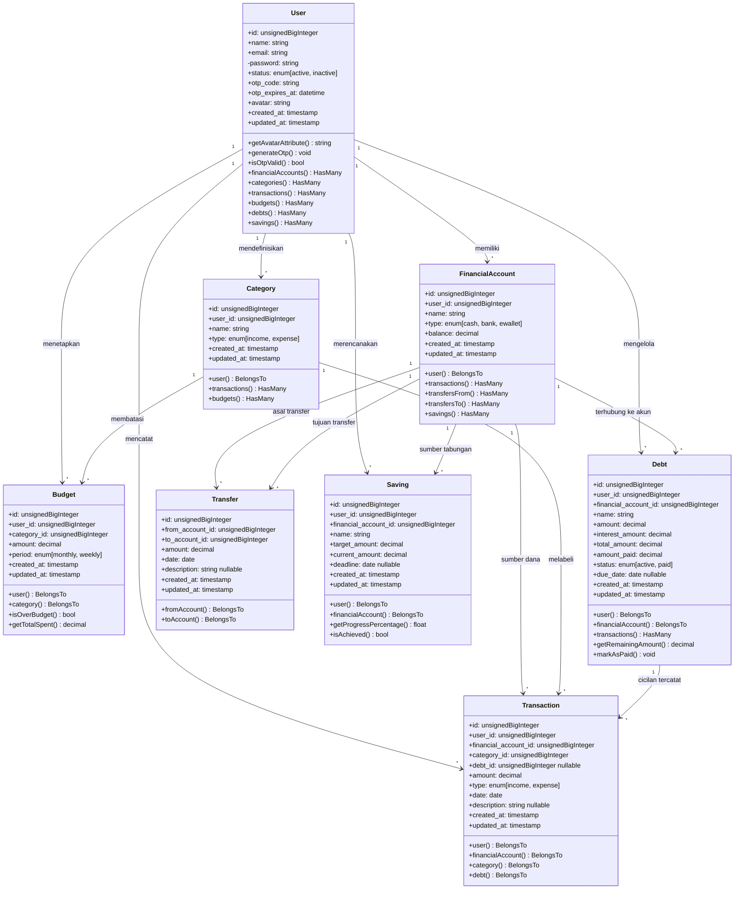

# 3.5.4 Class Diagram

*Class Diagram* atau Diagram Kelas adalah salah satu jenis diagram struktur pada UML yang menggambarkan dengan jelas struktur serta deskripsi *class*, atribut, metode, dan hubungan dari setiap objek. Berbeda dengan *Activity* dan *Sequence Diagram* yang bersifat dinamis, *Class Diagram* bersifat **statis** — ia tidak menjelaskan apa yang *terjadi* saat kelas berhubungan, melainkan menjelaskan *hubungan apa* yang terjadi antar kelas.

Pada sistem **Sapopoe**, *Class Diagram* ini merepresentasikan seluruh **Model Eloquent Laravel** beserta atribut, metode, dan relasi antar model yang membentuk struktur database aplikasi manajemen keuangan pribadi ini.

---

## Keterangan Komponen

Setiap kelas dalam diagram terdiri dari tiga bagian sesuai standar UML:

| Bagian | Isi | Keterangan |
|---|---|---|
| **Atas** | Nama *Class* | Nama model Laravel (ex: `User`, `Transaction`) |
| **Tengah** | Atribut | Kolom database beserta tipe data (`+nama: tipe`) |
| **Bawah** | Metode / Operasi | Method Eloquent, accessor, dan logika bisnis |

### Notasi Visibilitas Atribut

| Simbol | Nama | Keterangan |
|---|---|---|
| `+` | Public | Dapat diakses dari luar kelas |
| `-` | Private | Hanya dapat diakses dari dalam kelas |
| `#` | Protected | Dapat diakses oleh kelas turunan |

### Notasi Hubungan Antar Kelas

| Notasi | Jenis Relasi | Keterangan |
|---|---|---|
| `1 --> *` | Asosiasi (1 ke Banyak) | Satu objek berelasi dengan banyak objek lain |
| `* --> 1` | Asosiasi (Banyak ke 1) | Banyak objek berelasi ke satu objek induk |
| `1 o-- *` | Agregasi | Bagian dari kelas lain, namun dapat berdiri sendiri |
| `<\|--` | Pewarisan (Inheritance) | Subclass mewarisi atribut dan metode superclass |

---

## Diagram Kelas Sistem Sapopoe

---

## Penjelasan Detail Per Class

### 1. Class `User` — Entitas Inti Sistem

*Class* `User` adalah pusat dari seluruh data dalam sistem Sapopoe. Semua model lain berelasi langsung ke `User` melalui `user_id`, mengimplementasikan pola **Strict Data Ownership**.

| Atribut | Tipe | Keterangan |
|---|---|---|
| `id` | `unsignedBigInteger` | Primary key otomatis |
| `name` | `string` | Nama lengkap pengguna |
| `email` | `string` | Email unik, digunakan untuk login dan OTP |
| `password` | `string` | Hash bcrypt, visibilitas *private* |
| `status` | `enum` | `active` atau `inactive` |
| `otp_code` | `string` | Kode OTP sementara untuk verifikasi |
| `otp_expires_at` | `datetime` | Masa berlaku kode OTP |
| `avatar` | `string` | Path file WebP hasil konversi |

**Metode Khusus:**
- `getAvatarAttribute()` — *Accessor* yang mengonversi path file menjadi URL lengkap atau mengembalikan URL eksternal secara otomatis
- `generateOtp()` — Membuat kode OTP baru dan menyimpan waktu kedaluwarsa
- `isOtpValid()` — Memvalidasi kode dan mengecek apakah belum melewati `otp_expires_at`

---

### 2. Class `FinancialAccount` — Dompet & Rekening

Merepresentasikan aset keuangan nyata: dompet fisik, rekening bank, atau e-wallet.

| Atribut | Tipe | Keterangan |
|---|---|---|
| `name` | `string` | Nama akun (ex: BCA, Kas, GoPay) |
| `type` | `enum` | `cash`, `bank`, atau `ewallet` |
| `balance` | `decimal` | Saldo terkini, diperbarui setiap transaksi |

---

### 3. Class `Transaction` — Jurnal Arus Kas

Merekam setiap pemasukan (*income*) dan pengeluaran (*expense*) harian.

| Atribut | Tipe | Keterangan |
|---|---|---|
| `amount` | `decimal` | Nominal transaksi |
| `type` | `enum` | `income` atau `expense` |
| `date` | `date` | Tanggal transaksi dicatat |
| `debt_id` | `unsignedBigInteger` | *Nullable* — diisi jika transaksi merupakan cicilan hutang |

**Logika Bisnis:** Atribut `debt_id` bersifat opsional. Jika diisi, transaksi ini sekaligus akan mengurangi sisa hutang pada model `Debt` — mengintegrasikan buku besar transaksi dengan modul manajemen hutang.

---

### 4. Class `Category` — Label Transaksi

Pengelompokan transaksi berdasarkan jenis pengeluaran atau pemasukan (Makanan, Transportasi, Gaji, dll).

| Atribut | Tipe | Keterangan |
|---|---|---|
| `name` | `string` | Nama kategori (ex: Food, Transport) |
| `type` | `enum` | `income` atau `expense` |

---

### 5. Class `Budget` — Batas Anggaran Per Kategori

Menetapkan plafon pengeluaran untuk kategori tertentu dalam periode waktu.

| Atribut | Tipe | Keterangan |
|---|---|---|
| `amount` | `decimal` | Batas maksimal pengeluaran |
| `period` | `enum` | `monthly` atau `weekly` |

**Metode Khusus:**
- `getTotalSpent()` — Menghitung total pengeluaran aktual kategori ini dalam periode berlaku
- `isOverBudget()` — Mengembalikan `true` jika total pengeluaran melampaui `amount`

---

### 6. Class `Debt` — Hutang dan Piutang

Manajemen pinjaman dengan pihak ketiga, lengkap dengan perhitungan bunga dan status pelunasan.

| Atribut | Tipe | Keterangan |
|---|---|---|
| `name` | `string` | Nama orang atau lembaga pemberi/penerima pinjaman |
| `amount` | `decimal` | Pokok pinjaman |
| `interest_amount` | `decimal` | Besaran bunga |
| `total_amount` | `decimal` | Total tagihan (pokok + bunga) |
| `amount_paid` | `decimal` | Total yang sudah dibayarkan |
| `status` | `enum` | `active` atau `paid` |
| `due_date` | `date` | Jatuh tempo, bersifat opsional |

**Metode Khusus:**
- `getRemainingAmount()` — Menghitung sisa hutang: `total_amount - amount_paid`
- `markAsPaid()` — Mengubah status menjadi `paid` saat hutang lunas

---

### 7. Class `Transfer` — Mutasi Antar Akun

Mencatat perpindahan saldo antara dua `FinancialAccount` milik pengguna yang sama.

| Atribut | Tipe | Keterangan |
|---|---|---|
| `from_account_id` | `unsignedBigInteger` | Foreign key ke akun sumber |
| `to_account_id` | `unsignedBigInteger` | Foreign key ke akun tujuan |
| `amount` | `decimal` | Nominal yang dipindahkan |

**Catatan Relasi:** `Transfer` berelasi dua kali ke `FinancialAccount` (sebagai asal dan tujuan), sehingga memiliki dua method `BelongsTo`: `fromAccount()` dan `toAccount()`.

---

### 8. Class `Saving` — Rencana Menabung

Fitur target tabungan dengan progres yang dapat dipantau.

| Atribut | Tipe | Keterangan |
|---|---|---|
| `name` | `string` | Nama tujuan tabungan (ex: Liburan, Laptop) |
| `target_amount` | `decimal` | Nominal target yang ingin dicapai |
| `current_amount` | `decimal` | Saldo tabungan yang sudah terkumpul |
| `deadline` | `date` | Batas waktu target, bersifat opsional |

**Metode Khusus:**
- `getProgressPercentage()` — Menghitung persentase: `(current_amount / target_amount) * 100`
- `isAchieved()` — Mengembalikan `true` jika `current_amount >= target_amount`

---

## Peta Relasi Antar Class

| Class Asal | Relasi | Class Tujuan | Keterangan Logika Bisnis |
|---|---|---|---|
| `User` | `1 --> *` | `FinancialAccount` | Satu user memiliki banyak akun/dompet |
| `User` | `1 --> *` | `Transaction` | Seluruh transaksi terikat ke satu user |
| `User` | `1 --> *` | `Category` | Kategori bersifat personal per user |
| `User` | `1 --> *` | `Budget` | Anggaran didefinisikan per user |
| `User` | `1 --> *` | `Debt` | Hutang dikelola secara pribadi |
| `User` | `1 --> *` | `Saving` | Target tabungan milik user |
| `FinancialAccount` | `1 --> *` | `Transaction` | Setiap transaksi menggunakan satu akun sebagai sumber dana |
| `Category` | `1 --> *` | `Transaction` | Transaksi dilabeli dengan satu kategori |
| `Category` | `1 --> *` | `Budget` | Budget ditetapkan per kategori |
| `Debt` | `1 --> *` | `Transaction` | Cicilan hutang tercatat sebagai transaksi pengeluaran |
| `FinancialAccount` | `1 --> *` | `Transfer` | Satu akun bisa menjadi sumber banyak transfer |
| `FinancialAccount` | `1 --> *` | `Transfer` | Satu akun bisa menjadi tujuan banyak transfer |
| `FinancialAccount` | `1 --> *` | `Saving` | Tabungan dihubungkan ke akun tertentu sebagai wadah dana |
| `FinancialAccount` | `1 --> *` | `Debt` | Hutang dikaitkan ke akun untuk pencatatan arus kas |
