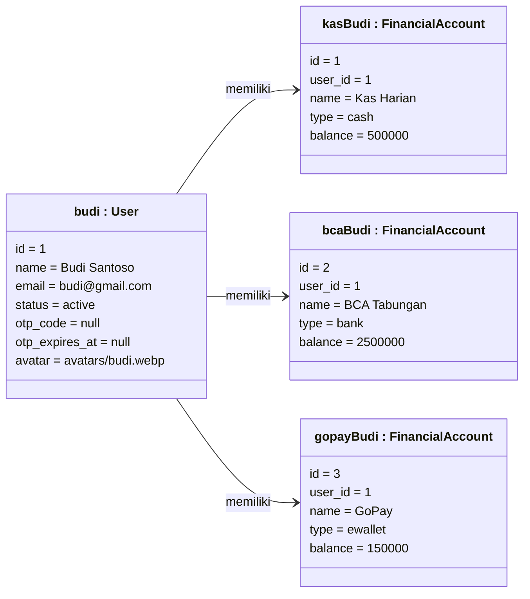
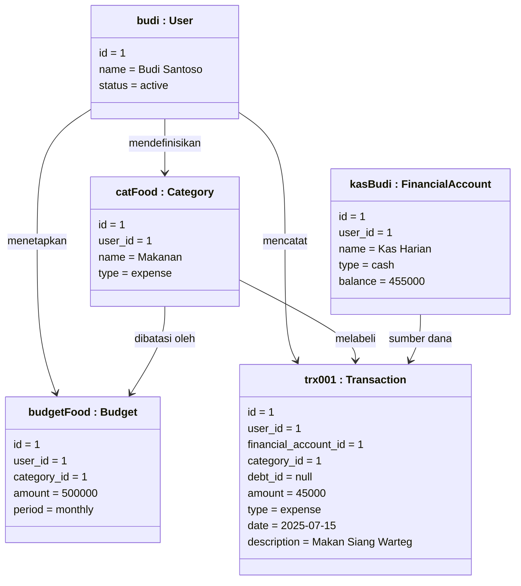
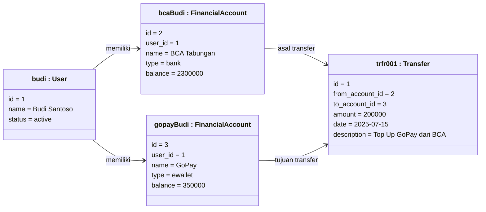
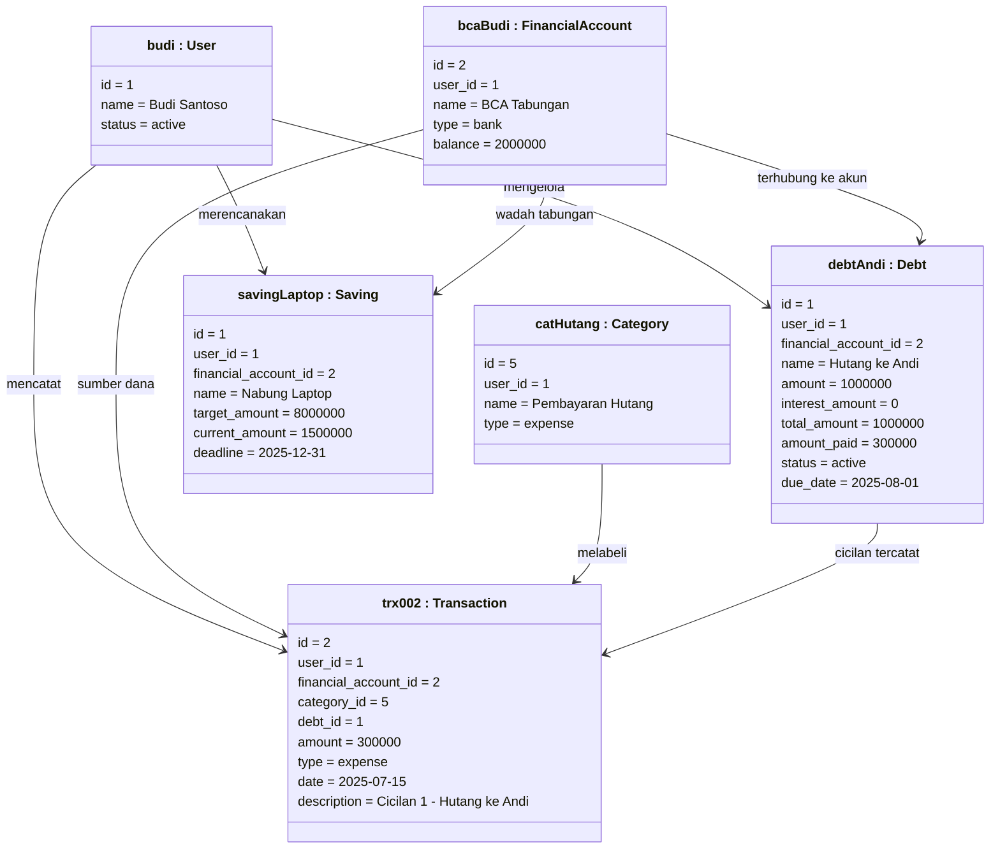

# 3.5.5 Object Diagram

*Object Diagram* adalah instansiasi dari *Class Diagram* — ia menampilkan **snapshot** (gambaran sesaat) dari kondisi nyata sistem pada suatu titik waktu tertentu saat aplikasi sedang berjalan (*runtime*). Jika *Class Diagram* menggambarkan *cetak biru* struktur sistem secara abstrak, maka *Object Diagram* menggambarkan **contoh konkret** dari cetak biru tersebut dengan nilai data yang sesungguhnya.

Setiap objek dalam diagram ini merepresentasikan sebuah **instance** dari class yang telah didefinisikan di *Class Diagram* (3.5.4), dengan format penamaan:

```
namaObjek : NamaClass
```

Atribut di dalam setiap objek memiliki **nilai nyata** yang ditetapkan, bukan sekadar tipe data.

---

## Keterangan Simbol

| Simbol | Keterangan |
|---|---|
| Kotak persegi dengan nama **bergaris bawah** | Objek (*instance* dari sebuah class) |
| `namaObjek : NamaClass` | Format penamaan objek — nama instance diikuti nama classnya |
| `atribut = nilai` | Nilai atribut yang konkret pada saat *snapshot* |
| Garis penghubung antar objek | *Link* — instansiasi dari asosiasi/relasi di *Class Diagram* |
| Label pada garis | Nama peran atau nama relasi antar objek |

---

## Skenario Snapshot

Dokumen ini memvisualisasikan **4 skenario snapshot** yang merepresentasikan kondisi sistem Sapopoe pada momen-momen operasional kunci:

1. Snapshot saat pengguna baru selesai registrasi dan memiliki dompet pertama
2. Snapshot saat transaksi pengeluaran dicatat dan budget diperiksa
3. Snapshot saat transfer antar dompet dilakukan
4. Snapshot saat manajemen hutang dengan cicilan tercatat

---

## A. Snapshot 1: Pengguna Aktif dengan Dompet Pertama

Kondisi sistem sesaat setelah pengguna **Budi Santoso** berhasil menyelesaikan registrasi, verifikasi OTP, dan menginisialisasi dompet pertamanya.



**Penjelasan Snapshot:**

| Objek | Class | Nilai Penting |
|---|---|---|
| `budi` | `User` | Status `active` — OTP sudah terhapus setelah verifikasi berhasil |
| `kasBudi` | `FinancialAccount` | Dompet tunai dengan saldo awal Rp500.000 |
| `bcaBudi` | `FinancialAccount` | Rekening bank dengan saldo Rp2.500.000 |
| `gopayBudi` | `FinancialAccount` | E-wallet GoPay dengan saldo Rp150.000 |

---

## B. Snapshot 2: Transaksi Pengeluaran dan Pengecekan Budget

Kondisi sistem sesaat setelah Budi mencatat pengeluaran makan siang sebesar Rp45.000 dari Kas Harian, dan sistem mengecek apakah pengeluaran kategori *Food* sudah melebihi budget bulanan.



**Penjelasan Snapshot:**

| Objek | Class | Nilai Penting |
|---|---|---|
| `trx001` | `Transaction` | Pengeluaran Rp45.000 untuk kategori Makanan, `debt_id = null` artinya bukan cicilan |
| `kasBudi` | `FinancialAccount` | Saldo sudah terpotong: Rp500.000 − Rp45.000 = **Rp455.000** |
| `budgetFood` | `Budget` | Batas budget makanan Rp500.000/bulan — pengeluaran saat ini masih aman |
| `catFood` | `Category` | Kategori `expense` yang menghubungkan transaksi dengan budget |

---

## C. Snapshot 3: Transfer Antar Dompet

Kondisi sistem sesaat setelah Budi melakukan transfer saldo sebesar Rp200.000 dari rekening BCA ke GoPay untuk keperluan sehari-hari. Operasi menggunakan *atomic transaction*.



**Penjelasan Snapshot:**

| Objek | Class | Nilai Penting |
|---|---|---|
| `trfr001` | `Transfer` | Mencatat mutasi Rp200.000 dari `from_account_id = 2` ke `to_account_id = 3` |
| `bcaBudi` | `FinancialAccount` | Saldo berkurang: Rp2.500.000 − Rp200.000 = **Rp2.300.000** |
| `gopayBudi` | `FinancialAccount` | Saldo bertambah: Rp150.000 + Rp200.000 = **Rp350.000** |

---

## D. Snapshot 4: Manajemen Hutang dengan Cicilan Tercatat

Kondisi sistem yang menggambarkan Budi memiliki hutang kepada rekannya (Andi) sebesar Rp1.000.000 dan baru saja melakukan pembayaran cicilan pertama sebesar Rp300.000 dari rekening BCA. Cicilan tersebut secara otomatis tercatat sebagai transaksi pengeluaran dan mengurangi sisa hutang.



**Penjelasan Snapshot:**

| Objek | Class | Nilai Penting |
|---|---|---|
| `debtAndi` | `Debt` | Pokok hutang Rp1.000.000, sudah dibayar Rp300.000, sisa = **Rp700.000**, status masih `active` |
| `trx002` | `Transaction` | `debt_id = 1` — integrasi hutang dengan buku besar transaksi; cicilan ini mengurangi `amount_paid` pada `debtAndi` |
| `bcaBudi` | `FinancialAccount` | Saldo setelah cicilan: Rp2.300.000 − Rp300.000 = **Rp2.000.000** |
| `savingLaptop` | `Saving` | Target Rp8.000.000, terkumpul Rp1.500.000 — progres **18,75%**, deadline akhir 2025 |

---

## Perbandingan Class Diagram vs Object Diagram

| Aspek | Class Diagram (3.5.4) | Object Diagram (3.5.5) |
|---|---|---|
| **Sifat** | Statis / abstrak | Snapshot / konkret |
| **Isi** | Nama class, tipe atribut, metode | Nama instance, nilai atribut nyata |
| **Penamaan** | `User`, `Transaction` | `budi : User`, `trx001 : Transaction` |
| **Atribut** | `balance: decimal` | `balance = 455000` |
| **Relasi** | Asosiasi antar class | *Link* antar instance objek |
| **Waktu** | Tidak terikat waktu | Merepresentasikan titik waktu tertentu |
| **Tujuan** | Merancang struktur sistem | Memverifikasi dan mengilustrasikan skenario nyata |

---

## Ringkasan Objek Per Skenario

| Snapshot | Objek yang Terlibat | Momen yang Digambarkan |
|---|---|---|
| **A** | `budi`, `kasBudi`, `bcaBudi`, `gopayBudi` | Setelah registrasi selesai, tiga dompet aktif |
| **B** | `budi`, `catFood`, `budgetFood`, `kasBudi`, `trx001` | Pencatatan pengeluaran makan, saldo terpotong |
| **C** | `budi`, `bcaBudi`, `gopayBudi`, `trfr001` | Transfer antar dompet selesai, dua saldo berubah |
| **D** | `budi`, `debtAndi`, `bcaBudi`, `catHutang`, `trx002`, `savingLaptop` | Cicilan hutang dicatat, terintegrasi ke transaksi |
