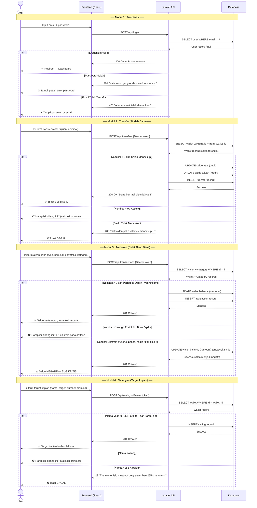
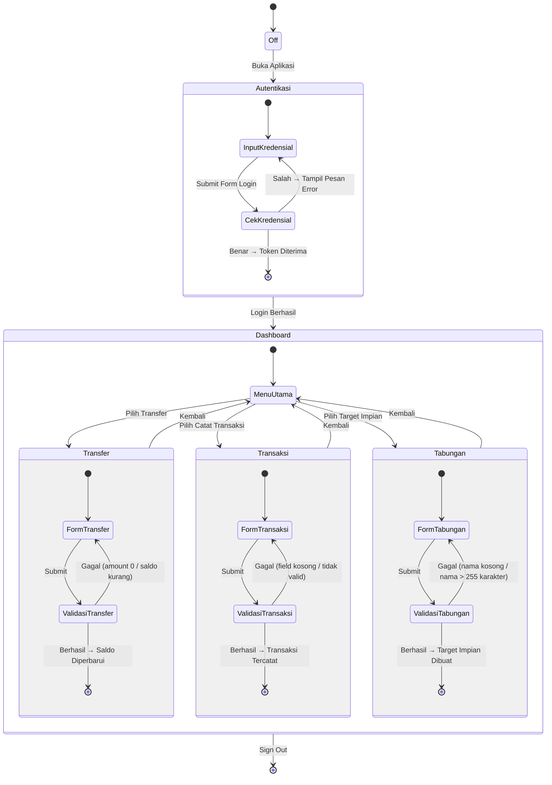

# BB-06 — Behaviour Testing
## Sistem: SaPoPoe FINANCE (Midnight Finance)
## Teknik: Black Box Testing — Behaviour Testing (BDD)

---

> **Definisi Teknik:**
> Behaviour Testing (juga dikenal sebagai **Behavior-Driven Development / BDD**) adalah pendekatan pengujian perangkat lunak yang **berfokus pada perilaku yang diharapkan dari suatu program dari sudut pandang pengguna**. Pengujian ini menggunakan diagram UML untuk menggambarkan interaksi dan alur sistem secara keseluruhan:
> - **Diagram Sequence** — menggambarkan interaksi antar objek dalam berkomunikasi saling mengirim message berdasarkan urutan waktu
> - **Statechart UML** — diagram yang menggambarkan kelakuan sistem secara keseluruhan melalui state dan transisi antar state
>
> — Materi Pertemuan 11, Software Quality, T Informatika UKRI

---

## Diagram Sequence — SaPoPoe FINANCE

> Menggambarkan **interaksi antar objek** (User ↔ Frontend ↔ Laravel API ↔ Database) untuk seluruh 4 modul berdasarkan urutan waktu.



---

## Statechart UML — SaPoPoe FINANCE

> Menggambarkan **kelakuan sistem secara keseluruhan** melalui state (keadaan) dan transisi antar state untuk seluruh 4 modul.



---

## Modul 1 — Autentikasi: `User::login()`

### Kasus Uji Behaviour (Given-When-Then)

| ID | Skenario | Given | When | Then | Actual Output | Status |
|---|---|---|---|---|---|---|
| TC1 | Login dengan kredensial valid | User terdaftar dengan email `sultan@test.com` dan password `password123` | User mengisi form login dan klik MASUK | Sistem memvalidasi token Sanctum dan me-redirect ke Dashboard | Dashboard berhasil tampil — "Sultan Keuangan" | ✅ Passed |
| TC2 | Login dengan password salah | User terdaftar dengan email `sultan@test.com` | User memasukkan password `salahpassword` dan klik MASUK | Sistem menolak login dan menampilkan pesan error password | "Kata sandi yang Anda masukkan salah." | ✅ Passed |
| TC3 | Login dengan email tidak terdaftar | Email `tidakada@test.com` tidak ada di database | User memasukkan email tersebut dengan password apapun dan klik MASUK | Sistem menolak login dan menampilkan pesan error email | "Alamat email tidak ditemukan. Silakan buat akun terlebih dahulu." | ✅ Passed |


---

> **Analisis SQA — Behaviour Auth:**
> Sistem berperilaku sesuai ekspektasi dari sudut pandang pengguna pada seluruh 3 skenario. State `InputKredensial → CekKredensial` dieksekusi dengan benar — valid menghasilkan transisi ke Dashboard, tidak valid menghasilkan kembali ke state error. Seluruh 3 TC Passed.

---

## Modul 2 — Transfer: `Transfer::store()`

### Kasus Uji Behaviour (Given-When-Then)

| ID | Skenario | Given | When | Then | Actual Output | Status |
|---|---|---|---|---|---|---|
| TC1 | Transfer valid — saldo mencukupi | Brankas Mandiri memiliki saldo Rp 3.050.000 | User melakukan transfer Rp 50.000 dari Mandiri ke BSI dan klik EKSEKUSI TRANSFER | Sistem memproses transfer, memperbarui saldo kedua brankas, dan menampilkan konfirmasi berhasil | "BERHASIL Dana berhasil dipindahkan!" | ✅ Passed |
| TC2 | Transfer dengan nominal kosong / 0 | Form PINDAH DANA terbuka | User mengosongkan field nominal (nilai 0) dan klik EKSEKUSI TRANSFER | Browser mencegah pengiriman form dan menampilkan validasi | "Harap isi bidang ini." — form tidak terkirim | ✅ Passed |
| TC3 | Transfer melebihi saldo — saldo tidak cukup | Brankas BCA memiliki saldo Rp -994.649.999 (negatif) | User melakukan transfer Rp 999.999.999 dari BCA ke Mandiri | Sistem mendeteksi saldo tidak mencukupi dan menolak transfer | "GAGAL Saldo dompet asal tidak mencukupi untuk nominal transfer beserta biaya admin!" | ✅ Passed |


---

> **Analisis SQA — Behaviour Transfer:**
> State `FormTransfer → ValidasiTransfer` berperilaku benar untuk skenario valid dan invalid saldo. TC2 ditangani di layer browser (HTML5 required validation) sebelum request mencapai backend. TC3 ditangani di layer backend dengan response 400. Seluruh 3 TC Passed.

---

## Modul 3 — Transaksi: `Transaction::store()`

### Kasus Uji Behaviour (Given-When-Then)

| ID | Skenario | Given | When | Then | Actual Output | Status |
|---|---|---|---|---|---|---|
| TC1 | Catat income valid — saldo bertambah | Brankas BSI memiliki saldo Rp 2.050.000, kategori Gaji/Penghasilan tersedia | User mengisi income Rp 75.000 ke BSI dan klik SIMPAN KE BRANKAS | Sistem mencatat transaksi dan menambah saldo BSI sebesar Rp 75.000 | Saldo BSI menjadi Rp 2.125.000 ✅ | ✅ Passed |
| TC2 | Catat transaksi dengan nominal kosong | Form CATAT ALIRAN DANA terbuka, tab MASUK aktif | User mengosongkan field nominal dan klik SIMPAN | Browser mencegah pengiriman dan menampilkan validasi | "Harap isi bidang ini." — form tidak terkirim | ✅ Passed |
| TC3 | Catat expense ekstrem — saldo tidak divalidasi | Brankas BCA memiliki saldo negatif | User mencatat expense Rp 999.999.999 dari BCA (type=expense) | Sistem seharusnya menolak karena saldo tidak mencukupi | ⚠️ HTTP 201 — saldo BCA menjadi **Rp -994.649.999 (NEGATIF)** — **BUG KRITIS** | 🔴 Failed |


---

> **Analisis SQA — Behaviour Transaksi:**
> TC1 dan TC2 berperilaku sesuai ekspektasi. Namun TC3 mengungkap **kegagalan kritis pada perilaku sistem**: state `ValidasiTransaksi` tidak memiliki transisi "Gagal" untuk kasus expense melebihi saldo — sistem langsung bertransisi ke state "Berhasil" tanpa pengecekan saldo. Ini berarti **statechart sistem tidak lengkap** — `TransactionController::store()` membutuhkan guard condition sebelum UPDATE balance. Hasil: 2 Passed / 1 Failed.

---

## Modul 4 — Tabungan: `Saving::store()`

### Kasus Uji Behaviour (Given-When-Then)

| ID | Skenario | Given | When | Then | Actual Output | Status |
|---|---|---|---|---|---|---|
| TC1 | Buat target impian valid | Brankas BSI tersedia sebagai sumber, form TARGET IMPIAN BARU terbuka | User mengisi nama `TabunganSample` (14 karakter), target Rp 500.000, sumber BSI, dan klik BUAT TARGET IMPIAN | Sistem membuat target tabungan baru dan menampilkannya di daftar Target Impian | "TABUNGANSAMPLE" muncul di halaman Target Impian (0% terkumpul / Rp 500.000) | ✅ Passed |
| TC2 | Buat target dengan nama kosong | Form TARGET IMPIAN BARU terbuka, sumber BSI dipilih | User mengosongkan field nama dan klik BUAT TARGET IMPIAN | Browser mencegah pengiriman dan menampilkan validasi pada field nama | "Harap isi bidang ini." — form tidak terkirim | ✅ Passed |
| TC3 | Buat target dengan nama 300 karakter | Form TARGET IMPIAN BARU terbuka, sumber BSI dipilih | User mengisi field nama dengan 300 karakter (`AAA...×300`) dan klik BUAT TARGET IMPIAN | Sistem menolak karena nama melebihi batas 255 karakter | "GAGAL — The name field must not be greater than 255 characters." | ✅ Passed |


---

> **Analisis SQA — Behaviour Tabungan:**
> State `FormTabungan → ValidasiTabungan` berperilaku benar untuk semua skenario yang diuji. TC2 ditangani di layer browser, TC3 ditangani di backend (422). Sistem menunjukkan perilaku yang diharapkan dari sudut pandang pengguna. Seluruh 3 TC Passed.

---

## Ringkasan Hasil Behaviour Testing — Seluruh Sistem

| Modul | Method | Jumlah TC | Passed | Failed | Behaviour Status |
|---|---|---|---|---|---|
| Auth — Form Login | `User::login()` | 3 | 3 | 0 | ✅ Perilaku sesuai ekspektasi |
| Transfer — Form Pindah Dana | `Transfer::store()` | 3 | 3 | 0 | ✅ Perilaku sesuai ekspektasi |
| Transaksi — Form Catat Aliran Dana | `Transaction::store()` | 3 | 2 | **1** | 🔴 TC3: Perilaku tidak sesuai — saldo negatif |
| Tabungan — Form Target Impian | `Saving::store()` | 3 | 3 | 0 | ✅ Perilaku sesuai ekspektasi |
| **TOTAL** | **4 method** | **12** | **11** | **1** | |

> **Kesimpulan Behaviour Testing:**
> Dari sudut pandang pengguna, SaPoPoe FINANCE berperilaku sesuai ekspektasi pada **11 dari 12 skenario**. Satu skenario gagal secara kritis: **Transaksi TC3** — sistem tidak memiliki guard condition pada state `ValidasiTransaksi` untuk expense yang melebihi saldo, sehingga menghasilkan saldo negatif. Statechart UML sistem perlu diperbarui dengan menambahkan transisi "Saldo Tidak Mencukupi → Gagal" pada state Transaksi, dan `TransactionController::store()` perlu menambahkan pengecekan:
> ```php
> if ($request->type === 'expense' && $wallet->balance < $request->amount) {
>     return response()->json(['error' => 'Saldo tidak mencukupi'], 400);
> }
> ```
