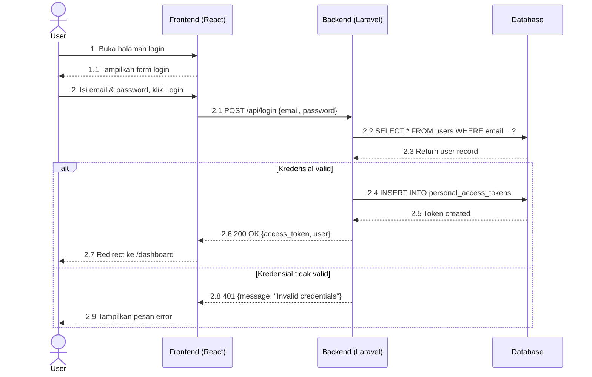
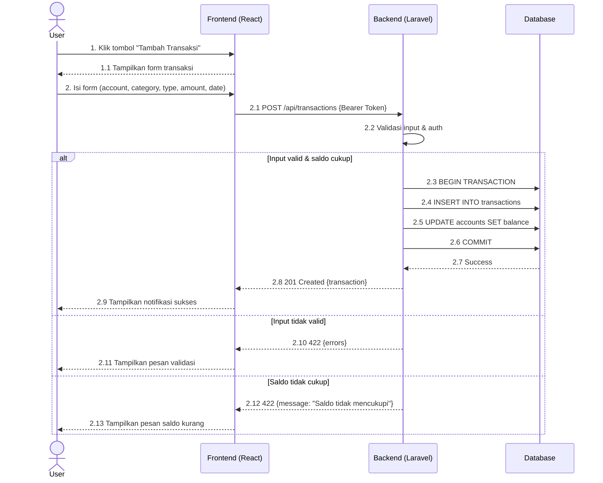
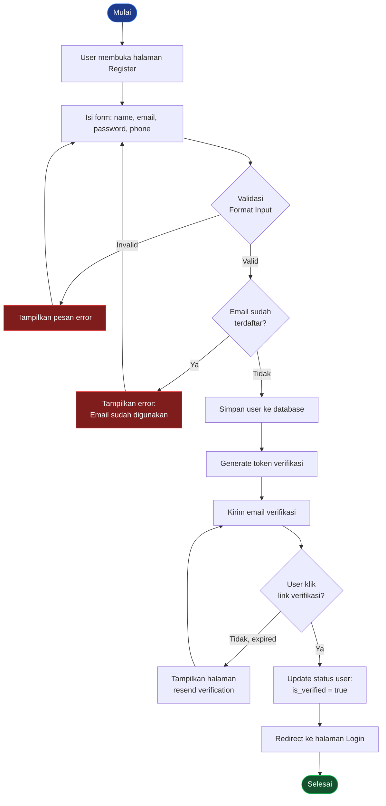
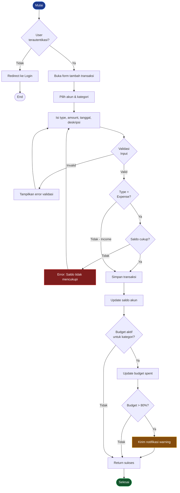
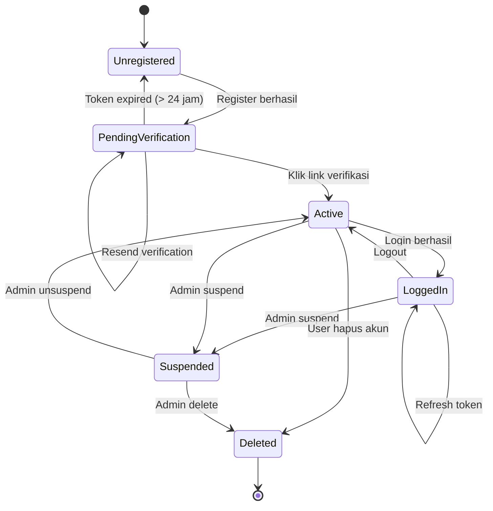
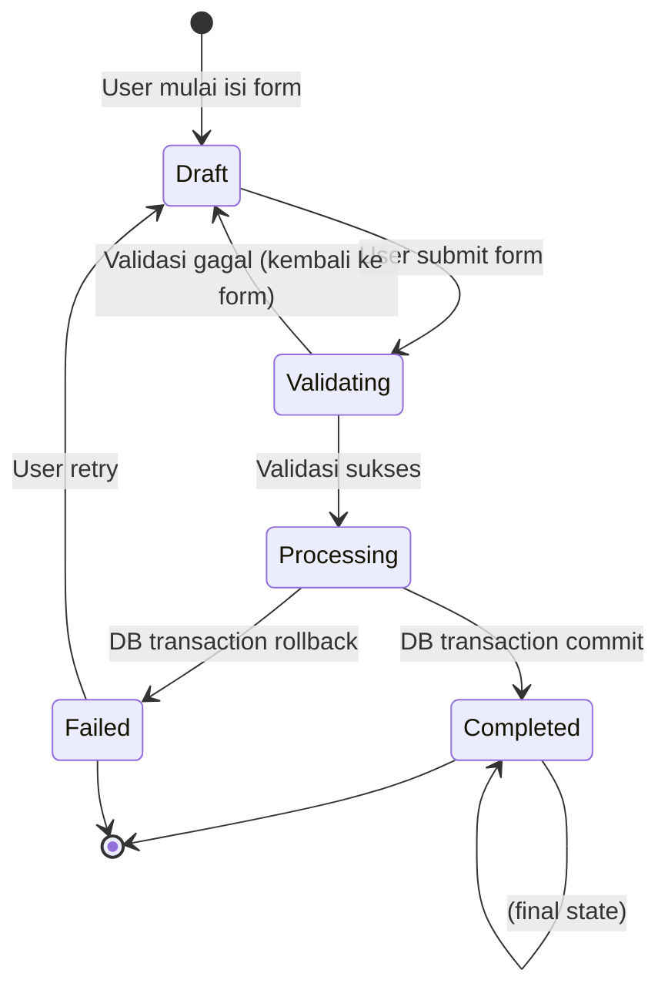
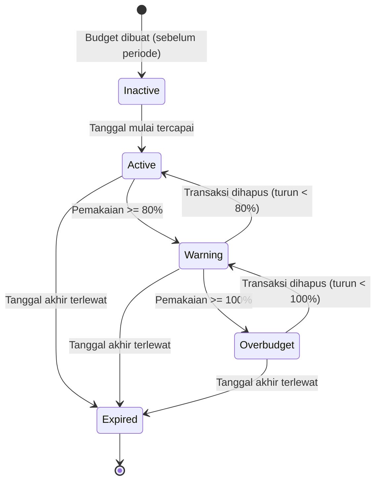
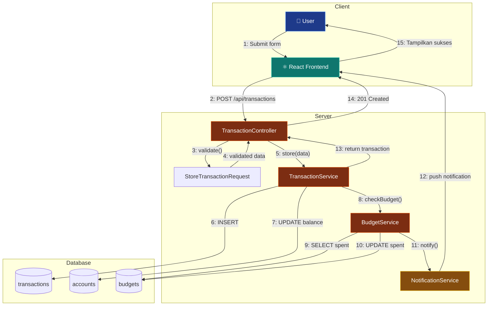

# 🎭 Behaviour Testing (BDD)

> **Model Black Box Testing #7** — *Logic-Based Testing*
> **Modul Target:** User Journey — Registrasi → Login → Buat Transaksi
> **Tim:** REMACode

---

## 📖 1. Definisi

**Behaviour Testing** (juga dikenal sebagai **Behavior-Driven Development/BDD**) adalah pendekatan pengujian perangkat lunak yang **berfokus pada perilaku yang diharapkan dari suatu program dari sudut pandang pengguna** (Suprihadi, 2025). Teknik ini menggunakan berbagai diagram UML untuk menggambarkan interaksi, alur aktivitas, dan perilaku sistem secara keseluruhan.

> *"Behaviour Testing (juga dikenal sebagai Behavior-Driven Development (BDD)) adalah pendekatan pengujian perangkat lunak yang berfokus pada perilaku yang diharapkan dari suatu program dari sudut pandang pengguna."* — (Suprihadi, 2025)

### Diagram UML yang Digunakan

| Diagram | Fungsi | Tools |
|---|---|---|
| **Sequence Diagram** | Interaksi antar objek berdasarkan urutan waktu | Mermaid `sequenceDiagram` |
| **Activity Diagram** | Alur aktivitas dan keputusan dalam proses | Mermaid `flowchart` |
| **Statechart/State Machine** | Kelakuan sistem secara keseluruhan via state | Mermaid `stateDiagram-v2` |
| **Collaboration Diagram** | Organisasi antar objek dalam interaksi | Mermaid `graph` (approx.) |

---

## 🎯 2. Tujuan Pengujian

| No | Tujuan |
|---|---|
| 1 | Memvalidasi **user journey** end-to-end dari perspektif pengguna |
| 2 | Memastikan **urutan interaksi** sistem sesuai dengan spesifikasi |
| 3 | Mendeteksi **state transition** yang tidak valid |
| 4 | Memverifikasi semua **skenario alternatif** (happy path & sad path) |
| 5 | Memberikan **dokumentasi hidup** yang dipahami semua stakeholder |

---

## 💻 3. Modul yang Diuji

**User Journey:** Registrasi → Verifikasi → Login → Buat Transaksi → Lihat Summary

**Aktor:** User (pengguna Midnight Finance)

> ⚠️ **TODO:** Sesuaikan flow jika ada step tambahan (mis. verifikasi email, onboarding setup akun pertama).

---

## 🔷 4. Sequence Diagram

Sequence diagram menggambarkan **interaksi antar objek dalam berkomunikasi saling mengirim message disusun berdasarkan urutan waktu** (Suprihadi, 2025).

### 4.1 Sequence Diagram — Flow Login



### 4.2 Sequence Diagram — Flow Buat Transaksi



---

## 🔶 5. Activity Diagram

Activity diagram digunakan untuk **menggambarkan urutan kerja masing-masing objek dalam menyelesaikan permasalahan tertentu sesuai dengan fungsi kerja masing-masing objek** (Suprihadi, 2025).

### 5.1 Activity Diagram — Registrasi User



### 5.2 Activity Diagram — Buat Transaksi



---

## 🔵 6. Statechart Diagram

Statechart UML adalah diagram yang **menggambarkan kelakuan sistem secara keseluruhan**. Karena menggambarkan kelakuan sistem secara keseluruhan, pembangkitan data uji berdasar statechart (state machine) dianggap menguji keseluruhan sistem (Suprihadi, 2025).

### 6.1 Statechart — User Account States



### 6.2 Statechart — Transaksi States



### 6.3 Statechart — Budget States



---

## 🟣 7. Collaboration Diagram

Collaboration diagram digunakan untuk **menggambarkan susunan organisasi antar objek dalam berinteraksi dan bekerjasama untuk melaksanakan fungsi yang didefinisikan di dalam sistem software** (Suprihadi, 2025).

### 7.1 Collaboration — Proses Buat Transaksi



---

## 🧪 8. BDD Scenarios (Gherkin Format)

```gherkin
Feature: User Authentication & Transaction Management
  Sebagai pengguna Midnight Finance
  Saya ingin bisa login dan membuat transaksi
  Agar saya bisa mencatat keuangan saya

  Background:
    Given saya memiliki akun yang terdaftar dan terverifikasi
    And saya memiliki akun keuangan dengan saldo Rp 1.000.000

  Scenario: Login berhasil sebagai user biasa
    When saya membuka halaman login
    And saya mengisi email "user@test.com" dan password "Pass@1234"
    And saya menekan tombol "Login"
    Then saya diarahkan ke halaman dashboard
    And saya melihat nama saya di navbar

  Scenario: Login gagal dengan password salah
    When saya membuka halaman login
    And saya mengisi email "user@test.com" dan password "wrongpassword"
    And saya menekan tombol "Login"
    Then saya melihat pesan "Invalid credentials"
    And saya tetap di halaman login

  Scenario: Membuat transaksi expense berhasil
    Given saya sudah login
    When saya membuka form tambah transaksi
    And saya memilih tipe "Expense"
    And saya mengisi nominal "Rp 200.000"
    And saya memilih kategori "Makanan"
    And saya menekan tombol "Simpan"
    Then transaksi berhasil disimpan
    And saldo akun saya berkurang menjadi "Rp 800.000"

  Scenario: Transaksi expense gagal karena saldo tidak cukup
    Given saya sudah login
    When saya membuka form tambah transaksi
    And saya memilih tipe "Expense"
    And saya mengisi nominal "Rp 2.000.000"
    And saya menekan tombol "Simpan"
    Then saya melihat pesan "Saldo tidak mencukupi"
    And saldo akun saya tidak berubah

  Scenario: Notifikasi warning budget muncul saat mendekati limit
    Given saya sudah login
    And saya memiliki budget "Makanan" dengan limit "Rp 500.000"
    And saya sudah memakai "Rp 380.000" (76%)
    When saya menambahkan transaksi expense "Makanan" senilai "Rp 50.000"
    Then total pemakaian menjadi 86%
    And saya menerima notifikasi "Anggaran Makanan mendekati batas (86%)"
```

---

## 📸 9. Screenshot yang Diperlukan

> **📸 SCREENSHOT NEEDED #1:** **Halaman Login**
> Screenshot halaman `/login` Midnight Finance.
> *File suggested name:* `screenshot/BHV-login-page.png`

> **📸 SCREENSHOT NEEDED #2:** **Dashboard setelah Login Berhasil**
> Screenshot halaman dashboard yang muncul setelah login sukses.
> *File suggested name:* `screenshot/BHV-dashboard-after-login.png`

> **📸 SCREENSHOT NEEDED #3:** **Form Tambah Transaksi**
> Screenshot form input transaksi.
> *File suggested name:* `screenshot/BHV-form-transaksi.png`

> **📸 SCREENSHOT NEEDED #4:** **Notifikasi Sukses Setelah Transaksi**
> Screenshot notifikasi/toast sukses setelah transaksi berhasil disimpan.
> *File suggested name:* `screenshot/BHV-transaksi-success-notif.png`

> **📸 SCREENSHOT NEEDED #5:** **Notifikasi Budget Warning**
> Screenshot notifikasi warning budget mendekati limit (jika ada push notification / badge).
> *File suggested name:* `screenshot/BHV-budget-warning-notif.png`

---

## 🚀 10. Implementasi Pengujian (PHPUnit)

```php
<?php

namespace Tests\Feature\BDD;

use App\Models\Budget;
use App\Models\User;
use App\Models\Account;
use App\Models\Category;
use Illuminate\Foundation\Testing\RefreshDatabase;
use Tests\TestCase;

class UserJourneyBehaviourTest extends TestCase
{
    use RefreshDatabase;

    /** @test Scenario: Login berhasil */
    public function user_can_login_with_valid_credentials(): void
    {
        $user = User::factory()->create([
            'email'     => 'user@test.com',
            'password'  => bcrypt('Pass@1234'),
            'is_active' => true,
        ]);

        $this->postJson('/api/login', [
            'email'    => 'user@test.com',
            'password' => 'Pass@1234',
        ])
        ->assertStatus(200)
        ->assertJsonStructure(['access_token', 'user']);
    }

    /** @test Scenario: Login gagal password salah */
    public function user_cannot_login_with_wrong_password(): void
    {
        User::factory()->create(['email' => 'user@test.com']);

        $this->postJson('/api/login', [
            'email'    => 'user@test.com',
            'password' => 'wrongpassword',
        ])
        ->assertStatus(401)
        ->assertJson(['message' => 'Invalid credentials']);
    }

    /** @test Scenario: Transaksi expense berhasil + saldo berkurang */
    public function user_can_create_expense_and_balance_decreases(): void
    {
        $user    = User::factory()->create();
        $account = Account::factory()->create([
            'user_id' => $user->id,
            'balance' => 1_000_000,
        ]);
        $category = Category::factory()->create(['user_id' => $user->id]);

        $this->actingAs($user)->postJson('/api/transactions', [
            'account_id'       => $account->id,
            'category_id'      => $category->id,
            'type'             => 'expense',
            'amount'           => 200_000,
            'transaction_date' => now()->toDateString(),
        ])->assertStatus(201);

        $account->refresh();
        $this->assertEquals(800_000, $account->balance);
    }

    /** @test Scenario: Transaksi gagal saldo tidak cukup */
    public function user_cannot_create_expense_exceeding_balance(): void
    {
        $user    = User::factory()->create();
        $account = Account::factory()->create([
            'user_id' => $user->id,
            'balance' => 1_000_000,
        ]);
        $category = Category::factory()->create(['user_id' => $user->id]);

        $this->actingAs($user)->postJson('/api/transactions', [
            'account_id'       => $account->id,
            'category_id'      => $category->id,
            'type'             => 'expense',
            'amount'           => 2_000_000,
            'transaction_date' => now()->toDateString(),
        ])->assertStatus(422);

        // Balance tidak berubah
        $account->refresh();
        $this->assertEquals(1_000_000, $account->balance);
    }

    /** @test Scenario: State machine — budget inactive → active → warning */
    public function budget_transitions_through_states_correctly(): void
    {
        $user     = User::factory()->create();
        $category = Category::factory()->create(['user_id' => $user->id]);
        $account  = Account::factory()->create(['user_id' => $user->id, 'balance' => 10_000_000]);

        $budget = Budget::factory()->create([
            'user_id'      => $user->id,
            'limit_amount' => 1_000_000,
            'start_date'   => now()->startOfMonth(),
            'end_date'     => now()->endOfMonth(),
        ]);

        // State: Active (0%)
        $status = $this->actingAs($user)
            ->getJson("/api/budgets/{$budget->id}/status")
            ->json('data.status');
        $this->assertEquals('safe', $status);

        // Transition → Warning (85%)
        $this->actingAs($user)->postJson('/api/transactions', [
            'account_id'       => $account->id,
            'category_id'      => $category->id,
            'type'             => 'expense',
            'amount'           => 850_000,
            'transaction_date' => now()->toDateString(),
        ]);

        $status = $this->actingAs($user)
            ->getJson("/api/budgets/{$budget->id}/status")
            ->json('data.status');
        $this->assertEquals('warning', $status);
    }
}
```

---

## 📊 11. Hasil Eksekusi

| Scenario | Gherkin | State Transition | Expected | Status |
|---|---|---|---|---|
| Login sukses | ✅ Covered | Active → LoggedIn | 200 + token | ⏳ Pending |
| Login gagal | ✅ Covered | Active (no change) | 401 | ⏳ Pending |
| Transaksi expense sukses | ✅ Covered | Draft → Completed | 201 | ⏳ Pending |
| Transaksi saldo kurang | ✅ Covered | Draft → Failed | 422 | ⏳ Pending |
| Budget safe → warning | ✅ Covered | Active → Warning | status=warning | ⏳ Pending |
| Budget warning → overbudget | ✅ Covered | Warning → Overbudget | status=overbudget | ⏳ Pending |

---

## 🐛 12. Temuan & Analisis

| ID | Severity | Deskripsi (Predicted) | Rekomendasi |
|---|---|---|---|
| `BHV-001` | 🔴 High | State `PendingVerification` tidak di-enforce — user bisa login tanpa verifikasi email | Tambah check `is_verified` di login logic |
| `BHV-002` | 🟡 Medium | Tidak ada state `Deleted` di implementasi — akun hanya di-soft delete | Tambah `SoftDeletes` + state guard |
| `BHV-003` | 🟡 Medium | Notifikasi budget warning tidak real-time (butuh refresh manual) | Implementasi Laravel Broadcasting + Pusher |
| `BHV-004` | 🟢 Low | Tidak ada state history/audit log untuk perubahan budget status | Tambah `budget_status_logs` table |

---

## ⚖️ 13. Kelebihan & Kekurangan

### ✅ Kelebihan
- **Dokumentasi hidup** yang dipahami developer & non-developer
- Menguji sistem **end-to-end** dari perspektif pengguna
- **State machine** mendeteksi transisi ilegal
- BDD scenarios bisa jadi **acceptance criteria** yang clear
- Diagram sequence membantu **debug** alur komunikasi

### ❌ Kekurangan
- **Setup effort tinggi** untuk 4 jenis diagram
- Diagram bisa **outdated** jika tidak di-maintain
- Tidak menguji **internal logic** secara detail (gunakan White Box)
- Gherkin syntax memerlukan **Behat/Cucumber** untuk full automation
- Collaboration diagram sulit di-Mermaid secara exact

---

## 🛠️ 14. Tools Pendukung

| Tool | Kegunaan |
|---|---|
| **Behat** | BDD framework untuk PHP (Gherkin execution) |
| **Cucumber** | BDD framework multi-language |
| **Cypress** | E2E test yang mirror Gherkin scenario |
| **Mermaid** | Semua 4 jenis diagram dalam `.md` |
| **draw.io** | Collaboration diagram yang lebih visual |
| **Laravel Dusk** | Browser automation untuk E2E |

```bash
# Install Behat untuk BDD
composer require --dev behat/behat behat/mink-extension

# Run Gherkin scenarios
./vendor/bin/behat features/authentication.feature
./vendor/bin/behat features/transaction.feature
```

---

## 📚 Referensi

1. Suprihadi, D. (2025). *Materi Software Quality Pertemuan 11*. Universitas Kristen Indonesia.
2. North, D. (2006). *Introducing BDD*. https://dannorth.net/introducing-bdd/
3. Fowler, M. (2004). *UML Distilled* (3rd ed.). Addison-Wesley.
4. Myers, G. J., Sandler, C., & Badgett, T. (2011). *The Art of Software Testing* (3rd ed.). Wiley.

---

<div align="center">

[⬅ Comparison Testing](./Comparison_Testing.md) · [Kembali ke README](./README.md) · [Lanjut ke Performance Testing ➡](./Performance_Testing.md)

**Tim REMACode** — Midnight Finance SQA Documentation

</div>
