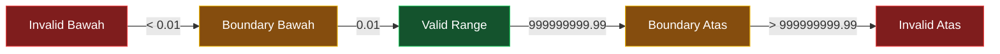

# 📏 Boundary Value Analysis

> **Model Black Box Testing #2** — *Input-Based Testing*
> **Modul Target:** Input Nominal Transaksi (Income & Expense)
> **Tim:** REMACode

---

## 📖 1. Definisi

**Boundary Value Analysis (BVA)** digunakan untuk **melakukan validasi fungsionalitas sistem berdasarkan persyaratan dan spesifikasi**, sehingga diperlukan analisis terhadap **nilai batas**. BVA merupakan **perluasan dari Model Equivalence Partitioning**, dengan memasukkan nilai sedikit dari minimum dan kurang sedikit dari maksimum (Suprihadi, 2025).

> *"Teknik BVA digunakan untuk melakukan validasi fungsionalitas system berdasarkan persyaratan dan spesifikasi, sehingga diperlukan analisis terhadap Nilai Batas, BVA merupakan Perluasan dari Model Equivalence Partitioning, dengan memasukan nilai sedikit dari minimum dan kurang sedikit dari maksimum."* — (Suprihadi, 2025)

### Perbedaan dengan Equivalence Partitioning

| Aspek | Equivalence Partitioning | Boundary Value Analysis |
|---|---|---|
| **Fokus** | Tengah partisi | Batas partisi |
| **Nilai yang dipilih** | 1 representative per partisi | Min, Min+1, Normal, Max-1, Max |
| **Deteksi bug** | Kesalahan range umum | Off-by-one errors |
| **Jumlah test case** | Lebih sedikit | Lebih banyak |
| **Hubungan** | Dasar | Perluasan dari EP |

### Strategi BVA Klasik (3-point & 7-point)

| Strategi | Nilai yang Diuji |
|---|---|
| **3-point BVA** | Min, Normal, Max |
| **7-point BVA** | Min-1, Min, Min+1, Normal, Max-1, Max, Max+1 |

> **Tim REMACode menggunakan 7-point BVA** untuk coverage maksimal pada modul finansial.

---

## 🎯 2. Tujuan Pengujian

| No | Tujuan |
|---|---|
| 1 | Memvalidasi sistem menolak input di luar batas yang ditentukan |
| 2 | Mendeteksi **off-by-one error** pada kondisi batas |
| 3 | Memastikan nilai tepat di batas (≤, <, ≥, >) ditangani benar |
| 4 | Memverifikasi pesan error yang tepat ditampilkan di nilai boundary |
| 5 | Menjamin integritas data finansial pada nilai ekstrem |

---

## 💻 3. Modul yang Diuji

**Endpoint:** `POST /api/transactions`
**Field:** `amount` — nominal transaksi income/expense

> ⚠️ **TODO:** Konfirmasi batas atas dan bawah yang diimplementasikan di `midnight-finance-backend`. Nilai di bawah adalah asumsi berdasarkan domain financial management.

### Spesifikasi Batas Amount

| Parameter | Nilai | Keterangan |
|---|---|---|
| **Minimum** | `0.01` | Minimal 1 sen (Rp 1 jika unit rupiah) |
| **Maximum** | `999.999.999.99` | Maksimal ~1 miliar |
| **Precision** | 2 desimal | Sesuai standar currency |
| **Tipe data** | `decimal(15,2)` | Di database MySQL |

---

## 🔍 4. Identifikasi Kelas Ekuivalensi



| Kelas | Range | Status |
|---|---|---|
| **Invalid Bawah** | `amount < 0.01` (termasuk negatif & 0) | ❌ Invalid |
| **Boundary Bawah** | `amount = 0.01` | ✅ Valid (minimum) |
| **Valid Normal** | `0.01 < amount < 999.999.999.99` | ✅ Valid |
| **Boundary Atas** | `amount = 999.999.999.99` | ✅ Valid (maximum) |
| **Invalid Atas** | `amount > 999.999.999.99` | ❌ Invalid |

---

## 🧪 5. Test Case Design (7-Point BVA)

### 5.1 Boundary Points untuk Field `amount`

| Boundary Point | Nilai | Kategori | Keterangan |
|---|---|---|---|
| **Min - 1** | `0.00` | ❌ Below min | Tepat di bawah minimum |
| **Min** | `0.01` | ✅ Valid | Tepat di minimum |
| **Min + 1** | `0.02` | ✅ Valid | Satu step di atas minimum |
| **Normal** | `500.000.00` | ✅ Valid | Nilai tipikal |
| **Max - 1** | `999.999.999.98` | ✅ Valid | Satu step di bawah maximum |
| **Max** | `999.999.999.99` | ✅ Valid | Tepat di maximum |
| **Max + 1** | `1.000.000.000.00` | ❌ Above max | Tepat di atas maximum |

### 5.2 Boundary Points Tambahan (Negatif & Zero)

| TC | Nilai | Kategori | Keterangan |
|---|---|---|---|
| Negatif | `-1.00` | ❌ Invalid | Nominal tidak boleh negatif |
| Nol | `0.00` | ❌ Invalid | Nominal tidak boleh nol |
| String | `"abc"` | ❌ Invalid | Tipe data salah |
| Empty | `""` | ❌ Invalid | Wajib diisi |

### 5.3 Tabel Test Case Lengkap

| TC ID | Skenario | Input Amount | Type | Expected HTTP | Expected Message |
|---|---|---|---|---|---|
| `BVA-TC-01` | Min - 1 (nol) | `0.00` | expense | 422 | amount minimal 0.01 |
| `BVA-TC-02` | **Min boundary** | `0.01` | income | 201 | Transaction created |
| `BVA-TC-03` | Min + 1 | `0.02` | income | 201 | Transaction created |
| `BVA-TC-04` | Normal | `500000.00` | expense | 201 | Transaction created |
| `BVA-TC-05` | Max - 1 | `999999999.98` | income | 201 | Transaction created |
| `BVA-TC-06` | **Max boundary** | `999999999.99` | income | 201 | Transaction created |
| `BVA-TC-07` | Max + 1 | `1000000000.00` | income | 422 | amount melebihi batas |
| `BVA-TC-08` | Negatif | `-1.00` | expense | 422 | amount harus positif |
| `BVA-TC-09` | String input | `"seratus"` | expense | 422 | amount harus angka |
| `BVA-TC-10` | Empty | `""` | expense | 422 | amount wajib diisi |
| `BVA-TC-11` | Presisi > 2 decimal | `100.999` | income | 422 | max 2 desimal |

---

## 📸 6. Screenshot yang Diperlukan

> **📸 SCREENSHOT NEEDED #1:** **Form Tambah Transaksi**
> Buka halaman tambah transaksi di Midnight Finance, screenshot tampilan form input amount dalam kondisi default.
> *File suggested name:* `screenshot/BVA-form-transaksi-default.png`

> **📸 SCREENSHOT NEEDED #2:** **Error Amount = 0 (TC-01)**
> Isi amount dengan `0`, submit, screenshot pesan error yang muncul.
> *File suggested name:* `screenshot/BVA-tc01-zero-amount.png`

> **📸 SCREENSHOT NEEDED #3:** **Sukses Amount = 0.01 (TC-02)**
> Isi amount dengan `0.01`, submit, screenshot hasil sukses.
> *File suggested name:* `screenshot/BVA-tc02-min-boundary.png`

> **📸 SCREENSHOT NEEDED #4:** **Sukses Amount Max (TC-06)**
> Isi amount dengan nilai maximum, submit, screenshot hasil.
> *File suggested name:* `screenshot/BVA-tc06-max-boundary.png`

> **📸 SCREENSHOT NEEDED #5:** **Error Amount Melebihi Batas (TC-07)**
> Isi amount dengan nilai di atas maximum, screenshot pesan error.
> *File suggested name:* `screenshot/BVA-tc07-over-max.png`

---

## 🚀 7. Implementasi Pengujian

### 7.1 Tabel Equivalence Class Lengkap (Sesuai Format Slide)

**Equivalence Class:**

| No | Nama Kolom | Tipe Data | Batasan Data |
|---|---|---|---|
| 1 | amount | Decimal | `0.01 ≤ amount ≤ 999.999.999.99` |
| 2 | type | String | `'income'` atau `'expense'` |

**Batasan Equivalence Class:**

| No | Field | Boundary | Value | Input Data |
|---|---|---|---|---|
| 1 | amount | Batas Bawah (BB) | 0.01 | 0.00 (BB-1), 0.01 (BB), 0.02 (BB+1) |
| 2 | amount | Batas Atas (BA) | 999999999.99 | 999999999.98 (BA-1), 999999999.99 (BA), 1000000000.00 (BA+1) |

### 7.2 PHPUnit Test

```php
<?php

namespace Tests\Feature\Transaction;

use App\Models\Account;
use App\Models\Category;
use App\Models\User;
use Illuminate\Foundation\Testing\RefreshDatabase;
use Tests\TestCase;

class TransactionBoundaryValueTest extends TestCase
{
    use RefreshDatabase;

    private User $user;
    private Account $account;
    private Category $category;

    protected function setUp(): void
    {
        parent::setUp();
        $this->user     = User::factory()->create();
        $this->account  = Account::factory()->create([
            'user_id' => $this->user->id,
            'balance' => 1_000_000_000,
        ]);
        $this->category = Category::factory()->create([
            'user_id' => $this->user->id,
        ]);
    }

    private function makeTransaction(mixed $amount, string $type = 'income'): \Illuminate\Testing\TestResponse
    {
        return $this->actingAs($this->user)
            ->postJson('/api/transactions', [
                'account_id'       => $this->account->id,
                'category_id'      => $this->category->id,
                'type'             => $type,
                'amount'           => $amount,
                'transaction_date' => now()->toDateString(),
            ]);
    }

    /** @test BVA-TC-01: Min-1 — amount = 0 */
    public function it_rejects_zero_amount(): void
    {
        $this->makeTransaction(0.00)
             ->assertStatus(422)
             ->assertJsonValidationErrors(['amount']);
    }

    /** @test BVA-TC-02: Min boundary — amount = 0.01 */
    public function it_accepts_minimum_amount(): void
    {
        $this->makeTransaction(0.01)
             ->assertStatus(201);
    }

    /** @test BVA-TC-03: Min+1 — amount = 0.02 */
    public function it_accepts_min_plus_one(): void
    {
        $this->makeTransaction(0.02)
             ->assertStatus(201);
    }

    /** @test BVA-TC-04: Normal — amount = 500000 */
    public function it_accepts_normal_amount(): void
    {
        $this->makeTransaction(500_000.00)
             ->assertStatus(201);
    }

    /** @test BVA-TC-05: Max-1 — amount = 999999999.98 */
    public function it_accepts_max_minus_one(): void
    {
        $this->makeTransaction(999_999_999.98)
             ->assertStatus(201);
    }

    /** @test BVA-TC-06: Max boundary — amount = 999999999.99 */
    public function it_accepts_maximum_amount(): void
    {
        $this->makeTransaction(999_999_999.99)
             ->assertStatus(201);
    }

    /** @test BVA-TC-07: Max+1 — amount = 1000000000 */
    public function it_rejects_over_maximum_amount(): void
    {
        $this->makeTransaction(1_000_000_000.00)
             ->assertStatus(422)
             ->assertJsonValidationErrors(['amount']);
    }

    /** @test BVA-TC-08: Negatif — amount = -1 */
    public function it_rejects_negative_amount(): void
    {
        $this->makeTransaction(-1.00)
             ->assertStatus(422)
             ->assertJsonValidationErrors(['amount']);
    }

    /** @test BVA-TC-09: String input */
    public function it_rejects_non_numeric_amount(): void
    {
        $this->makeTransaction('seratus')
             ->assertStatus(422)
             ->assertJsonValidationErrors(['amount']);
    }

    /** @test BVA-TC-11: Precision > 2 decimal */
    public function it_rejects_amount_with_more_than_two_decimals(): void
    {
        $this->makeTransaction(100.999)
             ->assertStatus(422)
             ->assertJsonValidationErrors(['amount']);
    }
}
```

---

## 📊 8. Hasil Eksekusi

### 8.1 Tabel Hasil BVA (Format Sesuai Slide)

| No | Test Case | Input Amount | Expected Output | Actual Output | Status |
|---|---|---|---|---|---|
| 1 | `BVA-TC-01` | `0.00` | Invalid/Not Processed | ⏳ Pending | — |
| 2 | `BVA-TC-02` | `0.01` | Valid/Processed | ⏳ Pending | — |
| 3 | `BVA-TC-03` | `0.02` | Valid/Processed | ⏳ Pending | — |
| 4 | `BVA-TC-04` | `500000.00` | Valid/Processed | ⏳ Pending | — |
| 5 | `BVA-TC-05` | `999999999.98` | Valid/Processed | ⏳ Pending | — |
| 6 | `BVA-TC-06` | `999999999.99` | Valid/Processed | ⏳ Pending | — |
| 7 | `BVA-TC-07` | `1000000000.00` | Invalid/Not Processed | ⏳ Pending | — |
| 8 | `BVA-TC-08` | `-1.00` | Invalid/Not Processed | ⏳ Pending | — |
| 9 | `BVA-TC-09` | `"seratus"` | Invalid/Not Processed | ⏳ Pending | — |
| 10 | `BVA-TC-10` | `""` | Invalid/Not Processed | ⏳ Pending | — |
| 11 | `BVA-TC-11` | `100.999` | Invalid/Not Processed | ⏳ Pending | — |

### 8.2 Coverage Summary

| Boundary Point | Test Case | Status |
|---|---|---|
| Min - 1 (0.00) | BVA-TC-01 | ⏳ |
| **Min (0.01)** | BVA-TC-02 | ⏳ |
| Min + 1 (0.02) | BVA-TC-03 | ⏳ |
| Normal (500000) | BVA-TC-04 | ⏳ |
| Max - 1 | BVA-TC-05 | ⏳ |
| **Max (999999999.99)** | BVA-TC-06 | ⏳ |
| Max + 1 | BVA-TC-07 | ⏳ |

---

## 🐛 9. Temuan & Analisis

| ID | Severity | Deskripsi (Predicted) | Rekomendasi |
|---|---|---|---|
| `BVA-001` | 🔴 High | Jika max tidak di-set di validation, amount besar akan menyebabkan DB overflow (`decimal(15,2)` max = `9.999.999.999.999.99`) | Tambah `max:999999999.99` di rules |
| `BVA-002` | 🟡 Medium | Float comparison `0.01` di PHP bisa presisi issue — `0.01 + 0.02 ≠ 0.03` secara float | Gunakan BCMath atau cast ke string sebelum validasi |
| `BVA-003` | 🟡 Medium | Validasi `decimal:0,2` (Laravel 10+) mungkin tidak aktif di versi lama | Cek versi Laravel & gunakan regex sebagai fallback |
| `BVA-004` | 🟢 Low | Tidak ada feedback spesifik untuk masing-masing boundary violation | Buat pesan error yang menunjukkan range yang valid |

---

## ✅ 10. Rekomendasi Validasi Laravel

```php
// app/Http/Requests/StoreTransactionRequest.php

public function rules(): array
{
    return [
        'amount' => [
            'required',
            'numeric',
            'min:0.01',
            'max:999999999.99',
            'decimal:0,2',  // Laravel 10+ - max 2 decimal places
        ],
        'type' => 'required|in:income,expense',
        // ...
    ];
}

public function messages(): array
{
    return [
        'amount.required' => 'Nominal transaksi wajib diisi',
        'amount.numeric'  => 'Nominal harus berupa angka',
        'amount.min'      => 'Nominal minimal Rp 0,01',
        'amount.max'      => 'Nominal maksimal Rp 999.999.999,99',
        'amount.decimal'  => 'Nominal hanya boleh 2 angka desimal',
    ];
}
```

---

## ⚖️ 11. Kelebihan & Kekurangan

### ✅ Kelebihan
- **Mendeteksi off-by-one error** yang sering lolos dari review manual
- **Coverage lebih tinggi** dibanding EP dengan sedikit test case tambahan
- **Wajib** untuk sistem finansial — kesalahan batas bisa = kerugian nyata
- Mudah dikombinasikan dengan **Equivalence Partitioning**
- Test case bisa langsung jadi **regression test suite**

### ❌ Kekurangan
- **Lebih banyak test case** dibanding pure EP
- Tidak menangkap bug **kombinasi field** (gunakan Decision Table)
- Boundary yang tepat **harus diketahui** dari spesifikasi
- Tidak efektif jika batas **tidak terdefinisi jelas** dalam requirements
- Float precision issue mempersulit boundary testing

---

## 🛠️ 12. Tools Pendukung

| Tool | Kegunaan |
|---|---|
| **PHPUnit** | Automated boundary testing |
| **Postman** | Manual boundary testing |
| **MySQL Workbench** | Verifikasi data tersimpan di DB setelah boundary |
| **Xdebug** | Step-debug nilai boundary |
| **Laravel Tinker** | Quick REPL untuk tes kalkulasi boundary |

```bash
# Quick test di Tinker
php artisan tinker
>>> 999999999.99 + 0.01  // Test float precision
>>> bcadd('999999999.99', '0.01')  // BCMath version
```

---

## 📚 Referensi

1. Suprihadi, D. (2025). *Materi Software Quality Pertemuan 11*. Universitas Kristen Indonesia.
2. Myers, G. J., Sandler, C., & Badgett, T. (2011). *The Art of Software Testing* (3rd ed.). Wiley.
3. Beizer, B. (1995). *Black-Box Testing: Techniques for Functional Testing of Software and Systems*. Wiley.
4. Kaner, C., Falk, J., & Nguyen, H. Q. (1999). *Testing Computer Software* (2nd ed.). Wiley.

---

<div align="center">

[⬅ Equivalence Partitioning](./Equivalence_Partitioning.md) · [Kembali ke README](./README.md) · [Lanjut ke Decision Table Testing ➡](./Decision_Table_Testing.md)

**Tim REMACode** — Midnight Finance SQA Documentation

</div>
