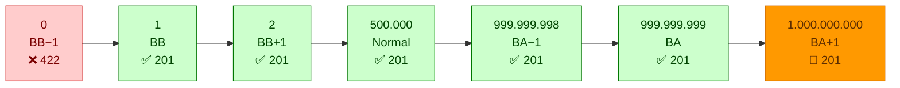
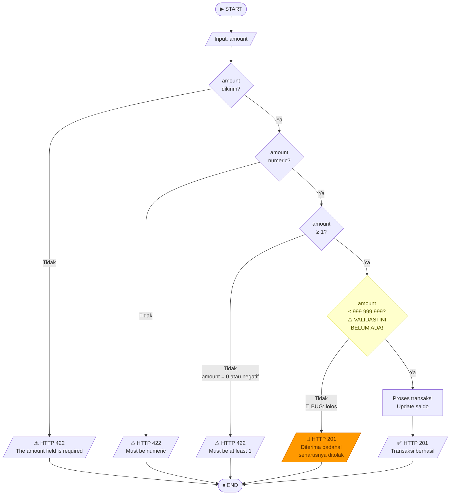

# 📏 Boundary Value Analysis (BVA) — Midnight Finance

**Proyek:** Midnight Finance
**Modul yang Diuji:** Transaction — `POST /api/transactions`
**Tanggal Pengujian:** 27 Mei 2026
**Penguji:** QA Team — REMACode
**Metode:** Boundary Value Analysis (BVA) — 7-Point Strategy

---

## 1. Definisi

**Boundary Value Analysis (BVA)** digunakan untuk melakukan validasi fungsionalitas system berdasarkan persyaratan dan spesifikasi, sehingga diperlukan analisis terhadap **Nilai Batas**. BVA merupakan **Perluasan dari Model Equivalence Partitioning**, dengan memasukan nilai sedikit dari minimum dan kurang sedikit dari maksimum (Suprihadi, 2025).

**Field yang diuji:** `amount` (jumlah transaksi)
**Range valid:** `1 ≤ amount ≤ 999.999.999`
**Endpoint:** `POST /api/transactions`
**Auth:** Bearer Token

---

## 2. Tabel Equivalence Class

| No | Nama Kolom | Tipe Data | Batasan Data |
|:--:|:---|:---|:---|
| 1 | `amount` (Nominal Transaksi) | Numeric | `0 < amount ≤ 999.999.999` (Rupiah) |

---

## 3. Tabel Batasan Equivalence Class

| No | Field Name | Boundary | Value | Input Data |
|:--:|:---|:---|:---:|:---:|
| 1 | `amount` | Batas Bawah (BB) | 0 | 1 |
| 1 | `amount` | Batas Atas (BA) | 999.999.999 | 1.000.000.000 |

---

## 4. Visualisasi 7-Point BVA

```
         INVALID │◄──────── VALID RANGE ────────►│ INVALID
                 │                               │
  ───────────────┼───────────────────────────────┼───────────────
  ... 0(✗) │ 1(✓) │ 2(✓) │ ... 500.000(✓) ... │ 999.999.998(✓) │ 999.999.999(✓) │ 1.000.000.000(✗) ...
           BB-1  BB    BB+1        NORMAL           BA-1              BA                BA+1
           ❌    ✅    ✅           ✅               ✅                ✅                ❌(BUG!)
```



> 🐛 **BVA-07 ditemukan BUG** — sistem seharusnya menolak amount 1 miliar tapi malah menerima (HTTP 201)

---

## 5. Flowchart Alur Validasi Amount



---

## 6. Test Cases dan Hasil Pengujian

### TC-BVA-01 — Amount = 0 (Di bawah batas minimum)

| Atribut | Detail |
|:---|:---|
| **ID Test** | BB02-BVA01 |
| **Input** | `amount: 0`, `type: expense` |
| **Expected Output** | HTTP 422 — "The amount field must be at least 1." |
| **Actual Output** | HTTP 422 — `{"message":"The amount field must be at least 1.","errors":{"amount":["The amount field must be at least 1."]}}` |
| **Status** | ✅ PASSED |

### TC-BVA-02 — Amount = 1 (Batas minimum tepat)

| Atribut | Detail |
|:---|:---|
| **ID Test** | BB02-BVA02 |
| **Input** | `amount: 1`, `type: expense` |
| **Expected Output** | HTTP 201 — Transaksi berhasil |
| **Actual Output** | HTTP 201 — Transaksi berhasil, `id: 56`, balance diperbarui |
| **Status** | ✅ PASSED |

### TC-BVA-03 — Amount = 2 (Batas minimum + 1)

| Atribut | Detail |
|:---|:---|
| **ID Test** | BB02-BVA03 |
| **Input** | `amount: 2`, `type: income` |
| **Expected Output** | HTTP 201 — Transaksi berhasil |
| **Actual Output** | HTTP 201 — Transaksi berhasil, `id: 57`, balance diperbarui |
| **Status** | ✅ PASSED |

### TC-BVA-04 — Amount = 500.000 (Nilai normal)

| Atribut | Detail |
|:---|:---|
| **ID Test** | BB02-BVA04 |
| **Input** | `amount: 500000`, `type: income` |
| **Expected Output** | HTTP 201 — Transaksi berhasil |
| **Actual Output** | HTTP 201 — Transaksi berhasil, `id: 58`, balance diperbarui |
| **Status** | ✅ PASSED |

### TC-BVA-05 — Amount = 999.999.998 (Batas maksimum − 1)

| Atribut | Detail |
|:---|:---|
| **ID Test** | BB02-BVA05 |
| **Input** | `amount: 999999998`, `type: income` |
| **Expected Output** | HTTP 201 — Transaksi berhasil |
| **Actual Output** | HTTP 201 — Transaksi berhasil, `id: 59`, balance diperbarui |
| **Status** | ✅ PASSED |

### TC-BVA-06 — Amount = 999.999.999 (Batas maksimum tepat)

| Atribut | Detail |
|:---|:---|
| **ID Test** | BB02-BVA06 |
| **Input** | `amount: 999999999`, `type: income` |
| **Expected Output** | HTTP 201 — Transaksi berhasil |
| **Actual Output** | HTTP 201 — Transaksi berhasil, `id: 60`, balance diperbarui |
| **Status** | ✅ PASSED |

### TC-BVA-07 — Amount = 1.000.000.000 (Di atas batas maksimum) 🐛

| Atribut | Detail |
|:---|:---|
| **ID Test** | BB02-BVA07 |
| **Input** | `amount: 1000000000`, `type: expense` |
| **Expected Output** | HTTP 422 — Validasi gagal (amount melebihi batas maksimum) |
| **Actual Output** | HTTP 201 — **Transaksi BERHASIL dibuat** (`id: 61`, amount 1 miliar tersimpan) |
| **Status** | ❌ **FAILED — BUG DITEMUKAN** |

> **⚠️ BUG #001 — Missing Max Validation on Amount Field**
>
> **Root Cause:** `TransactionController.php` hanya punya rule `'amount' => 'required|numeric|min:1'` tanpa `max`.
>
> **Rekomendasi Fix:** Ubah menjadi `'amount' => 'required|numeric|min:1|max:999999999'`

---

## 7. Ringkasan Hasil Pengujian

| ID Test | Nilai Amount | Expected HTTP | Actual HTTP | Status |
|:---:|:---:|:---:|:---:|:---:|
| BVA-01 | 0 | 422 | 422 | ✅ PASSED |
| BVA-02 | 1 | 201 | 201 | ✅ PASSED |
| BVA-03 | 2 | 201 | 201 | ✅ PASSED |
| BVA-04 | 500.000 | 201 | 201 | ✅ PASSED |
| BVA-05 | 999.999.998 | 201 | 201 | ✅ PASSED |
| BVA-06 | 999.999.999 | 201 | 201 | ✅ PASSED |
| BVA-07 | 1.000.000.000 | 422 | **201** | ❌ **FAILED** |

**Total: 7 test case | ✅ 6 Passed | ❌ 1 Failed | 🐛 1 Bug Ditemukan**

---

## 8. Bukti Pengujian (Test Evidence)

File JSON hasil pengujian tersimpan di `screenshots/black-box/`:

| File | HTTP | Keterangan |
|:---|:---:|:---|
| `BB02-BVA01-amount0.json` | 422 | Amount 0 ditolak ✅ |
| `BB02-BVA02-amount1.json` | 201 | Amount 1 diterima ✅ |
| `BB02-BVA03-amount2.json` | 201 | Amount 2 diterima ✅ |
| `BB02-BVA04-amount500000.json` | 201 | Amount 500.000 diterima ✅ |
| `BB02-BVA05-amount999999998.json` | 201 | Amount 999.999.998 diterima ✅ |
| `BB02-BVA06-amount999999999.json` | 201 | Amount 999.999.999 diterima ✅ |
| `BB02-BVA07-amount1000000000.json` | 201 | **BUG: 1 miliar diterima** ❌ |

---

## 📚 Referensi

- Suprihadi, D. (2025). *Software Quality — Black Box Testing*. T Informatika UKRI.
- Nurudin, M., et al. (2019). Pengujian Black Box pada Aplikasi Penjualan Berbasis Web Menggunakan Teknik Boundary Value Analysis. *Jurnal Informatika Universitas Pamulang*, 4(4), 143.
