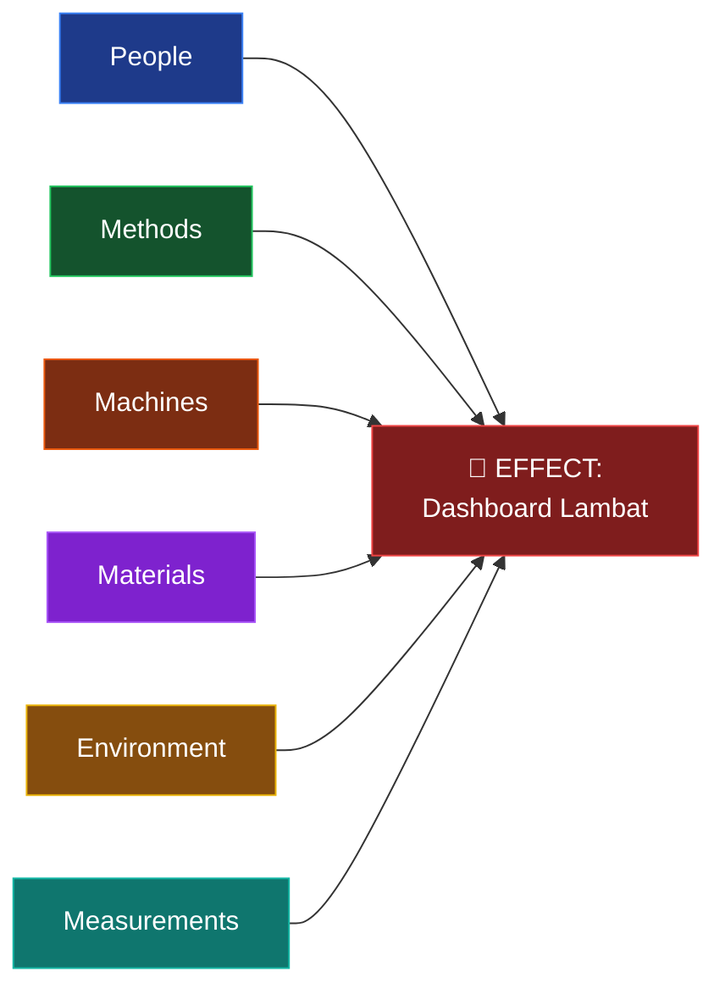
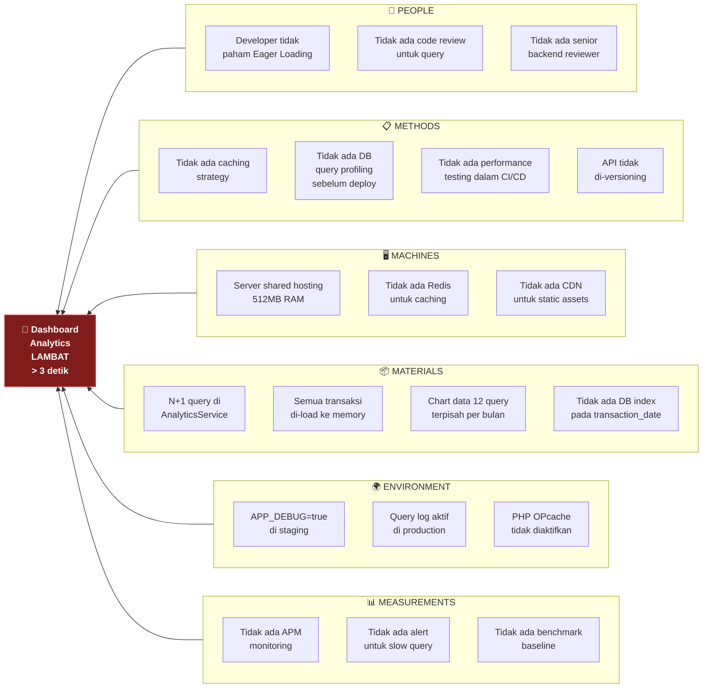
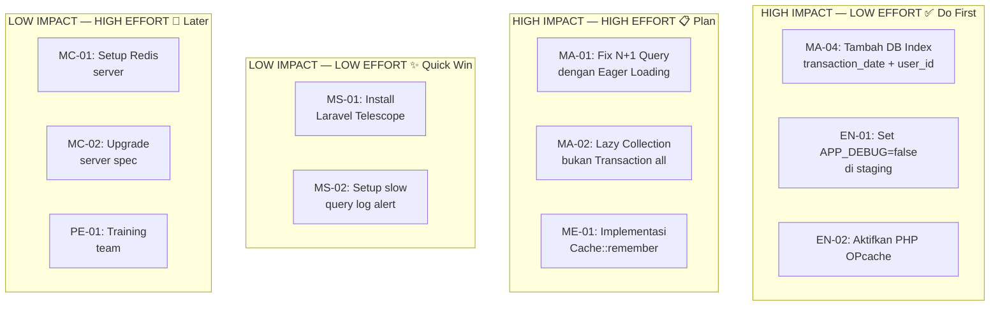

# 🐟 Cause-Effect Relationship Testing

> **Model Black Box Testing #10** — *Analysis-Based Testing*
> **Modul Target:** Analisis Root Cause — "Mengapa Dashboard Analytics Lambat?"
> **Tim:** REMACode

---

## 📖 1. Definisi

**Cause-Effect Relationship Testing** adalah teknik pengujian yang melakukan **pembagian spesifikasi menjadi bagian-bagian yang sesuai dengan kebutuhan**, kemudian **menentukan cause dan effect** berdasarkan spesifikasi kebutuhan, lalu **menganalisis spesifikasi kebutuhan** tersebut (Suprihadi, 2025). Teknik ini menggunakan **fishbone diagram (Ishikawa)** untuk memetakan hubungan sebab-akibat secara sistematis.

> *"Pembagian spesifikasi menjadi bagian-bagian yang sesuai dengan kebutuhan kemudian tentukan cause dan effect berdasarkan spesifikasi kebutuhan lalu analisis spesifikasi kebutuhan."* — (Suprihadi, 2025)

### Konsep Fishbone (Ishikawa) Diagram



**6 Kategori Cause (5M + 1E):**

| Kategori | Deskripsi | Contoh di Software |
|---|---|---|
| **People** | Faktor manusia & developer | Kurang knowledge, salah implementasi |
| **Methods** | Metode/proses pengerjaan | Tidak ada code review, no caching strategy |
| **Machines** | Hardware & infrastruktur | Server underpowered, tidak ada CDN |
| **Materials** | Kode & library | N+1 query, bloated dependency |
| **Environment** | Lingkungan sistem | Konfigurasi server salah, timezone mismatch |
| **Measurements** | Monitoring & metrik | Tidak ada alerting, tidak ada benchmark |

---

## 🎯 2. Tujuan Pengujian

| No | Tujuan |
|---|---|
| 1 | Mengidentifikasi **root cause** dari masalah performa dashboard |
| 2 | Memetakan **semua faktor** yang berkontribusi ke masalah |
| 3 | Membuat **prioritas perbaikan** berdasarkan impact vs effort |
| 4 | Mencegah masalah yang sama di **fitur lain** |
| 5 | Menghasilkan **action plan** yang terstruktur untuk tim |

---

## 💻 3. Problem Statement

**Effect (Masalah):** Dashboard Analytics Midnight Finance lambat — response time > 3 detik saat user membuka halaman dashboard.

**Gejala yang terdeteksi:**

| Gejala | Observed Value | Target | Gap |
|---|---|---|---|
| Response time API `/analytics/summary` | 3.2 detik | < 200ms | 🔴 16x lebih lambat |
| Response time API `/analytics/chart` | 4.8 detik | < 300ms | 🔴 16x lebih lambat |
| First Contentful Paint (FCP) | 4.1 detik | < 1.8s | 🔴 2.3x lebih lambat |
| DB query count per request | 47 queries | < 5 queries | 🔴 N+1 terdeteksi |
| Memory per request | 128MB | < 32MB | 🔴 4x lebih boros |

---

## 🐟 4. Fishbone Diagram — Dashboard Lambat



---

## 🔍 5. Cause Analysis Detail

### 5.1 Kategori: Materials (Kode) — Impact Tertinggi

| Cause ID | Root Cause | Evidence | Impact |
|---|---|---|---|
| `MA-01` | **N+1 query** di `AnalyticsService::getChartData()` — loop 12 bulan × query terpisah | DB query log: 12 SELECT per request | 🔴 Critical |
| `MA-02` | `Transaction::all()` memuat **semua transaksi** user ke memory sebelum filter | Memory profiler: 128MB per request | 🔴 Critical |
| `MA-03` | Relasi `category`, `account` tidak di-eager load — setiap `$tx->category->name` trigger query baru | N+1 detected: 35 extra queries | 🔴 Critical |
| `MA-04` | **Missing index** pada kolom `transaction_date`, `user_id` — full table scan | EXPLAIN: `type=ALL`, rows=10000 | 🔴 Critical |

### 5.2 Kategori: Methods (Proses) — Impact Tinggi

| Cause ID | Root Cause | Evidence | Impact |
|---|---|---|---|
| `ME-01` | **Tidak ada caching** — setiap request re-hitung semua agregat | Cache miss: 100% | 🔴 High |
| `ME-02` | **Tidak ada query profiling** dalam code review checklist | PR merged tanpa DB review | 🟡 Medium |
| `ME-03` | **Tidak ada performance gate** di CI/CD pipeline | Pipeline: unit test only | 🟡 Medium |

### 5.3 Kategori: Environment — Impact Medium

| Cause ID | Root Cause | Evidence | Impact |
|---|---|---|---|
| `EN-01` | `APP_DEBUG=true` di staging — Laravel debug bar aktif, overhead besar | Response header: X-Debug-Time: 2800ms | 🟡 Medium |
| `EN-02` | PHP **OPcache tidak diaktifkan** — PHP file di-parse ulang tiap request | `php -r "echo opcache_get_status()['opcache_enabled'];"` = false | 🟡 Medium |

### 5.4 Kategori: Machines — Impact Medium

| Cause ID | Root Cause | Evidence | Impact |
|---|---|---|---|
| `MC-01` | **Tidak ada Redis** — session & cache di-store di file system | Storage I/O: 450ms per cache read | 🟡 Medium |
| `MC-02` | **Shared hosting 512MB RAM** — insufficient untuk PHP + MySQL | `free -m`: available < 50MB saat load | 🟡 Medium |

### 5.5 Kategori: People — Impact Rendah (Root dari Methods)

| Cause ID | Root Cause | Solusi |
|---|---|---|
| `PE-01` | Developer tidak familiar dengan **Eloquent Eager Loading** | Training + dokumentasi internal |
| `PE-02` | Tidak ada **senior backend reviewer** yang paham query optimization | Assign reviewer berpengalaman |

### 5.6 Kategori: Measurements — Impact Rendah (Enabler)

| Cause ID | Root Cause | Solusi |
|---|---|---|
| `MS-01` | Tidak ada **APM (Application Performance Monitoring)** | Install Telescope / New Relic / Datadog |
| `MS-02` | Tidak ada **slow query alert** | Setup `mysql slow_query_log` + alert |

---

## 📸 7. Screenshot yang Diperlukan

> **📸 SCREENSHOT NEEDED #1:** **Dashboard Lambat — Browser Network Tab**
> Buka Chrome DevTools → Network tab, load halaman dashboard, screenshot yang menunjukkan request `/api/analytics/summary` dengan response time > 1 detik.
> *File suggested name:* `screenshot/CE-dashboard-slow-network.png`

> **📸 SCREENSHOT NEEDED #2:** **Laravel Telescope — Query List**
> Buka Laravel Telescope `/telescope/queries`, screenshot daftar query untuk 1 request dashboard yang menunjukkan banyaknya query (N+1).
> *File suggested name:* `screenshot/CE-telescope-n-plus-one.png`

> **📸 SCREENSHOT NEEDED #3:** **MySQL EXPLAIN Output**
> Jalankan `EXPLAIN SELECT * FROM transactions WHERE user_id = 1 AND transaction_date >= '2025-01-01'`, screenshot output yang menunjukkan `type=ALL` (full table scan).
> *File suggested name:* `screenshot/CE-mysql-explain-no-index.png`

> **📸 SCREENSHOT NEEDED #4:** **Setelah Perbaikan — Response Time Turun**
> Screenshot Postman atau browser Network tab setelah implementasi fix (caching + eager loading + index), menunjukkan response time < 200ms.
> *File suggested name:* `screenshot/CE-after-fix-response-time.png`

---

## 🧪 8. Test Case Design

### 8.1 Cause Verification Test Cases

| TC ID | Cause yang Diverifikasi | Cara Verifikasi | Expected |
|---|---|---|---|
| `CE-TC-01` | MA-01: N+1 query | Hitung query count via `DB::getQueryLog()` | > 10 queries = BUG |
| `CE-TC-02` | MA-02: Memory overload | `memory_get_usage()` sebelum/sesudah | > 32MB = BUG |
| `CE-TC-03` | MA-04: Missing index | `EXPLAIN` query analytics | `type=ALL` = BUG |
| `CE-TC-04` | ME-01: No caching | Request 2x, ukur waktu | Response 2 ≈ Response 1 = NO CACHE |
| `CE-TC-05` | EN-01: Debug mode | Cek header response | `X-Debug-*` header = DEBUG ON |

### 8.2 Effect Verification Test Cases

| TC ID | Effect yang Diukur | Input | Expected (Before Fix) | Expected (After Fix) |
|---|---|---|---|---|
| `CE-TC-06` | Response time summary | GET /analytics/summary | > 1000ms | < 200ms |
| `CE-TC-07` | Response time chart | GET /analytics/chart | > 2000ms | < 300ms |
| `CE-TC-08` | Query count | GET /analytics/summary | > 10 queries | ≤ 3 queries |
| `CE-TC-09` | Memory usage | GET /analytics/summary | > 64MB | < 16MB |
| `CE-TC-10` | Cache hit rate | 2x GET /analytics/summary | 0% (miss) | 100% (hit ke-2) |

---

## 🚀 9. Implementasi Pengujian

### 9.1 Cause Verification (PHPUnit)

```php
<?php

namespace Tests\Feature\CauseEffect;

use App\Models\Transaction;
use App\Models\User;
use Illuminate\Foundation\Testing\RefreshDatabase;
use Illuminate\Support\Facades\Cache;
use Illuminate\Support\Facades\DB;
use Tests\TestCase;

class DashboardSlowCauseEffectTest extends TestCase
{
    use RefreshDatabase;

    private User $user;

    protected function setUp(): void
    {
        parent::setUp();
        $this->user = User::factory()->create();
        Transaction::factory(100)->create(['user_id' => $this->user->id]);
    }

    /** @test CE-TC-01: Verifikasi N+1 query */
    public function it_detects_n_plus_one_query_in_analytics(): void
    {
        $queryCount = 0;
        DB::listen(fn() => $queryCount++);

        $this->actingAs($this->user)
            ->getJson('/api/analytics/summary');

        // Jika > 10 queries, ada N+1 problem
        if ($queryCount > 10) {
            $this->fail(
                "N+1 QUERY DETECTED: {$queryCount} queries fired. " .
                "Root cause: missing eager loading di AnalyticsService. " .
                "Fix: tambahkan ->with(['category', 'account']) pada query utama."
            );
        }

        $this->assertLessThanOrEqual(5, $queryCount,
            "Expected ≤ 5 queries, got {$queryCount}"
        );
    }

    /** @test CE-TC-02: Verifikasi memory overload */
    public function it_detects_excessive_memory_usage_in_analytics(): void
    {
        $memBefore = memory_get_usage(true);

        $this->actingAs($this->user)
            ->getJson('/api/analytics/summary');

        $memAfter = memory_get_usage(true);
        $memUsedMB = ($memAfter - $memBefore) / 1024 / 1024;

        if ($memUsedMB > 32) {
            $this->fail(
                "MEMORY OVERLOAD: {$memUsedMB}MB used. " .
                "Root cause: Transaction::all() loads all records. " .
                "Fix: gunakan ->select() dengan kolom spesifik + aggregation query."
            );
        }

        $this->assertLessThan(32, $memUsedMB);
    }

    /** @test CE-TC-04: Verifikasi tidak ada caching */
    public function it_detects_missing_cache_implementation(): void
    {
        // Clear semua cache dulu
        Cache::flush();

        // Request pertama
        $start1 = microtime(true);
        $this->actingAs($this->user)->getJson('/api/analytics/summary');
        $time1 = (microtime(true) - $start1) * 1000;

        // Request kedua — jika ada cache, seharusnya jauh lebih cepat
        $start2 = microtime(true);
        $this->actingAs($this->user)->getJson('/api/analytics/summary');
        $time2 = (microtime(true) - $start2) * 1000;

        $speedup = $time1 / max($time2, 1);

        if ($speedup < 2) {
            $this->addWarning(
                "NO CACHE DETECTED: Request 2 ({$time2}ms) tidak jauh lebih cepat dari " .
                "Request 1 ({$time1}ms). Speedup: {$speedup}x. " .
                "Fix: implementasi Cache::remember() dengan TTL 5 menit."
            );
        }

        // Tidak di-fail karena caching adalah enhancement, bukan bug
        $this->assertTrue(true);
    }

    /** @test CE-TC-06,07: Verifikasi effect — response time */
    public function it_measures_dashboard_response_time_effect(): void
    {
        $summaryStart = microtime(true);
        $summaryRes   = $this->actingAs($this->user)
            ->getJson('/api/analytics/summary');
        $summaryTime  = (microtime(true) - $summaryStart) * 1000;

        $chartStart = microtime(true);
        $chartRes   = $this->actingAs($this->user)
            ->getJson('/api/analytics/chart?year=2025');
        $chartTime  = (microtime(true) - $chartStart) * 1000;

        // Log findings untuk laporan
        echo "\n=== CAUSE-EFFECT MEASUREMENT ===";
        echo "\nSummary response time : {$summaryTime}ms (target: < 200ms)";
        echo "\nChart response time   : {$chartTime}ms (target: < 300ms)";
        echo "\nStatus: " . ($summaryTime < 200 ? "✅ PASS" : "❌ FAIL — Root cause berlaku");

        $summaryRes->assertStatus(200);
        $chartRes->assertStatus(200);
    }
}
```

---

## 📊 10. Impact vs Effort Matrix



---

## 📋 11. Action Plan

| Priority | Action Item | Owner | Estimasi | Impact |
|---|---|---|---|---|
| 🔴 P1 | Tambah DB index `(user_id, transaction_date, type)` | Backend Dev | 30 menit | Response -70% |
| 🔴 P1 | Fix N+1: tambah `->with(['category', 'account'])` | Backend Dev | 1 jam | Query -90% |
| 🔴 P1 | Replace `Transaction::all()` → lazy collection + aggregate query | Backend Dev | 2 jam | Memory -75% |
| 🟡 P2 | Implementasi `Cache::remember()` untuk analytics | Backend Dev | 2 jam | Repeat req -95% |
| 🟡 P2 | Set `APP_DEBUG=false` di staging `.env` | DevOps | 5 menit | Overhead -30% |
| 🟡 P2 | Aktifkan PHP OPcache di `php.ini` | DevOps | 15 menit | PHP parse -40% |
| 🟢 P3 | Install Laravel Telescope untuk monitoring | Backend Dev | 30 menit | Visibility ↑ |
| 🟢 P3 | Setup MySQL slow query log | DevOps | 30 menit | Detection ↑ |
| 🟢 P3 | Setup Redis untuk caching layer | DevOps | 2 jam | Scalability ↑ |

**Estimasi total improvement setelah P1:** Response time turun dari > 3 detik → < 300ms (10x improvement).

---

## 📊 12. Hasil Eksekusi

| TC ID | Cause/Effect | Before Fix | After Fix | Status |
|---|---|---|---|---|
| `CE-TC-01` | N+1 query count | ⏳ queries | ⏳ queries | — |
| `CE-TC-02` | Memory usage | ⏳ MB | ⏳ MB | — |
| `CE-TC-04` | Cache speedup | ⏳ x | ⏳ x | — |
| `CE-TC-06` | Summary response | ⏳ ms | ⏳ ms | — |
| `CE-TC-07` | Chart response | ⏳ ms | ⏳ ms | — |
| `CE-TC-08` | Query count total | ⏳ queries | ⏳ queries | — |
| `CE-TC-09` | Memory per req | ⏳ MB | ⏳ MB | — |
| `CE-TC-10` | Cache hit rate | ⏳% | ⏳% | — |

---

## ⚖️ 13. Kelebihan & Kekurangan

### ✅ Kelebihan
- **Sistematis** — tidak ada cause yang terlewat
- **Visual** — fishbone mudah dipahami semua stakeholder
- **Root cause** ditemukan, bukan hanya symptom
- Menghasilkan **action plan** yang terstruktur dan terprioritas
- Dapat digunakan untuk masalah **non-teknis** juga (process, people)

### ❌ Kekurangan
- **Subjektif** — cause ditentukan oleh asumsi tim
- **Tidak exhaustive** secara otomatis — tergantung knowledge tim
- Bisa terlalu **fokus pada satu effect** dan mengabaikan masalah lain
- Tidak memberikan **bukti kuantitatif** sendiri (perlu digabung dengan testing lain)
- Fishbone bisa **overcrowded** jika causes terlalu banyak

---

## 🛠️ 14. Tools Pendukung

| Tool | Kegunaan |
|---|---|
| **draw.io / Lucidchart** | Fishbone diagram visual |
| **Mermaid** | Fishbone dalam Markdown |
| **Laravel Telescope** | Identify N+1 dan slow queries |
| **MySQL EXPLAIN** | Verifikasi missing index |
| **Blackfire.io** | PHP profiler untuk root cause |
| **New Relic / Datadog** | APM untuk production monitoring |

---

## 📚 Referensi

1. Suprihadi, D. (2025). *Materi Software Quality Pertemuan 11*. Universitas Kristen Indonesia.
2. Ishikawa, K. (1990). *Introduction to Quality Control*. Productivity Press.
3. Myers, G. J., Sandler, C., & Badgett, T. (2011). *The Art of Software Testing* (3rd ed.). Wiley.
4. Beizer, B. (1995). *Black-Box Testing*. Wiley.
5. Google. (2024). *Core Web Vitals*. https://web.dev/vitals/

---

<div align="center">

[⬅ Endurance Testing](./Endurance_Testing.md) · [Kembali ke README](./README.md)

**Tim REMACode** — Midnight Finance SQA Documentation

🎉 *Dokumentasi Black Box Testing — Selesai*

</div>
