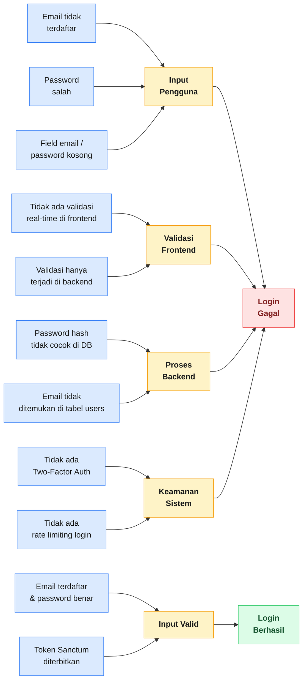
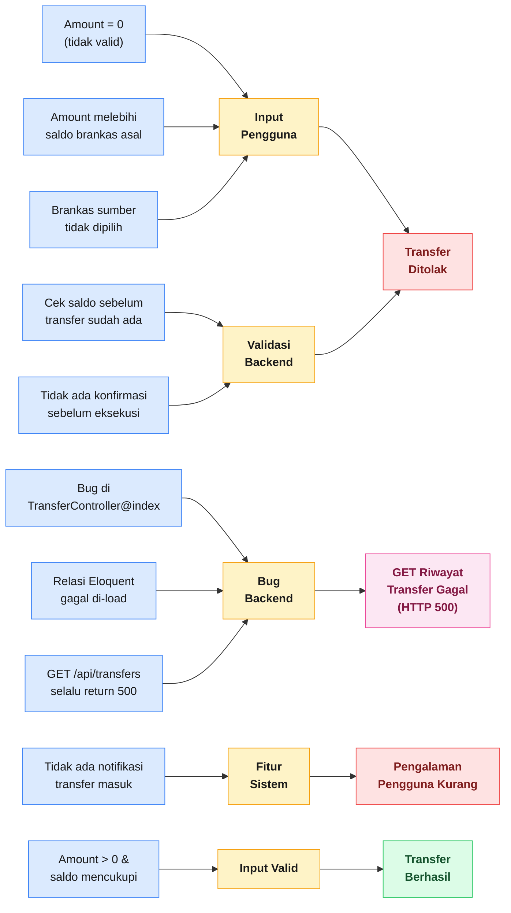
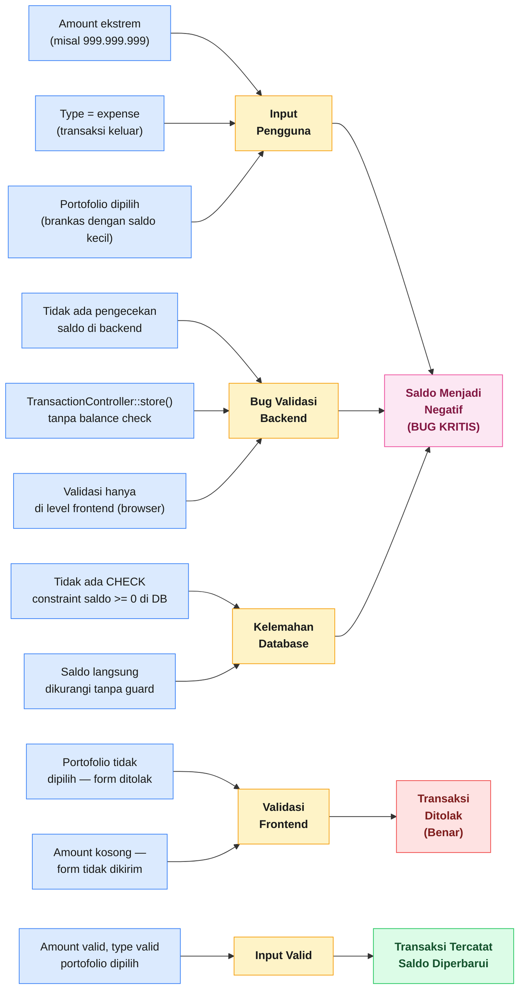
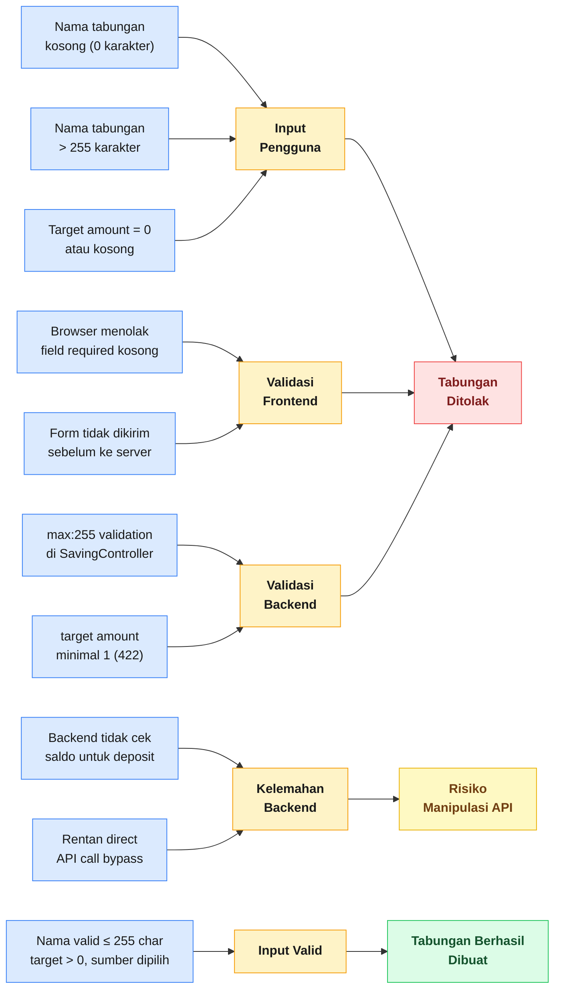

# BB-09 — Cause-Effect Relationship Testing
## Sistem: SaPoPoe FINANCE (Midnight Finance)
## Teknik: Black Box Testing — Cause-Effect Relationship Testing

---

> **Definisi Teknik:**
> Cause-Effect Relationship Testing adalah teknik pengujian dengan cara **membagi spesifikasi menjadi bagian-bagian yang sesuai dengan kebutuhan**, kemudian menentukan **cause** (penyebab) dan **effect** (akibat) berdasarkan spesifikasi kebutuhan, lalu menganalisis hubungan antar keduanya.
>
> Cause merupakan **kondisi input atau situasi** yang memicu suatu perilaku sistem. Effect merupakan **output atau perubahan kondisi** yang dihasilkan oleh system sebagai respons atas cause tersebut. Teknik ini divisualisasikan menggunakan **diagram fishbone (Ishikawa)**.
>
> — Materi Pertemuan 11, Software Quality, T Informatika UKRI

---

## Modul 1 — Autentikasi
### Effect: *"Mengapa Login Bisa Gagal / Berhasil?"*

### Tabel Cause → Effect

| No | Cause (Penyebab) | Kategori | Effect (Akibat) | Status |
|---|---|---|---|---|
| 1 | Email tidak terdaftar di database | Input Pengguna | "Alamat email tidak ditemukan." | 🔴 Gagal |
| 2 | Password tidak sesuai akun | Input Pengguna | "Kata sandi yang Anda masukkan salah." | 🔴 Gagal |
| 3 | Field email atau password kosong | Input Pengguna | Form tidak dikirim — "Harap isi bidang ini." | 🔴 Gagal |
| 4 | Tidak ada validasi real-time | Validasi Frontend | Error baru diketahui setelah submit | ⚠️ Kelemahan UX |
| 5 | Email terdaftar & password benar | Input Valid | Token Sanctum diterbitkan → Dashboard tampil | ✅ Berhasil |

### Screenshot Bukti

**Cause: Email valid + Password benar → Effect: Login Berhasil**

**Cause: Password salah → Effect: Login Ditolak**

---

## Modul 2 — Transfer (Pindah Dana)
### Effect: *"Mengapa Transfer Bisa Gagal?"*

### Tabel Cause → Effect

| No | Cause (Penyebab) | Kategori | Effect (Akibat) | Status |
|---|---|---|---|---|
| 1 | Amount = 0 atau kosong | Input Pengguna | "Harap isi bidang ini." — tidak dikirim | 🔴 Ditolak |
| 2 | Amount > saldo brankas asal | Input Pengguna | "GAGAL Saldo tidak mencukupi..." | 🔴 Ditolak |
| 3 | Bug di `TransferController@index()` | Bug Backend | GET /api/transfers → HTTP 500 di semua request | 🔴 Bug Baru |
| 4 | Tidak ada konfirmasi sebelum eksekusi | Validasi Backend | Transfer langsung diproses tanpa verifikasi ulang | ⚠️ Risiko |
| 5 | Amount valid & saldo mencukupi | Input Valid | "BERHASIL Dana berhasil dipindahkan!" | ✅ Berhasil |

### Screenshot Bukti

**Cause: Amount valid, saldo cukup → Effect: Transfer Berhasil**

**Cause: Amount > saldo → Effect: Transfer Ditolak**

---

## Modul 3 — Transaksi (Catat Aliran Dana)
### Effect: *"Mengapa Saldo Bisa Menjadi Negatif?"*

### Tabel Cause → Effect

| No | Cause (Penyebab) | Kategori | Effect (Akibat) | Status |
|---|---|---|---|---|
| 1 | Amount = 0 atau kosong | Validasi Frontend | "Harap isi bidang ini." — tidak dikirim | ✅ Benar |
| 2 | Portofolio tidak dipilih | Validasi Frontend | "Pilih item pada daftar." — tidak dikirim | ✅ Benar |
| 3 | Tidak ada `balance check` di `TransactionController::store()` | Bug Backend | Expense ekstrem diproses → saldo negatif | 🔴 Bug Kritis |
| 4 | Tidak ada CHECK constraint `saldo >= 0` di database | Kelemahan DB | Database menerima nilai saldo negatif | 🔴 Kelemahan |
| 5 | Amount valid + type valid + portofolio dipilih | Input Valid | Transaksi tercatat, saldo diperbarui sesuai | ✅ Berhasil |

### Screenshot Bukti

**Cause: Income valid → Effect: Transaksi Berhasil, Saldo Bertambah**

sample-transaksi-tc1.png

**Cause: Expense ekstrem tanpa validasi saldo → Effect: Saldo Negatif (Bug Kritis)**

---

## Modul 4 — Tabungan (Target Impian)
### Effect: *"Mengapa Tabungan Bisa Ditolak / Berhasil?"*

### Tabel Cause → Effect

| No | Cause (Penyebab) | Kategori | Effect (Akibat) | Status |
|---|---|---|---|---|
| 1 | Nama tabungan kosong | Validasi Frontend | "Harap isi bidang ini." — tidak dikirim | ✅ Benar |
| 2 | Nama tabungan > 255 karakter | Validasi Backend | "GAGAL — The name field must not be greater than 255 characters." | ✅ Benar |
| 3 | Target amount = 0 | Validasi Backend | HTTP 422 — "target amount minimal 1" | ✅ Benar |
| 4 | Backend tidak memvalidasi saldo saat deposit | Kelemahan Backend | Direct API call bisa bypass frontend validation | ⚠️ Risiko |
| 5 | Nama valid, target > 0, sumber dipilih | Input Valid | Tabungan berhasil dibuat, muncul di daftar | ✅ Berhasil |

### Screenshot Bukti

**Cause: Input valid → Effect: Tabungan Berhasil Dibuat**

**Cause: Nama > 255 karakter → Effect: Ditolak Backend**

---

## Ringkasan Temuan Cause-Effect — Seluruh Sistem

| Modul | Jumlah Cause | Effect Benar ✅ | Effect Bug 🔴 | Kelemahan ⚠️ |
|---|---|---|---|---|
| Autentikasi | 5 | 4 | 0 | 1 (tidak ada real-time validation) |
| Transfer | 5 | 2 | 1 (GET 500) | 2 (konfirmasi, notifikasi) |
| Transaksi | 5 | 3 | 1 (saldo negatif) | 1 (constraint DB) |
| Tabungan | 5 | 4 | 0 | 1 (bypass API) |
| **TOTAL** | **20** | **13** | **2** | **5** |

### Rekapitulasi Defect yang Ditemukan

| No | Defect | Modul | Cause | Effect | Rekomendasi |
|---|---|---|---|---|---|
| 1 | Saldo bisa negatif | Transaksi | Tidak ada `balance check` di `TransactionController::store()` | Saldo BCA menjadi Rp -994.649.999 | Tambahkan `if ($wallet->balance < $request->amount) return 400` |
| 2 | GET riwayat transfer error | Transfer | Bug di `TransferController@index()` — relasi gagal | HTTP 500 di setiap request GET /api/transfers | Debug query Eloquent di `TransferController@index()` |

> **Kesimpulan Cause-Effect Testing:** Dari pemetaan 20 hubungan cause-effect pada 4 modul, ditemukan **2 defect aktif** dan **5 area kelemahan** yang berpotensi menjadi risiko. Defect paling kritis adalah saldo negatif pada modul Transaksi yang disebabkan oleh tidak adanya pengecekan saldo di layer backend. Diagram fishbone membantu mengidentifikasi bahwa akar masalah bukan di layer input pengguna, melainkan di **layer validasi backend** yang tidak lengkap.
