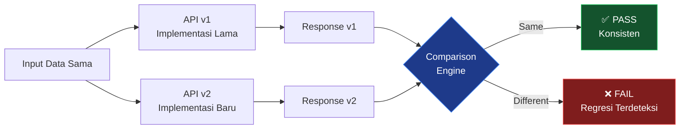

# 🔄 Comparison Testing

> **Model Black Box Testing #6** — *Quality Attribute Testing*
> **Modul Target:** API Response — Konsistensi Versi & Redundansi
> **Tim:** REMACode

---

## 📖 1. Definisi

**Comparison Testing** adalah teknik pengujian yang **menguji tiap versi**, bertujuan untuk **menjamin keseluruhan versi mendapatkan hasil yang sama dengan data uji yang sama**. Teknik ini memungkinkan penggunaan **redundansi hardware dan software untuk mengurangi kesalahan** (Suprihadi, 2025).

> *"Uji tiap versi, yang bertujuan untuk menjamin keseluruhan versi mendapatkan hasil yang sama dengan data uji yang sama. Kemungkinan penggunaan redunansi hardware dan software untuk mengurangi kesalahan."* — (Suprihadi, 2025)

### Skenario Comparison Testing

| Skenario | Deskripsi |
|---|---|
| **Version Comparison** | Uji API v1 vs v2 — hasil harus konsisten untuk fungsi yang sama |
| **Environment Comparison** | Uji di local vs staging vs production — hasil harus identik |
| **Redundancy Comparison** | Uji dengan data yang sama di server berbeda |
| **Refactor Comparison** | Sebelum vs sesudah refactor — behavior harus sama |

---

## 🎯 2. Tujuan Pengujian

| No | Tujuan |
|---|---|
| 1 | Memastikan API v1 dan v2 menghasilkan data yang **semantically equivalent** |
| 2 | Mendeteksi **regresi** saat upgrade atau refactor |
| 3 | Memvalidasi **backward compatibility** endpoint yang di-deprecate |
| 4 | Memverifikasi **konsistensi kalkulasi** di berbagai versi |
| 5 | Menjamin **data integrity** tidak berubah antar versi |

---

## 💻 3. Modul yang Diuji

**Endpoint Pair:**
- `GET /api/v1/transactions/summary` — versi lama
- `GET /api/v2/transactions/summary` — versi baru (refactored)

**Endpoint Tambahan:**
- `GET /api/v1/accounts/balance` vs `GET /api/v2/accounts/balance`
- `GET /api/v1/budgets/{id}` vs `GET /api/v2/budgets/{id}`

> ⚠️ **TODO:** Konfirmasi apakah Midnight Finance menggunakan versioning API (`/v1/`, `/v2/`). Jika tidak, gunakan skenario **before/after refactor** atau **local vs staging comparison**.

---

## 🔍 4. Strategi Comparison



### 4.1 Yang Dibandingkan

| Aspek | v1 | v2 | Harus Sama? |
|---|---|---|---|
| **Nilai kalkulasi** | `total_income: 5000000` | `total_income: 5000000` | ✅ Ya |
| **Struktur data core** | `data.transactions[]` | `data.transactions[]` | ✅ Ya |
| **HTTP Status Code** | 200 | 200 | ✅ Ya |
| **Field tambahan baru** | — | `data.meta.version: 2` | ⚠️ Boleh berbeda |
| **Format field baru** | — | `data.percentage` (baru) | ⚠️ Boleh berbeda |
| **Response time** | ~200ms | ~150ms (lebih cepat) | ⚠️ v2 boleh lebih cepat |

---

## 🧪 5. Test Case Design

### 5.1 Summary Transaksi — v1 vs v2

| TC ID | Endpoint | Input | Yang Dibandingkan | Expected |
|---|---|---|---|---|
| `CT-TC-01` | `/v1/` vs `/v2/summary` | month=1, year=2024 | `total_income` | Nilai identik |
| `CT-TC-02` | `/v1/` vs `/v2/summary` | month=1, year=2024 | `total_expense` | Nilai identik |
| `CT-TC-03` | `/v1/` vs `/v2/summary` | month=1, year=2024 | `net_balance` | Nilai identik |
| `CT-TC-04` | `/v1/` vs `/v2/summary` | Semua data kosong | Response structure | Konsisten |

### 5.2 Account Balance — v1 vs v2

| TC ID | Endpoint | Input | Yang Dibandingkan | Expected |
|---|---|---|---|---|
| `CT-TC-05` | `/v1/` vs `/v2/accounts` | account_id=1 | `balance` | Nilai identik |
| `CT-TC-06` | `/v1/` vs `/v2/accounts` | account_id=1 | `currency` | Nilai identik |
| `CT-TC-07` | `/v1/` vs `/v2/accounts` | Account tidak ada | HTTP status | Sama (404) |

### 5.3 Budget Status — v1 vs v2

| TC ID | Endpoint | Input | Yang Dibandingkan | Expected |
|---|---|---|---|---|
| `CT-TC-08` | `/v1/` vs `/v2/budgets` | budget_id=1 | `status` | Nilai identik |
| `CT-TC-09` | `/v1/` vs `/v2/budgets` | budget_id=1 | `percentage` | Nilai identik (±0.01) |
| `CT-TC-10` | `/v1/` vs `/v2/budgets` | budget_id=1 | `spent` | Nilai identik |

### 5.4 Environment Comparison

| TC ID | Environment A | Environment B | Input | Expected |
|---|---|---|---|---|
| `CT-ENV-01` | Local | Staging | POST /register | Behavior sama |
| `CT-ENV-02` | Local | Staging | POST /login | Token format sama |
| `CT-ENV-03` | Staging | Production | GET /transactions | Data count sama |

---

## 📸 7. Screenshot yang Diperlukan

> **📸 SCREENSHOT NEEDED #1:** **Postman — Response v1 Summary**
> Jalankan `GET /api/v1/transactions/summary?month=1&year=2024`, screenshot full response JSON.
> *File suggested name:* `screenshot/CT-v1-summary-response.png`

> **📸 SCREENSHOT NEEDED #2:** **Postman — Response v2 Summary**
> Jalankan `GET /api/v2/transactions/summary?month=1&year=2024` dengan data sama, screenshot full response JSON untuk dibandingkan.
> *File suggested name:* `screenshot/CT-v2-summary-response.png`

> **📸 SCREENSHOT NEEDED #3:** **Hasil Comparison (Side by Side)**
> Jika memungkinkan, screenshot kedua response berdampingan untuk menunjukkan nilai yang sama.
> *File suggested name:* `screenshot/CT-comparison-sidebyside.png`

> **📸 SCREENSHOT NEEDED #4:** **Test Result PHPUnit**
> Screenshot hasil `php artisan test --filter=ComparisonTest` yang menunjukkan semua test pass.
> *File suggested name:* `screenshot/CT-phpunit-result.png`

---

## 🚀 8. Implementasi Pengujian

### 8.1 Postman Collection — Comparison Runner

```javascript
// Postman Test Script (tambahkan di Tests tab kedua request)

// Simpan response v1 ke environment variable
pm.environment.set('v1_total_income', pm.response.json().data.total_income);
pm.environment.set('v1_total_expense', pm.response.json().data.total_expense);
pm.environment.set('v1_net_balance', pm.response.json().data.net_balance);

// Di request v2, bandingkan dengan v1
const v1Income  = pm.environment.get('v1_total_income');
const v2Income  = pm.response.json().data.total_income;

pm.test('Total income v1 == v2', () => {
    pm.expect(v2Income).to.equal(v1Income);
});

pm.test('HTTP status sama', () => {
    pm.expect(pm.response.code).to.equal(200);
});
```

### 8.2 PHPUnit Comparison Test

```php
<?php

namespace Tests\Feature\Comparison;

use App\Models\Transaction;
use App\Models\User;
use Carbon\Carbon;
use Illuminate\Foundation\Testing\RefreshDatabase;
use Tests\TestCase;

class ApiVersionComparisonTest extends TestCase
{
    use RefreshDatabase;

    private User $user;

    protected function setUp(): void
    {
        parent::setUp();
        $this->user = User::factory()->create();

        // Seed identical data for both versions to compare
        Transaction::factory(20)->create([
            'user_id' => $this->user->id,
            'type'    => 'income',
            'transaction_date' => Carbon::create(2024, 1, 15),
        ]);

        Transaction::factory(15)->create([
            'user_id' => $this->user->id,
            'type'    => 'expense',
            'transaction_date' => Carbon::create(2024, 1, 20),
        ]);
    }

    /** @test CT-TC-01,02,03: Summary kalkulasi v1 == v2 */
    public function it_returns_identical_summary_calculations_across_versions(): void
    {
        $v1 = $this->actingAs($this->user)
            ->getJson('/api/v1/transactions/summary?month=1&year=2024')
            ->assertStatus(200)
            ->json('data');

        $v2 = $this->actingAs($this->user)
            ->getJson('/api/v2/transactions/summary?month=1&year=2024')
            ->assertStatus(200)
            ->json('data');

        // Core values MUST be identical
        $this->assertEquals($v1['total_income'], $v2['total_income'],
            'total_income berbeda antara v1 dan v2'
        );

        $this->assertEquals($v1['total_expense'], $v2['total_expense'],
            'total_expense berbeda antara v1 dan v2'
        );

        $this->assertEquals($v1['net_balance'], $v2['net_balance'],
            'net_balance berbeda antara v1 dan v2'
        );
    }

    /** @test CT-TC-05: Account balance v1 == v2 */
    public function it_returns_identical_account_balance_across_versions(): void
    {
        $account = \App\Models\Account::factory()->create([
            'user_id' => $this->user->id,
            'balance' => 5_000_000,
        ]);

        $v1Balance = $this->actingAs($this->user)
            ->getJson("/api/v1/accounts/{$account->id}")
            ->json('data.balance');

        $v2Balance = $this->actingAs($this->user)
            ->getJson("/api/v2/accounts/{$account->id}")
            ->json('data.balance');

        $this->assertEquals($v1Balance, $v2Balance,
            'Balance berbeda antara v1 dan v2'
        );
    }

    /** @test CT-TC-08,09: Budget status v1 == v2 */
    public function it_returns_identical_budget_status_across_versions(): void
    {
        $budget = \App\Models\Budget::factory()->create([
            'user_id'      => $this->user->id,
            'limit_amount' => 1_000_000,
            'start_date'   => Carbon::now()->startOfMonth(),
            'end_date'     => Carbon::now()->endOfMonth(),
        ]);

        $v1 = $this->actingAs($this->user)
            ->getJson("/api/v1/budgets/{$budget->id}/status")
            ->json('data');

        $v2 = $this->actingAs($this->user)
            ->getJson("/api/v2/budgets/{$budget->id}/status")
            ->json('data');

        $this->assertEquals($v1['status'], $v2['status']);
        $this->assertEqualsWithDelta($v1['percentage'], $v2['percentage'], 0.01);
        $this->assertEquals($v1['spent'], $v2['spent']);
    }

    /** @test CT-TC-07: 404 behavior konsisten */
    public function it_returns_same_error_behavior_for_nonexistent_resource(): void
    {
        $v1Status = $this->actingAs($this->user)
            ->getJson('/api/v1/accounts/99999')
            ->status();

        $v2Status = $this->actingAs($this->user)
            ->getJson('/api/v2/accounts/99999')
            ->status();

        $this->assertEquals($v1Status, $v2Status,
            'HTTP status berbeda untuk resource tidak ada antara v1 dan v2'
        );
    }

    /** @test Refactor test: kalkulasi tetap sama setelah refactor */
    public function it_produces_same_result_before_and_after_refactor(): void
    {
        // Simulasi: bandingkan hasil kalkulasi manual vs service
        $dbTotal = Transaction::where('user_id', $this->user->id)
            ->where('type', 'income')
            ->whereMonth('transaction_date', 1)
            ->whereYear('transaction_date', 2024)
            ->sum('amount');

        $apiTotal = $this->actingAs($this->user)
            ->getJson('/api/v2/transactions/summary?type=income&month=1&year=2024')
            ->json('data.total_income');

        $this->assertEqualsWithDelta($dbTotal, $apiTotal, 0.01,
            'Kalkulasi API tidak sesuai dengan kalkulasi langsung dari DB'
        );
    }
}
```

---

## 📊 9. Hasil Eksekusi

### 9.1 Version Comparison Table

| TC ID | v1 Result | v2 Result | Match? | Status |
|---|---|---|---|---|
| `CT-TC-01` (total_income) | ⏳ Pending | ⏳ Pending | — | — |
| `CT-TC-02` (total_expense) | ⏳ Pending | ⏳ Pending | — | — |
| `CT-TC-03` (net_balance) | ⏳ Pending | ⏳ Pending | — | — |
| `CT-TC-05` (balance) | ⏳ Pending | ⏳ Pending | — | — |
| `CT-TC-07` (404 behavior) | ⏳ Pending | ⏳ Pending | — | — |
| `CT-TC-08` (budget status) | ⏳ Pending | ⏳ Pending | — | — |
| `CT-TC-09` (percentage) | ⏳ Pending | ⏳ Pending | — | — |

### 9.2 Diff Analysis Template

Ketika ditemukan perbedaan, gunakan format ini:

```diff
// CT-TC-01: total_income comparison
- v1: { "total_income": 5000000 }
+ v2: { "total_income": 5000001 }    ← REGRESI TERDETEKSI
```

---

## 🐛 10. Temuan & Analisis

| ID | Severity | Deskripsi (Predicted) | Rekomendasi |
|---|---|---|---|
| `CT-001` | 🔴 High | Float precision berbeda di v1 vs v2 jika salah satu refactor ke BCMath | Standardisasi semua kalkulasi finansial ke BCMath |
| `CT-002` | 🟡 Medium | Response structure berubah di v2 (field rename) tanpa backward compat | Jaga field lama, tambah field baru (non-breaking) |
| `CT-003` | 🟡 Medium | Timezone berbeda di v1 vs v2 menyebabkan summary bulan berbeda | Pastikan semua query pakai `app.timezone` config |
| `CT-004` | 🟢 Low | v2 response lebih verbose (extra meta fields) membesar payload | Dokumentasikan perubahan di API changelog |

---

## ⚖️ 11. Kelebihan & Kekurangan

### ✅ Kelebihan
- Mendeteksi **regresi** yang tidak terlihat dari unit test
- **Safety net** saat refactor atau upgrade dependency
- Memvalidasi **backward compatibility** untuk client lama
- Mendeteksi **inkonsistensi kalkulasi** antar environment
- Dapat di-automate sepenuhnya

### ❌ Kekurangan
- Membutuhkan **dua versi sistem** yang berjalan bersamaan
- **Effort setup** tinggi jika tidak ada versioning
- Tidak berguna jika v2 memang **intentionally berbeda**
- Sulit untuk **non-deterministic output** (timestamp, random ID)
- Tidak mendeteksi bug yang ada di **kedua versi sekaligus**

---

## 🛠️ 12. Tools Pendukung

| Tool | Kegunaan |
|---|---|
| **Postman Collection Runner** | Run comparison request secara batch |
| **Newman** | CLI runner untuk Postman collection |
| **Diffy** | Automated API response diff tool |
| **PHPUnit** | Automated comparison assertions |
| **Laravel API Versioning** | `league/fractal` atau route prefix |

```bash
# Run Postman collection comparison via Newman
npx newman run comparison-collection.json \
    --environment staging.json \
    --reporters cli,json \
    --reporter-json-export results.json
```

---

## 📚 Referensi

1. Suprihadi, D. (2025). *Materi Software Quality Pertemuan 11*. Universitas Kristen Indonesia.
2. Myers, G. J., Sandler, C., & Badgett, T. (2011). *The Art of Software Testing* (3rd ed.). Wiley.
3. Beizer, B. (1995). *Black-Box Testing*. Wiley.
4. Fowler, M. (2018). *Refactoring: Improving the Design of Existing Code* (2nd ed.). Addison-Wesley.

---

<div align="center">

[⬅ Robustness Testing](./Robustness_Testing.md) · [Kembali ke README](./README.md) · [Lanjut ke Behaviour Testing ➡](./Behaviour_Testing.md)

**Tim REMACode** — Midnight Finance SQA Documentation

</div>
