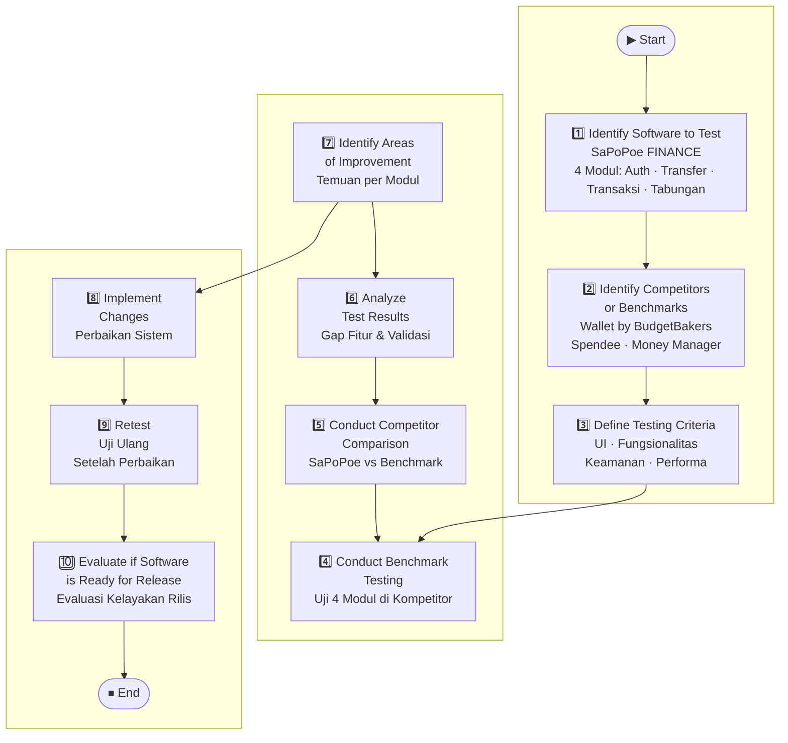

# BB-04 — Comparison Testing
## Sistem: SaPoPoe FINANCE (Midnight Finance)
## Teknik: Black Box Testing — Comparison Testing

---

> **Definisi Teknik:**
> Comparison Testing adalah pengujian **gabungan dari berbagai versi atau sistem**, yang bertujuan untuk menjamin keseluruhan versi mendapatkan hasil yang sama dengan data uji yang sama. Kemungkinan penggunaan **redudansi hardware dan software untuk mengurangi kesalahan**.
>
> — Materi Pertemuan 11, Software Quality, T Informatika UKRI

---

## Proses Comparison Testing — SaPoPoe FINANCE

---

## Identifikasi Sistem & Kompetitor

| Item | Detail |
|---|---|
| **Software yang Diuji** | SaPoPoe FINANCE (Midnight Finance) — Laravel 11 + React.js |
| **Modul yang Diuji** | Auth (Login), Transfer (Pindah Dana), Transaksi (Catat Aliran Dana), Tabungan (Target Impian) |
| **Kompetitor / Benchmark** | Wallet by BudgetBakers, Spendee, Money Manager |
| **Kriteria Pengujian** | UI/UX, Fungsionalitas, Validasi Input, Keamanan, Pesan Error |

---

## Kriteria Pengujian (Testing Criteria)

| No | Kriteria | Deskripsi |
|---|---|---|
| 1 | **UI / UX** | Kemudahan penggunaan, kejelasan tampilan form, responsivitas |
| 2 | **Fungsionalitas** | Apakah fitur berjalan sesuai tujuan (login, transfer, catat transaksi, tabungan) |
| 3 | **Validasi Input** | Apakah sistem menolak input tidak valid dengan pesan yang tepat |
| 4 | **Keamanan** | Apakah autentikasi aman, saldo tidak bisa menjadi negatif |

---

## Hasil Perbandingan — 4 Modul

### Modul 1 — Autentikasi (Form Login)

| No | Kriteria | SaPoPoe FINANCE | Benchmark (Wallet by BudgetBakers) | Hasil |
|---|---|---|---|---|
| 1 | UI / UX | Form login minimalis, dark theme, responsif | Form login dengan opsi Google/Apple Sign-In | SaPoPoe lebih sederhana, tanpa SSO |
| 2 | Fungsionalitas | Email + password, token-based (Sanctum) | Multi-provider auth (email, Google, Apple) | Benchmark lebih lengkap |
| 3 | Validasi Input | Validasi required dan format email di backend (422) | Validasi real-time di frontend | SaPoPoe kurang validasi real-time |
| 4 | Keamanan | Token disimpan via Sanctum, tidak ada 2FA | Mendukung 2FA dan session management | Benchmark lebih aman |
| | **Kesimpulan** | Fungsi dasar login berjalan baik | Fitur auth lebih kaya | ⚠️ Perlu peningkatan (SSO, 2FA, real-time validation) |

---

### Modul 2 — Transfer (Form Pindah Dana)

| No | Kriteria | SaPoPoe FINANCE | Benchmark (Wallet by BudgetBakers) | Hasil |
|---|---|---|---|---|
| 1 | UI / UX | Form sederhana: pilih sumber, tujuan, nominal | Form transfer dengan preview saldo sebelum/sesudah | Benchmark lebih informatif |
| 2 | Fungsionalitas | Transfer antar brankas internal + biaya admin | Transfer antar akun, koneksi rekening bank nyata | Benchmark lebih lengkap (bank integration) |
| 3 | Validasi Input | Validasi amount min 1, cek saldo mencukupi | Validasi saldo real-time sebelum submit | Kedua sistem menangani validasi saldo |
| 4 | Keamanan | Saldo dicek sebelum proses transfer | Konfirmasi PIN / biometrik sebelum transfer | Benchmark lebih aman (konfirmasi tambahan) |
| | **Kesimpulan** | Transfer internal berfungsi dengan baik | Lebih kaya fitur (bank nyata, PIN konfirmasi) | ⚠️ Perlu konfirmasi sebelum transfer |

---

### Modul 3 — Transaksi (Form Catat Aliran Dana)

| No | Kriteria | SaPoPoe FINANCE | Benchmark (Spendee) | Hasil |
|---|---|---|---|---|
| 1 | UI / UX | Modal form dengan tab MASUK/KELUAR, kategori dropdown | Form dengan ikon kategori visual, autocomplete | Benchmark lebih intuitif secara visual |
| 2 | Fungsionalitas | Catat income/expense, pilih portofolio & kategori | Catat transaksi + foto nota + geolokasi | Benchmark lebih lengkap |
| 3 | Validasi Input | Validasi amount dan portofolio (browser native) | Validasi real-time dengan highlight field error | SaPoPoe hanya validasi browser default |
| 4 | Keamanan | **Bug kritis**: expense tidak cek saldo → saldo bisa negatif | Saldo tidak bisa negatif, ada konfirmasi | 🔴 SaPoPoe gagal di aspek ini |
| | **Kesimpulan** | Fungsionalitas dasar berjalan kecuali cek saldo | Lebih lengkap dan aman | 🔴 Defect kritis ditemukan (TC6 BVA) |

---

### Modul 4 — Tabungan (Form Target Impian)

| No | Kriteria | SaPoPoe FINANCE | Benchmark (Money Manager) | Hasil |
|---|---|---|---|---|
| 1 | UI / UX | Form target dengan nama, nominal, deadline opsional | Target tabungan dengan progress bar, notifikasi | Benchmark lebih engaging (gamifikasi) |
| 2 | Fungsionalitas | Buat target, setor dana, pantau progres | Buat target + auto-debit + reminder | Benchmark lebih otomatis |
| 3 | Validasi Input | Validasi nama (required, max 255), target min 1 | Validasi real-time semua field | SaPoPoe validasi backend sudah cukup baik |
| 4 | Keamanan | Frontend validasi saldo sebelum setor; backend masih rentan direct API | Validasi saldo di semua layer | ⚠️ Backend SaPoPoe masih rentan direct API call |
| | **Kesimpulan** | Fungsionalitas dasar berjalan, frontend sudah aman | Lebih lengkap (auto-debit, reminder) | ⚠️ Backend perlu diperkuat |

---

## Ringkasan Temuan & Rekomendasi

| Modul | Status | Temuan Utama | Rekomendasi |
|---|---|---|---|
| Auth — Form Login | ⚠️ Perlu Peningkatan | Tidak ada SSO, 2FA, dan validasi real-time di frontend | Tambahkan validasi real-time + opsi Google Sign-In |
| Transfer — Form Pindah Dana | ⚠️ Perlu Peningkatan | Tidak ada konfirmasi PIN sebelum transfer | Tambahkan konfirmasi transaksi sebelum dieksekusi |
| Transaksi — Form Catat Aliran Dana | 🔴 Defect Kritis | Backend tidak cek saldo untuk expense → saldo negatif | Tambahkan cek saldo di `TransactionController::store()` |
| Tabungan — Form Target Impian | ⚠️ Perlu Peningkatan | Backend rentan direct API (bypass frontend validation) | Tambahkan cek saldo di `SavingController::store()` |

> **Kesimpulan Comparison Testing:** SaPoPoe FINANCE memiliki fungsionalitas dasar yang berjalan sesuai kebutuhan, namun dibandingkan dengan aplikasi keuangan personal sejenis, masih terdapat **1 defect kritis** (saldo negatif pada modul Transaksi) dan beberapa area yang perlu ditingkatkan (keamanan backend, UX validation, konfirmasi transaksi). Sistem **belum sepenuhnya siap untuk rilis** tanpa perbaikan pada `TransactionController` dan `SavingController`.
