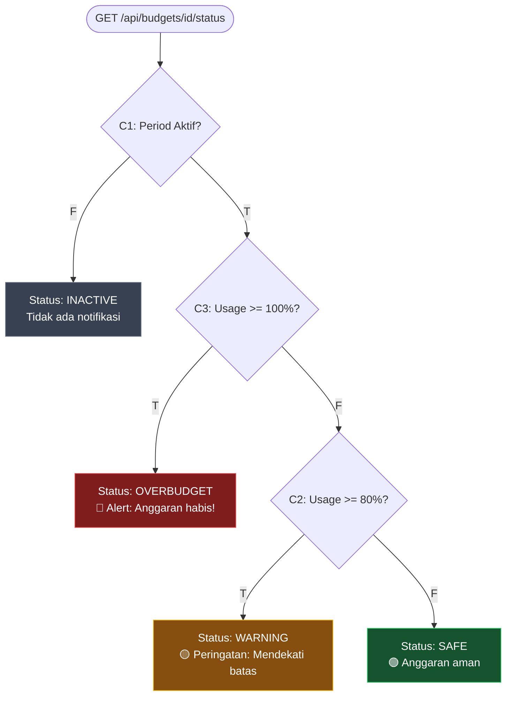

# 📋 Decision Table Testing

> **Model Black Box Testing #3** — *Logic-Based Testing*
> **Modul Target:** Status Anggaran Bulanan (Safe / Warning / Overbudget)
> **Tim:** REMACode

---

## 📖 1. Definisi

**Decision Table Testing** adalah pengujian **gabungan dari berbagai kondisi dalam pengambilan keputusan**, yang digunakan pada uji software dalam **verifikasi input yang beragam** tetapi saling menggenapi fungsi form (Suprihadi, 2025). Teknik ini sangat efektif ketika output sistem ditentukan oleh **kombinasi dari beberapa kondisi** secara bersamaan.

> *"Pengujian gabungan dari berbagai kondisi dalam pengambilan keputusan, yang digunakan pada uji software dalam verifikasi input yang beragam tetapi saling menggenapi fungsi form."* — (Suprihadi, 2025)

### Komponen Decision Table

| Komponen | Simbol | Deskripsi |
|---|---|---|
| **Condition** | C | Kondisi/rules yang dievaluasi |
| **Action** | A | Aksi yang dieksekusi |
| **True** | T | Kondisi bernilai benar |
| **False** | F | Kondisi bernilai salah |
| **Execute** | E | Aksi dijalankan |
| **Don't Care** | — | Nilai tidak mempengaruhi output |

---

## 🎯 2. Tujuan Pengujian

| No | Tujuan |
|---|---|
| 1 | Memastikan setiap kombinasi kondisi menghasilkan aksi yang benar |
| 2 | Menemukan kombinasi yang tidak ter-handle (missing rules) |
| 3 | Mendeteksi inkonsistensi logika bisnis |
| 4 | Memverifikasi tampilan notifikasi & alert sesuai status |
| 5 | Menjamin coverage 100% kombinasi kondisi |

---

## 💻 3. Modul yang Diuji

**Endpoint:** `GET /api/budgets/{id}/status`
**Modul:** Dashboard Anggaran — menentukan status berdasarkan kombinasi kondisi

> ⚠️ **TODO:** Konfirmasi threshold dan kondisi di `midnight-finance-backend`.

### Kondisi Bisnis

Modul ini menggunakan **3 kondisi utama** yang menentukan **4 kemungkinan aksi**:

| Kondisi | Deskripsi |
|---|---|
| **C1** | Budget period sudah aktif (tanggal sekarang dalam range periode) |
| **C2** | Persentase pemakaian ≥ 80% |
| **C3** | Persentase pemakaian ≥ 100% |

---

## 📊 4. Decision Table

### 4.1 Full Decision Table (8 kombinasi)

| ID | C1: Period Aktif? | C2: Usage ≥ 80%? | C3: Usage ≥ 100%? | A1: Status = Inactive | A2: Status = Safe | A3: Status = Warning | A4: Status = Overbudget |
|---|---|---|---|---|---|---|---|
| **TC1** | F | F | F | **E** | — | — | — |
| **TC2** | F | T | F | **E** | — | — | — |
| **TC3** | F | F | T | **E** | — | — | — |
| **TC4** | F | T | T | **E** | — | — | — |
| **TC5** | T | F | F | — | **E** | — | — |
| **TC6** | T | T | F | — | — | **E** | — |
| **TC7** | T | F | T | — | — | — | *(impossible)* |
| **TC8** | T | T | T | — | — | — | **E** |

> **Catatan TC7:** Kondisi `C2=F (usage < 80%)` & `C3=T (usage ≥ 100%)` tidak mungkin terjadi secara bersamaan karena 100% > 80%. Ini adalah **impossible combination** yang tidak perlu diuji.

### 4.2 Reduced Decision Table (Effective Rules)

Setelah eliminasi impossible combination:

| TC ID | C1: Period Aktif | C2: ≥ 80% | C3: ≥ 100% | Action | Status |
|---|---|---|---|---|---|
| `DT-TC-01` | F | F | F | Status = **Inactive** | — |
| `DT-TC-02` | F | T | F | Status = **Inactive** | — |
| `DT-TC-03` | F | T | T | Status = **Inactive** | — |
| `DT-TC-04` | T | F | F | Status = **Safe** | — |
| `DT-TC-05` | T | T | F | Status = **Warning** | — |
| `DT-TC-06` | T | T | T | Status = **Overbudget** | — |

**Total Effective Rules: 6** (dari 8 kombinasi teoretis, 1 impossible + 1 redundant dihilangkan)

---

## 🗺️ 5. Visualisasi Logika



---

## 🧪 6. Detail Test Case

### DT-TC-01: Period Tidak Aktif (Semua False)

| Parameter | Value |
|---|---|
| **Input** | Budget period: masa lalu (expired) |
| **Usage** | 0% |
| **Expected Status** | `inactive` |
| **Expected HTTP** | 200 OK |
| **Expected Notif** | Tidak ada alert |

### DT-TC-04: Period Aktif, Usage Normal

| Parameter | Value |
|---|---|
| **Input** | Budget period: aktif |
| **Usage** | 50% (spent=500rb, limit=1jt) |
| **Expected Status** | `safe` |
| **Expected HTTP** | 200 OK |
| **Expected Notif** | Badge hijau di dashboard |

### DT-TC-05: Period Aktif, Usage Warning

| Parameter | Value |
|---|---|
| **Input** | Budget period: aktif |
| **Usage** | 85% (spent=850rb, limit=1jt) |
| **Expected Status** | `warning` |
| **Expected HTTP** | 200 OK |
| **Expected Notif** | Badge kuning + push notification |

### DT-TC-06: Period Aktif, Overbudget

| Parameter | Value |
|---|---|
| **Input** | Budget period: aktif |
| **Usage** | 120% (spent=1.2jt, limit=1jt) |
| **Expected Status** | `overbudget` |
| **Expected HTTP** | 200 OK |
| **Expected Notif** | Badge merah + alert + email notification |

---

## 📸 7. Screenshot yang Diperlukan

> **📸 SCREENSHOT NEEDED #1:** **Dashboard Anggaran — Status Safe**
> Buka halaman anggaran dengan kondisi usage < 80%, screenshot badge/status "Safe" (hijau) di dashboard.
> *File suggested name:* `screenshot/DT-status-safe.png`

> **📸 SCREENSHOT NEEDED #2:** **Dashboard Anggaran — Status Warning**
> Buat atau temukan budget dengan usage 80-99%, screenshot badge/status "Warning" (kuning).
> *File suggested name:* `screenshot/DT-status-warning.png`

> **📸 SCREENSHOT NEEDED #3:** **Dashboard Anggaran — Status Overbudget**
> Buat atau temukan budget dengan usage ≥ 100%, screenshot badge/status "Overbudget" (merah) beserta alert.
> *File suggested name:* `screenshot/DT-status-overbudget.png`

> **📸 SCREENSHOT NEEDED #4:** **Budget Inactive**
> Buka budget yang sudah expired (periode sudah lewat), screenshot tampilannya.
> *File suggested name:* `screenshot/DT-status-inactive.png`

---

## 🚀 8. Implementasi Pengujian

### 8.1 Manual Testing (Postman)

```http
GET /api/budgets/1/status HTTP/1.1
Authorization: Bearer {token}
```

**Response TC-04 (Safe):**
```json
{
    "status": "success",
    "data": {
        "budget_id": 1,
        "status": "safe",
        "percentage": 50.00,
        "spent": 500000,
        "limit": 1000000,
        "period": {
            "start": "2025-05-01",
            "end": "2025-05-31",
            "is_active": true
        }
    }
}
```

**Response TC-06 (Overbudget):**
```json
{
    "status": "success",
    "data": {
        "budget_id": 1,
        "status": "overbudget",
        "percentage": 120.00,
        "spent": 1200000,
        "limit": 1000000,
        "period": {
            "start": "2025-05-01",
            "end": "2025-05-31",
            "is_active": true
        }
    }
}
```

### 8.2 PHPUnit Feature Test

```php
<?php

namespace Tests\Feature\Budget;

use App\Models\Budget;
use App\Models\Transaction;
use App\Models\User;
use Carbon\Carbon;
use Illuminate\Foundation\Testing\RefreshDatabase;
use Tests\TestCase;

class BudgetStatusDecisionTableTest extends TestCase
{
    use RefreshDatabase;

    private User $user;

    protected function setUp(): void
    {
        parent::setUp();
        $this->user = User::factory()->create();
    }

    /** @test DT-TC-01: C1=F, C2=F, C3=F → Inactive */
    public function it_returns_inactive_when_period_not_active(): void
    {
        $budget = Budget::factory()->create([
            'user_id'      => $this->user->id,
            'limit_amount' => 1_000_000,
            'start_date'   => Carbon::now()->subDays(60),
            'end_date'     => Carbon::now()->subDays(30), // expired
        ]);

        $response = $this->actingAs($this->user)
            ->getJson("/api/budgets/{$budget->id}/status");

        $response->assertStatus(200)
                 ->assertJsonPath('data.status', 'inactive');
    }

    /** @test DT-TC-04: C1=T, C2=F, C3=F → Safe */
    public function it_returns_safe_when_usage_below_80_percent(): void
    {
        $budget = Budget::factory()->create([
            'user_id'      => $this->user->id,
            'limit_amount' => 1_000_000,
            'start_date'   => Carbon::now()->startOfMonth(),
            'end_date'     => Carbon::now()->endOfMonth(),
        ]);

        // Create transactions totaling 50% of budget
        Transaction::factory()->create([
            'user_id'    => $this->user->id,
            'budget_id'  => $budget->id,
            'type'       => 'expense',
            'amount'     => 500_000,
        ]);

        $response = $this->actingAs($this->user)
            ->getJson("/api/budgets/{$budget->id}/status");

        $response->assertStatus(200)
                 ->assertJsonPath('data.status', 'safe')
                 ->assertJsonPath('data.percentage', 50.00);
    }

    /** @test DT-TC-05: C1=T, C2=T, C3=F → Warning */
    public function it_returns_warning_when_usage_between_80_and_100_percent(): void
    {
        $budget = Budget::factory()->create([
            'user_id'      => $this->user->id,
            'limit_amount' => 1_000_000,
            'start_date'   => Carbon::now()->startOfMonth(),
            'end_date'     => Carbon::now()->endOfMonth(),
        ]);

        Transaction::factory()->create([
            'user_id'   => $this->user->id,
            'budget_id' => $budget->id,
            'type'      => 'expense',
            'amount'    => 850_000, // 85%
        ]);

        $response = $this->actingAs($this->user)
            ->getJson("/api/budgets/{$budget->id}/status");

        $response->assertStatus(200)
                 ->assertJsonPath('data.status', 'warning')
                 ->assertJsonPath('data.percentage', 85.00);
    }

    /** @test DT-TC-06: C1=T, C2=T, C3=T → Overbudget */
    public function it_returns_overbudget_when_usage_exceeds_100_percent(): void
    {
        $budget = Budget::factory()->create([
            'user_id'      => $this->user->id,
            'limit_amount' => 1_000_000,
            'start_date'   => Carbon::now()->startOfMonth(),
            'end_date'     => Carbon::now()->endOfMonth(),
        ]);

        Transaction::factory()->create([
            'user_id'   => $this->user->id,
            'budget_id' => $budget->id,
            'type'      => 'expense',
            'amount'    => 1_200_000, // 120%
        ]);

        $response = $this->actingAs($this->user)
            ->getJson("/api/budgets/{$budget->id}/status");

        $response->assertStatus(200)
                 ->assertJsonPath('data.status', 'overbudget')
                 ->assertJsonPath('data.percentage', 120.00);
    }

    /** @test Boundary: tepat 80% → Warning */
    public function it_returns_warning_at_exactly_80_percent(): void
    {
        $budget = Budget::factory()->create([
            'user_id'      => $this->user->id,
            'limit_amount' => 1_000_000,
            'start_date'   => Carbon::now()->startOfMonth(),
            'end_date'     => Carbon::now()->endOfMonth(),
        ]);

        Transaction::factory()->create([
            'user_id'   => $this->user->id,
            'budget_id' => $budget->id,
            'type'      => 'expense',
            'amount'    => 800_000, // exactly 80%
        ]);

        $response = $this->actingAs($this->user)
            ->getJson("/api/budgets/{$budget->id}/status");

        $response->assertJsonPath('data.status', 'warning');
    }

    /** @test Boundary: tepat 100% → Overbudget */
    public function it_returns_overbudget_at_exactly_100_percent(): void
    {
        $budget = Budget::factory()->create([
            'user_id'      => $this->user->id,
            'limit_amount' => 1_000_000,
            'start_date'   => Carbon::now()->startOfMonth(),
            'end_date'     => Carbon::now()->endOfMonth(),
        ]);

        Transaction::factory()->create([
            'user_id'   => $this->user->id,
            'budget_id' => $budget->id,
            'type'      => 'expense',
            'amount'    => 1_000_000, // exactly 100%
        ]);

        $response = $this->actingAs($this->user)
            ->getJson("/api/budgets/{$budget->id}/status");

        $response->assertJsonPath('data.status', 'overbudget');
    }
}
```

---

## 📊 9. Hasil Eksekusi

| TC ID | C1 | C2 | C3 | Expected Action | Actual | Status |
|---|---|---|---|---|---|---|
| `DT-TC-01` | F | F | F | Inactive | ⏳ Pending | — |
| `DT-TC-02` | F | T | F | Inactive | ⏳ Pending | — |
| `DT-TC-03` | F | T | T | Inactive | ⏳ Pending | — |
| `DT-TC-04` | T | F | F | Safe | ⏳ Pending | — |
| `DT-TC-05` | T | T | F | Warning | ⏳ Pending | — |
| `DT-TC-06` | T | T | T | Overbudget | ⏳ Pending | — |
| Boundary 80% | T | T | F | Warning | ⏳ Pending | — |
| Boundary 100% | T | T | T | Overbudget | ⏳ Pending | — |

---

## 🐛 10. Temuan & Analisis

| ID | Severity | Deskripsi (Predicted) | Rekomendasi |
|---|---|---|---|
| `DT-001` | 🟡 Medium | Threshold 80% & 100% hardcoded di service — tidak bisa dikonfigurasi per budget | Pindahkan ke kolom `warning_threshold` di tabel `budgets` |
| `DT-002` | 🟡 Medium | Budget inactive tidak punya visual indicator yang jelas di frontend | Tambah badge "Expired" di UI |
| `DT-003` | 🟢 Low | Kondisi C2=F & C3=T (impossible) tidak ada guard di backend | Tambah assertion/exception untuk impossible state |
| `DT-004` | 🟢 Low | Tidak ada notifikasi push ketika status berubah dari Safe → Warning | Implementasi event listener `BudgetStatusChanged` |

---

## ⚖️ 11. Kelebihan & Kekurangan

### ✅ Kelebihan
- **Komprehensif** — semua kombinasi kondisi terdefinisi
- **Visual & mudah dipahami** oleh stakeholder non-teknis
- **Mendeteksi missing rules** yang sering terlewat
- Sangat efektif untuk logika bisnis kompleks multi-kondisi
- Dapat langsung di-convert ke **test case matrix**

### ❌ Kekurangan
- **Combinatorial explosion** untuk kondisi yang banyak (2^n kombinasi)
- Tidak efektif untuk **kondisi kontinu** (gunakan BVA)
- Memerlukan **spesifikasi bisnis yang jelas** sebagai dasar
- Tidak menangkap bug **sequential** (gunakan Behaviour Testing)
- Sulit jika kondisi saling dependen secara kompleks

---

## 🛠️ 12. Tools Pendukung

| Tool | Kegunaan |
|---|---|
| **PHPUnit** | Automated decision rule testing |
| **Postman Collection** | Manual API testing per kombinasi |
| **Mermaid** | Visualisasi decision flowchart |
| **Excel/Sheets** | Buat & track decision table |
| **draw.io** | Decision table diagram visual |

---

## 📚 Referensi

1. Suprihadi, D. (2025). *Materi Software Quality Pertemuan 11*. Universitas Kristen Indonesia.
2. Myers, G. J., Sandler, C., & Badgett, T. (2011). *The Art of Software Testing* (3rd ed.). Wiley.
3. Beizer, B. (1995). *Black-Box Testing*. Wiley.
4. ISTQB. (2023). *Certified Tester Foundation Level Syllabus v4.0*.

---

<div align="center">

[⬅ Boundary Value Analysis](./Boundary_Value_Analysis.md) · [Kembali ke README](./README.md) · [Lanjut ke Sample Testing ➡](./Sample_Testing.md)

**Tim REMACode** — Midnight Finance SQA Documentation

</div>
