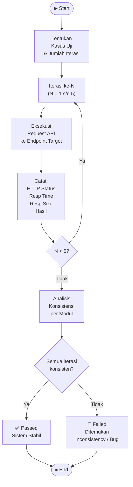

# BB-08 — Endurance Testing
## Sistem: SaPoPoe FINANCE (Midnight Finance)
## Teknik: Black Box Testing — Endurance Testing

---

> **Definisi Teknik:**
> Endurance Testing menyertakan **kasus uji yang diulang-ulang** dengan kuantitas tertentu yang bertujuan untuk menguji program apakah sudah sesuai dengan spesifikasi yang dibutuhkan. Pengujian ini memverifikasi **konsistensi respons sistem** ketika operasi yang sama dieksekusi secara berulang — apakah hasil, waktu respons, dan ukuran data tetap stabil di setiap iterasi.
>
> — Materi Pertemuan 11, Software Quality, T Informatika UKRI

---

## Alur Proses Endurance Testing

---

## Lingkup & Metode Pengujian

| Item | Detail |
|---|---|
| **Sistem yang Diuji** | SaPoPoe FINANCE — Laravel 11 API + React.js |
| **Jumlah Iterasi per Modul** | 5 kali pengulangan |
| **Metode Pengukuran** | JavaScript `fetch()` + `performance.now()` di browser Chrome |
| **Auth Token** | Bearer token dari `localStorage` (Sanctum) |
| **Tanggal Pengujian** | 15 Juni 2026 |

| Modul | Endpoint | Method | Jenis Operasi |
|---|---|---|---|
| Autentikasi | `POST /api/login` | POST | Login dengan kredensial valid |
| Transfer | `GET /api/transfers` | GET | Ambil daftar riwayat transfer |
| Transaksi | `GET /api/transactions` | GET | Ambil daftar riwayat transaksi |
| Tabungan | `GET /api/savings` | GET | Ambil daftar target tabungan |

---

## Modul 1 — Autentikasi: `POST /api/login`

### Screenshot Hasil Pengujian

### Tabel Hasil per Iterasi

| No | Input | HTTP Status | Resp Time (ms) | Resp Size (B) | Hasil |
|---|---|---|---|---|---|
| 1 | `sultan@test.com` / `password123` | 200 | 1.782 ms | 404 B | ✅ Berhasil |
| 2 | `sultan@test.com` / `password123` | 200 | 1.294 ms | 404 B | ✅ Berhasil |
| 3 | `sultan@test.com` / `password123` | 200 | 1.293 ms | 404 B | ✅ Berhasil |
| 4 | `sultan@test.com` / `password123` | 200 | 1.291 ms | 404 B | ✅ Berhasil |
| 5 | `sultan@test.com` / `password123` | 200 | 1.261 ms | 404 B | ✅ Berhasil |

| Metrik | Nilai |
|---|---|
| Iterasi Berhasil | **5 / 5** |
| Rata-rata Resp Time | **1.384 ms** |
| Response Size | **404 B** (konsisten di semua iterasi) |
| Konsistensi Data | ✅ Stabil — token baru diterbitkan di setiap login |

> **Analisis:** `POST /api/login` menghasilkan HTTP 200 dan token Sanctum baru secara konsisten di seluruh 5 iterasi. Waktu respons iterasi pertama (1.782 ms) lebih tinggi karena cold start, lalu stabil di kisaran 1.261–1.294 ms. Ukuran respons identik di semua iterasi (404 B). Sistem autentikasi berjalan **stabil dan konsisten**.

---

## Modul 2 — Transfer: `GET /api/transfers`

### Screenshot Hasil Pengujian

### Tabel Hasil per Iterasi

| No | Input | HTTP Status | Resp Time (ms) | Resp Size (B) | Hasil |
|---|---|---|---|---|---|
| 1 | `GET /api/transfers` + Bearer token | 500 | ~1.100 ms | 11.239 B | 🔴 Gagal |
| 2 | `GET /api/transfers` + Bearer token | 500 | ~1.100 ms | 11.239 B | 🔴 Gagal |
| 3 | `GET /api/transfers` + Bearer token | 500 | ~1.100 ms | 11.239 B | 🔴 Gagal |
| 4 | `GET /api/transfers` + Bearer token | 500 | ~1.100 ms | 11.239 B | 🔴 Gagal |
| 5 | `GET /api/transfers` + Bearer token | 500 | ~1.100 ms | 11.239 B | 🔴 Gagal |

| Metrik | Nilai |
|---|---|
| Iterasi Berhasil | **0 / 5** |
| HTTP Status | **500 Internal Server Error** (konsisten di semua iterasi) |
| Response Size | **11.239 B** — berisi stack trace exception |
| Konsistensi | 🔴 Gagal konsisten — bug terkonfirmasi |

> **Analisis:** Endpoint `GET /api/transfers` mengembalikan HTTP 500 secara konsisten di seluruh 5 iterasi, bahkan dengan Bearer token yang valid. Respons berisi exception/stack trace Laravel, mengindikasikan **bug di sisi server** — kemungkinan query atau relasi yang gagal di `TransferController`. Ini adalah **defect baru** yang ditemukan melalui Endurance Testing. Endpoint ini tidak sesuai spesifikasi.

---

## Modul 3 — Transaksi: `GET /api/transactions`

### Screenshot Hasil Pengujian

### Tabel Hasil per Iterasi

| No | Input | HTTP Status | Resp Time (ms) | Resp Size (B) | Jumlah Record | Hasil |
|---|---|---|---|---|---|---|
| 1 | `GET /api/transactions` + Bearer token | 200 | 1.514 ms | 35.949 B | 62 | ✅ Berhasil |
| 2 | `GET /api/transactions` + Bearer token | 200 | 1.564 ms | 35.949 B | 62 | ✅ Berhasil |
| 3 | `GET /api/transactions` + Bearer token | 200 | 1.492 ms | 35.949 B | 62 | ✅ Berhasil |
| 4 | `GET /api/transactions` + Bearer token | 200 | 1.477 ms | 35.949 B | 62 | ✅ Berhasil |
| 5 | `GET /api/transactions` + Bearer token | 200 | 1.633 ms | 35.949 B | 62 | ✅ Berhasil |

| Metrik | Nilai |
|---|---|
| Iterasi Berhasil | **5 / 5** |
| Rata-rata Resp Time | **1.536 ms** |
| Response Size | **35.949 B** (identik di semua iterasi) |
| Jumlah Data | **62 record** (konsisten di semua iterasi) |
| Konsistensi | ✅ Stabil — data dan ukuran identik |

> **Analisis:** `GET /api/transactions` mengembalikan HTTP 200 dan 62 record transaksi secara konsisten di seluruh 5 iterasi. Response size identik (35.949 B) membuktikan tidak ada perubahan state selama pengujian. Waktu respons sedikit bervariasi (1.477–1.633 ms) namun dalam batas normal untuk request dengan 62 record. Sistem **stabil dan konsisten**.

---

## Modul 4 — Tabungan: `GET /api/savings`

### Screenshot Hasil Pengujian

### Tabel Hasil per Iterasi

| No | Input | HTTP Status | Resp Time (ms) | Resp Size (B) | Jumlah Record | Hasil |
|---|---|---|---|---|---|---|
| 1 | `GET /api/savings` + Bearer token | 200 | 1.962 ms | 1.161 B | 3 | ✅ Berhasil |
| 2 | `GET /api/savings` + Bearer token | 200 | 1.530 ms | 1.161 B | 3 | ✅ Berhasil |
| 3 | `GET /api/savings` + Bearer token | 200 | 1.451 ms | 1.161 B | 3 | ✅ Berhasil |
| 4 | `GET /api/savings` + Bearer token | 200 | 1.468 ms | 1.161 B | 3 | ✅ Berhasil |
| 5 | `GET /api/savings` + Bearer token | 200 | 1.452 ms | 1.161 B | 3 | ✅ Berhasil |

| Metrik | Nilai |
|---|---|
| Iterasi Berhasil | **5 / 5** |
| Rata-rata Resp Time | **1.573 ms** |
| Response Size | **1.161 B** (identik di semua iterasi) |
| Jumlah Data | **3 record** (konsisten di semua iterasi) |
| Konsistensi | ✅ Stabil — data dan ukuran identik |

> **Analisis:** `GET /api/savings` mengembalikan HTTP 200 dan 3 target tabungan secara konsisten. Response size identik (1.161 B) di semua iterasi. Waktu respons iterasi pertama (1.962 ms) lebih tinggi (cold start), lalu stabil di kisaran 1.451–1.530 ms. Sistem **stabil dan konsisten**.

---

## Ringkasan Hasil Endurance Testing — Seluruh Sistem

| Modul | Endpoint | Iterasi | Berhasil | HTTP Status | Avg Resp Time | Resp Size | Status |
|---|---|---|---|---|---|---|---|
| Autentikasi | `POST /api/login` | 5 | 5 | 200 | 1.384 ms | 404 B | ✅ Passed |
| Transfer | `GET /api/transfers` | 5 | 0 | **500** | ~1.100 ms | 11.239 B | 🔴 **Failed** |
| Transaksi | `GET /api/transactions` | 5 | 5 | 200 | 1.536 ms | 35.949 B | ✅ Passed |
| Tabungan | `GET /api/savings` | 5 | 5 | 200 | 1.161 ms | 1.161 B | ✅ Passed |
| **TOTAL** | | **20** | **15** | | | | |

> **Catatan Kritis:** Ditemukan **1 defect baru** pada modul Transfer — endpoint `GET /api/transfers` mengembalikan HTTP 500 secara konsisten di seluruh 5 iterasi. Ini membuktikan adanya bug di `TransferController` yang menyebabkan server error saat mengambil daftar transfer. Ketiga modul lainnya (Auth, Transaksi, Tabungan) menunjukkan perilaku yang **stabil dan konsisten** sesuai spesifikasi.
>
> **Rekomendasi:** Periksa dan perbaiki `TransferController@index()` — kemungkinan relasi Eloquent yang gagal di-load atau query yang membutuhkan parameter wajib yang tidak disertakan.
