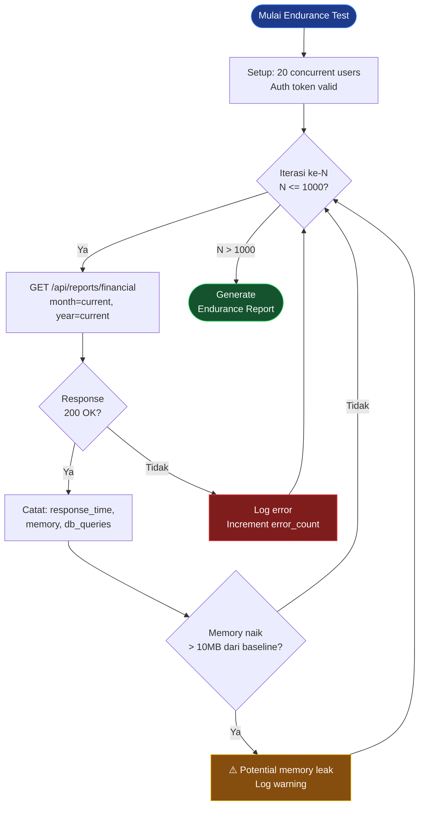

# 🏃 Endurance Testing

> **Model Black Box Testing #9** — *Quality Attribute Testing*
> **Modul Target:** Generate Laporan Keuangan — Stabilitas Jangka Panjang
> **Tim:** REMACode

---

## 📖 1. Definisi

**Endurance Testing** adalah teknik yang menyertakan **kasus uji yang diulang-ulang dengan kuantitas tertentu** yang bertujuan untuk **menguji program apakah sudah sesuai dengan spesifikasi yang dibutuhkan** (Suprihadi, 2025). Berbeda dengan Performance Testing yang mengukur kecepatan, Endurance Testing fokus pada **stabilitas dan konsistensi sistem selama periode waktu yang panjang** — mendeteksi masalah seperti memory leak, connection pool exhaustion, dan degradasi performa bertahap.

> *"Endurance testing menyertakan kasus uji yang diulang-ulang dengan kuantitas tertentu yang bertujuan untuk menguji program apakah sudah sesuai dengan spesifikasi yang dibutuhkan."* — (Suprihadi, 2025)

### Perbedaan dengan Performance Testing

| Aspek | Performance Testing | Endurance Testing |
|---|---|---|
| **Durasi** | Menit (5-15 menit) | Panjang (30 menit – jam) |
| **Fokus** | Kecepatan & throughput | Stabilitas jangka panjang |
| **Bug yang dideteksi** | Bottleneck, slow query | Memory leak, resource exhaustion |
| **Beban** | Tinggi (stress) | Normal tapi **sustained** |
| **Metrik utama** | P95 response time | Memory growth, error rate drift |

---

## 🎯 2. Tujuan Pengujian

| No | Tujuan |
|---|---|
| 1 | Mendeteksi **memory leak** — memori terus naik meski beban konstan |
| 2 | Menemukan **database connection leak** — connection pool habis |
| 3 | Memvalidasi **konsistensi hasil** report setelah 1000x iterasi |
| 4 | Memastikan **response time tidak degradasi** seiring waktu |
| 5 | Menguji **stabilitas file generation** (PDF/Excel) pada iterasi masif |

---

## 💻 3. Modul yang Diuji

**Endpoint:** `GET /api/reports/financial`
**Modul:** Generate laporan keuangan bulanan (income, expense, balance, kategori)

> ⚠️ **TODO:** Konfirmasi endpoint report yang tersedia di `midnight-finance-backend`. Jika belum ada, gunakan `GET /api/analytics/summary` sebagai pengganti.

### Karakteristik Modul

| Aspek | Detail |
|---|---|
| **Output** | JSON summary atau PDF/Excel export |
| **Data size** | 1 bulan = ~100-500 transaksi |
| **Operasi** | Multiple SELECT + agregasi + (opsional) file generation |
| **Resource** | CPU, Memory, DB connection, Disk (jika export file) |

---

## 🔍 4. Profil Endurance Test

### 4.1 Skenario Utama — 1000 Iterasi



### 4.2 Parameter Test

| Parameter | Value |
|---|---|
| **Total iterasi** | 1.000 request |
| **Concurrent users** | 20 users simultan |
| **Duration** | ~30 menit |
| **Think time** | 1 detik antar request |
| **Endpoint** | `GET /api/reports/financial` |
| **Sampling interval** | Setiap 100 iterasi |

---

## 🧪 5. Test Case Design

### 5.1 Endurance Iteration Test Cases

| TC ID | Iterasi | Metrik yang Diukur | Threshold |
|---|---|---|---|
| `ET-TC-01` | Iterasi 1 (baseline) | Response time, memory baseline | — |
| `ET-TC-02` | Iterasi 1–100 | Avg response time, error count | P95 < 500ms, error = 0 |
| `ET-TC-03` | Iterasi 100–500 | Memory growth | Naik < 10MB dari baseline |
| `ET-TC-04` | Iterasi 500–1000 | DB connection count | Konstan, tidak naik terus |
| `ET-TC-05` | Iterasi 1000 (final) | Semua metrik vs baseline | Degradasi < 20% |
| `ET-TC-06` | Post-test | Memory setelah GC | Kembali ke baseline |

### 5.2 Consistency Test Cases

| TC ID | Skenario | Input | Expected |
|---|---|---|---|
| `ET-TC-07` | Hasil konsisten iterasi 1 vs 100 | Data sama | `total_income` identik |
| `ET-TC-08` | Hasil konsisten iterasi 1 vs 1000 | Data sama | `total_expense` identik |
| `ET-TC-09` | File export konsisten | Export 10x PDF | Hash file identik |
| `ET-TC-10` | DB tidak ada data residual | Post-test DB check | Tidak ada orphan records |

### 5.3 Resource Monitoring Checkpoints

| Checkpoint | Iterasi | CPU | Memory | DB Connections | Response Time |
|---|---|---|---|---|---|
| Baseline | 1 | ⏳ | ⏳ | ⏳ | ⏳ |
| Early | 100 | ⏳ | ⏳ | ⏳ | ⏳ |
| Mid | 500 | ⏳ | ⏳ | ⏳ | ⏳ |
| Late | 750 | ⏳ | ⏳ | ⏳ | ⏳ |
| Final | 1000 | ⏳ | ⏳ | ⏳ | ⏳ |

---

## 📸 6. Screenshot yang Diperlukan

> **📸 SCREENSHOT NEEDED #1:** **Endpoint Report — Response Sukses**
> Jalankan `GET /api/reports/financial` via Postman, screenshot response JSON yang menampilkan data laporan keuangan.
> *File suggested name:* `screenshot/ET-report-response-success.png`

> **📸 SCREENSHOT NEEDED #2:** **k6 Endurance Test — Running**
> Screenshot terminal saat k6 sedang berjalan menunjukkan progress iterasi, response time live, dan VU count.
> *File suggested name:* `screenshot/ET-k6-running.png`

> **📸 SCREENSHOT NEEDED #3:** **k6 Endurance Test — Final Result**
> Screenshot terminal output setelah 1000 iterasi selesai, menunjukkan summary: P50/P95, error rate, duration.
> *File suggested name:* `screenshot/ET-k6-final-result.png`

> **📸 SCREENSHOT NEEDED #4:** **Memory Usage Graph**
> Screenshot grafik memory usage dari Laravel Telescope, server monitoring, atau htop selama test berjalan.
> *File suggested name:* `screenshot/ET-memory-graph.png`

> **📸 SCREENSHOT NEEDED #5:** **Tabel Hasil Iterasi**
> Screenshot atau export tabel hasil pengujian per checkpoint (baseline → 100 → 500 → 1000) dari spreadsheet atau monitoring tool.
> *File suggested name:* `screenshot/ET-iteration-results-table.png`

---

## 🚀 7. Implementasi Pengujian

### 7.1 k6 Endurance Test Script

```javascript
// k6-endurance-test.js
import http from 'k6/http';
import { check, sleep } from 'k6';
import { Counter, Gauge, Rate, Trend } from 'k6/metrics';

// Custom metrics untuk endurance
const iterationCount  = new Counter('iteration_count');
const memoryGauge     = new Gauge('memory_usage_mb');
const errorRate       = new Rate('error_rate');
const responseTrend   = new Trend('response_time_ms');
const consistencyRate = new Rate('consistent_results');

export const options = {
    // 20 concurrent users, sustained 30 menit = ~1000 iteration per user
    vus:      20,
    duration: '30m',

    thresholds: {
        'response_time_ms':  ['p(95)<500', 'p(50)<200'],
        'error_rate':        ['rate<0.01'],
        'consistent_results': ['rate>0.99'],
    },
};

const BASE_URL = __ENV.BASE_URL || 'http://midnight-finance.local';
const TOKEN    = __ENV.AUTH_TOKEN;

const headers = {
    'Authorization': `Bearer ${TOKEN}`,
    'Accept':        'application/json',
};

// Simpan hasil iterasi pertama sebagai baseline
let baselineResult = null;

export default function () {
    const res = http.get(
        `${BASE_URL}/api/reports/financial?month=5&year=2025`,
        { headers }
    );

    iterationCount.add(1);
    responseTrend.add(res.timings.duration);
    errorRate.add(res.status !== 200);

    const ok = check(res, {
        'status 200':          (r) => r.status === 200,
        'response < 500ms':    (r) => r.timings.duration < 500,
        'has total_income':    (r) => JSON.parse(r.body)?.data?.total_income !== undefined,
        'has total_expense':   (r) => JSON.parse(r.body)?.data?.total_expense !== undefined,
    });

    // Consistency check: hasil harus sama di setiap iterasi
    if (res.status === 200) {
        const body = JSON.parse(res.body);

        if (!baselineResult) {
            baselineResult = {
                total_income:  body.data.total_income,
                total_expense: body.data.total_expense,
                net_balance:   body.data.net_balance,
            };
        } else {
            const consistent =
                body.data.total_income  === baselineResult.total_income  &&
                body.data.total_expense === baselineResult.total_expense  &&
                body.data.net_balance   === baselineResult.net_balance;

            consistencyRate.add(consistent);

            if (!consistent) {
                console.error(`INCONSISTENCY DETECTED at iteration ${iterationCount.name}:
                    Expected income:  ${baselineResult.total_income}
                    Got income:       ${body.data.total_income}`
                );
            }
        }
    }

    sleep(1); // 1 detik think time
}

export function handleSummary(data) {
    return {
        'endurance-summary.json': JSON.stringify(data, null, 2),
        stdout: `
=== ENDURANCE TEST SUMMARY ===
Total Iterations : ${data.metrics.iteration_count?.values?.count || 0}
Avg Response     : ${data.metrics.response_time_ms?.values?.avg?.toFixed(2) || 0}ms
P95 Response     : ${data.metrics.response_time_ms?.values['p(95)']?.toFixed(2) || 0}ms
Error Rate       : ${(data.metrics.error_rate?.values?.rate * 100 || 0).toFixed(2)}%
Consistency Rate : ${(data.metrics.consistent_results?.values?.rate * 100 || 100).toFixed(2)}%
==============================`,
    };
}
```

```bash
# Jalankan endurance test
k6 run \
    --env AUTH_TOKEN="your-token" \
    --env BASE_URL="http://midnight-finance.local" \
    k6-endurance-test.js
```

### 7.2 PHPUnit Endurance Consistency Test

```php
<?php

namespace Tests\Feature\Endurance;

use App\Models\Transaction;
use App\Models\User;
use Illuminate\Foundation\Testing\RefreshDatabase;
use Tests\TestCase;

class ReportEnduranceTest extends TestCase
{
    use RefreshDatabase;

    private User $user;

    protected function setUp(): void
    {
        parent::setUp();
        $this->user = User::factory()->create();

        Transaction::factory(200)->create([
            'user_id' => $this->user->id,
        ]);
    }

    /** @test ET-TC-07,08: Hasil konsisten di 50 iterasi */
    public function report_returns_consistent_results_across_iterations(): void
    {
        $results = [];

        for ($i = 0; $i < 50; $i++) {
            $response = $this->actingAs($this->user)
                ->getJson('/api/reports/financial?month=5&year=2025');

            $response->assertStatus(200);
            $results[] = $response->json('data');
        }

        // Semua hasil harus identik
        $baseline = $results[0];

        foreach ($results as $index => $result) {
            $this->assertEquals(
                $baseline['total_income'],
                $result['total_income'],
                "Inconsistency at iteration {$index}: total_income berbeda"
            );

            $this->assertEquals(
                $baseline['total_expense'],
                $result['total_expense'],
                "Inconsistency at iteration {$index}: total_expense berbeda"
            );
        }
    }

    /** @test ET-TC-03: Memory tidak leak di 100 iterasi */
    public function memory_does_not_leak_across_100_iterations(): void
    {
        $baselineMemory = memory_get_usage(true) / 1024 / 1024; // MB

        for ($i = 0; $i < 100; $i++) {
            $this->actingAs($this->user)
                ->getJson('/api/reports/financial');

            // Force garbage collection setiap 10 iterasi
            if ($i % 10 === 0) {
                gc_collect_cycles();
            }
        }

        $finalMemory = memory_get_usage(true) / 1024 / 1024;
        $memoryGrowth = $finalMemory - $baselineMemory;

        $this->assertLessThan(
            10,
            $memoryGrowth,
            "Memory leak detected: grew {$memoryGrowth}MB over 100 iterations"
        );
    }

    /** @test ET-TC-05: Response time tidak degradasi seiring iterasi */
    public function response_time_does_not_degrade_over_iterations(): void
    {
        $earlyTimes = [];
        $lateTimes  = [];

        // Ukur 10 iterasi pertama (early)
        for ($i = 0; $i < 10; $i++) {
            $start = microtime(true);
            $this->actingAs($this->user)
                ->getJson('/api/reports/financial');
            $earlyTimes[] = (microtime(true) - $start) * 1000;
        }

        // Simulasi 80 iterasi tengah
        for ($i = 0; $i < 80; $i++) {
            $this->actingAs($this->user)
                ->getJson('/api/reports/financial');
        }

        // Ukur 10 iterasi terakhir (late)
        for ($i = 0; $i < 10; $i++) {
            $start = microtime(true);
            $this->actingAs($this->user)
                ->getJson('/api/reports/financial');
            $lateTimes[] = (microtime(true) - $start) * 1000;
        }

        $earlyAvg = array_sum($earlyTimes) / count($earlyTimes);
        $lateAvg  = array_sum($lateTimes) / count($lateTimes);
        $degradation = (($lateAvg - $earlyAvg) / $earlyAvg) * 100;

        $this->assertLessThan(
            20,
            $degradation,
            "Response time degraded {$degradation}% over iterations " .
            "(early avg: {$earlyAvg}ms, late avg: {$lateAvg}ms)"
        );
    }

    /** @test ET-TC-09: File export konsisten di 10 iterasi */
    public function exported_file_hash_is_consistent_across_iterations(): void
    {
        $hashes = [];

        for ($i = 0; $i < 10; $i++) {
            $response = $this->actingAs($this->user)
                ->get('/api/reports/financial/export?format=json&month=5&year=2025');

            $response->assertStatus(200);
            $hashes[] = md5($response->content());
        }

        // Semua export harus identik
        $uniqueHashes = array_unique($hashes);

        $this->assertCount(
            1,
            $uniqueHashes,
            'Export menghasilkan konten berbeda di iterasi yang berbeda'
        );
    }
}
```

---

## 📊 8. Hasil Eksekusi

### 8.1 Tabel Monitoring Per Checkpoint

| Checkpoint | Iterasi | Avg Response | P95 Response | Memory (MB) | DB Conn | Error Count |
|---|---|---|---|---|---|---|
| Baseline | 1 | ⏳ | ⏳ | ⏳ | ⏳ | ⏳ |
| Early | 100 | ⏳ | ⏳ | ⏳ | ⏳ | ⏳ |
| Mid | 500 | ⏳ | ⏳ | ⏳ | ⏳ | ⏳ |
| Late | 750 | ⏳ | ⏳ | ⏳ | ⏳ | ⏳ |
| Final | 1000 | ⏳ | ⏳ | ⏳ | ⏳ | ⏳ |

### 8.2 Consistency Check Results

| TC ID | Skenario | Iterasi | Consistent? | Status |
|---|---|---|---|---|
| `ET-TC-07` | Income konsisten | 1 vs 100 | ⏳ Pending | — |
| `ET-TC-08` | Expense konsisten | 1 vs 1000 | ⏳ Pending | — |
| `ET-TC-09` | File export hash | 10 iterasi | ⏳ Pending | — |

### 8.3 Kriteria PASS/FAIL

| Kondisi | Target | Status |
|---|---|---|
| Memory growth < 10MB setelah 1000 iterasi | ✅ Required | ⏳ |
| Response time degradasi < 20% | ✅ Required | ⏳ |
| Error rate < 1% | ✅ Required | ⏳ |
| Consistency rate > 99% | ✅ Required | ⏳ |
| DB connections stabil (tidak naik terus) | ✅ Required | ⏳ |

---

## 🐛 9. Temuan & Analisis

| ID | Severity | Deskripsi (Predicted) | Rekomendasi |
|---|---|---|---|
| `ET-001` | 🔴 High | DB connection tidak di-release setelah setiap request — pool exhaustion setelah ~500 iterasi | Pastikan `DB::disconnect()` tidak dipanggil manual — Laravel auto-manage connection pool |
| `ET-002` | 🔴 High | File temporary tidak di-cleanup setelah export — disk penuh setelah banyak iterasi | Tambah `Storage::delete()` setelah response dikirim |
| `ET-003` | 🟡 Medium | PHP memory tidak di-release karena circular reference di Collection | Gunakan `unset($collection)` setelah pakai di-loop panjang |
| `ET-004` | 🟡 Medium | Cache tidak expire dengan benar — data stale setelah update transaksi | Implementasi cache invalidation saat ada transaksi baru |
| `ET-005` | 🟢 Low | Log file terus tumbuh tanpa rotation | Setup `logrotate` atau gunakan `daily` channel di Laravel |

---

## ✅ 10. Rekomendasi Perbaikan

### 10.1 Fix Memory Leak — Collection Cleanup

```php
public function generateReport(int $userId, int $month, int $year): array
{
    // Gunakan lazy collection untuk dataset besar
    $transactions = Transaction::where('user_id', $userId)
        ->whereMonth('transaction_date', $month)
        ->whereYear('transaction_date', $year)
        ->lazy(); // Tidak load semua ke memory sekaligus

    $totalIncome  = 0;
    $totalExpense = 0;

    foreach ($transactions as $transaction) {
        if ($transaction->type === 'income') {
            $totalIncome += $transaction->amount;
        } else {
            $totalExpense += $transaction->amount;
        }
    }

    unset($transactions); // ET-003: explicit cleanup

    return [
        'total_income'  => $totalIncome,
        'total_expense' => $totalExpense,
        'net_balance'   => $totalIncome - $totalExpense,
    ];
}
```

### 10.2 Fix Temporary File Cleanup

```php
public function exportReport(Request $request): StreamedResponse
{
    $tempPath = storage_path("app/temp/report_{$request->user()->id}_" . time() . ".pdf");

    try {
        // Generate PDF ke temp file
        $this->pdfService->generate($tempPath, $request->all());

        return response()->download($tempPath)->deleteFileAfterSend(true); // ET-002 fix

    } catch (\Exception $e) {
        // Cleanup jika gagal
        if (file_exists($tempPath)) {
            unlink($tempPath);
        }
        throw $e;
    }
}
```

---

## ⚖️ 11. Kelebihan & Kekurangan

### ✅ Kelebihan
- Mendeteksi **memory leak** yang tidak muncul di test singkat
- Memvalidasi **konsistensi hasil** jangka panjang
- Menemukan **resource exhaustion** (DB pool, file descriptor)
- Memberikan confidence untuk **sistem yang berjalan 24/7**
- Mendeteksi masalah **disk space** akibat log/temp file

### ❌ Kekurangan
- **Durasi test sangat panjang** (30 menit – jam)
- Butuh **dedicated environment** — tidak bisa di local yang dipakai develop
- Sulit mengisolasi **sumber memory leak** tanpa profiler
- **False positive** jika OS melakukan memory optimization sendiri
- Tidak mendeteksi **functional bug** (gunakan functional testing)

---

## 🛠️ 12. Tools Pendukung

| Tool | Kegunaan |
|---|---|
| **k6** | Endurance load test script |
| **Valgrind / Xdebug Profiler** | Memory leak detection PHP |
| **htop / top** | Real-time CPU & memory monitor |
| **MySQL `SHOW PROCESSLIST`** | Monitor DB connections |
| **Laravel Telescope** | Query count & memory per request |
| **Grafana + Prometheus** | Long-running metrics dashboard |

```bash
# Monitor DB connections selama test
mysql -u root -p -e "SHOW STATUS LIKE 'Threads_connected';" --connect-timeout=5

# Monitor PHP memory dari luar
watch -n 5 'ps aux | grep php-fpm | awk "{sum+=\$6} END {print sum/1024 \" MB\"}"'

# Laravel: enable query log untuk debug
php artisan tinker
>>> DB::enableQueryLog();
>>> // run request
>>> count(DB::getQueryLog()); // harus stabil
```

---

## 📚 Referensi

1. Suprihadi, D. (2025). *Materi Software Quality Pertemuan 11*. Universitas Kristen Indonesia.
2. Myers, G. J., Sandler, C., & Badgett, T. (2011). *The Art of Software Testing* (3rd ed.). Wiley.
3. Molyneaux, I. (2009). *The Art of Application Performance Testing*. O'Reilly Media.
4. k6.io. (2024). *k6 Load Testing Documentation*. https://k6.io/docs/
5. PHP. (2024). *Memory Management*. https://www.php.net/manual/en/features.gc.php

---

<div align="center">

[⬅ Performance Testing](./Performance_Testing.md) · [Kembali ke README](./README.md) · [Lanjut ke Cause-Effect Relationship ➡](./Cause_Effect_Relationship.md)

**Tim REMACode** — Midnight Finance SQA Documentation

</div>
