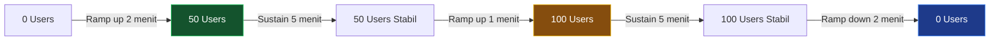

# ⚡ Performance Testing

> **Model Black Box Testing #8** — *Quality Attribute Testing*
> **Modul Target:** Analytics Dashboard — Kecepatan, Skalabilitas, Stabilitas
> **Tim:** REMACode

---

## 📖 1. Definisi

**Performance Testing** adalah teknik pengujian perangkat lunak yang berfokus pada **pengukuran dan evaluasi kinerja aplikasi dalam hal kecepatan, skalabilitas, dan stabilitas**. Teknik ini penting untuk memastikan aplikasi dapat **menangani beban pengguna** dan memberikan kenyamanan pada pengguna secara optimal (Suprihadi, 2025).

> *"Performance Testing adalah teknik pengujian perangkat lunak yang berfokus pada pengukuran dan evaluasi kinerja aplikasi dalam hal kecepatan, skalabilitas, dan stabilitas. Teknik ini penting untuk memastikan aplikasi dapat menangani beban pengguna dan memberikan kenyamanan pada pengguna secara optimal."* — (Suprihadi, 2025)

### Tipe Performance Testing

| Tipe | Deskripsi | Kapan Dipakai |
|---|---|---|
| **Load Testing** | Uji performa pada beban normal & puncak | Sebelum launch |
| **Stress Testing** | Uji batas maksimum sistem | Kapasitas planning |
| **Spike Testing** | Uji lonjakan tiba-tiba | Flash sale, viral event |
| **Soak Testing** | Uji stabilitas jangka panjang | Memory leak detection |
| **Scalability Testing** | Uji respon saat user bertambah | Infrastructure planning |

---

## 🎯 2. Tujuan Pengujian

| No | Tujuan |
|---|---|
| 1 | Mengukur **response time** endpoint analytics dalam kondisi normal |
| 2 | Menentukan **throughput maksimum** (requests per second) yang bisa ditangani |
| 3 | Mendeteksi **memory leak** pada endpoint yang sering dipanggil |
| 4 | Memvalidasi sistem tetap stabil di bawah **concurrent users** |
| 5 | Mengidentifikasi **bottleneck** (DB query, N+1, missing index) |

---

## 💻 3. Modul yang Diuji

**Endpoint Utama:**

| Endpoint | Deskripsi | Estimasi Complexity |
|---|---|---|
| `GET /api/analytics/summary` | Summary income/expense/balance | 🔴 High (agregasi besar) |
| `GET /api/analytics/chart` | Data chart bulanan 12 bulan | 🔴 High (12 query) |
| `GET /api/transactions` | List transaksi dengan filter | 🟡 Medium |
| `GET /api/budgets` | List anggaran aktif | 🟢 Low |
| `POST /api/transactions` | Buat transaksi baru | 🟡 Medium (DB write) |

> ⚠️ **TODO:** Konfirmasi endpoint analytics yang ada di `midnight-finance-backend`. Sesuaikan path jika berbeda.

---

## 📏 4. Metrik & Threshold

### 4.1 Target Performa (Service Level Agreement)

| Metrik | Target | Warning | Critical |
|---|---|---|---|
| **Response Time (P50)** | < 200ms | < 500ms | > 1000ms |
| **Response Time (P95)** | < 500ms | < 1000ms | > 2000ms |
| **Response Time (P99)** | < 1000ms | < 2000ms | > 5000ms |
| **Throughput** | > 100 req/s | > 50 req/s | < 20 req/s |
| **Error Rate** | < 0.1% | < 1% | > 1% |
| **CPU Usage** | < 70% | < 85% | > 90% |
| **Memory Usage** | < 512MB | < 756MB | > 1GB |

### 4.2 Web Vitals (Frontend — Lighthouse)

| Metric | Good | Needs Improvement | Poor |
|---|---|---|---|
| **FCP** (First Contentful Paint) | < 1.8s | 1.8s – 3s | > 3s |
| **LCP** (Largest Contentful Paint) | < 2.5s | 2.5s – 4s | > 4s |
| **TBT** (Total Blocking Time) | < 200ms | 200ms – 600ms | > 600ms |
| **CLS** (Cumulative Layout Shift) | < 0.1 | 0.1 – 0.25 | > 0.25 |
| **Speed Index** | < 3.4s | 3.4s – 5.8s | > 5.8s |

---

## 🧪 5. Test Scenario Design

### 5.1 Load Test Scenario



| Phase | Users | Duration | Target |
|---|---|---|---|
| Warm up | 0 → 10 | 1 menit | Baseline response time |
| Normal load | 10 → 50 | 5 menit | P95 < 500ms |
| Peak load | 50 → 100 | 5 menit | P95 < 1000ms |
| Stress | 100 → 200 | 3 menit | Error rate < 1% |
| Recovery | 200 → 0 | 2 menit | System recovers |

### 5.2 Test Case Matrix

| TC ID | Endpoint | Concurrent Users | Duration | Expected P95 |
|---|---|---|---|---|
| `PT-TC-01` | `GET /analytics/summary` | 1 (baseline) | — | < 200ms |
| `PT-TC-02` | `GET /analytics/summary` | 50 | 5 menit | < 500ms |
| `PT-TC-03` | `GET /analytics/summary` | 100 | 5 menit | < 1000ms |
| `PT-TC-04` | `GET /analytics/chart` | 1 (baseline) | — | < 300ms |
| `PT-TC-05` | `GET /analytics/chart` | 50 | 5 menit | < 800ms |
| `PT-TC-06` | `GET /transactions` | 100 | 5 menit | < 500ms |
| `PT-TC-07` | `POST /transactions` | 50 | 5 menit | < 300ms |
| `PT-TC-08` | Mixed endpoints | 100 | 10 menit | Error < 0.1% |
| `PT-TC-09` | Soak test | 20 | 30 menit | Memory stabil |

---

## 📸 6. Screenshot yang Diperlukan

> **📸 SCREENSHOT NEEDED #1:** **Lighthouse / PageSpeed Score**
> Buka https://pagespeed.web.dev, masukkan URL Midnight Finance (local/staging), screenshot full report menunjukkan score Performance, Accessibility, Best Practices, SEO beserta Web Vitals metrics.
> *File suggested name:* `screenshot/PT-lighthouse-score.png`

> **📸 SCREENSHOT NEEDED #2:** **Lighthouse — Detail Metrics**
> Screenshot section "Metrics" dari Lighthouse yang menunjukkan FCP, LCP, TBT, CLS, Speed Index.
> *File suggested name:* `screenshot/PT-lighthouse-metrics.png`

> **📸 SCREENSHOT NEEDED #3:** **k6 / JMeter Load Test Result**
> Screenshot atau terminal output hasil load test menunjukkan: response time P50/P95/P99, throughput, error rate.
> *File suggested name:* `screenshot/PT-k6-loadtest-result.png`

> **📸 SCREENSHOT NEEDED #4:** **Laravel Telescope / Debugbar**
> Screenshot Telescope atau Debugbar yang menunjukkan query count dan execution time untuk endpoint analytics.
> *File suggested name:* `screenshot/PT-telescope-queries.png`

> **📸 SCREENSHOT NEEDED #5:** **Pingdom atau DebugBear Result**
> Screenshot hasil test dari https://tools.pingdom.com atau https://www.debugbear.com.
> *File suggested name:* `screenshot/PT-pingdom-result.png`

---

## 🚀 7. Implementasi Pengujian

### 7.1 k6 Load Test Script

```javascript
// k6-load-test.js
import http from 'k6/http';
import { check, sleep } from 'k6';
import { Rate, Trend } from 'k6/metrics';

const errorRate    = new Rate('errors');
const summaryTrend = new Trend('analytics_summary_duration');
const chartTrend   = new Trend('analytics_chart_duration');

export const options = {
    stages: [
        { duration: '1m', target: 10  }, // warm up
        { duration: '5m', target: 50  }, // normal load
        { duration: '5m', target: 100 }, // peak load
        { duration: '3m', target: 200 }, // stress
        { duration: '2m', target: 0   }, // recovery
    ],
    thresholds: {
        'http_req_duration': ['p(95)<1000'],   // P95 < 1s
        'http_req_duration': ['p(50)<200'],    // P50 < 200ms
        'errors':            ['rate<0.01'],    // error < 1%
        'analytics_summary_duration': ['p(95)<500'],
        'analytics_chart_duration':   ['p(95)<800'],
    },
};

const BASE_URL = __ENV.BASE_URL || 'http://midnight-finance.local';
const TOKEN    = __ENV.AUTH_TOKEN;

const headers = {
    'Authorization': `Bearer ${TOKEN}`,
    'Content-Type':  'application/json',
    'Accept':        'application/json',
};

export default function () {
    // PT-TC-02: Analytics Summary
    const summaryRes = http.get(
        `${BASE_URL}/api/analytics/summary?month=5&year=2025`,
        { headers }
    );

    summaryTrend.add(summaryRes.timings.duration);
    errorRate.add(summaryRes.status !== 200);

    check(summaryRes, {
        'summary status 200': (r) => r.status === 200,
        'summary < 500ms':    (r) => r.timings.duration < 500,
        'summary has data':   (r) => JSON.parse(r.body).data !== undefined,
    });

    sleep(0.5);

    // PT-TC-05: Analytics Chart
    const chartRes = http.get(
        `${BASE_URL}/api/analytics/chart?year=2025`,
        { headers }
    );

    chartTrend.add(chartRes.timings.duration);

    check(chartRes, {
        'chart status 200': (r) => r.status === 200,
        'chart < 800ms':    (r) => r.timings.duration < 800,
        'chart 12 months':  (r) => JSON.parse(r.body).data?.length === 12,
    });

    sleep(1);

    // PT-TC-07: Create Transaction (write test)
    const txRes = http.post(
        `${BASE_URL}/api/transactions`,
        JSON.stringify({
            account_id:       1,
            category_id:      1,
            type:             'income',
            amount:           10000,
            transaction_date: '2025-05-19',
        }),
        { headers }
    );

    check(txRes, {
        'transaction status 201': (r) => r.status === 201,
        'transaction < 300ms':    (r) => r.timings.duration < 300,
    });

    sleep(1);
}
```

```bash
# Jalankan load test
export AUTH_TOKEN="your-sanctum-token-here"
export BASE_URL="http://midnight-finance.local"

k6 run --env AUTH_TOKEN=$AUTH_TOKEN --env BASE_URL=$BASE_URL k6-load-test.js

# Dengan output HTML report
k6 run --out json=results.json k6-load-test.js
```

### 7.2 Lighthouse CLI

```bash
# Install Lighthouse
npm install -g lighthouse

# Test performa frontend
lighthouse http://midnight-finance.local/dashboard \
    --output html \
    --output-path ./lighthouse-report.html \
    --chrome-flags="--headless"

# Test mobile
lighthouse http://midnight-finance.local/dashboard \
    --emulated-form-factor mobile \
    --output html \
    --output-path ./lighthouse-mobile-report.html
```

### 7.3 PHPUnit Performance Assertion

```php
<?php

namespace Tests\Feature\Performance;

use App\Models\Transaction;
use App\Models\User;
use Illuminate\Foundation\Testing\RefreshDatabase;
use Illuminate\Support\Facades\DB;
use Tests\TestCase;

class AnalyticsPerformanceTest extends TestCase
{
    use RefreshDatabase;

    private User $user;

    protected function setUp(): void
    {
        parent::setUp();
        $this->user = User::factory()->create();

        // Seed 500 transaksi untuk simulasi real load
        Transaction::factory(500)->create(['user_id' => $this->user->id]);
    }

    /** @test PT-TC-01: Baseline response time analytics summary */
    public function analytics_summary_responds_within_200ms(): void
    {
        $start = microtime(true);

        $response = $this->actingAs($this->user)
            ->getJson('/api/analytics/summary?month=5&year=2025');

        $duration = (microtime(true) - $start) * 1000;

        $response->assertStatus(200);
        $this->assertLessThan(200, $duration,
            "Analytics summary terlalu lambat: {$duration}ms (target: < 200ms)"
        );
    }

    /** @test PT-TC-04: Baseline analytics chart */
    public function analytics_chart_responds_within_300ms(): void
    {
        $start = microtime(true);

        $response = $this->actingAs($this->user)
            ->getJson('/api/analytics/chart?year=2025');

        $duration = (microtime(true) - $start) * 1000;

        $response->assertStatus(200);
        $this->assertLessThan(300, $duration,
            "Analytics chart terlalu lambat: {$duration}ms (target: < 300ms)"
        );
    }

    /** @test N+1 query detection */
    public function analytics_endpoint_does_not_have_n_plus_one_queries(): void
    {
        $queryCount = 0;
        DB::listen(function () use (&$queryCount) {
            $queryCount++;
        });

        $this->actingAs($this->user)
            ->getJson('/api/analytics/summary?month=5&year=2025');

        // Maksimum 5 query untuk summary endpoint
        $this->assertLessThanOrEqual(5, $queryCount,
            "N+1 query detected: {$queryCount} queries fired"
        );
    }

    /** @test Memory usage tidak meledak */
    public function analytics_endpoint_uses_acceptable_memory(): void
    {
        $memBefore = memory_get_usage(true);

        $this->actingAs($this->user)
            ->getJson('/api/analytics/summary');

        $memAfter = memory_get_usage(true);
        $memUsed  = ($memAfter - $memBefore) / 1024 / 1024; // MB

        $this->assertLessThan(32, $memUsed,
            "Memory usage terlalu tinggi: {$memUsed}MB (target: < 32MB)"
        );
    }
}
```

---

## 📊 8. Hasil Eksekusi

### 8.1 Lighthouse Score

| Metric | Score | Status |
|---|---|---|
| Performance | ⏳ Pending | — |
| Accessibility | ⏳ Pending | — |
| Best Practices | ⏳ Pending | — |
| SEO | ⏳ Pending | — |

### 8.2 Web Vitals

| Metric | Result | Target | Status |
|---|---|---|---|
| FCP | ⏳ Pending | < 1.8s | — |
| LCP | ⏳ Pending | < 2.5s | — |
| TBT | ⏳ Pending | < 200ms | — |
| CLS | ⏳ Pending | < 0.1 | — |
| Speed Index | ⏳ Pending | < 3.4s | — |

### 8.3 Load Test Results (k6)

| TC ID | Concurrent Users | P50 | P95 | P99 | Error Rate | Status |
|---|---|---|---|---|---|---|
| `PT-TC-01` | 1 | ⏳ | ⏳ | ⏳ | ⏳ | — |
| `PT-TC-02` | 50 | ⏳ | ⏳ | ⏳ | ⏳ | — |
| `PT-TC-03` | 100 | ⏳ | ⏳ | ⏳ | ⏳ | — |
| `PT-TC-04` | 1 | ⏳ | ⏳ | ⏳ | ⏳ | — |
| `PT-TC-05` | 50 | ⏳ | ⏳ | ⏳ | ⏳ | — |
| `PT-TC-08` | 100 (mixed) | ⏳ | ⏳ | ⏳ | ⏳ | — |

---

## 🐛 9. Temuan & Analisis

| ID | Severity | Deskripsi (Predicted) | Rekomendasi |
|---|---|---|---|
| `PT-001` | 🔴 High | Analytics chart query 12 bulan = 12 separate DB queries (N+1) | Gunakan `groupBy('month')` dalam 1 query |
| `PT-002` | 🔴 High | Tidak ada caching untuk analytics summary — di-hitung ulang tiap request | Implementasi `Cache::remember()` dengan TTL 5 menit |
| `PT-003` | 🟡 Medium | Missing index pada `(user_id, transaction_date)` — full table scan | Tambah composite index |
| `PT-004` | 🟡 Medium | Response tidak di-compress (gzip) — payload besar untuk chart data | Aktifkan gzip di Nginx/Apache config |
| `PT-005` | 🟢 Low | Tidak ada HTTP caching header (`Cache-Control`, `ETag`) | Tambah response caching headers |

---

## ✅ 10. Rekomendasi Optimasi

### 10.1 Query Optimization — Analytics Chart

```php
// ❌ SEBELUM: 12 query terpisah (N+1)
for ($month = 1; $month <= 12; $month++) {
    $data[] = Transaction::where('user_id', $userId)
        ->whereMonth('transaction_date', $month)
        ->whereYear('transaction_date', $year)
        ->sum('amount');
}

// ✅ SESUDAH: 1 query dengan groupBy
$data = Transaction::selectRaw(
        'MONTH(transaction_date) as month,
         SUM(CASE WHEN type = "income" THEN amount ELSE 0 END) as income,
         SUM(CASE WHEN type = "expense" THEN amount ELSE 0 END) as expense'
    )
    ->where('user_id', $userId)
    ->whereYear('transaction_date', $year)
    ->groupBy('month')
    ->orderBy('month')
    ->get();
```

### 10.2 Response Caching

```php
public function summary(Request $request): JsonResponse
{
    $cacheKey = "analytics_summary_{$request->user()->id}_{$request->month}_{$request->year}";

    $data = Cache::remember($cacheKey, now()->addMinutes(5), function () use ($request) {
        return $this->analyticsService->getSummary(
            $request->user()->id,
            $request->month,
            $request->year
        );
    });

    return response()->json(['data' => $data]);
}
```

---

## ⚖️ 11. Kelebihan & Kekurangan

### ✅ Kelebihan
- Mengidentifikasi **bottleneck** sebelum production
- Memberikan **metrik kuantitatif** yang jelas (P50/P95/P99)
- Mendeteksi **memory leak** dan **N+1 query**
- Data untuk **capacity planning** infrastruktur
- Dapat di-schedule sebagai **regression performance test**

### ❌ Kekurangan
- Hasil sangat **environment-dependent** (hardware, network)
- **Setup k6/JMeter** butuh effort awal
- Tidak mendeteksi **logical bug** (gunakan functional testing)
- Hasil di local ≠ production (cold cache, shared resources)
- **SLA threshold** perlu dikalibrasi per kondisi nyata

---

## 🛠️ 12. Tools Pendukung

| Tool | Kegunaan |
|---|---|
| **k6** | Modern load testing (script-based) |
| **Apache JMeter** | GUI-based load testing |
| **Lighthouse** | Frontend Web Vitals |
| **PageSpeed Insights** | Real-world performance data |
| **Pingdom** | Uptime & speed monitoring |
| **Laravel Telescope** | Query profiling di development |
| **Blackfire.io** | PHP profiler untuk bottleneck |
| **Redis** | Caching layer untuk optimasi |

---

## 📚 Referensi

1. Suprihadi, D. (2025). *Materi Software Quality Pertemuan 11*. Universitas Kristen Indonesia.
2. Google. (2024). *Web Vitals*. https://web.dev/vitals/
3. k6.io. (2024). *k6 Load Testing Documentation*. https://k6.io/docs/
4. Myers, G. J., Sandler, C., & Badgett, T. (2011). *The Art of Software Testing* (3rd ed.). Wiley.
5. Molyneaux, I. (2009). *The Art of Application Performance Testing*. O'Reilly Media.

---

<div align="center">

[⬅ Behaviour Testing](./Behaviour_Testing.md) · [Kembali ke README](./README.md) · [Lanjut ke Endurance Testing ➡](./Endurance_Testing.md)

**Tim REMACode** — Midnight Finance SQA Documentation

</div>
