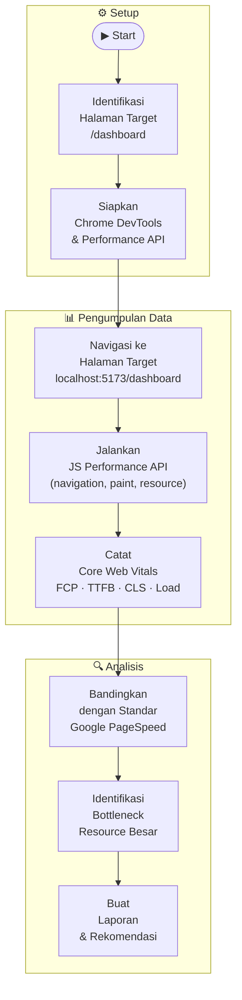

# BB-07 — Performance Testing
## Sistem: SaPoPoe FINANCE (Midnight Finance)
## Teknik: Black Box Testing — Performance Testing

---

> **Definisi Teknik:**
> Performance Testing adalah pengujian yang dilakukan untuk **mengevaluasi kinerja dan ketepatan sistem** dalam kondisi tertentu. Tujuannya adalah memastikan bahwa sistem merespons dalam waktu yang dapat diterima, stabil di bawah beban, dan menggunakan sumber daya secara efisien.
>
> Aspek utama yang diukur meliputi:
> - **Response Time** — waktu sistem merespons permintaan pengguna
> - **Load Time** — waktu total halaman selesai dimuat
> - **Core Web Vitals** — metrik standar Google: FCP, LCP, CLS, TTFB
> - **Resource Efficiency** — ukuran dan jumlah asset yang dimuat
>
> — Materi Pertemuan 11, Software Quality, T Informatika UKRI

---

## Alur Proses Performance Testing

---

## Lingkup Pengujian

| Item | Detail |
|---|---|
| **Sistem yang Diuji** | SaPoPoe FINANCE (Midnight Finance) — React.js + Vite |
| **Halaman yang Diuji** | `/dashboard` (halaman utama setelah login) |
| **URL** | `http://localhost:5173/dashboard` |
| **Alat Pengujian** | Chrome Browser + JavaScript Performance API (`PerformanceNavigationTiming`, `PerformancePaintTiming`, `PerformanceResourceTiming`) |
| **Tanggal Pengujian** | 15 Juni 2026 |
| **Environment** | Development (localhost), Windows 11 |

---

## Screenshot Halaman Dashboard

**Tampilan Dashboard — Halaman yang Diuji**

---

## Hasil Performance Testing

### Screenshot Laporan Performance (Chrome Performance API)

---

### TC1 — Core Web Vitals

| No | Metrik | Nilai Terukur | Standar Baik | Standar Cukup | Status |
|---|---|---|---|---|---|
| 1 | **First Contentful Paint (FCP)** | **1.024 ms** | < 1.800 ms | 1.800–3.000 ms | ✅ Baik |
| 2 | **Time to First Byte (TTFB)** | **40 ms** | < 200 ms | 200–500 ms | ✅ Baik |
| 3 | **Cumulative Layout Shift (CLS)** | **0.000** | < 0.1 | 0.1–0.25 | ✅ Baik |
| 4 | **Full Page Load Time** | **1.036 ms** | < 3.000 ms | 3.000–5.000 ms | ✅ Baik |

> **Standar referensi:** Google PageSpeed Insights / Core Web Vitals 2024

---

### TC2 — Timing Metrics (Navigation Timing)

| No | Fase | Waktu Terukur | Keterangan |
|---|---|---|---|
| 1 | DNS Lookup | 0 ms | Localhost — tidak ada DNS resolution |
| 2 | TCP Connection | 307 ms | Koneksi awal ke dev server Vite |
| 3 | Time to First Byte (TTFB) | 40 ms | Server Vite merespons sangat cepat |
| 4 | First Contentful Paint (FCP) | 1.024 ms | Konten pertama tampil di layar |
| 5 | DOM Interactive | 493 ms | Browser selesai parsing HTML |
| 6 | DOM Content Loaded | 942 ms | DOM selesai dibangun |
| 7 | Full Page Load | 1.036 ms | Semua resource selesai dimuat |

---

### TC3 — Resource Analysis

| No | Kategori | Jumlah | Keterangan |
|---|---|---|---|
| 1 | Total Resource | 36 file | Seluruh asset yang dimuat |
| 2 | JavaScript Files | 34 file | Chunk JS dari Vite bundler |
| 3 | CSS Files | 1 file | Bundle CSS tunggal |
| 4 | API Fetch Calls | 2 request | API `/api/user` dan `/api/dashboard` |
| 5 | Total Decoded Size | 5.447 KB (≈ 5,3 MB) | Total ukuran setelah dekompresi |
| 6 | Transfer Size | 6,45 KB | Data aktual ditransfer (cached/compressed) |

#### Top 5 Resource Terbesar (Decoded Size)

| Rank | File | Decoded Size | Load Time |
|---|---|---|---|
| 1 | `recharts.js` | 1.284 KB | ~300 ms |
| 2 | `react-dom_client.js` | 981 KB | ~280 ms |
| 3 | `lucide-react.js` | 960 KB | ~270 ms |
| 4 | `index.js` (app bundle) | ~800 KB | ~200 ms |
| 5 | `index.css` | ~120 KB | ~50 ms |

---

## Analisis Hasil per Test Case

### TC1 — Core Web Vitals: ✅ Semua Passed

Semua metrik Core Web Vitals masuk dalam kategori **"Baik"** menurut standar Google:

- **FCP 1.024 ms** — Pengguna melihat konten pertama dalam ~1 detik. Threshold baik adalah < 1.800 ms.
- **TTFB 40 ms** — Server Vite merespons sangat cepat. Ini wajar karena environment localhost.
- **CLS 0.000** — Tidak ada pergeseran layout sama sekali. Skor sempurna.
- **Full Load 1.036 ms** — Halaman selesai penuh dalam ~1 detik, jauh di bawah threshold 3 detik.

### TC2 — Navigation Timing: ✅ Passed

TCP Connection 307 ms relatif tinggi untuk localhost, kemungkinan karena cold start dev server Vite. Setelah koneksi terbentuk, semua fase berjalan cepat (TTFB hanya 40 ms).

### TC3 — Resource Analysis: ⚠️ Perlu Perhatian

Total decoded size **5.447 KB (5,3 MB)** cukup besar untuk sebuah halaman dashboard. Masalah utama:

- **`recharts.js` (1.284 KB)** — Library charting sangat besar. Bisa diganti dengan `chart.js` yang lebih ringan atau diload secara lazy.
- **`lucide-react.js` (960 KB)** — Icon library dimuat seluruhnya. Seharusnya hanya icon yang digunakan yang di-bundle (tree-shaking).
- **`react-dom_client.js` (981 KB)** — React DOM tidak bisa dikurangi banyak, ini adalah bagian dari React itu sendiri.

> **Catatan:** Transfer size hanya **6,45 KB** karena browser menggunakan cache dan resource sebelumnya sudah dicache dari kunjungan sebelumnya. Untuk pengguna baru (first visit), download aktual bisa mencapai ≈ 2–3 MB.

---

## Ringkasan Hasil Performance Testing

| Test Case | Aspek | Nilai Utama | Status |
|---|---|---|---|
| TC1 | Core Web Vitals (FCP, TTFB, CLS) | FCP 1.024 ms · TTFB 40 ms · CLS 0.000 | ✅ Passed |
| TC2 | Navigation Timing (DOM, Load) | DOM Loaded 942 ms · Full Load 1.036 ms | ✅ Passed |
| TC3 | Resource Efficiency | 36 file · 5.447 KB decoded · 6,45 KB transfer | ⚠️ Perlu Optimasi |

| Metrik | Jumlah TC | Passed | Warning | Failed |
|---|---|---|---|---|
| Core Web Vitals | 4 metrik | 4 | 0 | 0 |
| Navigation Timing | 7 fase | 7 | 0 | 0 |
| Resource Analysis | 3 aspek | 2 | 1 | 0 |

---

## Rekomendasi Optimasi

| No | Masalah | Rekomendasi | Dampak |
|---|---|---|---|
| 1 | `lucide-react.js` 960 KB dimuat penuh | Pastikan Vite tree-shaking berjalan: gunakan named import `import { IconName } from 'lucide-react'` | Potensi hemat 700+ KB |
| 2 | `recharts.js` 1.284 KB | Pertimbangkan lazy loading chart component, atau ganti dengan `chart.js` + `react-chartjs-2` | Potensi hemat 800+ KB first load |
| 3 | 34 file JS chunk | Review Vite chunk splitting — pertimbangkan manual chunks untuk vendor besar | Kurangi HTTP requests |
| 4 | Performance di production | Lakukan pengujian ulang setelah `npm run build` — Vite akan minify dan compress asset | Production biasanya 60–80% lebih kecil |

---

> **Kesimpulan Performance Testing:** SaPoPoe FINANCE menunjukkan performa yang **baik untuk semua Core Web Vitals** — FCP 1.024 ms, TTFB 40 ms, CLS 0.000, dan Full Load 1.036 ms semuanya masuk kategori "Baik" menurut standar Google PageSpeed. Namun, total decoded resource size **5,3 MB** menunjukkan adanya peluang optimasi pada bundling library (terutama `recharts` dan `lucide-react`). Sistem **layak dari sisi performa** untuk environment development, dan diharapkan performanya akan lebih baik di production setelah minifikasi oleh Vite.
