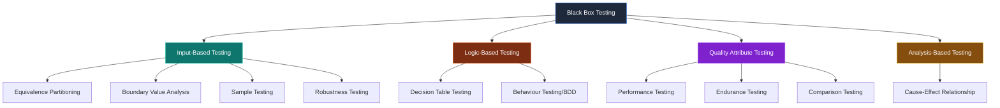

# 📦 Black Box Testing — Midnight Finance

> **Mata Kuliah:** Software Quality Assurance
> **Pertemuan:** 11 — Black Box Testing
> **Tim:** REMACode
> **Sistem yang Diuji:** Midnight Finance (Private Wealth Management Platform) — Laravel 11 + React.js

---

## 📖 Apa itu Black Box Testing?

**Black Box Testing** adalah metode pengujian perangkat lunak yang **menguji sistem tanpa mengetahui desain internalnya** (Priyaungga et al., 2020). Teknik ini berfokus pada **informasi dari perangkat lunak** dan menghasilkan test case dengan cara **mempartisi masukan dan keluaran** dari sebuah program untuk mencakup pengujian yang menyeluruh (Destiningrum & Adrian, 2017).

### Karakteristik Utama

| Aspek | Penjelasan |
|---|---|
| **Akses Kode** | Tidak membutuhkan akses ke source code |
| **Fokus** | Input → Output (functional behavior) |
| **Sudut Pandang** | Pengguna akhir (end user) |
| **Pelaku** | QA Tester, Business Analyst, atau end user |
| **Tujuan** | Memvalidasi fungsionalitas sesuai spesifikasi |

### Perbandingan dengan White Box Testing

| Aspek | White Box | Black Box |
|---|---|---|
| **Pengetahuan kode** | Wajib | Tidak diperlukan |
| **Fokus** | Struktur internal | Behavior eksternal |
| **Tester** | Developer/QA Engineer | QA Tester/End User |
| **Test Design** | Berdasarkan kode | Berdasarkan spesifikasi |
| **Contoh teknik** | Basis Path, Data Flow | BVA, Equivalence Partitioning |

---

## 🎯 Tujuan Dokumentasi

Dokumentasi ini berisi **10 model Black Box Testing** yang diterapkan pada modul-modul kritis sistem **Midnight Finance**. Setiap model menjelaskan:

- ✅ Definisi formal & konsep dasar
- ✅ Tujuan pengujian
- ✅ Spesifikasi modul yang diuji (input/output)
- ✅ Tabel test case dengan expected vs actual
- ✅ Screenshot bukti pengujian (sebagian)
- ✅ Analisis hasil & temuan
- ✅ Kelebihan & kekurangan
- ✅ Tools yang relevan

---

## 📂 Daftar Model Pengujian

| # | Model | File | Modul Target | Tingkat Kompleksitas |
|---|---|---|---|---|
| 1 | **Equivalence Partitioning** | [`Equivalence_Partitioning.md`](./Equivalence_Partitioning.md) | Form Registrasi User | 🟢 Low |
| 2 | **Boundary Value Analysis** | [`Boundary_Value_Analysis.md`](./Boundary_Value_Analysis.md) | Input Amount Transaksi | 🟢 Low |
| 3 | **Decision Table Testing** | [`Decision_Table_Testing.md`](./Decision_Table_Testing.md) | Status Anggaran (Safe/Warning/Overbudget) | 🟡 Medium |
| 4 | **Sample Testing** | [`Sample_Testing.md`](./Sample_Testing.md) | Sampling Transaksi Dataset Besar | 🟡 Medium |
| 5 | **Robustness Testing** | [`Robustness_Testing.md`](./Robustness_Testing.md) | Login dengan Input Ekstrem | 🔴 High |
| 6 | **Comparison Testing** | [`Comparison_Testing.md`](./Comparison_Testing.md) | API Response v1 vs v2 | 🟡 Medium |
| 7 | **Behaviour Testing (BDD)** | [`Behaviour_Testing.md`](./Behaviour_Testing.md) | Flow Registrasi → Login → Transaksi | 🔴 High |
| 8 | **Performance Testing** | [`Performance_Testing.md`](./Performance_Testing.md) | Endpoint Analytics Dashboard | 🔴 High |
| 9 | **Endurance Testing** | [`Endurance_Testing.md`](./Endurance_Testing.md) | Generate Report 1000x Berulang | 🟡 Medium |
| 10 | **Cause-Effect Relationship** | [`Cause_Effect_Relationship.md`](./Cause_Effect_Relationship.md) | Analisis "Why Dashboard Slow?" | 🟡 Medium |

---

## 🗺️ Klasifikasi Model



**Klasifikasi:**
- **Input-Based:** Berfokus pada partisi & validasi input
- **Logic-Based:** Berfokus pada kombinasi kondisi & perilaku
- **Quality Attribute:** Berfokus pada non-functional requirements
- **Analysis-Based:** Berfokus pada root cause analysis

---

## 📊 Tabel Perbandingan Singkat

| Model | Tipe | Fokus Utama | Output |
|---|---|---|---|
| Equivalence Partitioning | Input | Partisi kelas input | Tabel kelas valid/invalid |
| Boundary Value Analysis | Input | Nilai batas (min/max ± 1) | Tabel boundary test |
| Decision Table | Logic | Kombinasi kondisi | Truth table |
| Sample Testing | Input | Sampling dari kelas | Subset test data |
| Robustness | Input | Input di luar spesifikasi | Error handling report |
| Comparison | Quality | Konsistensi antar versi | Diff report |
| Behaviour (BDD) | Logic | User journey | Gherkin scenario |
| Performance | Quality | Speed, scalability | Metrics report |
| Endurance | Quality | Stabilitas jangka panjang | Long-run test log |
| Cause-Effect | Analysis | Root cause | Fishbone diagram |

---

## 🛠️ Tools yang Digunakan

| Kategori | Tool | Kegunaan |
|---|---|---|
| **API Testing** | Postman, Insomnia | Test endpoint REST API |
| **E2E Testing** | Cypress, Playwright | Behaviour & end-to-end |
| **BDD Framework** | Behat, Cucumber | Scenario-based testing |
| **Performance** | JMeter, k6, Lighthouse | Load & speed testing |
| **Monitoring** | Pingdom, PageSpeed Insights | Real-world performance |
| **Manual Testing** | TestRail, Google Sheets | Test case management |
| **Fishbone** | draw.io, Lucidchart | Root cause analysis |

---

## 🚀 Cara Membaca Dokumentasi

1. **Mulai dari file ini** untuk memahami big picture
2. **Buka file per model** sesuai urutan tabel di atas (low → high complexity)
3. **Lengkapi screenshot** sesuai marker `📸 SCREENSHOT NEEDED:` di setiap file
4. **Jalankan test case** sesuai instruksi di tiap model
5. **Update tabel "Hasil Eksekusi"** dengan data aktual

```bash
# Menjalankan API test (dari root midnight-finance-backend)
php artisan test --testsuite=Feature

# Menjalankan E2E test
npm run cypress:run

# Performance test
npx lighthouse https://midnight-finance.local --view
```

---

## 📚 Referensi

1. Priyaungga, R., et al. (2020). *Pengujian Sistem Informasi dengan Black Box Testing*. Jurnal Teknik Informatika.
2. Destiningrum, M., & Adrian, Q. J. (2017). *Sistem Informasi Penjadwalan Dokter Berbasis Web dengan Menggunakan Framework Codeigniter*. Jurnal TEKNOINFO.
3. Suprihadi, D. (2025). *Materi Software Quality Pertemuan 11 — Black Box Testing*. Universitas Kristen Indonesia.
4. Myers, G. J., Sandler, C., & Badgett, T. (2011). *The Art of Software Testing* (3rd ed.). Wiley.
5. Beizer, B. (1995). *Black-Box Testing: Techniques for Functional Testing of Software and Systems*. Wiley.
6. ISTQB. (2023). *Certified Tester Foundation Level Syllabus v4.0*. International Software Testing Qualifications Board.

---

## 🔗 Dokumentasi Terkait

- [⬅ White Box Testing](../White%20Box%20Testing/README.md) — Pengujian struktur internal
- [📁 Grey Box Testing](../Grey%20Box%20testing/) — Kombinasi white & black box
- [📁 Test Plan](../../Test%20Plan/) — Rencana pengujian komprehensif

---

<div align="center">

**Dokumentasi disusun oleh Tim REMACode**

*"Testing shows the presence, not the absence of bugs." — Edsger W. Dijkstra*

</div>
