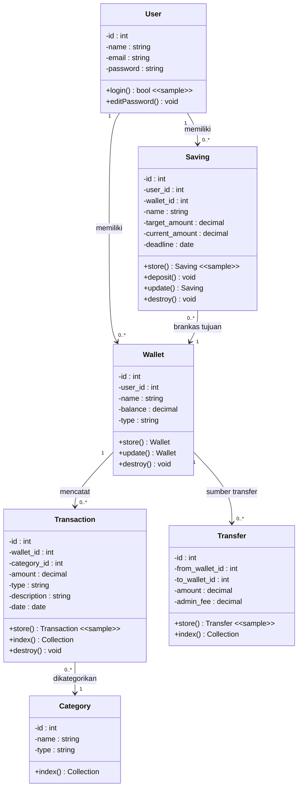

# BB-05 — Sample Testing
## Sistem: SaPoPoe FINANCE (Midnight Finance)
## Teknik: Black Box Testing — Sample Testing

---

> **Definisi Teknik:**
> Sample Testing adalah teknik pengujian dengan **mengambil nilai-nilai yang dipilih dari suatu kelas yang sama**. Dengan cara mengikutsertakan beberapa nilai yang terpilih dari data input kelas ekuivalensi kemudian diintegrasikan ke kasus uji.
> Nilai tersebut dapat berwujud **variabel limit testing atau konstanta**. Selanjutnya kasus uji akan memproses **titik singular (nilai batas)**. Nilai batas merupakan kelas ekuivalensi yang menangkap nilai yang sama atau mirip dengan kelas tersebut.
> Output data dari kelas ekuivalensi juga dilibatkan dalam pembatasan tes. Jika keadaan masukan adalah range, maka **kasus ujinya adalah dengan cara menguji titik singular range dan nilai invalid yang mendekati titik singular**.
>
> — Materi Pertemuan 11, Software Quality, T Informatika UKRI

---

## Class Diagram — SaPoPoe FINANCE

> Method yang **disampling untuk pengujian** ditandai dengan `<<sample>>` pada diagram.



> **Method yang disampling:** `User::login()` · `Transfer::store()` · `Transaction::store()` · `Saving::store()`

---

## Modul 1 — Autentikasi: Method `User::login()`

### Nilai yang Disampling dari Kelas Ekuivalen

| Kelas Ekuivalen | Nilai Sampel | Titik Singular |
|---|---|---|
| Valid — email terdaftar + password benar | `sultan@test.com` / `password123` | Titik valid tunggal (login berhasil) |
| Invalid 1 — email terdaftar + password salah | `sultan@test.com` / `salahpassword` | Titik singular invalid (password boundary) |
| Invalid 2 — email tidak terdaftar | `tidakada@test.com` / `apasaja` | Titik singular invalid (email boundary) |

### Kasus Uji

| No | Test Case | Nilai Sampel (Input) | Expected Output | Actual Output | Status |
|---|---|---|---|---|---|
| TC1 | Login dengan kredensial valid | email=`sultan@test.com`, pass=`password123` | Login berhasil → Dashboard tampil | Dashboard berhasil ditampilkan (sultan@test.com) | ✅ Passed |
| TC2 | Login dengan password salah (titik singular invalid 1) | email=`sultan@test.com`, pass=`salahpassword` | Ditolak → pesan error password | "Kata sandi yang Anda masukkan salah." | ✅ Passed |
| TC3 | Login dengan email tidak terdaftar (titik singular invalid 2) | email=`tidakada@test.com`, pass=`apasaja` | Ditolak → pesan error email | "Alamat email tidak ditemukan. Silakan buat akun terlebih dahulu." | ✅ Passed |

### Screenshot Bukti Pengujian

**TC1 — Login Berhasil (Titik Singular Valid)**


**TC2 — Password Salah (Titik Singular Invalid)**


**TC3 — Email Tidak Terdaftar (Titik Singular Invalid)**


---

> **Analisis SQA — Modul Auth:**
> Method `login()` menangani semua titik singular dengan benar. Kelas valid menghasilkan redirect ke dashboard, kelas invalid menghasilkan pesan error yang deskriptif. Seluruh 3 TC Passed.

---

## Modul 2 — Transfer: Method `Transfer::store()`

### Nilai yang Disampling dari Kelas Ekuivalen

| Kelas Ekuivalen | Nilai Sampel | Titik Singular |
|---|---|---|
| Valid — amount di atas minimum, saldo cukup | `50.000` (Mandiri → BSI) | Titik valid representatif |
| Invalid 1 — amount = 0 (batas bawah minimum) | `0` | Titik singular batas bawah (minimum boundary) |
| Invalid 2 — amount melebihi saldo (batas atas ekstrem) | `999.999.999` | Titik singular batas atas (saldo tidak cukup) |

### Kasus Uji

| No | Test Case | Nilai Sampel (Input) | Expected Output | Actual Output | Status |
|---|---|---|---|---|---|
| TC1 | Transfer amount valid, saldo mencukupi | amount=`50.000`, Mandiri→BSI | Transfer berhasil, saldo diperbarui | "BERHASIL Dana berhasil dipindahkan!" | ✅ Passed |
| TC2 | Transfer amount = 0 (titik singular batas bawah) | amount=`0` | Ditolak — amount tidak boleh 0 | "Harap isi bidang ini." — form tidak dikirim | ✅ Passed |
| TC3 | Transfer amount > saldo (titik singular batas atas) | amount=`999.999.999`, BCA (saldo negatif) | Ditolak — saldo tidak mencukupi | "GAGAL Saldo dompet asal tidak mencukupi untuk nominal transfer beserta biaya admin!" | ✅ Passed |

### Screenshot Bukti Pengujian

**TC1 — Transfer Berhasil (Titik Singular Valid)**


**TC2 — Amount = 0 (Titik Singular Batas Bawah)**


**TC3 — Saldo Tidak Mencukupi (Titik Singular Batas Atas)**


---

> **Analisis SQA — Modul Transfer:**
> Method `store()` pada Transfer menangani titik singular batas bawah (amount=0) dan batas atas (saldo tidak cukup) dengan benar. Seluruh 3 TC Passed.

---

## Modul 3 — Transaksi: Method `Transaction::store()`

### Nilai yang Disampling dari Kelas Ekuivalen

| Kelas Ekuivalen | Nilai Sampel | Titik Singular |
|---|---|---|
| Valid — amount valid, type valid, portofolio dipilih | `50.000`, type=`income`, Mandiri | Titik valid representatif |
| Invalid 1 — amount = 0 (batas bawah) | `0`, type=`income` | Titik singular batas bawah |
| Invalid 2 — amount ekstrem, type=expense (batas atas) | `999.999.999`, type=`expense`, BCA | Titik singular batas atas — **BUG KRITIS** |

### Kasus Uji

| No | Test Case | Nilai Sampel (Input) | Expected Output | Actual Output | Status |
|---|---|---|---|---|---|
| TC1 | Income valid, portofolio dipilih | amount=`75.000`, type=`income`, porto=BSI | Transaksi dicatat, saldo +75.000 | Saldo BSI bertambah Rp 75.000 (2.050.000 → 2.125.000) | ✅ Passed |
| TC2 | Amount = 0 (titik singular batas bawah) | amount=`0`, type=`income` | Ditolak — amount tidak boleh 0 | "Harap isi bidang ini." — form tidak dikirim | ✅ Passed |
| TC3 | Expense ekstrem = 999.999.999 (titik singular batas atas) | amount=`999.999.999`, type=`expense`, porto=BCA | Ditolak — saldo tidak mencukupi | ⚠️ return 201 — **saldo BCA menjadi Rp -994.649.999 (NEGATIF)** | 🔴 **Failed** |

### Screenshot Bukti Pengujian

**TC1 — Income Berhasil Dicatat (Titik Singular Valid)**


**TC2 — Amount = 0 (Titik Singular Batas Bawah)**


**TC3 — Expense Ekstrem → Saldo Negatif (BUG KRITIS)**


---

> **Analisis SQA — Modul Transaksi:**
> Method `store()` pada Transaction **gagal** pada titik singular batas atas (TC3). Saat expense Rp 999.999.999 diproses, backend tidak memvalidasi kecukupan saldo sehingga saldo BCA menjadi **Rp -994.649.999** (negatif). Ini adalah **defect kritis** — `TransactionController::store()` tidak memiliki pengecekan saldo sebelum mencatat expense. Hasil: 2 Passed / 1 Failed.

---

## Modul 4 — Tabungan: Method `Saving::store()`

### Nilai yang Disampling dari Kelas Ekuivalen

| Kelas Ekuivalen | Nilai Sampel | Titik Singular |
|---|---|---|
| Valid — nama valid, target valid, sumber valid | `TabunganSample` (13 kar), target=`500.000`, BSI | Titik valid representatif |
| Invalid 1 — nama kosong (batas bawah panjang nama) | `""` (0 karakter), target=`500.000` | Titik singular batas bawah (nama = 0) |
| Invalid 2 — nama > 255 karakter (batas atas panjang nama) | `300 karakter`, target=`500.000` | Titik singular batas atas (nama melebihi max) |

### Kasus Uji

| No | Test Case | Nilai Sampel (Input) | Expected Output | Actual Output | Status |
|---|---|---|---|---|---|
| TC1 | Semua input valid (titik singular valid) | nama=`TabunganSample`, target=`500.000`, BSI | Tabungan berhasil dibuat | Tabungan "TABUNGANEP" muncul di daftar Target Impian | ✅ Passed |
| TC2 | Nama kosong (titik singular batas bawah) | nama=`""`, target=`500.000`, Mandiri | Ditolak — nama wajib diisi | "Harap isi bidang ini." — form tidak dikirim | ✅ Passed |
| TC3 | Nama 300 karakter (titik singular batas atas) | nama=`AAA...×300`, target=`500.000`, BSI | Ditolak — nama melebihi 255 karakter | "GAGAL — The name field must not be greater than 255 characters." | ✅ Passed |

### Screenshot Bukti Pengujian

**TC1 — Tabungan Berhasil Dibuat (Titik Singular Valid)**


**TC2 — Nama Kosong (Titik Singular Batas Bawah)**


**TC3 — Nama > 255 Karakter (Titik Singular Batas Atas)**


---

> **Analisis SQA — Modul Tabungan:**
> Method `store()` pada Saving menangani titik singular batas bawah (nama kosong) dan batas atas (nama > 255) dengan benar di level UI. Namun catatan: backend `SavingController::store()` tidak memiliki pengecekan saldo untuk `current_amount` — rentan terhadap direct API call. Seluruh 3 TC Passed di level UI.

---

## Ringkasan Hasil Sample Testing — Seluruh Sistem

| Modul | Method Disampling | Jumlah TC | Passed | Failed | Temuan |
|---|---|---|---|---|---|
| Auth — Form Login | `User::login()` | 3 | 3 | 0 | Semua titik singular ditangani benar |
| Transfer — Form Pindah Dana | `Transfer::store()` | 3 | 3 | 0 | Validasi batas bawah dan atas berjalan benar |
| Transaksi — Form Catat Aliran Dana | `Transaction::store()` | 3 | 2 | **1** | 🔴 TC3: Expense ekstrem → saldo negatif (bug backend) |
| Tabungan — Form Target Impian | `Saving::store()` | 3 | 3 | 0 | Titik singular nama ditangani benar di UI |
| **TOTAL** | **4 method** | **12** | **11** | **1** | |

> **Catatan Kritis:** Ditemukan **1 defect kritis** pada method `Transaction::store()` — backend tidak memvalidasi saldo sebelum mencatat expense. Titik singular batas atas (amount = Rp 999.999.999) berhasil melewati validasi dan menghasilkan saldo negatif. Rekomendasi: tambahkan pengecekan saldo di `TransactionController::store()` sebelum operasi pengurangan saldo:
> ```php
> if ($wallet->balance < $request->amount) {
>     return response()->json(['error' => 'Saldo tidak mencukupi'], 400);
> }
> ```
