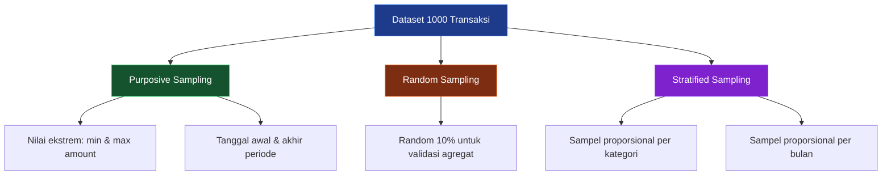

# 🎲 Sample Testing masih salah

> **Model Black Box Testing #4** — *Input-Based Testing*
> **Modul Target:** Riwayat Transaksi — Sampling dari Dataset Besar
> **Tim:** REMACode

---

## 📖 1. Definisi

**Sample Testing** adalah teknik pengujian yang **mengambil nilai-nilai yang dipilih dari suatu kelas yang sama**, dengan cara mengikutsertakan beberapa nilai yang terpilih dari data input kelas ekivalensi kemudian diintegrasikan ke kasus uji (Suprihadi, 2025). Nilai tersebut dapat berwujud **variabel limit testing atau konstanta**, dan kasus uji akan memproses **titik singular (nilai batas)**. Jika kondisi masukan adalah range, maka kasus ujinya adalah **menguji titik singular range dan nilai invalid yang mendekati titik singular**.

### Perbedaan dengan Teknik Lain

| Aspek | EP | BVA | Sample Testing |
|---|---|---|---|
| **Dasar pemilihan** | Partisi kelas | Nilai batas | Representasi populasi |
| **Skala data** | Kecil-menengah | Kecil | **Besar (dataset nyata)** |
| **Tujuan** | Validasi rule | Deteksi off-by-one | Deteksi anomali populasi |
| **Metode** | Deterministic | Deterministic | **Probabilistic/Purposive** |

---

## 🎯 2. Tujuan Pengujian

| No | Tujuan |
|---|---|
| 1 | Memverifikasi sistem menangani variasi data nyata dari dataset besar |
| 2 | Mendeteksi bug yang hanya muncul pada kombinasi data tertentu |
| 3 | Memastikan performa query tidak degradasi pada dataset besar |
| 4 | Memvalidasi kalkulasi agregat (total, average, sum) pada sampel |
| 5 | Menguji pagination & filtering dengan data volume tinggi |

---

## 💻 3. Modul yang Diuji

**Endpoint:** `GET /api/transactions`
**Modul:** Riwayat Transaksi dengan filter, sort, dan pagination

> ⚠️ **TODO:** Konfirmasi parameter filter & pagination yang tersedia di `midnight-finance-backend`.

### Parameter Endpoint

| Parameter | Tipe | Deskripsi |
|---|---|---|
| `page` | integer | Nomor halaman (default: 1) |
| `per_page` | integer | Item per halaman (default: 15, max: 100) |
| `type` | string | Filter: `income` / `expense` / `all` |
| `category_id` | integer | Filter berdasarkan kategori |
| `start_date` | date | Filter rentang tanggal awal |
| `end_date` | date | Filter rentang tanggal akhir |
| `sort_by` | string | Urutan: `date` / `amount` / `category` |
| `sort_order` | string | `asc` / `desc` |

---

## 🔍 4. Strategi Sampling

### 4.1 Dataset yang Digunakan

**Ukuran dataset:** 1.000 transaksi seed data

| Distribusi | Jumlah | Persentase |
|---|---|---|
| Income transaksi | 400 | 40% |
| Expense transaksi | 600 | 60% |
| Periode | Jan 2024 — Des 2024 | 12 bulan |
| Akun berbeda | 5 akun | — |
| Kategori berbeda | 10 kategori | — |

### 4.2 Metode Sampling



---

## 🧪 5. Test Case Design

### 5.1 Purposive Sample — Nilai Ekstrem

| TC ID | Deskripsi | Sample Criteria | Expected |
|---|---|---|---|
| `ST-TC-01` | Amount terbesar | Top 5 amount tertinggi | Return sorted desc |
| `ST-TC-02` | Amount terkecil | Bottom 5 amount terendah | Return sorted asc |
| `ST-TC-03` | Transaksi paling lama | Tanggal paling awal | Halaman terakhir (sort desc) |
| `ST-TC-04` | Transaksi paling baru | Tanggal hari ini | Halaman pertama (sort desc) |
| `ST-TC-05` | Kategori jarang dipakai | Kategori dengan < 5 transaksi | Semua item ter-return |

### 5.2 Random Sample — Validasi Agregat

| TC ID | Deskripsi | Sample Size | Expected |
|---|---|---|---|
| `ST-TC-06` | Sum income Januari | 100% data Jan income | `sum(amount)` sesuai DB |
| `ST-TC-07` | Sum expense Maret | 100% data Mar expense | `sum(amount)` sesuai DB |
| `ST-TC-08` | Average amount per kategori | Semua kategori | `avg(amount)` sesuai DB |
| `ST-TC-09` | Count transaksi per bulan | 12 bulan | Count tiap bulan sesuai |

### 5.3 Stratified Sample — Filter & Pagination

| TC ID | Filter Diterapkan | Page | Per Page | Expected |
|---|---|---|---|---|
| `ST-TC-10` | `type=income` | 1 | 15 | 15 income items |
| `ST-TC-11` | `type=expense` | 1 | 15 | 15 expense items |
| `ST-TC-12` | `start_date=2024-01-01&end_date=2024-01-31` | 1 | 100 | Hanya Jan 2024 |
| `ST-TC-13` | `category_id=1` | 1 | 15 | Hanya kategori 1 |
| `ST-TC-14` | `type=income&sort_by=amount&sort_order=desc` | 1 | 10 | 10 income terbesar |
| `ST-TC-15` | `per_page=100` | 1 | 100 | Max 100 items |
| `ST-TC-16` | `per_page=101` | 1 | 101 | Fallback 100 atau 422 |
| `ST-TC-17` | Semua filter kombinasi | 1 | 15 | Semua filter aktif |

---

## 📸 6. Screenshot yang Diperlukan

> **📸 SCREENSHOT NEEDED #1:** **Riwayat Transaksi — Default**
> Buka halaman riwayat transaksi, screenshot list dengan pagination default.
> *File suggested name:* `screenshot/ST-transaksi-list-default.png`

> **📸 SCREENSHOT NEEDED #2:** **Filter Type = Income**
> Terapkan filter `type=income`, screenshot hasilnya.
> *File suggested name:* `screenshot/ST-filter-income.png`

> **📸 SCREENSHOT NEEDED #3:** **Filter Rentang Tanggal**
> Terapkan filter `start_date` dan `end_date`, screenshot hasilnya.
> *File suggested name:* `screenshot/ST-filter-date-range.png`

> **📸 SCREENSHOT NEEDED #4:** **Sorting Amount Descending**
> Terapkan `sort_by=amount&sort_order=desc`, screenshot top 10 transaksi.
> *File suggested name:* `screenshot/ST-sort-amount-desc.png`

---

## 🚀 7. Implementasi Pengujian

### 7.1 Database Seeder

```php
<?php

namespace Database\Seeders;

use App\Models\Account;
use App\Models\Category;
use App\Models\Transaction;
use App\Models\User;
use Carbon\Carbon;
use Illuminate\Database\Seeder;

class SampleTransactionSeeder extends Seeder
{
    public function run(): void
    {
        $user       = User::factory()->create();
        $accounts   = Account::factory(5)->create(['user_id' => $user->id]);
        $categories = Category::factory(10)->create(['user_id' => $user->id]);

        for ($month = 1; $month <= 12; $month++) {
            Transaction::factory(rand(70, 100))->create([
                'user_id'          => $user->id,
                'account_id'       => $accounts->random()->id,
                'category_id'      => $categories->random()->id,
                'transaction_date' => Carbon::create(2024, $month)->addDays(rand(0, 27)),
            ]);
        }

        // Extreme value anchors
        Transaction::factory()->create([
            'user_id' => $user->id,
            'amount'  => 999_999_999.99, // max
            'type'    => 'income',
        ]);

        Transaction::factory()->create([
            'user_id' => $user->id,
            'amount'  => 0.01, // min
            'type'    => 'expense',
        ]);
    }
}
```

### 7.2 PHPUnit Test

```php
<?php

namespace Tests\Feature\Transaction;

use App\Models\Transaction;
use App\Models\User;
use Carbon\Carbon;
use Illuminate\Foundation\Testing\RefreshDatabase;
use Tests\TestCase;

class TransactionSampleTest extends TestCase
{
    use RefreshDatabase;

    private User $user;

    protected function setUp(): void
    {
        parent::setUp();
        $this->user = User::factory()->create();
        $this->seed(\Database\Seeders\SampleTransactionSeeder::class);
    }

    /** @test ST-TC-10: Filter type=income */
    public function it_returns_only_income_transactions(): void
    {
        $response = $this->actingAs($this->user)
            ->getJson('/api/transactions?type=income&per_page=15');

        $response->assertStatus(200);

        foreach ($response->json('data.data') as $item) {
            $this->assertEquals('income', $item['type']);
        }
    }

    /** @test ST-TC-12: Filter date range */
    public function it_returns_transactions_within_date_range(): void
    {
        $response = $this->actingAs($this->user)
            ->getJson('/api/transactions?start_date=2024-01-01&end_date=2024-01-31');

        $response->assertStatus(200);

        foreach ($response->json('data.data') as $item) {
            $date = Carbon::parse($item['transaction_date']);
            $this->assertTrue(
                $date->between(Carbon::parse('2024-01-01'), Carbon::parse('2024-01-31'))
            );
        }
    }

    /** @test ST-TC-14: Sort by amount descending */
    public function it_returns_transactions_sorted_by_amount_desc(): void
    {
        $response = $this->actingAs($this->user)
            ->getJson('/api/transactions?sort_by=amount&sort_order=desc&per_page=10');

        $response->assertStatus(200);

        $amounts = array_column($response->json('data.data'), 'amount');
        $sorted  = $amounts;
        rsort($sorted);

        $this->assertEquals($sorted, $amounts);
    }

    /** @test ST-TC-15 & 16: per_page limit */
    public function it_caps_per_page_at_100(): void
    {
        $response = $this->actingAs($this->user)
            ->getJson('/api/transactions?per_page=101');

        if ($response->status() === 200) {
            $this->assertLessThanOrEqual(100, count($response->json('data.data')));
        } else {
            $response->assertStatus(422);
        }
    }

    /** @test ST-TC-06: Aggregate sum validation */
    public function it_calculates_correct_income_sum(): void
    {
        $response = $this->actingAs($this->user)
            ->getJson('/api/transactions/summary?type=income&month=1&year=2024');

        $apiTotal = $response->json('data.total_amount');

        $dbTotal = Transaction::where('user_id', $this->user->id)
            ->where('type', 'income')
            ->whereYear('transaction_date', 2024)
            ->whereMonth('transaction_date', 1)
            ->sum('amount');

        $this->assertEqualsWithDelta($dbTotal, $apiTotal, 0.01);
    }
}
```

---

## 📊 8. Hasil Eksekusi

| TC ID | Metode Sampling | Dataset Size | Expected | Actual | Status |
|---|---|---|---|---|---|
| `ST-TC-01` | Purposive (max amount) | Top 5 | Sorted desc | ⏳ Pending | — |
| `ST-TC-02` | Purposive (min amount) | Bottom 5 | Sorted asc | ⏳ Pending | — |
| `ST-TC-06` | Random (Jan income) | ~40 records | Sum match | ⏳ Pending | — |
| `ST-TC-10` | Stratified (income) | 15/page | All income | ⏳ Pending | — |
| `ST-TC-12` | Stratified (Jan 2024) | ~80 records | All Jan | ⏳ Pending | — |
| `ST-TC-14` | Stratified (sort amt) | Top 10 | Desc sorted | ⏳ Pending | — |
| `ST-TC-15` | Stratified (max page) | 100/page | ≤100 items | ⏳ Pending | — |
| `ST-TC-16` | Edge (over limit) | 101/page | Fallback/422 | ⏳ Pending | — |
| `ST-TC-17` | Combined filters | 15/page | All applied | ⏳ Pending | — |

---

## 🐛 9. Temuan & Analisis

| ID | Severity | Deskripsi (Predicted) | Rekomendasi |
|---|---|---|---|
| `ST-001` | 🔴 High | Query tanpa index pada `transaction_date` & `amount` lambat di 1000+ records | Tambah composite index `(user_id, transaction_date, type)` |
| `ST-002` | 🟡 Medium | `per_page > 100` tidak di-cap — bisa DDoS via large request | Tambah `max:100` di validation |
| `ST-003` | 🟡 Medium | Agregat `sum(amount)` menggunakan float — presisi bisa off | Gunakan `DB::raw('SUM(amount)')` + cast ke string |
| `ST-004` | 🟢 Low | Tidak ada metadata total record di pagination response | Tambah `meta.total`, `meta.from`, `meta.to` |

---

## ✅ 10. Rekomendasi Optimasi

### Database Index

```sql
ALTER TABLE transactions
    ADD INDEX idx_user_date_type (user_id, transaction_date, type),
    ADD INDEX idx_user_amount (user_id, amount),
    ADD INDEX idx_user_category (user_id, category_id);
```

### Query Optimization

```php
public function index(Request $request)
{
    $perPage = min((int) $request->get('per_page', 15), 100); // ST-002 fix

    $query = Transaction::query()
        ->where('user_id', auth()->id())
        ->when($request->type !== 'all', fn($q) => $q->where('type', $request->type))
        ->when($request->category_id, fn($q) => $q->where('category_id', $request->category_id))
        ->when($request->start_date, fn($q) => $q->whereDate('transaction_date', '>=', $request->start_date))
        ->when($request->end_date, fn($q) => $q->whereDate('transaction_date', '<=', $request->end_date))
        ->orderBy(
            $request->get('sort_by', 'transaction_date'),
            $request->get('sort_order', 'desc')
        );

    return TransactionResource::collection($query->paginate($perPage));
}
```

---

## ⚖️ 11. Kelebihan & Kekurangan

### ✅ Kelebihan
- Menemukan bug yang tidak muncul di dataset kecil
- Memvalidasi performa & skalabilitas sistem
- Representatif terhadap kondisi produksi nyata
- Mendeteksi masalah agregasi di skala besar

### ❌ Kekurangan
- Butuh data seed yang cukup besar untuk meaningful
- Non-deterministic jika pakai random sampling murni
- Test bisa lambat karena volume data besar
- Sulit menemukan bug spesifik (gunakan EP/BVA)

---

## 🛠️ 12. Tools Pendukung

| Tool | Kegunaan |
|---|---|
| **Laravel Factory + Faker** | Generate sample data realistis |
| **Laravel Seeder** | Seed dataset besar ke DB |
| **MySQL EXPLAIN** | Analisis query performance |
| **Telescope / Debugbar** | Monitor query & memory |
| **Postman Collection Runner** | Run banyak sample request |

```bash
# Seed 1000 transaksi
php artisan db:seed --class=SampleTransactionSeeder

# Cek query log
php artisan tinker
>>> DB::enableQueryLog();
>>> DB::getQueryLog();
```

---

## 📚 Referensi

1. Suprihadi, D. (2025). *Materi Software Quality Pertemuan 11*. Universitas Kristen Indonesia.
2. Myers, G. J., Sandler, C., & Badgett, T. (2011). *The Art of Software Testing* (3rd ed.). Wiley.
3. Beizer, B. (1995). *Black-Box Testing*. Wiley.

---

<div align="center">

[⬅ Decision Table Testing](./Decision_Table_Testing.md) · [Kembali ke README](./README.md) · [Lanjut ke Robustness Testing ➡](./Robustness_Testing.md)

**Tim REMACode** — Midnight Finance SQA Documentation

</div>
