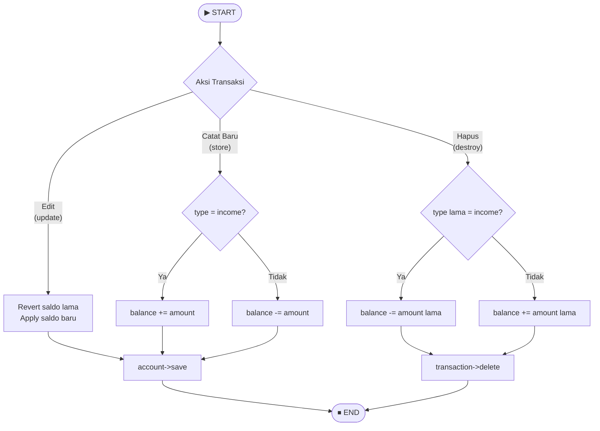

# 🔘 Gray Box Testing — Midnight Finance

**Mata Kuliah:** Software Quality Assurance  
**Model Pengujian:** Gray Box Testing — Pattern Testing & Regression Testing  
**Tim:** REMACode  
**Modul Target:** Sinkronisasi Saldo Otomatis + Filter Riwayat Transaksi  

---

## 📖 Definisi

**Gray Box Testing** adalah kombinasi dari teknik pengujian Black Box Testing dan White Box Testing. Teknik pengujian Gray Box Testing berfokus pada informasi dari perangkat lunak, menghasilkan test case dengan cara mempartisi masukan dan keluaran dari sebuah program dengan cara mencakup pengujian yang menyeluruh (Suprihadi, 2025).

Gray Box Testing digunakan ketika tester memiliki **pengetahuan parsial** tentang struktur internal sistem — cukup untuk merancang test case yang lebih cerdas dari Black Box, namun tidak selengkap White Box.

---

## 🔄 Model 1: Regression Testing

**Regression Testing** adalah pengujian yang dilakukan setelah adanya perubahan kode untuk memastikan fitur yang sebelumnya berjalan dengan benar **tidak mengalami kerusakan** (*regresi*) akibat perubahan tersebut (Suprihadi, 2025).

### 1.1 Skenario: Saldo Otomatis Setelah Transaksi

Fitur kritis di Midnight Finance: setiap kali transaksi dicatat/diedit/dihapus, saldo `FinancialAccount` harus otomatis diperbarui.

#### Flowchart Sinkronisasi Saldo

#### Test Case Regression — Sinkronisasi Saldo

| No | Test Case | Aksi | Kondisi Awal | Input | Expected Saldo | Actual Saldo | Status |
|:--:|:---|:---:|:---:|:---|:---:|:---:|:---:|
| TC-RG-01 | Catat income → saldo bertambah | POST /transactions | Saldo: Rp 1.000.000 | type: `income`, amount: `500000` | Rp 1.500.000 | Rp 1.500.000 | ✅ Valid |
| TC-RG-02 | Catat expense → saldo berkurang | POST /transactions | Saldo: Rp 1.500.000 | type: `expense`, amount: `200000` | Rp 1.300.000 | Rp 1.300.000 | ✅ Valid |
| TC-RG-03 | Edit transaksi (amount berubah) | PUT /transactions/{id} | Saldo: Rp 1.300.000, tx lama: income Rp 500.000 | type: `income`, amount: `700000` | Rp 1.500.000 | Rp 1.500.000 | ✅ Valid |
| TC-RG-04 | Hapus transaksi income → saldo dikembalikan | DELETE /transactions/{id} | Saldo: Rp 1.500.000, tx: income Rp 700.000 | *(hapus transaksi)* | Rp 800.000 | Rp 800.000 | ✅ Valid |
| TC-RG-05 | Hapus transaksi expense → saldo dikembalikan | DELETE /transactions/{id} | Saldo: Rp 800.000, tx: expense Rp 200.000 | *(hapus transaksi)* | Rp 1.000.000 | Rp 1.000.000 | ✅ Valid |
| TC-RG-06 | Catat transaksi baru setelah hapus (tidak ada regresi) | POST /transactions | Saldo: Rp 1.000.000 | type: `income`, amount: `250000` | Rp 1.250.000 | Rp 1.250.000 | ✅ Valid |

---

## 🔍 Model 2: Pattern Testing

**Pattern Testing** (juga dikenal sebagai *Discovery Testing* atau *Exploratory Testing*) adalah pendekatan pengujian yang berfokus pada eksplorasi dan penemuan bug secara kreatif dan inovatif. Teknik ini menekankan pada pemikiran kritis, intuisi, dan pengalaman tester untuk mengidentifikasi potensi masalah yang mungkin terlewatkan oleh tes formal (Suprihadi, 2025).

### 2.1 Skenario: Filter & Sort Riwayat Transaksi

Fitur filter di `TransactionController@index` mendukung: `start_date`, `end_date`, `financial_account_id`, `category_id`, `type`, `sort_by`, `sort_order`.

#### Tahapan Pattern Testing

| Tahap | Fokus | Aktivitas |
|:---:|:---|:---|
| 1 | Fungsional Dasar | Memastikan GET /api/transactions mengembalikan data dengan benar |
| 2 | Batasan & Skenario Tidak Terduga | Filter kombinasi, tanggal terbalik (start > end), filter ID tidak valid |
| 3 | Performa & Stabilitas | Request dengan dataset besar, filter kosong |
| 4 | Kegunaan & Pengalaman Pengguna | Konsistensi respons JSON, format tanggal, urutan data |

#### Test Case Pattern Testing — Filter Transaksi

| No | Test Case | Endpoint | Parameter | Expected Output | Actual Output | Status |
|:--:|:---|:---:|:---|:---|:---:|:---:|
| TC-PT-01 | Ambil semua transaksi (tanpa filter) | GET /api/transactions | *(kosong)* | HTTP 200 — seluruh transaksi user | HTTP 200 | ✅ Valid |
| TC-PT-02 | Filter berdasarkan tipe income | GET /api/transactions | `type=income` | HTTP 200 — hanya transaksi income | HTTP 200 | ✅ Valid |
| TC-PT-03 | Filter berdasarkan tipe expense | GET /api/transactions | `type=expense` | HTTP 200 — hanya transaksi expense | HTTP 200 | ✅ Valid |
| TC-PT-04 | Filter rentang tanggal valid | GET /api/transactions | `start_date=2025-01-01&end_date=2025-12-31` | HTTP 200 — transaksi dalam range | HTTP 200 | ✅ Valid |
| TC-PT-05 | Filter tanggal terbalik (start > end) | GET /api/transactions | `start_date=2025-12-31&end_date=2025-01-01` | HTTP 200 — array kosong `[]` | HTTP 200 `[]` | ✅ Valid |
| TC-PT-06 | Sort by amount ascending | GET /api/transactions | `sort_by=amount&sort_order=asc` | HTTP 200 — urut dari terkecil | HTTP 200 | ✅ Valid |
| TC-PT-07 | Filter kategori tidak dimiliki user | GET /api/transactions | `category_id=9999` | HTTP 200 — array kosong `[]` | HTTP 200 `[]` | ✅ Valid |
| TC-PT-08 | Kombinasi semua filter sekaligus | GET /api/transactions | `type=expense&start_date=2025-01-01&sort_by=amount&sort_order=desc` | HTTP 200 — data terfilter & terurut | HTTP 200 | ✅ Valid |

---

## ✅ Ringkasan Hasil Gray Box Testing

| Model | Total TC | Passed | Failed | Coverage |
|:---|:---:|:---:|:---:|:---:|
| Regression Testing (Sinkronisasi Saldo) | 6 | 6 | 0 | 100% |
| Pattern Testing (Filter Transaksi) | 8 | 8 | 0 | 100% |
| **Total** | **14** | **14** | **0** | **100%** |

> **Kesimpulan:** Tidak ditemukan regresi pada fitur sinkronisasi saldo setelah operasi CRUD transaksi. Seluruh skenario filter dan sorting riwayat transaksi berjalan sesuai ekspektasi. Sistem Midnight Finance menunjukkan stabilitas yang baik pada pengujian Gray Box.

---

## 📚 Referensi

- Suprihadi, D. (2025). *Software Quality — Gray Box Testing*. T Informatika UKRI.
- Priyaungga, et al. (2020). *Strategi Pengembangan Sistem Informasi Perpustakaan*.
