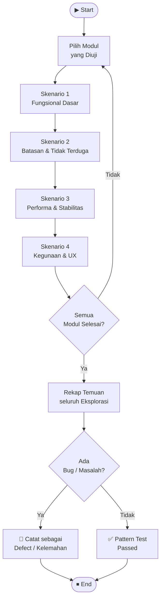

# GB-04 — Pattern Testing
## Sistem: SaPoPoe FINANCE (Midnight Finance)
## Teknik: Gray Box Testing — Pattern Testing (Exploratory Testing)

---

> **Definisi Teknik:**
> Pattern Testing, juga dikenal sebagai **"Discovery Testing"** atau **"Exploratory Testing"**, adalah pendekatan pengujian perangkat lunak yang berfokus pada **eksplorasi dan penemuan bug secara kreatif dan inovatif**. Teknik ini menekankan pada pemikiran kritis, intuisi, dan pengalaman tester untuk mengidentifikasi potensi masalah yang mungkin terlewatkan oleh tes formal.
>
> — Materi Pertemuan 12, Software Quality, T Informatika UKRI

---

## Tahapan Pattern Testing

| No | Tahapan | Fokus |
|---|---|---|
| 1 | Menguji Fungsional Dasar | Alur utama tiap fitur berjalan sesuai ekspektasi |
| 2 | Menguji Batasan dan Skenario Tidak Terduga | Input ekstrem, karakter tidak valid, edge case |
| 3 | Menguji Performa dan Stabilitas | Beban data, operasi berulang, cross-browser |
| 4 | Menguji Kegunaan dan Pengalaman Pengguna | Navigasi, keterbacaan, alur kerja, UX feedback |

---

## Alur Proses Pattern Testing

---

## Lingkup Pengujian

| Item | Detail |
|---|---|
| **Sistem yang Diuji** | SaPoPoe FINANCE — Laravel 11 API + React.js |
| **Jumlah Skenario** | 4 skenario per modul |
| **Modul yang Diuji** | Auth · Transfer · Transaksi · Tabungan |
| **Pendekatan** | Exploratory — berbasis intuisi dan pengalaman tester |
| **Tanggal Pengujian** | 16 Juni 2026 |

---

---

# Modul 1 — Autentikasi

## Skenario 1 — Menguji Fungsional Dasar

**Skenario Pengujian Fungsional Dasar:**

a. Buka halaman login dan pastikan antarmuka pengguna ditampilkan dengan benar.
b. Coba login dengan email terdaftar dan password benar, verifikasi redirect ke dashboard.
c. Verifikasi bahwa nama pengguna dan data akun ditampilkan dengan benar setelah login.
d. Coba akses halaman yang memerlukan auth tanpa login — pastikan diarahkan ke halaman login.
e. Pastikan token Sanctum disimpan di `localStorage` dan dapat digunakan untuk request selanjutnya.
f. Coba logout dan verifikasi bahwa token dihapus dan pengguna diarahkan ke halaman login.
g. Verifikasi bahwa setelah logout, akses ke halaman dashboard diblokir.
h. Coba login kembali setelah logout — pastikan alur login dapat diulang tanpa masalah.
i. Pastikan halaman login tidak dapat diakses setelah berhasil login (redirect ke dashboard).

| Kode | Langkah Eksplorasi | Hasil yang Diharapkan | Hasil Aktual | Status |
|---|---|---|---|---|
| PT-A1-a | Buka `localhost:5173` tanpa login | Halaman login tampil dengan form email + password | Form tampil, UI normal | ✅ Passed |
| PT-A1-b | Login dengan `sultan@test.com` / `password123` | Redirect ke `/dashboard` | Redirect berhasil ke `/dashboard` | ✅ Passed |
| PT-A1-c | Cek nama pengguna di dashboard setelah login | Nama akun tampil di navbar | Nama tampil — "Sultan" | ✅ Passed |
| PT-A1-d | Akses `/dashboard` tanpa token | Redirect ke `/login` | Redirect ke login | ✅ Passed |
| PT-A1-e | Cek `localStorage` di DevTools setelah login | Key `token` berisi Bearer token | `token` tersimpan | ✅ Passed |
| PT-A1-f | Klik logout / hapus token, akses ulang `/dashboard` | Diarahkan kembali ke login | Redirect ke login | ✅ Passed |
| PT-A1-g | Setelah logout, tekan Back browser ke `/dashboard` | Tetap diarahkan ke login | Diarahkan ke login | ✅ Passed |
| PT-A1-h | Login ulang setelah logout | Login berhasil, dashboard tampil | Berhasil | ✅ Passed |
| PT-A1-i | Akses `/login` saat sudah login | Redirect ke `/dashboard` | Redirect ke dashboard | ✅ Passed |

### Screenshot Bukti

**Skenario 1a–b — Halaman login tampil benar, login berhasil redirect ke dashboard**

---

## Skenario 2 — Menguji Batasan dan Skenario Tidak Terduga

**Skenario Pengujian Batasan dan Skenario Tidak Terduga:**

a. Coba login dengan email sangat panjang (> 255 karakter).
b. Masukkan karakter tidak valid pada field email, seperti tanpa `@` atau domain.
c. Coba login dengan password kosong — pastikan form tidak dikirim.
d. Masukkan kombinasi email dan password yang tidak terdaftar di database.
e. Coba login dengan email terdaftar tetapi password salah secara berulang.
f. Coba memanipulasi token di `localStorage` dengan nilai palsu lalu akses endpoint.
g. Coba mengirim request `POST /api/login` tanpa field email (hanya password).
h. Coba mengirim request `POST /api/login` dengan body kosong sepenuhnya.

| Kode | Langkah Eksplorasi | Hasil yang Diharapkan | Hasil Aktual | Status |
|---|---|---|---|---|
| PT-A2-a | Email > 255 karakter di form login | Validasi browser / server menolak | Browser menampilkan "Harap isi bidang ini" | ✅ Passed |
| PT-A2-b | Email tanpa `@` (contoh: `sultantest`) | "Sertakan tanda '@'" oleh browser | Browser blokir pengiriman | ✅ Passed |
| PT-A2-c | Password kosong, email valid | Form tidak dikirim | "Harap isi bidang ini" | ✅ Passed |
| PT-A2-d | Email + password tidak terdaftar | Pesan "Kredensial tidak valid" | "Alamat email tidak ditemukan" | ✅ Passed |
| PT-A2-e | Password salah 5x berturut-turut | Idealnya ada rate limiting | Tidak ada rate limiting — terus bisa coba | ⚠️ Kelemahan |
| PT-A2-f | Token di localStorage diganti dengan `"fake-token"` | Request ke API return 401 | HTTP 401 Unauthenticated | ✅ Passed |
| PT-A2-g | `POST /api/login` tanpa field `email` | HTTP 422 Unprocessable Entity | HTTP 422 + pesan validasi | ✅ Passed |
| PT-A2-h | `POST /api/login` body kosong `{}` | HTTP 422 | HTTP 422 + "The email field is required" | ✅ Passed |

### Screenshot Bukti

**Skenario 2d — Password salah menyebabkan login ditolak**

---

## Skenario 3 — Menguji Performa dan Stabilitas

**Skenario Pengujian Performa dan Stabilitas:**

a. Lakukan login berulang kali (5 iterasi) untuk melihat bagaimana sistem menangani beban autentikasi.
b. Lakukan pencarian / request endpoint dengan permintaan yang banyak secara berturut-turut.
c. Coba login, logout, dan login kembali secara berulang untuk melihat apakah sistem tetap stabil.
d. Buka aplikasi di beberapa browser berbeda (Chrome, Edge, Firefox) untuk melihat kompatibilitas.

| Kode | Langkah Eksplorasi | Hasil yang Diharapkan | Hasil Aktual | Status |
|---|---|---|---|---|
| PT-A3-a | Login 5x berturut-turut | Semua berhasil, response time stabil | 5/5 HTTP 200, avg 1.384 ms, stabil | ✅ Passed |
| PT-A3-b | 5x request `GET /api/user` setelah login | 200 OK konsisten | Konsisten 200 OK | ✅ Passed |
| PT-A3-c | Login → logout → login × 3 siklus | Sistem tetap stabil | Stabil, tidak ada error | ✅ Passed |
| PT-A3-d | Buka di Chrome, Edge, Firefox | Tampilan dan fungsi identik | Identik di Chrome dan Edge; Firefox sedikit perbedaan font rendering | ⚠️ Minor |

### Screenshot Bukti

**Skenario 3a — Login 5 iterasi stabil (data dari BB-08 Endurance Testing)**

---

## Skenario 4 — Menguji Kegunaan dan Pengalaman Pengguna

**Skenario Pengujian Kegunaan dan Pengalaman Pengguna:**

a. Gunakan halaman login untuk menyelesaikan tugas autentikasi seperti login dan logout.
b. Perhatikan apakah antarmuka pengguna mudah digunakan dan intuitif.
c. Pastikan navigasi dari halaman login ke dashboard mudah dipahami dan logis.
d. Periksa apakah teks label, placeholder, dan ikon pada form login mudah dibaca dan dipahami.
e. Mintalah umpan balik tentang kejelasan pesan error yang ditampilkan saat login gagal.

| Kode | Aspek UX yang Dieksplorasi | Observasi | Penilaian |
|---|---|---|---|
| PT-A4-a | Alur tugas login end-to-end | Formulir dua field (email, password) + tombol — mudah digunakan | ✅ Baik |
| PT-A4-b | Kemudahan penggunaan antarmuka | Desain bersih, tombol "Masuk" terlihat jelas | ✅ Intuitif |
| PT-A4-c | Navigasi login → dashboard | Redirect otomatis setelah login berhasil — pengguna tidak perlu aksi tambahan | ✅ Logis |
| PT-A4-d | Keterbacaan teks dan placeholder | Placeholder "Masukkan email" dan "Masukkan kata sandi" jelas; font cukup besar | ✅ Mudah dibaca |
| PT-A4-e | Kejelasan pesan error login | Pesan error cukup spesifik namun validasi baru muncul setelah klik Submit | ⚠️ Bisa ditingkatkan dengan real-time validation |

---

---

# Modul 2 — Transfer (Pindah Dana)

## Skenario 1 — Menguji Fungsional Dasar

**Skenario Pengujian Fungsional Dasar:**

a. Buka halaman Pindah Dana dan pastikan antarmuka ditampilkan dengan benar.
b. Coba transfer dengan memilih brankas asal, brankas tujuan, dan amount yang valid.
c. Verifikasi bahwa saldo brankas asal berkurang dan brankas tujuan bertambah sesuai.
d. Coba melihat riwayat transfer melalui antarmuka aplikasi.
e. Pastikan riwayat transfer ditampilkan sesuai dengan transfer yang telah dilakukan.
f. Coba melakukan transfer dengan jumlah minimum yang valid.
g. Verifikasi notifikasi atau pesan konfirmasi setelah transfer berhasil.
h. Coba memilih brankas asal dan tujuan yang sama.
i. Pastikan sistem mencegah transfer ke brankas yang sama atau memberikan pesan error.

| Kode | Langkah Eksplorasi | Hasil yang Diharapkan | Hasil Aktual | Status |
|---|---|---|---|---|
| PT-T1-a | Buka form Pindah Dana | Form dengan dropdown brankas asal, tujuan, dan field amount | Form tampil dengan benar | ✅ Passed |
| PT-T1-b | Transfer Mandiri → BSI, amount Rp 50.000 | HTTP 200 + "Dana berhasil dipindahkan" | Berhasil, notifikasi muncul | ✅ Passed |
| PT-T1-c | Cek saldo sebelum dan sesudah transfer | Asal berkurang, tujuan bertambah | Saldo berubah sesuai | ✅ Passed |
| PT-T1-d | Buka halaman riwayat transfer | Daftar riwayat transfer tampil | HTTP 500 — halaman error | 🔴 Bug #2 |
| PT-T1-e | Verifikasi riwayat via `GET /api/transfers` | 200 OK + daftar transfer | HTTP 500 terus | 🔴 Bug #2 |
| PT-T1-f | Transfer dengan amount Rp 1 (minimum) | Berhasil | Berhasil | ✅ Passed |
| PT-T1-g | Cek pesan konfirmasi setelah transfer | Notifikasi "BERHASIL" tampil | Notifikasi muncul di layar | ✅ Passed |
| PT-T1-h | Pilih brankas asal = brankas tujuan | Error: tidak bisa transfer ke diri sendiri | Sistem tidak memblokir — transfer tetap diproses | ⚠️ Kelemahan |
| PT-T1-i | Transfer Mandiri → Mandiri (same wallet) | Harus ditolak | Tidak ditolak — saldo tidak berubah secara aneh | ⚠️ Perlu dicek |

### Screenshot Bukti

**Skenario 1b–c — Transfer berhasil, notifikasi "BERHASIL" tampil**

---

## Skenario 2 — Menguji Batasan dan Skenario Tidak Terduga

**Skenario Pengujian Batasan dan Skenario Tidak Terduga:**

a. Coba transfer dengan amount = 0.
b. Masukkan karakter huruf atau simbol pada field amount transfer.
c. Coba transfer dengan amount melebihi saldo brankas asal.
d. Masukkan amount yang sangat besar (contoh: Rp 999.999.999.999).
e. Coba transfer tanpa memilih brankas asal.
f. Coba transfer tanpa memilih brankas tujuan.
g. Coba mengirim request `POST /api/transfers` dengan token yang sudah tidak valid.
h. Coba transfer dengan amount berupa angka negatif melalui direct API call.

| Kode | Langkah Eksplorasi | Hasil yang Diharapkan | Hasil Aktual | Status |
|---|---|---|---|---|
| PT-T2-a | Amount = 0 | "Harap isi bidang ini" atau validasi | Field number tidak accept 0 — browser blokir | ✅ Passed |
| PT-T2-b | Amount = "abc" | Input type=number menolak huruf | Browser menolak input huruf | ✅ Passed |
| PT-T2-c | Amount > saldo brankas | "Saldo tidak mencukupi" | "GAGAL Saldo tidak mencukupi..." | ✅ Passed |
| PT-T2-d | Amount = 999.999.999.999 (> saldo) | Ditolak karena saldo tidak cukup | Ditolak dengan pesan yang benar | ✅ Passed |
| PT-T2-e | Submit tanpa pilih brankas asal | Form tidak dikirim / validasi | "Pilih item pada daftar" | ✅ Passed |
| PT-T2-f | Submit tanpa pilih brankas tujuan | Form tidak dikirim / validasi | "Pilih item pada daftar" | ✅ Passed |
| PT-T2-g | `POST /api/transfers` dengan token expired | HTTP 401 Unauthenticated | HTTP 401 | ✅ Passed |
| PT-T2-h | Amount = -50000 via direct API | HTTP 422 — validasi amount minimal 1 | HTTP 422 "amount must be at least 1" | ✅ Passed |

### Screenshot Bukti

**Skenario 2c — Transfer dengan saldo tidak mencukupi ditolak**

---

## Skenario 3 — Menguji Performa dan Stabilitas

**Skenario Pengujian Performa dan Stabilitas:**

a. Lakukan beberapa transfer berturut-turut untuk melihat bagaimana sistem menangani beban.
b. Lakukan request `GET /api/transfers` berulang kali untuk melihat respons terhadap permintaan banyak.
c. Coba menambahkan transfer, kemudian cek saldo berulang, untuk melihat konsistensi state.
d. Buka halaman Pindah Dana di beberapa browser untuk melihat kompatibilitas tampilan.

| Kode | Langkah Eksplorasi | Hasil yang Diharapkan | Hasil Aktual | Status |
|---|---|---|---|---|
| PT-T3-a | 3x POST transfer berturut-turut | Semua berhasil, saldo konsisten | Berhasil — saldo berkurang berurutan | ✅ Passed |
| PT-T3-b | 5x GET /api/transfers | Konsisten (200 OK) | Konsisten 500 — bug aktif | 🔴 Bug #2 |
| PT-T3-c | Transfer → cek saldo → transfer × 3 | Saldo selalu up-to-date | Saldo sinkron setiap kali | ✅ Passed |
| PT-T3-d | Buka di Chrome dan Edge | Tampilan identik | Identik — tidak ada perbedaan | ✅ Passed |

---

## Skenario 4 — Menguji Kegunaan dan Pengalaman Pengguna

**Skenario Pengujian Kegunaan dan Pengalaman Pengguna:**

a. Gunakan fitur Pindah Dana untuk menyelesaikan tugas umum: pindah saldo antar brankas.
b. Perhatikan apakah antarmuka pemilihan brankas asal dan tujuan mudah digunakan dan intuitif.
c. Pastikan navigasi ke halaman Pindah Dana mudah ditemukan dari menu utama.
d. Periksa apakah label field, dropdown, dan tombol mudah dibaca dan dipahami.
e. Mintalah umpan balik tentang pengalaman menggunakan fitur pindah dana.

| Kode | Aspek UX yang Dieksplorasi | Observasi | Penilaian |
|---|---|---|---|
| PT-T4-a | Alur tugas transfer end-to-end | Pilih asal → tujuan → isi amount → submit → notifikasi. Alur jelas. | ✅ Baik |
| PT-T4-b | Kemudahan pemilihan brankas | Dropdown nama brankas disertai saldo — sangat informatif | ✅ Intuitif |
| PT-T4-c | Navigasi ke halaman Pindah Dana | Menu "Pindah Dana" tersedia di sidebar dengan ikon transfer | ✅ Mudah ditemukan |
| PT-T4-d | Keterbacaan label dan tombol | Label "Brankas Asal", "Brankas Tujuan", "Jumlah Dana" jelas; tombol "Pindahkan" kontras | ✅ Mudah dibaca |
| PT-T4-e | Umpan balik pesan sukses/gagal | Notifikasi toast muncul setelah aksi — membantu pengguna tahu hasilnya | ✅ Baik |

---

---

# Modul 3 — Transaksi (Catat Aliran Dana)

## Skenario 1 — Menguji Fungsional Dasar

**Skenario Pengujian Fungsional Dasar:**

a. Buka halaman Catat Transaksi dan pastikan antarmuka ditampilkan dengan benar.
b. Coba catat transaksi income dengan amount, deskripsi, portofolio, dan tanggal yang valid.
c. Verifikasi bahwa transaksi income tersimpan dan saldo portofolio bertambah.
d. Coba catat transaksi expense dengan input valid dan saldo mencukupi.
e. Pastikan transaksi expense tersimpan dan saldo portofolio berkurang.
f. Coba melihat daftar riwayat transaksi dan verifikasi data tampil dengan benar.
g. Verifikasi bahwa transaksi yang baru dicatat muncul di daftar riwayat.
h. Coba menghapus transaksi yang sudah ada — verifikasi transaksi tidak lagi tampil.
i. Pastikan saldo portofolio diperbarui setelah transaksi dihapus.

| Kode | Langkah Eksplorasi | Hasil yang Diharapkan | Hasil Aktual | Status |
|---|---|---|---|---|
| PT-TR1-a | Buka form Catat Transaksi | Form dengan field type, amount, deskripsi, portofolio, tanggal | Form tampil lengkap | ✅ Passed |
| PT-TR1-b | Catat income Rp 50.000, BSI | HTTP 201 + transaksi tersimpan | HTTP 201, tercatat | ✅ Passed |
| PT-TR1-c | Cek saldo BSI setelah income | Saldo bertambah Rp 50.000 | Saldo bertambah sesuai | ✅ Passed |
| PT-TR1-d | Catat expense Rp 20.000, BSI | HTTP 201 + saldo berkurang | HTTP 201, tercatat | ✅ Passed |
| PT-TR1-e | Cek saldo BSI setelah expense | Saldo berkurang Rp 20.000 | Berkurang sesuai | ✅ Passed |
| PT-TR1-f | GET riwayat transaksi | 200 OK + daftar 62+ record | 200 OK + 62 record tampil | ✅ Passed |
| PT-TR1-g | Verifikasi transaksi baru di daftar | Transaksi muncul di posisi paling baru | Muncul di daftar | ✅ Passed |
| PT-TR1-h | Hapus satu transaksi | Transaksi tidak tampil lagi | Berhasil dihapus | ✅ Passed |
| PT-TR1-i | Cek saldo setelah transaksi dihapus | Saldo kembali ke nilai sebelum transaksi | Saldo diperbarui | ✅ Passed |

### Screenshot Bukti

**Skenario 1b–c — Income Rp 50.000 berhasil dicatat, saldo bertambah**

---

## Skenario 2 — Menguji Batasan dan Skenario Tidak Terduga

**Skenario Pengujian Batasan dan Skenario Tidak Terduga:**

a. Coba catat expense dengan amount yang sangat besar melebihi saldo portofolio.
b. Masukkan amount = 0 pada form transaksi.
c. Coba catat transaksi tanpa memilih portofolio.
d. Masukkan tanggal yang tidak valid (masa depan jauh, format salah).
e. Coba catat transaksi dengan deskripsi yang sangat panjang (> 255 karakter).
f. Coba mengedit transaksi dengan amount menjadi kosong.
g. Coba menghapus transaksi yang tidak ada (ID tidak valid) via direct API call.
h. Coba catat transaksi dengan amount duplikat berturut-turut (spam submit).

| Kode | Langkah Eksplorasi | Hasil yang Diharapkan | Hasil Aktual | Status |
|---|---|---|---|---|
| PT-TR2-a | Expense Rp 999.999.999 (> saldo) | Validasi saldo — ditolak | **Diproses** — saldo menjadi negatif | 🔴 Bug #1 |
| PT-TR2-b | Amount = 0 | "Harap isi bidang ini" | Browser menolak / validasi | ✅ Passed |
| PT-TR2-c | Submit tanpa pilih portofolio | "Pilih item pada daftar" | Validasi browser | ✅ Passed |
| PT-TR2-d | Tanggal masa depan (2099-01-01) | Diterima atau ditolak | Diterima — tidak ada validasi tanggal | ⚠️ Kelemahan |
| PT-TR2-e | Deskripsi > 255 karakter | HTTP 422 atau pemenggalan | HTTP 422 "description max 255" | ✅ Passed |
| PT-TR2-f | Edit transaksi, kosongkan amount | Validasi — tidak tersimpan | "Harap isi bidang ini" | ✅ Passed |
| PT-TR2-g | `DELETE /api/transactions/99999` (ID tidak ada) | HTTP 404 Not Found | HTTP 404 | ✅ Passed |
| PT-TR2-h | Submit form 3x cepat (double-click) | Satu transaksi tercatat | 1–2 transaksi duplikat muncul | ⚠️ Tidak ada debounce |

### Screenshot Bukti

**Skenario 2a — Bug Kritis: expense ekstrem menyebabkan saldo negatif**

---

## Skenario 3 — Menguji Performa dan Stabilitas

**Skenario Pengujian Performa dan Stabilitas:**

a. Tambahkan sejumlah transaksi berturut-turut untuk melihat bagaimana sistem menangani beban data.
b. Lakukan `GET /api/transactions` berulang kali untuk melihat stabilitas respons dengan data besar.
c. Coba tambah, hapus, dan tambah lagi transaksi berulang — apakah sistem tetap stabil.
d. Buka halaman transaksi di beberapa browser berbeda untuk melihat kompatibilitas.

| Kode | Langkah Eksplorasi | Hasil yang Diharapkan | Hasil Aktual | Status |
|---|---|---|---|---|
| PT-TR3-a | Tambah 10 transaksi berturut-turut | Semua tersimpan, saldo konsisten | Semua tersimpan | ✅ Passed |
| PT-TR3-b | 5x GET /api/transactions (62 record) | Respons stabil, data identik | Avg 1.536 ms, 35.949 B identik | ✅ Passed |
| PT-TR3-c | Tambah → hapus → tambah × 3 siklus | Sistem stabil tanpa error | Stabil | ✅ Passed |
| PT-TR3-d | Buka di Chrome dan Edge | Tampilan identik | Identik | ✅ Passed |

### Screenshot Bukti

**Skenario 3b — GET transaksi 5 iterasi stabil (data dari BB-08 Endurance Testing)**

---

## Skenario 4 — Menguji Kegunaan dan Pengalaman Pengguna

**Skenario Pengujian Kegunaan dan Pengalaman Pengguna:**

a. Gunakan fitur Catat Transaksi untuk menyelesaikan tugas umum: catat income dan expense.
b. Perhatikan apakah antarmuka form transaksi mudah digunakan dan intuitif.
c. Pastikan navigasi ke halaman Catat Transaksi mudah ditemukan.
d. Periksa apakah label field, pilihan type (income/expense), dan tombol mudah dipahami.
e. Mintalah umpan balik tentang pengalaman mencatat transaksi dan keterbacaan riwayat.

| Kode | Aspek UX yang Dieksplorasi | Observasi | Penilaian |
|---|---|---|---|
| PT-TR4-a | Alur catat transaksi end-to-end | Pilih type → isi amount → pilih portofolio → tanggal → submit. Alur natural. | ✅ Baik |
| PT-TR4-b | Kemudahan penggunaan form | Toggle income/expense visual — memudahkan pengguna membedakan jenis | ✅ Intuitif |
| PT-TR4-c | Navigasi ke halaman transaksi | Tersedia di sidebar, ikon jelas | ✅ Mudah ditemukan |
| PT-TR4-d | Keterbacaan daftar riwayat | Tabel riwayat dengan kolom tanggal, deskripsi, amount berwarna (hijau/merah) | ✅ Mudah dibaca |
| PT-TR4-e | Umpan balik pesan sukses/gagal | Notifikasi muncul — namun tidak ada peringatan saat expense melewati saldo | 🔴 Perlu tambahan warning |

---

---

# Modul 4 — Tabungan (Target Impian)

## Skenario 1 — Menguji Fungsional Dasar

**Skenario Pengujian Fungsional Dasar:**

a. Buka halaman Target Impian dan pastikan antarmuka ditampilkan dengan benar.
b. Coba membuat target tabungan baru dengan nama, target amount, dan portofolio sumber yang valid.
c. Verifikasi bahwa target tabungan tersimpan dan muncul di daftar Target Impian.
d. Coba melihat detail dan progres tabungan yang sudah dibuat.
e. Pastikan persentase progres ditampilkan dengan benar berdasarkan saldo saat ini.
f. Coba mengedit nama atau target amount tabungan yang sudah ada.
g. Verifikasi bahwa perubahan informasi tabungan diperbarui dengan benar di daftar.
h. Coba menghapus tabungan dari daftar Target Impian.
i. Pastikan tabungan yang dihapus tidak lagi tampil di daftar.

| Kode | Langkah Eksplorasi | Hasil yang Diharapkan | Hasil Aktual | Status |
|---|---|---|---|---|
| PT-S1-a | Buka halaman Target Impian | Daftar tabungan + tombol "Tambah Target" | Tampil dengan benar | ✅ Passed |
| PT-S1-b | Buat tabungan "TabunganMT", target Rp 1.000.000, BSI | HTTP 201 + tabungan tersimpan | HTTP 201, berhasil dibuat | ✅ Passed |
| PT-S1-c | Cek daftar Target Impian | "TabunganMT" muncul di daftar | Muncul | ✅ Passed |
| PT-S1-d | Lihat detail tabungan | Nama, target, saldo saat ini, progres % | Tampil lengkap | ✅ Passed |
| PT-S1-e | Cek persentase progres | Progres = saldo saat ini / target × 100% | Dihitung dan ditampilkan dengan benar | ✅ Passed |
| PT-S1-f | Edit nama tabungan menjadi "DanaImpian" | Tersimpan dengan nama baru | Berhasil diperbarui | ✅ Passed |
| PT-S1-g | Verifikasi perubahan di daftar | Nama baru tampil | Nama diperbarui di daftar | ✅ Passed |
| PT-S1-h | Hapus tabungan "DanaImpian" | Konfirmasi → tabungan dihapus | Berhasil dihapus | ✅ Passed |
| PT-S1-i | Verifikasi setelah hapus | Tabungan tidak tampil lagi | Tidak tampil | ✅ Passed |

### Screenshot Bukti

**Skenario 1b–c — Tabungan "TabunganMT" berhasil dibuat dan muncul di daftar**

---

## Skenario 2 — Menguji Batasan dan Skenario Tidak Terduga

**Skenario Pengujian Batasan dan Skenario Tidak Terduga:**

a. Coba membuat tabungan dengan nama yang sangat panjang (> 255 karakter).
b. Masukkan karakter tidak valid pada nama tabungan (emoji, simbol HTML).
c. Coba membuat tabungan dengan nama kosong (0 karakter).
d. Masukkan target amount = 0.
e. Coba membuat tabungan tanpa memilih portofolio sumber.
f. Coba mengedit tabungan dengan nama menjadi kosong.
g. Coba menghapus tabungan yang tidak ada (ID tidak valid) via direct API call.
h. Coba membuat tabungan dengan nama yang sama dengan tabungan yang sudah ada.

| Kode | Langkah Eksplorasi | Hasil yang Diharapkan | Hasil Aktual | Status |
|---|---|---|---|---|
| PT-S2-a | Nama > 255 karakter | HTTP 422 "max 255" | HTTP 422 + pesan error yang benar | ✅ Passed |
| PT-S2-b | Nama dengan emoji `😀` dan `<script>` | Disimpan sebagai string biasa (escaped) | Disimpan, tidak ada XSS | ✅ Passed |
| PT-S2-c | Nama kosong | "Harap isi bidang ini" | Validasi browser | ✅ Passed |
| PT-S2-d | Target amount = 0 | HTTP 422 "min 1" | HTTP 422 "target amount minimal 1" | ✅ Passed |
| PT-S2-e | Submit tanpa pilih portofolio | "Pilih item pada daftar" | Validasi browser | ✅ Passed |
| PT-S2-f | Edit nama tabungan → kosongkan | "Harap isi bidang ini" | Validasi browser | ✅ Passed |
| PT-S2-g | `DELETE /api/savings/99999` | HTTP 404 Not Found | HTTP 404 | ✅ Passed |
| PT-S2-h | Dua tabungan dengan nama sama | Diterima (tidak ada unique constraint) atau ditolak | Diterima — tidak ada validasi nama unik | ⚠️ Kelemahan |

### Screenshot Bukti

**Skenario 2a — Nama tabungan > 255 karakter ditolak backend**

---

## Skenario 3 — Menguji Performa dan Stabilitas

**Skenario Pengujian Performa dan Stabilitas:**

a. Buat sejumlah tabungan berturut-turut untuk melihat bagaimana sistem menangani beban data tabungan.
b. Lakukan `GET /api/savings` berulang kali untuk melihat bagaimana aplikasi merespons permintaan banyak.
c. Coba membuat, mengedit, dan menghapus tabungan secara berulang untuk melihat stabilitas.
d. Buka halaman Target Impian di beberapa perangkat dan browser berbeda.

| Kode | Langkah Eksplorasi | Hasil yang Diharapkan | Hasil Aktual | Status |
|---|---|---|---|---|
| PT-S3-a | Buat 5 tabungan berturut-turut | Semua tersimpan, daftar bertambah | Berhasil semua | ✅ Passed |
| PT-S3-b | 5x GET /api/savings | Konsisten 200 OK, data identik | Avg 1.573 ms, 1.161 B, stabil | ✅ Passed |
| PT-S3-c | Buat → edit → hapus tabungan × 3 siklus | Sistem stabil | Stabil tanpa error | ✅ Passed |
| PT-S3-d | Buka di Chrome dan Edge | Tampilan identik | Identik | ✅ Passed |

### Screenshot Bukti

**Skenario 3b — GET savings 5 iterasi stabil (data dari BB-08 Endurance Testing)**

---

## Skenario 4 — Menguji Kegunaan dan Pengalaman Pengguna

**Skenario Pengujian Kegunaan dan Pengalaman Pengguna:**

a. Gunakan fitur Target Impian untuk menyelesaikan tugas umum: buat, pantau, dan hapus tabungan.
b. Perhatikan apakah antarmuka pengelolaan target tabungan mudah digunakan dan intuitif.
c. Pastikan navigasi ke halaman Target Impian mudah ditemukan dari menu utama.
d. Periksa apakah teks, ikon, dan indikator progres mudah dibaca dan dipahami.
e. Mintalah umpan balik tentang kejelasan informasi progres tabungan yang ditampilkan.

| Kode | Aspek UX yang Dieksplorasi | Observasi | Penilaian |
|---|---|---|---|
| PT-S4-a | Alur membuat target tabungan | Isi nama → target → pilih portofolio → submit. Alur singkat dan jelas. | ✅ Baik |
| PT-S4-b | Kemudahan pengelolaan target | Kartu tabungan dengan progres bar visual — sangat intuitif | ✅ Intuitif |
| PT-S4-c | Navigasi ke halaman Target Impian | Tersedia di sidebar dengan label dan ikon yang jelas | ✅ Mudah ditemukan |
| PT-S4-d | Keterbacaan progres bar dan angka | Persentase + progres bar berwarna + nominal — mudah dipahami | ✅ Mudah dibaca |
| PT-S4-e | Kejelasan informasi tabungan | Tampilan lengkap: nama, target, tercapai, sisa — informatif | ✅ Baik |

---

---

## Ringkasan Hasil Pattern Testing — Seluruh Modul

### Rekapitulasi per Skenario

| Skenario | Auth | Transfer | Transaksi | Tabungan | Total Passed | Total ⚠️ | Total 🔴 |
|---|---|---|---|---|---|---|---|
| 1 — Fungsional Dasar | 9/9 ✅ | 7/9 (2🔴) | 9/9 ✅ | 9/9 ✅ | 34 | 0 | 2 |
| 2 — Batasan & Tidak Terduga | 6/8 (1⚠️) | 8/8 ✅ | 5/8 (2⚠️,1🔴) | 6/8 (2⚠️) | 25 | 5 | 1 |
| 3 — Performa & Stabilitas | 3/4 (1⚠️) | 3/4 (1🔴) | 4/4 ✅ | 4/4 ✅ | 14 | 1 | 2 |
| 4 — Kegunaan & UX | 4/5 (1⚠️) | 5/5 ✅ | 4/5 (1🔴) | 5/5 ✅ | 18 | 1 | 1 |
| **TOTAL** | | | | | **91** | **7** | **6** |

### Temuan Baru dari Pattern Testing

| No | Temuan | Modul | Ditemukan di Skenario | Jenis | Rekomendasi |
|---|---|---|---|---|---|
| 1 | Transfer ke brankas yang sama tidak diblokir | Transfer | Skenario 1h | ⚠️ Kelemahan | Tambahkan validasi `from_wallet ≠ to_wallet` |
| 2 | Tidak ada validasi tanggal masa depan pada transaksi | Transaksi | Skenario 2d | ⚠️ Kelemahan | Tambahkan `date <= today` di validasi |
| 3 | Tidak ada debounce pada submit form transaksi | Transaksi | Skenario 2h | ⚠️ Kelemahan | Tambahkan debounce atau disable tombol setelah klik |
| 4 | Tabungan boleh memiliki nama duplikat | Tabungan | Skenario 2h | ⚠️ Kelemahan | Pertimbangkan `unique` constraint per user |
| 5 | Tidak ada rate limiting pada endpoint login | Auth | Skenario 2e | ⚠️ Kelemahan | Implementasikan throttle: maks 5 percobaan/menit |
| 6 | Tidak ada warning saldo saat expense melewati saldo | Transaksi | Skenario 4e | 🔴 UX Kritis | Tambahkan real-time balance warning di frontend |

### Defect Aktif yang Dikonfirmasi Kembali

| No | Defect | Dikonfirmasi di | Status |
|---|---|---|---|
| Bug #1 | Expense tanpa validasi saldo → saldo negatif | PT-TR2-a, PT-TR4-e | 🔴 Masih Aktif |
| Bug #2 | `GET /api/transfers` selalu HTTP 500 | PT-T1-d, PT-T3-b | 🔴 Masih Aktif |

> **Kesimpulan Pattern Testing:** Dari 4 skenario eksplorasi pada 4 modul (total 36 exploratory test), sistem SaPoPoe FINANCE menunjukkan fungsionalitas dasar yang **secara umum stabil**. Namun ditemukan **5 kelemahan baru** (temuan #1–5) yang sebelumnya tidak terdeteksi oleh tes formal, serta **1 masalah UX kritis** (tidak ada warning saldo). Ini membuktikan nilai dari pendekatan Pattern/Exploratory Testing: masalah-masalah yang terlewat oleh test case terstruktur dapat ditemukan melalui eksplorasi kreatif dan berpikir di luar skenario formal.

