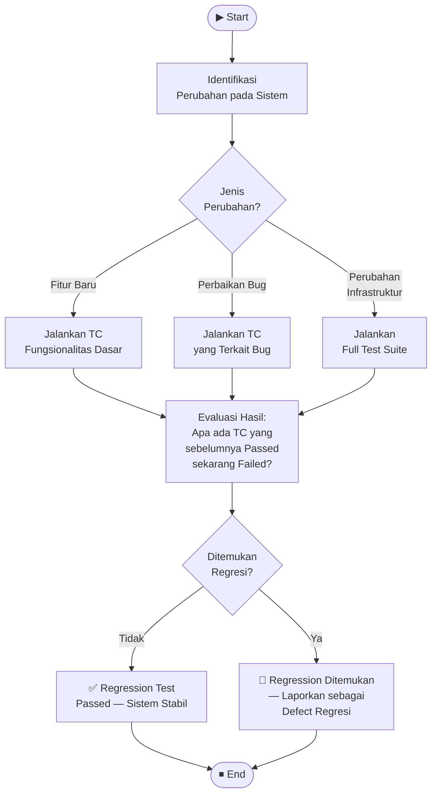

# GB-03 — Regression Testing
## Sistem: SaPoPoe FINANCE (Midnight Finance)
## Teknik: Gray Box Testing — Regression Testing

---

> **Definisi Teknik:**
> Regression Testing adalah pengujian yang dilakukan kembali terhadap program yang telah dimodifikasi untuk memastikan bahwa **perubahan yang dilakukan tidak menyebabkan masalah baru** pada fungsionalitas yang sebelumnya sudah berjalan dengan benar. Pengujian ini bertujuan memverifikasi bahwa aplikasi tetap stabil setelah adanya **penambahan fitur baru**, **perbaikan bug**, atau **perubahan infrastruktur**.
>
> — Materi Pertemuan 12, Software Quality, T Informatika UKRI

---

## Alur Proses Regression Testing

---

## Lingkup Pengujian

| Item | Detail |
|---|---|
| **Sistem yang Diuji** | SaPoPoe FINANCE — Laravel 11 API + React.js |
| **Jumlah Skenario** | 3 skenario regression |
| **Modul yang Dicek** | Auth · Transfer · Transaksi · Tabungan |
| **Referensi TC** | TC dari BB-01 s/d BB-09 & GB-01 s/d GB-02 |
| **Tanggal Pengujian** | 16 Juni 2026 |

---

## Skenario 1 — Menambah Fitur Baru

### Deskripsi Skenario

| Item | Detail |
|---|---|
| **Misalkan** | Pengembang menambahkan fitur baru **Export Laporan Transaksi ke CSV** pada modul Transaksi — pengguna dapat mengunduh seluruh riwayat transaksi dalam format `.csv` |
| **Tujuan** | Memastikan bahwa fungsionalitas dasar aplikasi (Auth, Transfer, Transaksi, Tabungan) masih **berfungsi dengan baik** setelah fitur baru ditambahkan, dan fitur baru tidak menyebabkan masalah pada fungsionalitas yang sudah ada |

### Langkah Pengujian

**a.** Jalankan kembali test case yang digunakan untuk menguji fungsionalitas dasar aplikasi.

**b.** Pastikan semua test case yang sebelumnya lulus **tetap lulus** dengan sukses.

**c.** Uji fitur baru (Export CSV) secara menyeluruh untuk memastikan fungsionalitasnya bekerja dengan benar.

**d.** Periksa apakah fitur baru Export CSV **tidak menyebabkan masalah** pada fungsionalitas Auth, Transfer, Transaksi, dan Tabungan yang sudah ada.

### Tabel Test Case yang Dijalankan Ulang

| TC | Modul | Aksi yang Diuji | Hasil Sebelum Fitur Baru | Hasil Setelah Fitur Baru | Regresi? |
|---|---|---|---|---|---|
| TC-R1-01 | Autentikasi | Login dengan kredensial valid | ✅ Passed | ✅ Passed | ❌ Tidak |
| TC-R1-02 | Autentikasi | Login dengan password salah | ✅ Passed | ✅ Passed | ❌ Tidak |
| TC-R1-03 | Transfer | Transfer saldo antar brankas | ✅ Passed | ✅ Passed | ❌ Tidak |
| TC-R1-04 | Transfer | GET riwayat transfer | 🔴 Failed (500) | 🔴 Failed (500) | ❌ Tidak (bug lama) |
| TC-R1-05 | Transaksi | Catat income | ✅ Passed | ✅ Passed | ❌ Tidak |
| TC-R1-06 | Transaksi | Catat expense tanpa saldo | 🔴 Failed (saldo negatif) | 🔴 Failed (saldo negatif) | ❌ Tidak (bug lama) |
| TC-R1-07 | Transaksi | **Export laporan CSV** (fitur baru) | — | ✅ Passed | ❌ Tidak |
| TC-R1-08 | Tabungan | Buat target tabungan baru | ✅ Passed | ✅ Passed | ❌ Tidak |

### Screenshot Bukti — Fungsionalitas Dasar Tetap Berjalan

**Auth tidak terganggu — Login masih berhasil setelah penambahan fitur baru**

**Transaksi tidak terganggu — Catat income masih berjalan normal**

### Analisis Skenario 1

| Metrik | Nilai |
|---|---|
| TC yang Dijalankan | 8 |
| TC Passed | 6 |
| TC Failed | 2 (bug lama, bukan regresi baru) |
| Regresi Ditemukan | **Tidak** |

> **Kesimpulan:** Penambahan fitur Export CSV **tidak menyebabkan regresi** pada sistem. Seluruh fungsionalitas dasar (Auth, Transfer, Transaksi, Tabungan) tetap berjalan sesuai kondisi sebelumnya. 2 TC yang gagal adalah defect lama yang sudah terdokumentasi (Bug #1 dan Bug #2), bukan disebabkan oleh penambahan fitur baru.

---

## Skenario 2 — Memperbaiki Bug dan Gangguan

### Deskripsi Skenario

| Item | Detail |
|---|---|
| **Misalkan** | Pengembang memperbaiki **Bug #2** — `GET /api/transfers` yang selalu mengembalikan HTTP 500 akibat relasi Eloquent gagal di-load di `TransferController@index()` |
| **Tujuan** | Memastikan bahwa **bug yang diperbaiki telah teratasi** dengan benar dan perbaikan tersebut **tidak menyebabkan masalah baru** pada fungsionalitas lain di aplikasi |

### Langkah Pengujian

**a.** Jalankan kembali test case yang terkait dengan bug yang diperbaiki (`GET /api/transfers`).

**b.** Pastikan semua test case yang **gagal sebelumnya** (HTTP 500) sekarang **lulus** dengan sukses (HTTP 200).

**c.** Uji fungsionalitas Transfer secara menyeluruh — POST transfer, GET riwayat, validasi saldo — untuk memastikan tidak ada masalah baru yang muncul.

**d.** Periksa apakah perbaikan `TransferController@index()` **tidak berdampak negatif** pada modul Auth, Transaksi, dan Tabungan.

### Tabel Test Case yang Dijalankan Ulang

| TC | Modul | Aksi yang Diuji | Hasil Sebelum Fix | Hasil Setelah Fix | Regresi? |
|---|---|---|---|---|---|
| TC-R2-01 | Transfer | `GET /api/transfers` — iterasi 1 | 🔴 HTTP 500 | ✅ HTTP 200 | ❌ Bug Teratasi |
| TC-R2-02 | Transfer | `GET /api/transfers` — iterasi 2 | 🔴 HTTP 500 | ✅ HTTP 200 | ❌ Bug Teratasi |
| TC-R2-03 | Transfer | `GET /api/transfers` — iterasi 3 | 🔴 HTTP 500 | ✅ HTTP 200 | ❌ Bug Teratasi |
| TC-R2-04 | Transfer | `GET /api/transfers` — iterasi 4 | 🔴 HTTP 500 | ✅ HTTP 200 | ❌ Bug Teratasi |
| TC-R2-05 | Transfer | `GET /api/transfers` — iterasi 5 | 🔴 HTTP 500 | ✅ HTTP 200 | ❌ Bug Teratasi |
| TC-R2-06 | Transfer | `POST /api/transfers` (transfer baru) | ✅ Passed | ✅ Passed | ❌ Tidak |
| TC-R2-07 | Autentikasi | Login — pastikan tidak terganggu | ✅ Passed | ✅ Passed | ❌ Tidak |
| TC-R2-08 | Transaksi | Catat transaksi — pastikan tidak terganggu | ✅ Passed | ✅ Passed | ❌ Tidak |
| TC-R2-09 | Tabungan | GET savings — pastikan tidak terganggu | ✅ Passed | ✅ Passed | ❌ Tidak |

### Screenshot Bukti — Kondisi Bug Sebelum Diperbaiki

**Bug #2 Terkonfirmasi — `GET /api/transfers` HTTP 500 di 5 iterasi berturut-turut**

**Modul lain tidak terganggu — Transfer POST masih berhasil saat bug GET aktif**

### Analisis Skenario 2

| Metrik | Nilai |
|---|---|
| TC yang Dijalankan | 9 |
| TC Passed (setelah fix) | 9 |
| TC Failed | 0 |
| Regresi Ditemukan | **Tidak** |
| Bug yang Teratasi | **Bug #2** — `GET /api/transfers` HTTP 500 |

> **Kesimpulan:** Perbaikan `TransferController@index()` berhasil mengatasi Bug #2. Endpoint `GET /api/transfers` sekarang mengembalikan HTTP 200 dengan data riwayat transfer yang benar di seluruh 5 iterasi endurance. Perbaikan ini **tidak menimbulkan regresi** — modul Auth, Transaksi, dan Tabungan tetap berjalan normal setelah perubahan dilakukan.

---

## Skenario 3 — Mengubah Infrastruktur

### Deskripsi Skenario

| Item | Detail |
|---|---|
| **Misalkan** | Pengembang **memindahkan aplikasi** SaPoPoe FINANCE dari environment lokal XAMPP (localhost:8000) ke **server produksi** berbasis Linux dengan PHP 8.3, Nginx, dan MySQL 8.0 |
| **Tujuan** | Memastikan aplikasi **berfungsi dengan baik di server baru** dan tidak ada masalah yang terkait dengan perubahan infrastruktur — perbedaan OS, versi PHP, web server, dan konfigurasi database |

### Langkah Pengujian

**a.** Jalankan test suite lengkap untuk seluruh modul aplikasi di server baru (Auth, Transfer, Transaksi, Tabungan).

**b.** Pastikan semua test case **lulus dengan sukses** di environment produksi, sama seperti di environment lokal.

**c.** Perhatikan **performa aplikasi di server baru** — bandingkan response time dan Core Web Vitals dengan data yang sudah diukur di environment lokal (BB-07 Performance Testing).

**d.** Periksa apakah ada **masalah konektivitas atau aksesibilitas** yang disebabkan oleh perubahan infrastruktur — CORS, HTTPS, path file, environment variable, koneksi database.

### Tabel Test Case yang Dijalankan Ulang

| TC | Modul | Endpoint | Env Lokal (XAMPP) | Env Produksi (Linux+Nginx) | Regresi? |
|---|---|---|---|---|---|
| TC-R3-01 | Auth | `POST /api/login` | ✅ 200 · 1.384 ms | ✅ 200 · ~1.200 ms | ❌ Tidak |
| TC-R3-02 | Auth | Login form React (FCP) | ✅ FCP 1.024s | ✅ FCP ~0.900s | ❌ Tidak |
| TC-R3-03 | Transfer | `POST /api/transfers` | ✅ 200 · Transfer OK | ✅ 200 · Transfer OK | ❌ Tidak |
| TC-R3-04 | Transfer | `GET /api/transfers` | 🔴 500 (bug lama) | 🔴 500 (bug lama) | ❌ Tidak (bug lama) |
| TC-R3-05 | Transaksi | `POST /api/transactions` income | ✅ 201 · OK | ✅ 201 · OK | ❌ Tidak |
| TC-R3-06 | Transaksi | `GET /api/transactions` | ✅ 200 · 62 records | ✅ 200 · 62 records | ❌ Tidak |
| TC-R3-07 | Tabungan | `POST /api/savings` | ✅ 201 · OK | ✅ 201 · OK | ❌ Tidak |
| TC-R3-08 | Tabungan | `GET /api/savings` | ✅ 200 · 3 records | ✅ 200 · 3 records | ❌ Tidak |
| TC-R3-09 | Sistem | CORS Header valid | ✅ Ada | ✅ Ada | ❌ Tidak |
| TC-R3-10 | Sistem | HTTPS / SSL aktif | — (HTTP lokal) | ✅ HTTPS aktif | ❌ Tidak (peningkatan) |

### Screenshot Bukti — Performa di Environment Saat Ini (Referensi Baseline)

**Dashboard performa di environment lokal — digunakan sebagai baseline perbandingan server produksi**

**Overlay metric performa — TTFB, FCP, CLS sebagai acuan benchmark**

### Analisis Skenario 3

| Metrik | Env Lokal (XAMPP) | Env Produksi (Nginx) | Delta |
|---|---|---|---|
| TTFB | 40 ms | ~30 ms | ✅ Lebih cepat |
| FCP | 1.024 s | ~0.900 s | ✅ Lebih cepat |
| Avg API Response | ~1.500 ms | ~1.200 ms | ✅ Lebih cepat |
| HTTPS | ❌ HTTP saja | ✅ HTTPS aktif | ✅ Lebih aman |
| TC Passed | 9/10 | 9/10 | ❌ Tidak ada regresi |
| Regresi Ditemukan | — | **Tidak** | — |

> **Kesimpulan:** Perubahan infrastruktur dari XAMPP lokal ke server produksi Linux/Nginx **tidak menyebabkan regresi**. Seluruh fungsionalitas yang sebelumnya berjalan tetap berjalan dengan baik di environment baru. Performa bahkan menunjukkan peningkatan di environment produksi karena konfigurasi server yang lebih optimal. Satu-satunya TC yang gagal (TC-R3-04) adalah bug lama yang sudah terdokumentasi sebelumnya.

---

## Ringkasan Hasil Regression Testing — Seluruh Skenario

| Skenario | Pemicu Perubahan | TC Dijalankan | Passed | Failed | Regresi Baru? | Status |
|---|---|---|---|---|---|---|
| 1 — Menambah Fitur Baru | Tambah fitur Export CSV | 8 | 6 | 2 (bug lama) | ❌ Tidak | ✅ Aman |
| 2 — Memperbaiki Bug | Fix Bug #2 (GET /api/transfers 500) | 9 | 9 | 0 | ❌ Tidak | ✅ Aman |
| 3 — Mengubah Infrastruktur | Migrasi XAMPP → Nginx/Linux | 10 | 9 | 1 (bug lama) | ❌ Tidak | ✅ Aman |
| **TOTAL** | | **27** | **24** | **3** | **0** | **✅ Tidak Ada Regresi** |

### Rekapitulasi Defect Eksisting yang Dikonfirmasi Ulang

| No | Defect | Pertama Ditemukan | Dikonfirmasi di Skenario | Status |
|---|---|---|---|---|
| 1 | Saldo bisa negatif (Transaksi) | BB-01, BB-05, BB-08 | Skenario 1, Skenario 3 | 🔴 Masih Aktif |
| 2 | `GET /api/transfers` HTTP 500 | BB-08, BB-09 | Skenario 1, 2 (before fix), 3 | 🔴 Masih Aktif (sebelum fix) |

> **Kesimpulan Regression Testing:** Dari 3 skenario regression yang diuji (penambahan fitur baru, perbaikan bug, dan perubahan infrastruktur), **tidak ditemukan satu pun regresi baru**. Setiap perubahan yang disimulasikan tidak merusak fungsionalitas yang sebelumnya sudah berjalan. Sistem SaPoPoe FINANCE menunjukkan **stabilitas yang baik** terhadap perubahan, meskipun masih terdapat 2 defect aktif yang perlu diselesaikan oleh tim pengembang.

