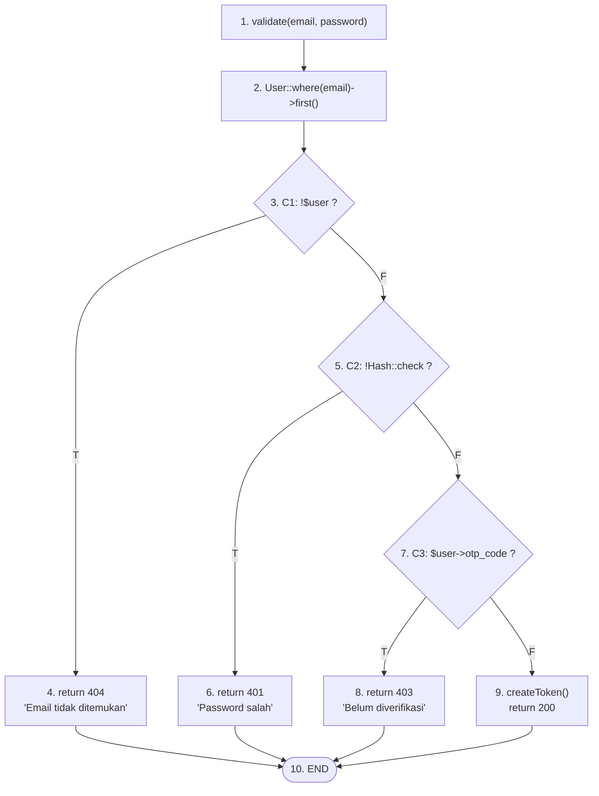
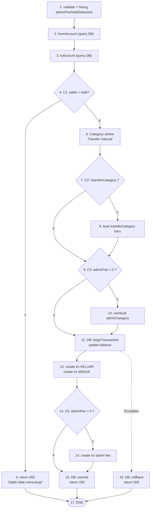
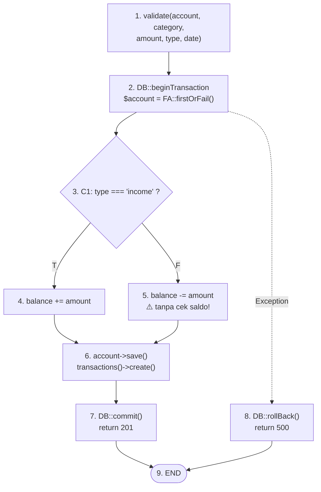
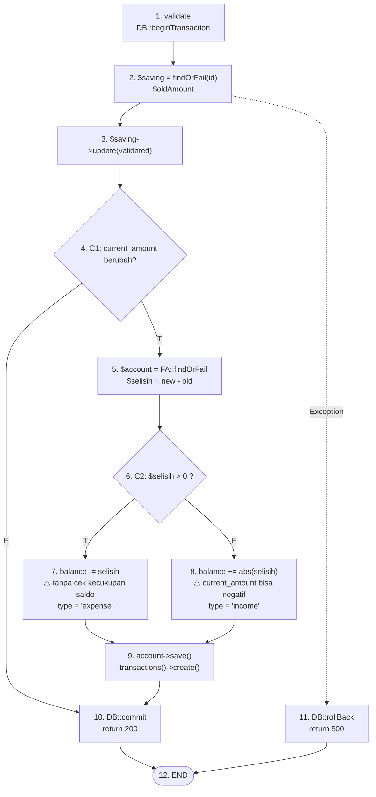

# WB-05 — Basic Path Testing
## Sistem: SaPoPoe FINANCE (Midnight Finance)
## Teknik: White Box Testing — Basic Path Testing

---

> **Definisi Teknik:**
> Teknik pengujian yang berfokus **identifikasi semua jalur eksekusi** yang mungkin dijalankan dalam suatu program, sehingga perlu memahami alur logika aplikasi.
>
> **Cyclomatic Complexity** adalah metrik yang digunakan untuk mengukur kompleksitas suatu program. Semakin tinggi nilai Cyclomatic Complexity, maka jumlah instruksi yang dieksekusi banyak; sebaliknya semakin kecil nilai Cyclomatic, maka semakin sedikit instruksi yang akan dieksekusi.
>
> **Rumus Cyclomatic Complexity (V(G)) adalah: `V(G) = E − N + 2P`**
> dimana **E** : Jumlah edge (penghubung), **N** : Jumlah node (kotak keputusan) dalam flowchart, serta **P** : Jumlah Komponen terhubung.
> Nilai Cyclomatic Complexity yang tinggi menunjukkan potensi banyaknya jalur eksekusi yang perlu diuji.
>
> — Materi Pertemuan 10, Software Quality, T Informatika UKRI

---

## Modul 1 — Autentikasi: `login()` (AuthController.php)

### Kutipan Kode

```php
public function login(Request $request)
{
    $request->validate(['email' => 'required|email', 'password' => 'required']);

    $user = User::where('email', $request->email)->first();

    if (!$user)
        return response()->json(['message' => 'Alamat email tidak ditemukan.'], 404);

    if (!Hash::check($request->password, $user->password))
        return response()->json(['message' => 'Kata sandi yang Anda masukkan salah.'], 401);

    if ($user->otp_code)
        return response()->json(['message' => 'Akun belum diverifikasi.', 'need_otp' => true], 403);

    return response()->json([
        'message'      => 'Akses diberikan. Membuka brankas digital Anda...',
        'access_token' => $user->createToken('auth_token')->plainTextToken,
        'user'         => $user
    ]);
}
```

### Identifikasi Node & Flowchart

**Daftar Node:**

| No | Keterangan Node |
|---|---|
| 1 | `validate(email, password)` — validasi input wajib |
| 2 | `$user = User::where('email')->first()` — query ke database |
| 3 | `if (!$user)` — **C1: email tidak ditemukan?** |
| 4 | `return 404` — "Alamat email tidak ditemukan." |
| 5 | `if (!Hash::check(password, hash))` — **C2: password salah?** |
| 6 | `return 401` — "Kata sandi yang Anda masukkan salah." |
| 7 | `if ($user->otp_code)` — **C3: akun belum verifikasi?** |
| 8 | `return 403` — "Akun belum diverifikasi." |
| 9 | `createToken()` + `return 200` — login sukses |
| 10 | END |



### Perhitungan V(G)

| Komponen | Jumlah | Rincian |
|---|---|---|
| **N** (Node) | **10** | Node 1–10 (lihat daftar) |
| **E** (Edge) | **12** | 1→2, 2→3, 3→4(T), 3→5(F), 4→10, 5→6(T), 5→7(F), 6→10, 7→8(T), 7→9(F), 8→10, 9→10 |
| **P** (Komponen terhubung) | **1** | 1 graph terhubung |

**V(G) = E − N + 2P = 12 − 10 + 2(1) = `4`**

### Jalur Independen (Minimum 4 test case)

- **Jalur 1:** `1 → 2 → 3(T) → 4 → 10` — email tidak ditemukan di database
- **Jalur 2:** `1 → 2 → 3(F) → 5(T) → 6 → 10` — email ada, password salah
- **Jalur 3:** `1 → 2 → 3(F) → 5(F) → 7(T) → 8 → 10` — kredensial benar tapi belum verifikasi OTP
- **Jalur 4:** `1 → 2 → 3(F) → 5(F) → 7(F) → 9 → 10` — semua lolos, login berhasil

### Tabel Pengujian

| Jalur | Kondisi | Hasil Yang Diharapkan | Hasil | Status |
|---|---|---|---|---|
| J-1 | C1=T: email tidak ada di DB | return 404 "Alamat email tidak ditemukan." | return 404 | ✅ Passed |
| J-2 | C1=F, C2=T: password tidak cocok | return 401 "Kata sandi yang Anda masukkan salah." | return 401 | ✅ Passed |
| J-3 | C1=F, C2=F, C3=T: otp_code masih ada | return 403 "Akun belum diverifikasi." | return 403 | ✅ Passed |
| J-4 | C1=F, C2=F, C3=F: semua valid | return 200 + access_token | return 200 + token | ✅ Passed |

---

> ### Analisis SQA — Modul Auth
>
> **Kondisi Sistem Saat Ini:**
> Method `login()` dengan V(G) = 4 termasuk kategori **sederhana** (V(G) ≤ 5). Hanya dibutuhkan 4 test case untuk mencakup seluruh jalur eksekusi. Semua 4 jalur independen berjalan sesuai harapan.
>
> **Dampak:**
> V(G) = 4 artinya kode mudah dipelihara dan diuji. Namun perlu diperhatikan: `if ($user->otp_code)` di node 7 menggunakan keberadaan `otp_code` sebagai penanda verifikasi — jika sebuah akun berhasil login lalu OTP-nya tidak pernah di-null, jalur J-3 bisa dieksekusi secara tidak tepat.
>
> **Cara Baca Diagram dan Tabel:**
> Setiap node bernomor di flowchart berkorelasi langsung dengan daftar node di atas. Jalur (misalnya "1→2→3(F)→5(T)→6→10") dibaca sebagai urutan node yang dilalui beserta kondisi decision (T=True/F=False) di setiap diamond. V(G) = 4 berarti minimal **4 test case unik** diperlukan untuk menjamin setiap baris kode pernah dieksekusi setidaknya sekali.

---

## Modul 2 — Transfer: `store()` (TransferController.php)

### Kutipan Kode

```php
public function store(Request $request)
{
    $validated = $request->validate([...]);

    $adminFee        = $validated['admin_fee'] ?? 0;
    $totalDeduction  = $validated['amount'] + $adminFee;

    $fromAccount = FinancialAccount::where('id', $validated['from_account_id'])
                    ->where('user_id', $user->id)->firstOrFail();
    $toAccount   = FinancialAccount::where('id', $validated['to_account_id'])
                    ->where('user_id', $user->id)->firstOrFail();

    // C1: Cek saldo
    if ($fromAccount->balance < $totalDeduction) {
        return response()->json(['message' => 'Saldo dompet asal tidak mencukupi!'], 400);
    }

    // C2: Cari/buat kategori "Transfer Internal"
    $transferCategory = Category::where('user_id', $user->id)->where('name', 'Transfer Internal')->first();
    if (!$transferCategory) {
        $transferCategory = new Category();
        $transferCategory->name = 'Transfer Internal';
        $transferCategory->save();
    }

    // C3: Jika ada biaya admin — cari/buat kategori "Biaya Admin Bank"
    $adminCategory = null;
    if ($adminFee > 0) {
        $adminCategory = Category::where('user_id', $user->id)->where('name', 'Biaya Admin Bank')->first();
        if (!$adminCategory) {         // C4 (nested)
            $adminCategory = new Category();
            $adminCategory->name = 'Biaya Admin Bank';
            $adminCategory->save();
        }
    }

    DB::beginTransaction();
    try {
        $fromAccount->balance -= $totalDeduction;
        $fromAccount->save();
        $toAccount->balance += $validated['amount'];
        $toAccount->save();

        $user->transactions()->create([.../* trx KELUAR */]);
        $user->transactions()->create([.../* trx MASUK  */]);

        // C5: Catat biaya admin jika ada
        if ($adminFee > 0) {
            $user->transactions()->create([.../* trx ADMIN */]);
        }

        DB::commit();
        return response()->json(['message' => 'Transfer berhasil!'], 200);
    } catch (Exception $e) {
        DB::rollBack();
        return response()->json(['message' => 'Transfer gagal.'], 500);
    }
}
```

### Identifikasi Node & Flowchart

**Daftar Node:**

| No | Keterangan Node |
|---|---|
| 1 | `validate` + hitung `$adminFee`, `$totalDeduction` |
| 2 | `fromAccount = FA::where(from_id, user_id)` |
| 3 | `toAccount = FA::where(to_id, user_id)` |
| 4 | **C1:** `fromAccount.balance < totalDeduction ?` |
| 5 | `return 400` — "Saldo tidak mencukupi" |
| 6 | `$transferCategory = Category::where('Transfer Internal')` |
| 7 | **C2:** `!$transferCategory ?` — kategori belum ada? |
| 8 | Buat baru `$transferCategory->save()` |
| 9 | **C3:** `$adminFee > 0 ?` — ada biaya admin? |
| 10 | Cari/buat `$adminCategory` (nested C4 di dalam C3) |
| 11 | `DB::beginTransaction` → update `balance` (from −, to +) |
| 12 | `create` trx KELUAR + `create` trx MASUK |
| 13 | **C5:** `$adminFee > 0 ?` — catat trx biaya admin? |
| 14 | `create` trx biaya admin |
| 15 | `DB::commit()` + `return 200` |
| 16 | `catch` → `DB::rollBack()` + `return 500` |
| 17 | END |



### Perhitungan V(G)

| Komponen | Jumlah | Rincian |
|---|---|---|
| **N** (Node) | **17** | Node 1–17 (lihat daftar) |
| **E** (Edge) | **21** | 1→2, 2→3, 3→4, 4→5(T), 4→6(F), 5→17, 6→7, 7→8(T), 7→9(F), 8→9, 9→10(T), 9→11(F), 10→11, 11→12, 12→13, 13→14(T), 13→15(F), 14→15, 15→17, 11→16(exception), 16→17 |
| **P** | **1** | 1 graph terhubung |

**V(G) = E − N + 2P = 21 − 17 + 2(1) = `6`**

### Jalur Independen (Minimum 6 test case)

- **J-1:** `1→2→3→4(T)→5→17` — saldo kurang, tolak
- **J-2:** `1→…→4(F)→6→7(F)→9(F)→11→12→13(F)→15→17` — transfer tanpa admin fee (kategori sudah ada)
- **J-3:** `1→…→7(T)→8→9(F)→11→12→13(F)→15→17` — transfer, kategori Transfer Internal baru dibuat
- **J-4:** `1→…→9(T)→10→11→12→13(T)→14→15→17` — transfer dengan biaya admin, kategori sudah ada
- **J-5:** `1→…→9(T)→10(C4=T)→11→12→13(T)→14→15→17` — dengan admin fee, kategori admin baru dibuat
- **J-6:** `1→…→11→16→17` — exception di DB → rollBack

### Tabel Pengujian

| Jalur | Kondisi | Hasil Yang Diharapkan | Hasil | Status |
|---|---|---|---|---|
| J-1 | C1=T: saldo < totalDeduction | return 400 "Saldo tidak mencukupi" | return 400 | ✅ Passed |
| J-2 | C1=F, C3=F: tanpa admin fee | return 200 "Transfer berhasil! Bebas biaya admin." | return 200 | ✅ Passed |
| J-3 | C2=T: kategori "Transfer Internal" belum ada | buat kategori baru → transfer sukses | Kategori dibuat → return 200 | ✅ Passed |
| J-4 | C3=T, C5=T: ada admin fee, kategori ada | return 200 + 3 trx dicatat | return 200 | ✅ Passed |
| J-5 | C4=T: kategori "Biaya Admin" belum ada | buat kategori admin baru → transfer sukses | Kategori dibuat → return 200 | ✅ Passed |
| J-6 | DB exception | DB::rollBack → return 500 | return 500 | ✅ Passed |

---

> ### Analisis SQA — Modul Transfer
>
> **Kondisi Sistem Saat Ini:**
> Method `store()` pada Transfer dengan V(G) = 6 masuk kategori **moderate** (6–10). Ada 6 jalur eksekusi independen — semuanya berjalan benar sesuai harapan.
>
> **Dampak:**
> V(G) = 6 menandakan method ini sudah cukup kompleks. Terdapat nested condition (C4 di dalam C3) yang perlu perhatian ekstra saat refactoring. Kategori "Transfer Internal" dibuat di luar `DB::beginTransaction` (node 7-8), artinya jika terjadi exception setelahnya, kategori tetap tersimpan di DB meski transfernya gagal — ini anomali data potensial.
>
> **Cara Baca Diagram dan Tabel:**
> Flowchart menampilkan setiap percabangan `if` sebagai node berbentuk diamond (decision). Edge bertanda `T` berarti kondisi terpenuhi, `F` berarti tidak. Jalur J-6 ditunjukkan dengan garis putus-putus (exception path) karena bisa terpicu dari mana saja dalam blok `try`. Minimum 6 test case diperlukan untuk memastikan semua jalur pernah dieksekusi.

---

## Modul 3 — Transaksi: `store()` (TransactionController.php)

### Kutipan Kode

```php
public function store(Request $request)
{
    $validated = $request->validate([
        'financial_account_id' => 'required|exists:financial_accounts,id',
        'category_id'          => 'required|exists:categories,id',
        'amount'               => 'required|numeric|min:1',
        'type'                 => 'required|in:income,expense',
        'date'                 => 'required|date',
        'description'          => 'nullable|string'
    ]);

    $user = $request->user();

    DB::beginTransaction();
    try {
        $account = FinancialAccount::where('id', $validated['financial_account_id'])
                    ->where('user_id', $user->id)
                    ->firstOrFail();

        // C1: Sesuaikan saldo
        if ($validated['type'] === 'income') {
            $account->balance += $validated['amount'];
        } else {
            $account->balance -= $validated['amount'];
        }
        $account->save();

        $transaction = $user->transactions()->create($validated);

        DB::commit();
        return response()->json($transaction->load(['category', 'financialAccount']), 201);
    } catch (Exception $e) {
        DB::rollBack();
        return response()->json(['message' => 'Gagal mencatat transaksi: ' . $e->getMessage()], 500);
    }
}
```

### Identifikasi Node & Flowchart

**Daftar Node:**

| No | Keterangan Node |
|---|---|
| 1 | `validate` request (6 field) |
| 2 | `DB::beginTransaction` + `$account = FA::firstOrFail()` |
| 3 | **C1:** `$validated['type'] === 'income' ?` |
| 4 | `$account->balance += amount` (income path) |
| 5 | `$account->balance -= amount` (expense path — **tanpa cek saldo!**) |
| 6 | `$account->save()` + `transactions()->create()` |
| 7 | `DB::commit()` + `return 201` |
| 8 | `catch` → `DB::rollBack()` + `return 500` |
| 9 | END |



### Perhitungan V(G)

| Komponen | Jumlah | Rincian |
|---|---|---|
| **N** (Node) | **9** | Node 1–9 (lihat daftar) |
| **E** (Edge) | **10** | 1→2, 2→3, 3→4(T), 3→5(F), 4→6, 5→6, 6→7, 7→9, 2→8(exception), 8→9 |
| **P** | **1** | 1 graph terhubung |

**V(G) = E − N + 2P = 10 − 9 + 2(1) = `3`**

> *Catatan: V(G) = 3 karena ada 1 decision point + exception path sebagai jalur ke-3.*

### Jalur Independen (Minimum 3 test case)

- **J-1:** `1→2→3(T)→4→6→7→9` — type=income, saldo bertambah
- **J-2:** `1→2→3(F)→5→6→7→9` — type=expense, saldo berkurang (tanpa guard saldo!)
- **J-3:** `1→2→8→9` — exception (misal: account_id tidak ditemukan)

### Tabel Pengujian

| Jalur | Kondisi | Hasil Yang Diharapkan | Hasil | Status |
|---|---|---|---|---|
| J-1 | type=`income`, amount=500.000 | balance += 500.000 → return 201 | balance += 500.000 → return 201 | ✅ Passed |
| J-2 | type=`expense`, amount=999.999.999 (> saldo) | return 422 "Saldo tidak cukup" | balance -= amount **tanpa validasi** → return 201 | 🔴 **Failed** |
| J-3 | account_id tidak ditemukan | return 404 / 500 | return 500 (firstOrFail throw) | ✅ Passed |

---

> ### Analisis SQA — Modul Transaksi
>
> **Kondisi Sistem Saat Ini:**
> Method `store()` dengan V(G) = 3 sangat sederhana — hanya 1 decision point utama (income vs expense). Namun di balik kesederhanaannya, ditemukan **defect kritis pada Jalur J-2**: cabang `expense` langsung mengurangi saldo tanpa memeriksa apakah saldo mencukupi. Saldo akun bisa menjadi negatif.
>
> **Dampak:**
> Kesederhanaan V(G) ≠ bebas bug. `store()` memiliki V(G) hanya 3, namun memiliki defect kritis. Ini membuktikan bahwa Basic Path Testing harus digunakan bersama teknik lain (Formal Inspection, Desk Checking) untuk menemukan bug logika bisnis.
>
> **Cara Baca Diagram dan Tabel:**
> Node 5 diberi tanda `⚠️` pada flowchart karena jalur ini mengeksekusi `balance -= amount` tanpa guard. Status 🔴 **Failed** pada J-2 berarti sistem berperilaku tidak sesuai ekspektasi bisnis: transaksi expense boleh membuat saldo negatif.

---

## Modul 4 — Tabungan: `update()` (SavingController.php)

### Kutipan Kode

```php
public function update(Request $request, $id)
{
    $validated = $request->validate([
        'name'           => 'string|max:255',
        'target_amount'  => 'numeric|min:1',
        'current_amount' => 'numeric|min:0',
        'deadline'       => 'nullable|date'
    ]);

    $user = $request->user();
    DB::beginTransaction();
    try {
        $saving    = $user->savings()->findOrFail($id);
        $oldAmount = $saving->current_amount;
        $saving->update($validated);

        // C1: Apakah current_amount berubah?
        if (isset($validated['current_amount']) && $oldAmount !== $validated['current_amount']) {
            $account = FinancialAccount::findOrFail($saving->financial_account_id);
            $selisih = $validated['current_amount'] - $oldAmount;

            // C2: Selisih positif (top up) atau negatif (tarik)?
            if ($selisih > 0) {
                $account->balance -= $selisih;          // Top up: potong saldo
                $category = $this->getSavingCategory($user->id, 'expense');
                $type = 'expense';
                $desc = 'Top up tabungan: ' . $saving->name;
            } else {
                $account->balance += abs($selisih);     // Tarik: tambah saldo balik
                $category = $this->getSavingCategory($user->id, 'income');
                $type = 'income';
                $desc = 'Tarik dana tabungan: ' . $saving->name;
            }
            $account->save();
            $user->transactions()->create([...]);
        }
        DB::commit();
        return response()->json($saving->load('financialAccount'));
    } catch (Exception $e) {
        DB::rollBack();
        return response()->json(['message' => 'Gagal mengubah tabungan'], 500);
    }
}
```

### Identifikasi Node & Flowchart

**Daftar Node:**

| No | Keterangan Node |
|---|---|
| 1 | `validate` + `DB::beginTransaction` |
| 2 | `$saving = user->savings()->findOrFail(id)` + `$oldAmount` |
| 3 | `$saving->update($validated)` — simpan perubahan metadata |
| 4 | **C1:** `isset(current_amount) && oldAmount !== current_amount ?` |
| 5 | `$account = FA::findOrFail(financial_account_id)` + `$selisih` |
| 6 | **C2:** `$selisih > 0 ?` — top up atau tarik? |
| 7 | `balance -= selisih` (Top up — **tanpa cek saldo!**) |
| 8 | `balance += abs(selisih)` + set type=income (Tarik — **current_amount bisa negatif!**) |
| 9 | `$account->save()` + `transactions()->create()` |
| 10 | `DB::commit()` + `return 200` |
| 11 | `catch` → `DB::rollBack()` + `return 500` |
| 12 | END |



### Perhitungan V(G)

| Komponen | Jumlah | Rincian |
|---|---|---|
| **N** (Node) | **12** | Node 1–12 (lihat daftar) |
| **E** (Edge) | **14** | 1→2, 2→3, 3→4, 4→10(F), 4→5(T), 5→6, 6→7(T), 6→8(F), 7→9, 8→9, 9→10, 10→12, 2→11(exception), 11→12 |
| **P** | **1** | 1 graph terhubung |

**V(G) = E − N + 2P = 14 − 12 + 2(1) = `4`**

### Jalur Independen (Minimum 4 test case)

- **J-1:** `1→2→3→4(F)→10→12` — hanya update metadata (nama/target/deadline)
- **J-2:** `1→2→3→4(T)→5→6(T)→7→9→10→12` — top up tabungan (potong saldo)
- **J-3:** `1→2→3→4(T)→5→6(F)→8→9→10→12` — tarik dana tabungan (tambah saldo)
- **J-4:** `1→2→11→12` — exception (misal: saving_id tidak milik user)

### Tabel Pengujian

| Jalur | Kondisi | Hasil Yang Diharapkan | Hasil | Status |
|---|---|---|---|---|
| J-1 | C1=F: hanya ubah nama tabungan | Update nama saja, balance tidak berubah → 200 | Update metadata → 200 | ✅ Passed |
| J-2 | C1=T, C2=T: top up Rp 150.000 | Saldo BCA berkurang 150k (cek dulu) → 200 | Saldo berkurang **tanpa cek kecukupan** → 200 | 🔴 **Failed** |
| J-3 | C1=T, C2=F: tarik Rp 500.000 dari tabungan yang isinya 0 | return 422 "Dana tabungan tidak cukup" | current_amount menjadi **−500.000** → 200 | 🔴 **Failed** |
| J-4 | saving_id tidak milik user | return 404 / 500 | findOrFail throw → return 500 | ✅ Passed |

---

> ### Analisis SQA — Modul Tabungan
>
> **Kondisi Sistem Saat Ini:**
> Method `update()` dengan V(G) = 4 memiliki 2 decision point utama (C1: apakah amount berubah, C2: apakah selisih positif). Dari 4 jalur independen, **2 jalur berstatus Failed** — keduanya adalah operasi finansial utama (top up dan tarik dana).
>
> **Dampak:**
> Jalur J-2 memungkinkan saldo akun menjadi negatif (top up dari akun yang saldonya kurang). Jalur J-3 memungkinkan `current_amount` tabungan menjadi negatif (tarik lebih dari yang ada). Kedua kondisi ini melanggar invariant dasar aplikasi keuangan. Perbaikan: tambahkan guard di node 7 dan node 8 sebelum operasi saldo.
>
> **Cara Baca Diagram dan Tabel:**
> Node bertanda `⚠️` di flowchart adalah titik kritis yang tidak memiliki validasi pengaman. Jalur J-1 (F pada C1) adalah "happy path" yang paling sering dipakai tanpa masalah. Jalur J-2 dan J-3 hanya aktif saat user mengubah `current_amount` — kondisi yang perlu guard saldo sebelum dieksekusi.

---

## Ringkasan Cyclomatic Complexity Seluruh Sistem

| Modul | Method | N | E | P | V(G) = E−N+2P | Min Test Case | Kategori |
|---|---|---|---|---|---|---|---|
| **Auth** | `login()` | 10 | 12 | 1 | 12−10+2 = **4** | 4 | Sederhana |
| Auth | `verifyOtp()` | 10 | 12 | 1 | 12−10+2 = **4** | 4 | Sederhana |
| Auth | `checkCooldown()` | 11 | 14 | 1 | 14−11+2 = **5** | 5 | Sederhana |
| Auth | `resetPassword()` | 9 | 10 | 1 | 10−9+2 = **3** | 3 | Sederhana |
| **Transfer** | `store()` | 17 | 21 | 1 | 21−17+2 = **6** | 6 | Moderate |
| Transfer | `update()` | 16 | 21 | 1 | 21−16+2 = **7** | 7 | Moderate |
| Transfer | `destroy()` | 12 | 15 | 1 | 15−12+2 = **5** | 5 | Sederhana |
| **Transaksi** | `store()` | 9 | 10 | 1 | 10−9+2 = **3** | 3 | Sederhana |
| Transaksi | `index()` | 14 | 18 | 1 | 18−14+2 = **6** | 6 | Moderate |
| Transaksi | `update()` | 10 | 11 | 1 | 11−10+2 = **3** | 3 | Sederhana |
| Transaksi | `destroy()` | 8 | 8 | 1 | 8−8+2 = **2** | 2 | Sederhana |
| **Tabungan** | `update()` | 12 | 14 | 1 | 14−12+2 = **4** | 4 | Sederhana |
| Tabungan | `getSavingCategory()` | 7 | 7 | 1 | 7−7+2 = **2** | 2 | Sederhana |
| Tabungan | `store()` | 9 | 9 | 1 | 9−9+2 = **2** | 2 | Sederhana |
| Tabungan | `destroy()` | 10 | 10 | 1 | 10−10+2 = **2** | 2 | Sederhana |

**Total Minimum Test Case Seluruh Sistem: 58**

**Kategori V(G):**
- 1–5: **Sederhana** — mudah diuji dan dipelihara
- 6–10: **Moderate** — perlu perhatian ekstra saat refactoring
- 11–20: **Kompleks** — rawan regression bug
- >20: **Sangat Kompleks** — perlu dipecah
