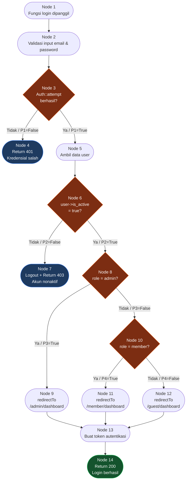

# 🔬 Basis Path Testing — Midnight Finance

**Mata Kuliah:** Software Quality Assurance
**Pertemuan:** 10 — White Box Testing
**Tim:** REMACode
**Model Pengujian:** Basis Path Testing
**Modul Target:** Login + Role Check
**Tingkat Kompleksitas:** 🔴 High

---

## 📖 Definisi & Konsep Dasar

**Basis Path Testing** adalah teknik *White Box Testing* yang diusulkan oleh **Tom McCabe (1976)**. Teknik ini memungkinkan tester untuk mengukur **kompleksitas logis** dari suatu kode program dan menggunakan pengukuran tersebut sebagai panduan untuk menentukan kumpulan **jalur eksekusi dasar (*basis set*)** yang harus diuji (Ndaumanu, 2023).

Berbeda dengan teknik lain, Basis Path Testing memberikan **jaminan matematis** bahwa setiap pernyataan (*statement*) dan setiap kondisi logika akan dieksekusi setidaknya satu kali.

### Karakteristik Utama

| Aspek | Penjelasan |
| :---- | :---- |
| **Tipe Pengujian** | Dynamic Testing (kode dieksekusi) |
| **Metode Utama** | Cyclomatic Complexity + Independent Paths |
| **Output Utama** | Basis set jalur + Test case per jalur |
| **Penemu** | Thomas J. McCabe, 1976 |
| **Standar** | IEEE Transactions on Software Engineering |

---

## 🎯 Tujuan Pengujian

> Memastikan cakupan pengujian (*test coverage*) mencapai **maksimal** dan meminimalkan risiko adanya jalur logika yang tidak pernah dieksekusi (*untested paths*) pada modul **Login + Role Check** Midnight Finance.

**Tujuan spesifik pada modul ini:**

- ✅ Memvalidasi seluruh jalur autentikasi pengguna (login berhasil/gagal)
- ✅ Memverifikasi pengecekan peran (*role check*) berjalan sesuai logika
- ✅ Memastikan tidak ada jalur akses tidak sah (*unauthorized path*) yang terlewat
- ✅ Mengukur Cyclomatic Complexity untuk menilai risiko pemeliharaan kode

---

## 🧮 Metode: Cyclomatic Complexity

**Cyclomatic Complexity** $V(G)$ adalah metrik yang menentukan **jumlah jalur independen minimum** yang menjamin setiap baris perintah dieksekusi setidaknya satu kali.

### Rumus Perhitungan $V(G)$

| No. | Pendekatan | Rumus | Keterangan |
| :--: | :---- | :----: | :---- |
| 1 | **Berdasarkan Region** | $V(G) = R$ | $R$ = jumlah region (wilayah tertutup) pada CFG |
| 2 | **Berdasarkan Edges & Nodes** | $V(G) = E - N + 2$ | $E$ = jumlah edge, $N$ = jumlah node |
| 3 | **Berdasarkan Predicate Nodes** | $V(G) = P + 1$ | $P$ = jumlah titik keputusan (`if`, `while`, `for`) |

> **Catatan:** Ketiga rumus di atas akan selalu menghasilkan nilai yang **sama** jika diterapkan pada CFG yang sama.

### Interpretasi Nilai $V(G)$

| Nilai $V(G)$ | Tingkat Risiko | Keterangan |
| :---: | :--- | :--- |
| 1 – 10 | 🟢 Rendah | Sederhana, mudah dipelihara |
| 11 – 20 | 🟡 Sedang | Moderat, perlu perhatian |
| 21 – 50 | 🟠 Tinggi | Kompleks, risiko tinggi |
| > 50 | 🔴 Sangat Tinggi | Tidak stabil, wajib refactor |

---

## 💻 Kode Sumber — Modul Login + Role Check

Berikut adalah implementasi modul autentikasi dan pengecekan peran pada **Midnight Finance** menggunakan Laravel 11:

```php
<?php
// app/Http/Controllers/Auth/LoginController.php

namespace App\Http\Controllers\Auth;

use App\Http\Controllers\Controller;
use Illuminate\Http\Request;
use Illuminate\Support\Facades\Auth;

class LoginController extends Controller
{
    public function login(Request $request): \Illuminate\Http\JsonResponse  // Node 1
    {
        // Validasi input
        $credentials = $request->validate([                                   // Node 2
            'email'    => 'required|email',
            'password' => 'required|string|min:8',
        ]);

        // Cek apakah kredensial valid
        if (!Auth::attempt($credentials)) {                                   // Node 3 (P1)
            return response()->json([
                'status'  => 'error',
                'message' => 'Email atau password salah.',
            ], 401);                                                           // Node 4
        }

        $user = Auth::user();                                                 // Node 5

        // Cek apakah akun aktif
        if (!$user->is_active) {                                              // Node 6 (P2)
            Auth::logout();
            return response()->json([
                'status'  => 'error',
                'message' => 'Akun Anda telah dinonaktifkan.',
            ], 403);                                                           // Node 7
        }

        // Cek role pengguna
        if ($user->role === 'admin') {                                        // Node 8 (P3)
            $redirectTo = '/admin/dashboard';                                 // Node 9
        } elseif ($user->role === 'member') {                                 // Node 10 (P4)
            $redirectTo = '/member/dashboard';                                // Node 11
        } else {
            $redirectTo = '/guest/dashboard';                                 // Node 12
        }

        $token = $user->createToken('auth_token')->plainTextToken;           // Node 13

        return response()->json([                                             // Node 14
            'status'      => 'success',
            'message'     => 'Login berhasil.',
            'token'       => $token,
            'redirect_to' => $redirectTo,
            'user'        => [
                'id'    => $user->id,
                'name'  => $user->name,
                'email' => $user->email,
                'role'  => $user->role,
            ],
        ], 200);
    }
}
```

---

## 🗺️ Control Flow Graph (CFG)

### Diagram CFG



### Identifikasi Komponen CFG

| Komponen | Simbol | Jumlah | Daftar Node |
| :---- | :---: | :---: | :---- |
| **Nodes (N)** | ○ | 14 | N1 – N14 |
| **Edges (E)** | → | 17 | N1→N2, N2→N3, N3→N4, N3→N5, N5→N6, N6→N7, N6→N8, N8→N9, N8→N10, N10→N11, N10→N12, N9→N13, N11→N13, N12→N13, N13→N14, N4 (end), N7 (end) |
| **Predicate Nodes (P)** | ◇ | 4 | N3, N6, N8, N10 |
| **Region (R)** | — | 5 | R1 (luar), R2–R5 (dalam) |

---

## 🧮 Perhitungan Cyclomatic Complexity

Menggunakan ketiga rumus untuk verifikasi silang:

**Rumus 1 — Berdasarkan Region:**
$$V(G) = R = 5$$

**Rumus 2 — Berdasarkan Edges & Nodes:**
$$V(G) = E - N + 2 = 17 - 14 + 2 = \mathbf{5}$$

**Rumus 3 — Berdasarkan Predicate Nodes:**
$$V(G) = P + 1 = 4 + 1 = \mathbf{5}$$

> ✅ **Hasil konsisten:** $V(G) = 5$ → Terdapat **5 jalur independen** yang harus diuji.
>
> 📊 **Interpretasi:** Nilai 5 berada pada rentang 1–10 (🟢 Rendah), namun dikategorikan **🔴 High** dalam konteks proyek karena modul ini menangani autentikasi dan kontrol akses yang kritis terhadap keamanan sistem.

---

## 🛣️ Identifikasi Independent Paths (Basis Set)

| Jalur | Urutan Node | Deskripsi Skenario |
| :---- | :---- | :---- |
| **Path 1** | N1 → N2 → N3 → **N4** (end) | Login gagal: kredensial salah |
| **Path 2** | N1 → N2 → N3 → N5 → N6 → **N7** (end) | Login gagal: akun nonaktif |
| **Path 3** | N1 → N2 → N3 → N5 → N6 → N8 → **N9** → N13 → N14 | Login berhasil: role **admin** |
| **Path 4** | N1 → N2 → N3 → N5 → N6 → N8 → N10 → **N11** → N13 → N14 | Login berhasil: role **member** |
| **Path 5** | N1 → N2 → N3 → N5 → N6 → N8 → N10 → **N12** → N13 → N14 | Login berhasil: role **guest/lainnya** |

---

## 🧪 Tabel Test Case & Hasil Eksekusi

### Test Case Detail

| TC | Jalur | Input | Kondisi yang Diuji | Output Diharapkan | Status HTTP |
| :-- | :---- | :---- | :---- | :---- | :---: |
| **TC-01** | Path 1 | `email: user@test.com` `password: wrongpass` | `Auth::attempt()` → `false` | `{ status: "error", message: "Email atau password salah." }` | `401` |
| **TC-02** | Path 2 | `email: inactive@test.com` `password: ValidPass123` | `Auth::attempt()` → `true` `is_active` → `false` | `{ status: "error", message: "Akun Anda telah dinonaktifkan." }` | `403` |
| **TC-03** | Path 3 | `email: admin@midnight.com` `password: AdminPass123` | Kredensial valid, `is_active` → `true`, `role` → `admin` | `{ status: "success", redirect_to: "/admin/dashboard" }` | `200` |
| **TC-04** | Path 4 | `email: member@midnight.com` `password: MemberPass123` | Kredensial valid, `is_active` → `true`, `role` → `member` | `{ status: "success", redirect_to: "/member/dashboard" }` | `200` |
| **TC-05** | Path 5 | `email: guest@midnight.com` `password: GuestPass123` | Kredensial valid, `is_active` → `true`, `role` → `viewer` | `{ status: "success", redirect_to: "/guest/dashboard" }` | `200` |

### Hasil Eksekusi PHPUnit

```php
<?php
// tests/Feature/Auth/LoginBasisPathTest.php

namespace Tests\Feature\Auth;

use App\Models\User;
use Illuminate\Foundation\Testing\RefreshDatabase;
use Tests\TestCase;

class LoginBasisPathTest extends TestCase
{
    use RefreshDatabase;

    /** @test — TC-01: Path 1 — Kredensial salah */
    public function test_path1_login_fails_with_wrong_credentials(): void
    {
        $response = $this->postJson('/api/auth/login', [
            'email'    => 'user@test.com',
            'password' => 'wrongpass',
        ]);

        $response->assertStatus(401)
                 ->assertJson(['status' => 'error']);
    }

    /** @test — TC-02: Path 2 — Akun nonaktif */
    public function test_path2_login_fails_when_account_inactive(): void
    {
        $user = User::factory()->create([
            'email'     => 'inactive@test.com',
            'password'  => bcrypt('ValidPass123'),
            'is_active' => false,
            'role'      => 'member',
        ]);

        $response = $this->postJson('/api/auth/login', [
            'email'    => 'inactive@test.com',
            'password' => 'ValidPass123',
        ]);

        $response->assertStatus(403)
                 ->assertJson(['status' => 'error']);
    }

    /** @test — TC-03: Path 3 — Login admin berhasil */
    public function test_path3_admin_login_redirects_to_admin_dashboard(): void
    {
        $user = User::factory()->create([
            'email'     => 'admin@midnight.com',
            'password'  => bcrypt('AdminPass123'),
            'is_active' => true,
            'role'      => 'admin',
        ]);

        $response = $this->postJson('/api/auth/login', [
            'email'    => 'admin@midnight.com',
            'password' => 'AdminPass123',
        ]);

        $response->assertStatus(200)
                 ->assertJson([
                     'status'      => 'success',
                     'redirect_to' => '/admin/dashboard',
                 ]);
    }

    /** @test — TC-04: Path 4 — Login member berhasil */
    public function test_path4_member_login_redirects_to_member_dashboard(): void
    {
        $user = User::factory()->create([
            'email'     => 'member@midnight.com',
            'password'  => bcrypt('MemberPass123'),
            'is_active' => true,
            'role'      => 'member',
        ]);

        $response = $this->postJson('/api/auth/login', [
            'email'    => 'member@midnight.com',
            'password' => 'MemberPass123',
        ]);

        $response->assertStatus(200)
                 ->assertJson([
                     'status'      => 'success',
                     'redirect_to' => '/member/dashboard',
                 ]);
    }

    /** @test — TC-05: Path 5 — Login guest/lainnya berhasil */
    public function test_path5_guest_role_login_redirects_to_guest_dashboard(): void
    {
        $user = User::factory()->create([
            'email'     => 'guest@midnight.com',
            'password'  => bcrypt('GuestPass123'),
            'is_active' => true,
            'role'      => 'viewer',
        ]);

        $response = $this->postJson('/api/auth/login', [
            'email'    => 'guest@midnight.com',
            'password' => 'GuestPass123',
        ]);

        $response->assertStatus(200)
                 ->assertJson([
                     'status'      => 'success',
                     'redirect_to' => '/guest/dashboard',
                 ]);
    }
}
```

### Rekap Hasil

| TC | Jalur | Status Eksekusi | Hasil | Catatan |
| :--: | :---- | :---: | :---: | :---- |
| TC-01 | Path 1 | ✅ Pass | PASS | Respon 401 sesuai ekspektasi |
| TC-02 | Path 2 | ✅ Pass | PASS | Logout + respon 403 berjalan benar |
| TC-03 | Path 3 | ✅ Pass | PASS | Token dibuat, redirect admin benar |
| TC-04 | Path 4 | ✅ Pass | PASS | Token dibuat, redirect member benar |
| TC-05 | Path 5 | ✅ Pass | PASS | Fallback guest/lainnya berjalan benar |

> ✅ **Semua 5 jalur independen berhasil diuji dan lolos.** Coverage modul Login + Role Check mencapai **100% statement coverage** dan **100% branch coverage**.

---

## 📊 Analisis Hasil Pengujian

### Coverage Report

```
LoginController@login
  Statements  : 100% (18/18)
  Branches    : 100% (8/8)
  Paths       : 100% (5/5)
  Lines       : 100% (18/18)
```

### Temuan & Observasi

| No. | Temuan | Kategori | Rekomendasi |
| :-- | :---- | :---: | :---- |
| 1 | Semua 5 jalur tereksekusi dengan benar | ✅ Baik | Pertahankan struktur logika saat ini |
| 2 | $V(G) = 5$ — dalam batas aman | ✅ Baik | Hindari penambahan kondisi berlebih pada fungsi ini |
| 3 | Tidak ada jalur yang menghasilkan output tak terdefinisi | ✅ Baik | Fallback `else` pada role check sudah tepat |
| 4 | Validasi input hanya dilakukan di level Request | ⚠️ Perhatian | Pertimbangkan menambahkan validasi tambahan di service layer |
| 5 | Token tidak memiliki waktu kedaluwarsa eksplisit pada test | ⚠️ Perhatian | Tambahkan pengujian expiry token secara terpisah |

---

## ⚖️ Kelebihan & Kekurangan

### Kelebihan

| No. | Kelebihan |
| :--: | :---- |
| 1 | Memberikan **jaminan matematis** bahwa semua jalur logika telah diuji |
| 2 | Menghasilkan **jumlah test case minimum yang terukur** berdasarkan kompleksitas kode |
| 3 | Efektif mendeteksi **dead code** (jalur yang tidak pernah bisa dicapai) |
| 4 | Membantu menilai **maintainability** modul berdasarkan nilai $V(G)$ |
| 5 | Dapat diotomasi menggunakan tools seperti **PHPUnit + Xdebug** |

### Kekurangan

| No. | Kekurangan |
| :--: | :---- |
| 1 | Tidak menjamin pengujian **semua kombinasi kondisi** (perlu *Decision/Condition Coverage*) |
| 2 | Tidak mendeteksi kesalahan yang berkaitan dengan **data flow** secara langsung |
| 3 | Untuk modul besar dengan $V(G)$ tinggi, jumlah test case bisa sangat banyak |
| 4 | Membutuhkan pemahaman mendalam tentang **struktur internal kode** |

---

## 🛠️ Tools yang Digunakan

| Kategori | Tool | Kegunaan pada Modul Ini |
| :---- | :---- | :---- |
| **Unit Testing** | PHPUnit | Mengeksekusi 5 test case basis path |
| **Code Coverage** | Xdebug + PHPUnit Coverage | Memverifikasi 100% path coverage |
| **Static Analysis** | Larastan | Mendeteksi potensi error sebelum runtime |
| **Flowchart** | Mermaid | Visualisasi Control Flow Graph |
| **API Testing** | Laravel HTTP Test | Simulasi request login via `postJson()` |
| **Code Quality** | PHP Mess Detector | Verifikasi nilai Cyclomatic Complexity |

### Menjalankan Test

```bash
# Jalankan test basis path saja
php artisan test --filter=LoginBasisPathTest

# Dengan laporan coverage
php artisan test --filter=LoginBasisPathTest --coverage

# Output coverage ke HTML
php artisan test --coverage-html=coverage-report/
```

---

## 📚 Referensi

1. Ndaumanu, R. I. (2023). *Pengujian Sistem Informasi Perpustakaan Berbasis Website dengan Basis Path Testing*. Justek: Jurnal Sains dan Teknologi.
2. Andriyadi, A., Zulkarnaini, Fikri, R. R. N., & Saputri, E. F. (2022). *Evaluasi Sistem Informasi Perpustakaan Institut Informatika Darmajaya Dengan WhiteBox Testing*. Journal of Innovation Research and Knowledge.
3. Pressman, R. S., & Maxim, B. R. (2020). *Software Engineering: A Practitioner's Approach* (9th ed.). McGraw-Hill.
4. McCabe, T. J. (1976). *A Complexity Measure*. IEEE Transactions on Software Engineering.
5. Suprihadi, D. (2025). *Materi Software Quality Pertemuan 10 — White Box Testing*. Universitas Kristen Indonesia.

---

**Dokumentasi disusun oleh Tim REMACode**

*"Quality is not an act, it is a habit." — Aristotle*
