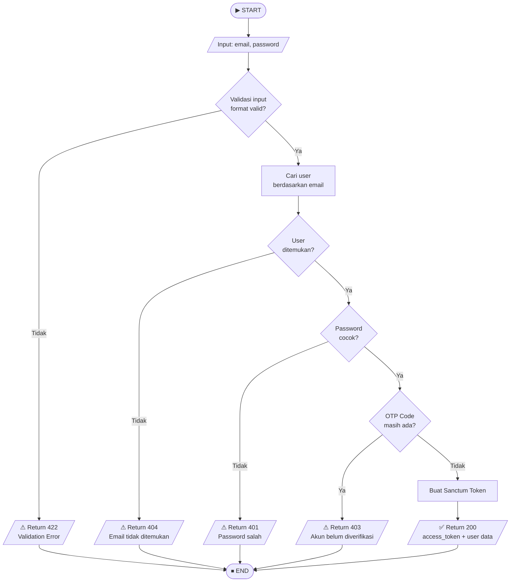
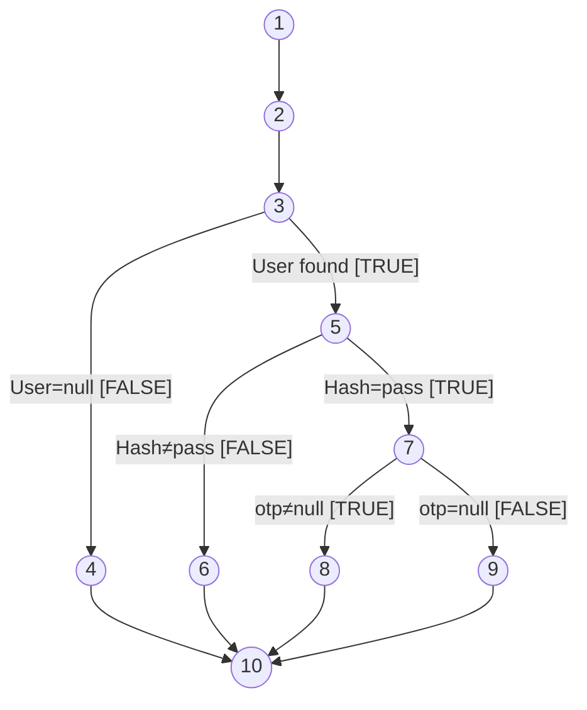
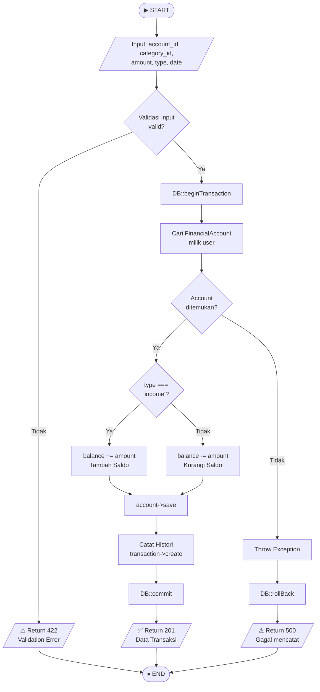
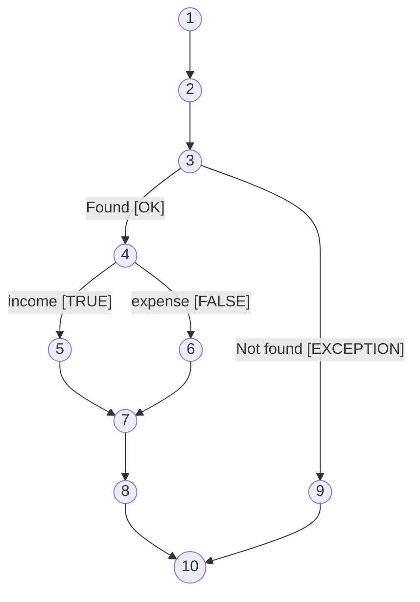

# 🔬 Basis Path Testing — Midnight Finance

**Mata Kuliah:** Software Quality Assurance  
**Model Pengujian:** White Box Testing — Basis Path Testing  
**Tim:** REMACode  
**Aplikasi:** Midnight Finance (Private Wealth Management)  
**Stack:** Laravel 11 (PHP 8.2) + React.js  

---

## 📖 Definisi

**White Box Testing** adalah teknik pengujian perangkat lunak yang menggunakan runtutan logika program yang terkait pada *source code*. White box testing mengikuti analisis internal kerja dan struktur software, yaitu proses pemberian input ke dalam sistem kemudian memeriksanya bagaimana sistem tersebut memproses input kemudian menghasilkan output yang diinginkan (Suprihadi, 2025).

**Basis Path Testing** adalah model *White Box Testing* yang berfokus pada identifikasi semua jalur eksekusi yang mungkin dijalankan dalam suatu program, sehingga perlu memahami alur logika aplikasi. **Cyclomatic Complexity** adalah metrik yang digunakan untuk mengukur kompleksitas suatu program.

> **Rumus:** `V(G) = E − N + 2P`  
> dimana **E** = Jumlah edge (penghubung), **N** = Jumlah node (kotak keputusan), **P** = Jumlah komponen terhubung (default = 1)

---

## 🔐 MODUL 1: Fitur Login (`AuthController@login`)

### 1.1 Source Code yang Diuji

```php
public function login(Request $request)
{
    // Node 1: Validasi input
    $request->validate(['email' => 'required|email', 'password' => 'required']);

    // Node 2: Cari user berdasarkan email
    $user = User::where('email', $request->email)->first();

    // Node 3: Decision — user ditemukan?
    if (!$user)
        return response()->json(['message' => 'Alamat email tidak ditemukan.'], 404);

    // Node 4: Decision — password cocok?
    if (!Hash::check($request->password, $user->password))
        return response()->json(['message' => 'Kata sandi salah.'], 401);

    // Node 5: Decision — akun sudah verifikasi OTP?
    if ($user->otp_code)
        return response()->json(['message' => 'Akun belum diverifikasi.', 'need_otp' => true], 403);

    // Node 6: Buat token & return sukses
    return response()->json([
        'access_token' => $user->createToken('auth_token')->plainTextToken,
        'user' => $user
    ]);
}
```

### 1.2 Flowchart Fitur Login



### 1.3 Flow Graph Fitur Login



| Node | Keterangan |
|:----:|:-----------|
| 1 | START — Terima request + validasi format input |
| 2 | Cari user berdasarkan email di database |
| 3 | Decision: `!$user` — apakah user ditemukan? |
| 4 | Return 404 (email tidak ditemukan) |
| 5 | Decision: `!Hash::check(password)` — password cocok? |
| 6 | Return 401 (password salah) |
| 7 | Decision: `$user->otp_code` — sudah verifikasi? |
| 8 | Return 403 (perlu verifikasi OTP) |
| 9 | Buat Sanctum Token → Return 200 (login sukses) |
| 10 | END |

### 1.4 Perhitungan Cyclomatic Complexity

| Parameter | Nilai | Keterangan |
|:---:|:---:|:---|
| **E** (Edges) | 12 | N1→N2, N2→N3, N3→N4, N3→N5, N4→N10, N5→N6, N5→N7, N6→N10, N7→N8, N7→N9, N8→N10, N9→N10 |
| **N** (Nodes) | 10 | Node 1 s/d Node 10 |
| **P** | 1 | Graf terhubung tunggal |

```
V(G) = E − N + 2P
V(G) = 12 − 10 + 2(1)
V(G) = 4
```

> **Interpretasi:** Nilai CC = 4 → Risiko **Rendah** (< 10). Terdapat **4 jalur independen** yang harus diuji.

### 1.5 Jalur Independen (Independent Path)

| No | Independent Path | Skenario |
|:--:|:---|:---|
| **Path 1** | N1 → N2 → N3 → **N4** → N10 | Email tidak terdaftar di database |
| **Path 2** | N1 → N2 → N3 → N5 → **N6** → N10 | Email benar, password salah |
| **Path 3** | N1 → N2 → N3 → N5 → N7 → **N8** → N10 | Email & password benar, tapi akun belum verifikasi OTP |
| **Path 4** | N1 → N2 → N3 → N5 → N7 → **N9** → N10 | Login berhasil — semua kondisi terpenuhi |

### 1.6 Test Case Basis Path Login

| No | Test Case | Path | Input | Expected Output | Actual Output | Status |
|:--:|:---|:---:|:---|:---|:---|:---:|
| TC-L-01 | Email tidak terdaftar | Path 1 | email: `notexist@mail.com`, password: `Test@1234` | HTTP 404 — "Alamat email tidak ditemukan" | HTTP 404 | ✅ Valid |
| TC-L-02 | Password salah | Path 2 | email: `user@midnight.com`, password: `WrongPass!` | HTTP 401 — "Kata sandi yang Anda masukkan salah" | HTTP 401 | ✅ Valid |
| TC-L-03 | Akun belum verifikasi OTP | Path 3 | email: `unverified@midnight.com`, password: `Test@1234` | HTTP 403 — "Akun belum diverifikasi", `need_otp: true` | HTTP 403 | ✅ Valid |
| TC-L-04 | Login berhasil | Path 4 | email: `user@midnight.com`, password: `Test@1234` | HTTP 200 — `access_token` + data user | HTTP 200 | ✅ Valid |

---

## 💸 MODUL 2: Fitur Catat Transaksi (`TransactionController@store`)

### 2.1 Source Code yang Diuji

```php
public function store(Request $request)
{
    // Node 1: Validasi input wajib
    $validated = $request->validate([
        'financial_account_id' => 'required|exists:financial_accounts,id',
        'category_id'          => 'required|exists:categories,id',
        'amount'               => 'required|numeric|min:1',
        'type'                 => 'required|in:income,expense',
        'date'                 => 'required|date',
    ]);

    // Node 2: Mulai DB Transaction
    DB::beginTransaction();
    try {
        // Node 3: Ambil akun & verifikasi kepemilikan
        $account = FinancialAccount::where('id', $validated['financial_account_id'])
            ->where('user_id', $user->id)->firstOrFail();

        // Node 4: Decision — tipe transaksi?
        if ($validated['type'] === 'income') {
            $account->balance += $validated['amount']; // Node 5: Tambah saldo
        } else {
            $account->balance -= $validated['amount']; // Node 6: Kurangi saldo
        }
        // Node 7: Simpan saldo
        $account->save();

        // Node 8: Catat histori transaksi
        $transaction = $user->transactions()->create($validated);

        // Node 9: Commit & return sukses
        DB::commit();
        return response()->json($transaction->load(['category', 'financialAccount']), 201);

    } catch (Exception $e) {
        // Node 10: Rollback & return error
        DB::rollBack();
        return response()->json(['message' => 'Gagal mencatat transaksi.'], 500);
    }
}
```

### 2.2 Flowchart Fitur Catat Transaksi



### 2.3 Flow Graph Fitur Catat Transaksi



| Node | Keterangan |
|:----:|:-----------|
| 1 | START — Validasi input request |
| 2 | DB::beginTransaction() |
| 3 | Decision: FinancialAccount ditemukan & milik user? |
| 4 | Decision: `type === 'income'`? |
| 5 | `balance += amount` (Tambah saldo — income) |
| 6 | `balance -= amount` (Kurangi saldo — expense) |
| 7 | `account->save()` + `transaction->create()` |
| 8 | DB::commit() → Return 201 Sukses |
| 9 | DB::rollBack() → Return 500 Error |
| 10 | END |

### 2.4 Perhitungan Cyclomatic Complexity

| Parameter | Nilai | Keterangan |
|:---:|:---:|:---|
| **E** (Edges) | 11 | N1→N2, N2→N3, N3→N9, N3→N4, N4→N5, N4→N6, N5→N7, N6→N7, N7→N8, N8→N10, N9→N10 |
| **N** (Nodes) | 10 | Node 1 s/d Node 10 |
| **P** | 1 | Graf terhubung tunggal |

```
V(G) = E − N + 2P
V(G) = 11 − 10 + 2(1)
V(G) = 3
```

> **Interpretasi:** Nilai CC = 3 → Risiko **Sangat Rendah**. Terdapat **3 jalur independen** yang harus diuji.

### 2.5 Jalur Independen (Independent Path)

| No | Independent Path | Skenario |
|:--:|:---|:---|
| **Path 1** | N1 → N2 → N3 → N4 → **N5** → N7 → N8 → N10 | Transaksi income berhasil dicatat, saldo bertambah |
| **Path 2** | N1 → N2 → N3 → N4 → **N6** → N7 → N8 → N10 | Transaksi expense berhasil dicatat, saldo berkurang |
| **Path 3** | N1 → N2 → N3 → **N9** → N10 | Akun tidak ditemukan / bukan milik user → gagal |

### 2.6 Test Case Basis Path Transaksi

| No | Test Case | Path | Input | Expected Output | Actual Output | Status |
|:--:|:---|:---:|:---|:---|:---|:---:|
| TC-T-01 | Catat transaksi income | Path 1 | type: `income`, amount: `500000`, account valid | HTTP 201 — data transaksi, saldo +500.000 | HTTP 201 | ✅ Valid |
| TC-T-02 | Catat transaksi expense | Path 2 | type: `expense`, amount: `150000`, account valid | HTTP 201 — data transaksi, saldo -150.000 | HTTP 201 | ✅ Valid |
| TC-T-03 | Akun tidak valid / bukan milik user | Path 3 | `financial_account_id`: ID milik user lain | HTTP 500 — "Gagal mencatat transaksi" | HTTP 500 | ✅ Valid |

---

## 📊 Ringkasan Hasil Pengujian

| Modul | E | N | V(G) | Jalur Independen | Risk Level |
|:---|:---:|:---:|:---:|:---:|:---:|
| Login (`AuthController@login`) | 12 | 10 | **4** | 4 jalur | 🟢 Rendah |
| Catat Transaksi (`TransactionController@store`) | 11 | 10 | **3** | 3 jalur | 🟢 Sangat Rendah |
| **Total** | 23 | 20 | **7** | **7 jalur** | 🟢 **Rendah** |

> **Kesimpulan:** Seluruh test case dinyatakan **valid**. Nilai Cyclomatic Complexity yang rendah menunjukkan bahwa risiko error dari aplikasi Midnight Finance terbilang **cukup rendah** dan kode dapat dipelihara dengan baik.

---

## 📚 Referensi

- Suprihadi, D. (2025). *Software Quality — White Box Testing*. T Informatika UKRI.
- Ndaumanu, R. I. (2023). Pengujian Sistem Informasi Perpustakaan Berbasis Website dengan Basis Path Testing. *Justek*, 6(1), 123.
- Zen, H. R. R., & Nuryasin, I. (2024). Penerapan Whitebox Testing pada Pengujian Sistem Menggunakan Teknik Basis Path. *JOISIE*, 8(1), 101–111.
- McCabe, T. J. (1976). A Complexity Measure. *IEEE Transactions on Software Engineering*, SE-2(4), 308–320.
