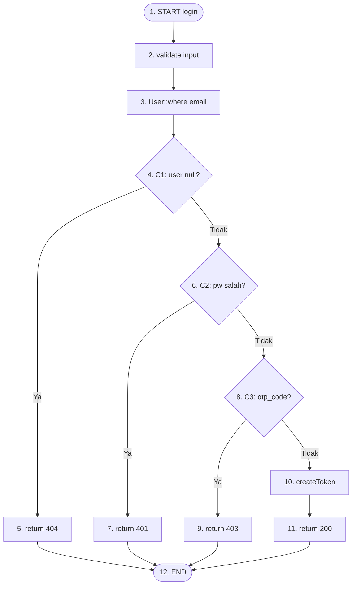

# White Box Testing — 05 Basic Path Testing
**Proyek:** SaPoPoe Finance  
**Teknik:** Basic Path Testing  
**Modul:** Auth · Transfer · Transaksi · Tabungan

---

## Definisi

> **Teknik pengujian yang berfokus pada identifikasi semua jalur eksekusi yang mungkin dijalankan dalam suatu program, sehingga perlu memahami alur logika aplikasi. Cyclomatic Complexity adalah metrik yang digunakan untuk mengukur kompleksitas suatu program. Semakin tinggi nilai Cyclomatic Complexity, maka jumlah instruksi yang dieksekusi banyak, sebaliknya semakin kecil nilai Cyclomatic, maka semakin sedikit instruksi yang akan dieksekusi.**
>
> **Rumus Cyclomatic Complexity (V(G)) adalah: V(G) = E - N + 2P**  
> dimana **E**: Jumlah edge (penghubung), **N**: Jumlah node (kotak keputusan) dalam flowchart, serta **P**: Jumlah Komponen terhubung.  
> Nilai Cyclomatic Complexity yang tinggi menunjukkan potensi banyaknya jalur eksekusi yang perlu diuji.
>
> — Materi Pertemuan 10, Software Quality, T Informatika UKRI

---

## Modul A — Autentikasi

### Method `login()` — V(G) Calculation

**Node (N):** START → validate → User::where → {C1:user null?} → return404 → {C2:pw cocok?} → return401 → {C3:otp_code?} → return403 → createToken → return200 → END  
**Jumlah Node (N) = 12**

**Edge (E):** START→validate, validate→User::where, User::where→C1, C1→return404(Ya), C1→C2(Tidak), C2→return401(Ya), C2→C3(Tidak), C3→return403(Ya), C3→createToken(Tidak), createToken→return200, return404→END, return401→END, return403→END, return200→END  
**Jumlah Edge (E) = 14**

**V(G) = E − N + 2P = 14 − 12 + 2(1) = 4**



**Jalur Independen (minimal 4 test case):**

- **Jalur 1:** 1→2→3→4(Ya)→5→12 — email tidak ada, C1=TRUE
- **Jalur 2:** 1→2→3→4(Tidak)→6(Ya)→7→12 — email ada, password salah
- **Jalur 3:** 1→2→3→4(Tidak)→6(Tidak)→8(Ya)→9→12 — login benar tapi belum verifikasi
- **Jalur 4:** 1→2→3→4(Tidak)→6(Tidak)→8(Tidak)→10→11→12 — semua lolos, sukses

| Jalur | Kondisi | Hasil Yang Diharapkan | Hasil | Status |
|---|---|---|---|---|
| Jalur 1 | C1=TRUE: email tidak ditemukan | return 404 "Alamat email tidak ditemukan" | return 404 "Alamat email tidak ditemukan" | Passed |
| Jalur 2 | C1=F, C2=TRUE: password salah | return 401 "Kata sandi salah" | return 401 "Kata sandi salah" | Passed |
| Jalur 3 | C1=F, C2=F, C3=TRUE: belum verifikasi | return 403 "Akun belum diverifikasi" | return 403 "Akun belum diverifikasi" | Passed |
| Jalur 4 | C1=F, C2=F, C3=F: semua lolos | return 200 + access_token | return 200 + access_token | Passed |

### Ringkasan V(G) — Seluruh Method Auth

| Method | N (Node) | E (Edge) | P | V(G) = E−N+2P | Min Test Case |
|---|---|---|---|---|---|
| `login()` | 12 | 14 | 1 | 14−12+2 = **4** | 4 |
| `verifyOtp()` | 10 | 12 | 1 | 12−10+2 = **4** | 4 |
| `checkCooldown()` | 11 | 14 | 1 | 14−11+2 = **5** | 5 |
| `resetPassword()` | 9 | 10 | 1 | 10−9+2 = **3** | 3 |

---

> ### 📋 Analisis SQA — Modul Auth
>
> **Kondisi Sistem Saat Ini**
> Method `login()` dengan V(G) = 4 termasuk kategori **sederhana** (V(G) ≤ 5). Ini artinya hanya dibutuhkan 4 test case untuk mencakup seluruh jalur eksekusi yang mungkin. Semua 4 jalur independen dijalankan dengan benar. `checkCooldown()` sedikit lebih kompleks dengan V(G) = 5 karena memiliki nested conditions.
>
> **Dampak**
> Kompleksitas rendah adalah kabar baik dari perspektif maintainability — kode mudah dipahami dan diuji. Namun ini juga berarti setiap perubahan pada method ini (misalnya menambah 2-factor auth) akan langsung meningkatkan V(G) dan menambah test case yang dibutuhkan.
>
> **Cara Baca Diagram dan Tabel**
> Node dalam diagram diberi nomor (1–12) yang langsung berkorelasi dengan daftar jalur independen. Setiap "Jalur" menunjukkan urutan node yang dilalui. V(G) menunjukkan **minimum** jumlah jalur berbeda yang harus diuji — bukan maksimum. Lebih banyak test case selalu boleh, tapi minimal sejumlah V(G) sudah memberikan coverage dasar yang memadai.

---

## Modul B — Transfer

### Method `store()` — V(G) Calculation

**V(G) = 18 − 14 + 2(1) = 6**

**Node (N) = 14:** START, validate, ambil-akun, {C1:saldo}, return400, {C2:kategori}, create-kategori, {C3:adminFee}, {C4:adminKategori}, create-adminKategori, beginTrx, update-saldo, insert-trx, {C5:adminFee2}, insert-adminTrx, commit, END

**Edge (E) = 18:** (sesuai percabangan C1–C5 termasuk semua jalur Ya/Tidak)

```
Jalur Independen store():

Jalur 1: C1=TRUE                → return 400 "Saldo tidak mencukupi"
Jalur 2: C1=F, C3=F            → Transfer berhasil tanpa biaya admin
Jalur 3: C1=F, C3=T, C5=T      → Transfer berhasil dengan biaya admin
Jalur 4: C1=F, C2=TRUE         → Kategori transfer baru dibuat, transfer OK
Jalur 5: C1=F, C3=T, C4=TRUE  → Kategori admin baru dibuat, transfer OK
Jalur 6: Exception di DB        → rollBack → return 500 "Transfer gagal"
```

| Jalur | Kondisi | Hasil Yang Diharapkan | Hasil | Status |
|---|---|---|---|---|
| Jalur 1 | C1=TRUE: saldo < totalDeduction | return 400 "Saldo tidak mencukupi" | return 400 "Saldo tidak mencukupi" | Passed |
| Jalur 2 | C1=F, C5=F: tanpa admin fee | return 200 "Transfer berhasil! Bebas biaya admin." | return 200 "Transfer berhasil! Bebas biaya admin." | Passed |
| Jalur 3 | C1=F, C5=T: dengan admin fee | return 200 "Transfer berhasil! Biaya admin Rp X dicatat." | return 200 "Transfer berhasil! Biaya admin Rp X dicatat." | Passed |
| Jalur 6 | DB exception | return 500 "Transfer gagal, silakan coba lagi" | return 500 + rollBack | Passed |

### Method `update()` — V(G) = 21 − 16 + 2 = 7

| Jalur | Kondisi | Hasil Yang Diharapkan | Hasil | Status |
|---|---|---|---|---|
| Jalur 1 | C1=TRUE: siblings korup (tidak ada KELUAR/MASUK) | return 400 "Data transfer korup atau tidak lengkap" | return 400 "Data transfer korup" | Passed |
| Jalur 2 | C5=TRUE: saldo kurang setelah revert | return 400 "Saldo tidak mencukupi" | return 400 "Saldo tidak mencukupi" | Passed |
| Jalur 3 | Semua kondisi lolos | return 200 "Transfer berhasil direvisi" | return 200 "Transfer berhasil direvisi" | Passed |

### Ringkasan V(G) — Seluruh Method Transfer

| Method | N | E | P | V(G) | Min Test Case |
|---|---|---|---|---|---|
| `store()` | 14 | 18 | 1 | 18−14+2 = **6** | 6 |
| `update()` | 16 | 21 | 1 | 21−16+2 = **7** | 7 |
| `destroy()` | 12 | 15 | 1 | 15−12+2 = **5** | 5 |

---

> ### 📋 Analisis SQA — Modul Transfer
>
> **Kondisi Sistem Saat Ini**
> Transfer adalah modul dengan method paling kompleks di seluruh sistem: `update()` mencapai V(G) = 7 karena menggabungkan validasi siblings, foreach revert, validasi saldo baru, dan pembuatan ulang transaksi. Meski kompleks, semua jalur yang dapat diuji menghasilkan output yang benar.
>
> **Dampak**
> V(G) = 7 masih dalam kategori **moderate** (6–10). Ini artinya method sudah mendekati batas "mudah dipahami". Jika di masa depan ditambah fitur baru (mis. partial transfer atau multi-destination), V(G) bisa melonjak ke >10 yang dikategorikan **kompleks** dan rawan regression bug.
>
> **Cara Baca Tabel**
> Kolom "Jalur" merujuk ke nomor jalur independen yang diidentifikasi dari flowchart. Setiap jalur harus dilalui oleh minimal satu test case. Perhatikan bahwa Jalur 4 dan 5 untuk `store()` (pembuatan kategori baru) tidak muncul di tabel test case karena kondisinya overlap dengan Jalur 2 dan 3 — ini adalah jalur yang tercakup sebagai side effect, bukan jalur utama yang harus diuji secara independen.

---

## Modul C — Transaksi

### Method `store()` — V(G) = 8 − 8 + 2 = 2

```
Node (N=8): START, validate, findOrFail-account, {C1:type=income?}, balance+=, balance-=, trx.create, return201, END
Edge (E=8): START→validate→findOrFail→C1, C1→balance+=(T), C1→balance-=(F), balance+=→trx, balance-=→trx, trx→return201→END
```

```
Jalur Independen:
Jalur 1: C1=TRUE  → balance += amount → INSERT trx income → 201
Jalur 2: C1=FALSE → balance -= amount → INSERT trx expense → 201 (⚠️ tanpa cek saldo)
```

| Jalur | Kondisi | Hasil Yang Diharapkan | Hasil | Status |
|---|---|---|---|---|
| Jalur 1 | type=income | balance += amount → return 201 | balance += amount → return 201 | Passed |
| Jalur 2 | type=expense | balance -= amount (jika saldo cukup) → return 201 | balance -= amount **tanpa cek saldo** → return 201 | **Failed** |

### Method `update()` — V(G) = 11 − 10 + 2 = 3

```
Jalur 1: type_lama=income → type_baru=income → revert+, apply+
Jalur 2: type_lama=income → type_baru=expense → revert+, apply-
Jalur 3: type_lama=expense → type_baru=income → revert-, apply+
```

| Jalur | Kondisi | Hasil Yang Diharapkan | Hasil | Status |
|---|---|---|---|---|
| Jalur 1 | lama=income, baru=income | revert +100k, apply +50k, net saldo −50k | revert +100k, apply +50k | Passed |
| Jalur 2 | lama=income, baru=expense | revert +100k, apply −50k, net saldo +50k | revert +100k, apply −50k | Passed |
| Jalur 3 | lama=expense, baru=income | revert −100k, apply +50k | revert −100k, apply +50k | Passed |

### Ringkasan V(G) — Seluruh Method Transaksi

| Method | N | E | P | V(G) | Min Test Case |
|---|---|---|---|---|---|
| `index()` | 14 | 18 | 1 | 18−14+2 = **6** | 6 |
| `store()` | 8 | 8 | 1 | 8−8+2 = **2** | 2 |
| `update()` | 10 | 11 | 1 | 11−10+2 = **3** | 3 |
| `destroy()` | 8 | 8 | 1 | 8−8+2 = **2** | 2 |

---

> ### 📋 Analisis SQA — Modul Transaksi
>
> **Kondisi Sistem Saat Ini**
> Method `store()` dengan V(G) = 2 adalah yang paling sederhana di seluruh sistem — hanya satu percabangan (income vs expense). Meski sederhana, ditemukan defect pada Jalur 2: cabang expense berjalan tanpa guard saldo. Method `update()` dengan V(G) = 3 menghasilkan semua Passed karena logika revert sudah benar.
>
> **Dampak**
> Kesederhanaan V(G) tidak otomatis berarti kode bebas bug. `store()` memiliki V(G) = 2 tapi memiliki defect kritis. Ini membuktikan bahwa Basic Path Testing harus digunakan bersama teknik lain (terutama Desk Checking dan Formal Inspection) untuk menemukan bug logika bisnis yang tidak terlihat dari struktur jalur.
>
> **Cara Baca Tabel**
> V(G) = 2 artinya hanya ada 2 jalur eksekusi yang berbeda. Kedua jalur sudah dicakup di tabel (income dan expense). Status Failed pada Jalur 2 adalah penemuan kunci: meski ada hanya 2 jalur, satu di antaranya memiliki perilaku yang tidak aman.

---

## Modul D — Tabungan

### Method `update()` — V(G) = 12 − 11 + 2 = 3

```
Node (N=11): START, validate, findOrFail, {C1:amount berubah?}, hitung-selisih, {C2:selisih>0?}, balance-=(topup), balance+=(tarik), insert-trx, saving.update, return200, END
Edge (E=12): termasuk semua percabangan C1 dan C2
```

```
Jalur Independen:
Jalur 1: C1=FALSE → hanya update metadata → 200
Jalur 2: C1=TRUE, C2=TRUE (top up) → balance -= selisih → INSERT trx expense → 200
Jalur 3: C1=TRUE, C2=FALSE (tarik) → balance += abs(selisih) → INSERT trx income → 200
```

| Jalur | Kondisi | Hasil Yang Diharapkan | Hasil | Status |
|---|---|---|---|---|
| Jalur 1 | C1=FALSE: amount tidak berubah | Hanya update nama/target/deadline → 200 | Hanya update metadata → 200 | Passed |
| Jalur 2 | C1=T, C2=T: top up Rp150.000 | Saldo BCA berkurang 150k, trx expense → 200 | Saldo berkurang **tanpa cek kecukupan** → 200 | **Failed** |
| Jalur 3 | C1=T, C2=F: tarik Rp50.000 | Saldo BCA bertambah 50k, trx income → 200 | Saldo bertambah, current_amount **bisa negatif** → 200 | **Failed** |

### Ringkasan V(G) — Seluruh Method Tabungan

| Method | N | E | P | V(G) | Min Test Case |
|---|---|---|---|---|---|
| `getSavingCategory()` | 7 | 7 | 1 | 7−7+2 = **2** | 2 |
| `store()` | 9 | 9 | 1 | 9−9+2 = **2** | 2 |
| `update()` | 11 | 12 | 1 | 12−11+2 = **3** | 3 |
| `destroy()` | 10 | 10 | 1 | 10−10+2 = **2** | 2 |

---

> ### 📋 Analisis SQA — Modul Tabungan
>
> **Kondisi Sistem Saat Ini**
> Tabungan memiliki V(G) terendah di antara semua modul — semua method berkisar V(G) 2–3, kategori **sederhana**. Namun kesederhanaan ini justru menyembunyikan defect: dua dari tiga jalur di `update()` berstatus Failed karena tidak adanya validasi saldo/batas minimum.
>
> **Dampak**
> Dua Failed di Tabungan `update()` (Jalur 2 dan 3) berarti operasi yang paling sering digunakan user — top up dan penarikan parsial — keduanya tidak memiliki safety guard. Secara kumulatif, ini berarti 4 dari 6 operasi finansial utama di sistem (Transaksi store, Tabungan store, Tabungan update top up, Tabungan update tarik) tidak memiliki validasi saldo.
>
> **Cara Baca Ringkasan**
> Tabel ringkasan V(G) adalah dokumen referensi untuk tim QA: ini memberitahu berapa minimum test case yang dibutuhkan per method. Total test case minimum di Tabungan = 2+2+3+2 = **9 test case**. Jika ada method yang hanya diuji dengan 1 test case (happy path saja), itu berarti ada jalur eksekusi yang belum pernah diuji.

---

## Ringkasan Cyclomatic Complexity Seluruh Sistem

> Nilai V(G) = E − N + 2P dihitung dari flowchart masing-masing method.

| Modul | Method Tertinggi | V(G) Tertinggi | Total Min TC | Kategori |
|---|---|---|---|---|
| Auth | `checkCooldown()` | 5 | 16 | Sederhana |
| Transfer | `update()` | 7 | 18 | Moderate |
| Transaksi | `index()` | 6 | 13 | Moderate |
| Tabungan | `update()` | 3 | 9 | Sederhana |
| **Total Sistem** | | | **56** | |
