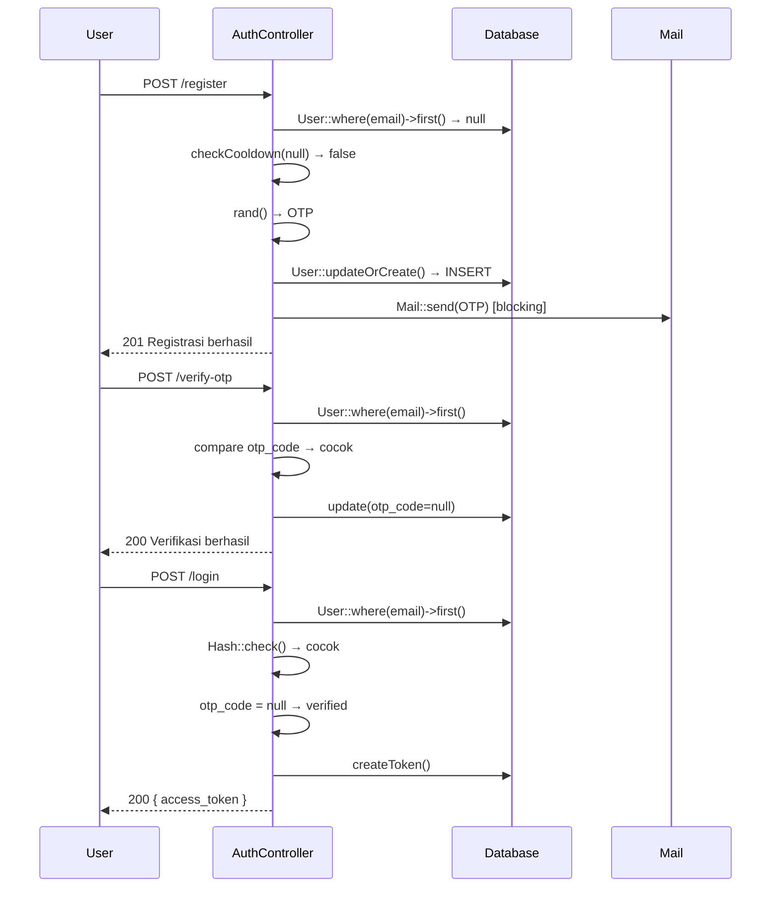
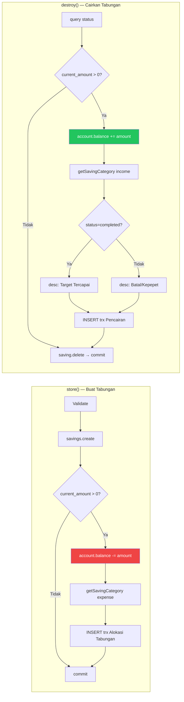

# White Box Testing — 02 Code Walkthrough
**Proyek:** SaPoPoe Finance  
**Teknik:** Code Walkthrough  
**Modul:** Auth · Transfer · Transaksi · Tabungan  
**Screenshot:** ❌ Tidak ada (analisis statis)

---

## Definisi

> **Teknik review kode secara formal atau informal yang dilakukan bersama-sama antara developer dan tim terkait untuk memahami logika kode, kemudian mengidentifikasi potensi error, dan meningkatkan kualitas keseluruhan program.**
>
> — Materi Pertemuan 10, Software Quality, T Informatika UKRI

---

## Modul A — Autentikasi: Walkthrough `register()` → `verifyOtp()` → `login()`

**Skenario:** User baru mendaftar, verifikasi OTP, lalu login.

```
[STEP 1] POST /api/register
  Input: { name:"Dzaki", email:"dzaki@mail.com", password:"Midnight@2026", password_confirmation:"Midnight@2026" }

  → validate() → OK
  → User::where(email)->first() → null (belum ada)
  → checkCooldown(null) → return false (tidak ada cooldown)
  → $otp = rand(100000, 999999) → misal: 847291
  → User::updateOrCreate(
      ['email' => 'dzaki@mail.com'],
      ['name','password'=>Hash::make(...),'otp_code'=>'847291','otp_expires_at'=>+10min]
    ) → INSERT baris baru
  → Mail::send(..., ['otp'=>847291]) → email terkirim (sinkron, blocking)
  → return 201 "Registrasi berhasil"

  STATE DB: users: { email, otp_code:'847291', otp_expires_at: +10min, status:'inactive' }

[STEP 2] POST /api/verify-otp
  Input: { email:"dzaki@mail.com", otp_code:"847291" }

  → validate() → OK
  → User::where(email)->first() → ada ✅
  → $user->otp_code !== "847291" → FALSE (cocok) → lanjut
  → now()->greaterThan(otp_expires_at) → FALSE (belum expired) → lanjut
  → $user->update([otp_code:null, otp_expires_at:null, email_verified_at:now()])
  → return 200 "Verifikasi berhasil"

  STATE DB: users: { otp_code:NULL, email_verified_at: timestamp, status:'inactive' }

[STEP 3] POST /api/login
  Input: { email:"dzaki@mail.com", password:"Midnight@2026" }

  → validate() → OK
  → User::where(email)->first() → ada ✅
  → !$user → FALSE → lanjut
  → !Hash::check("Midnight@2026", $user->password) → FALSE (cocok) → lanjut
  → $user->otp_code → NULL → FALSE (sudah verifikasi) → lanjut
  → $user->createToken('auth_token')->plainTextToken → "3|abc123..."
  → return 200 { access_token, user }

  STATE AKHIR: User dapat access_token, bisa akses endpoint auth:sanctum
```

### Diagram Alur Auth



---

## Modul B — Transfer: Walkthrough `store()` dengan Admin Fee

**Skenario:** Transfer Rp 200.000 dari BCA ke Mandiri, admin fee Rp 5.000. Saldo BCA = Rp 600.000.

```
[store() Execution]

  → $adminFee = 5000
  → $totalDeduction = 200000 + 5000 = 205000

  → fromAccount = BCA { balance:600000 }    ← user_id checked ✅
  → toAccount   = Mandiri { balance:100000 } ← user_id checked ✅

  → 600000 < 205000? → FALSE → lanjut

  → transferCategory = Category::where('Transfer Internal')->first()
    → misal belum ada → CREATE baru (di luar transaksi DB! ⚠️)

  → adminFee > 0 → TRUE
    → adminCategory = Category::where('Biaya Admin Bank')->first()
    → belum ada → CREATE baru (di luar transaksi DB! ⚠️)

  → DB::beginTransaction()
    → BCA.balance = 600000 − 205000 = 395000 → save()
    → Mandiri.balance = 100000 + 200000 = 300000 → save()
    → INSERT trx { type:transfer, desc:'Transfer Keluar ke Mandiri', amount:200000, account:BCA }
    → INSERT trx { type:transfer, desc:'Transfer Masuk dari BCA', amount:200000, account:Mandiri }
    → adminFee > 0 → INSERT trx { type:expense, desc:'Biaya admin...', amount:5000, account:BCA }
  → DB::commit()

  → return 200 "Transfer berhasil! Biaya admin Rp 5.000 dicatat."

  STATE AKHIR:
    BCA:     600.000 → 395.000
    Mandiri: 100.000 → 300.000
    Transaksi baru: 3 record
```

---

## Modul C — Transaksi: Walkthrough `update()` Ganti Tipe

**Skenario:** Transaksi income Rp 100.000 di akun BCA diubah menjadi expense Rp 50.000 di akun Mandiri.

```
[update() Execution]

  STATE AWAL:
    BCA: +100000 (dari income sebelumnya) → BCA.balance sudah bertambah 100000
    Transaksi lama: { type:income, amount:100000, account:BCA }

  → validate() → OK
  → Transaction::where(id)->where(user_id)->firstOrFail() → transaksi lama ✅

  → DB::beginTransaction()

  FASE 1 — REVERT:
    → $oldAccount = FinancialAccount::findOrFail(BCA.id)  ← TANPA user_id check ⚠️
    → type lama = 'income' → oldAccount.balance -= 100000
    → BCA.balance berkurang 100000 kembali ke kondisi sebelum income
    → oldAccount.save()

  FASE 2 — APPLY:
    → $newAccount = FinancialAccount::findOrFail(Mandiri.id) ← TANPA user_id check ⚠️
    → type baru = 'expense' → newAccount.balance -= 50000
    → Mandiri.balance berkurang 50000
    → newAccount.save()

  FASE 3 — UPDATE HISTORI:
    → $transaction->update({ type:'expense', amount:50000, account:Mandiri })

  → DB::commit()
  → return 200 { transaksi baru }
```

---

## Modul D — Tabungan: Walkthrough `destroy()` dengan Status `completed`

**Skenario:** User menyelesaikan tabungan "Liburan" senilai Rp 500.000 (status=completed).

```
[destroy() Execution]

  Input: DELETE /api/savings/{id}?status=completed

  → $status = $request->query('status', 'canceled') → 'completed'

  → DB::beginTransaction()

  → $saving = user->savings()->findOrFail(id)
    → { name:'Liburan', current_amount:500000, financial_account_id:BCA.id }

  → current_amount > 0 → TRUE
    → $account = FinancialAccount::findOrFail(BCA.id) ← TANPA user_id ⚠️
    → account.balance += 500000  ← saldo dikembalikan
    → account.save()

    → $category = getSavingCategory(user_id, 'income')
      → Category::where('Pencairan Tabungan')->first()
      → (di dalam blok try yang sudah beginTransaction → aman ✅)

    → $desc = status === 'completed'
            ? 'Target Tercapai & Cair: Liburan'
            : 'Batal/Kepepet Cair: Liburan'
    → 'Target Tercapai & Cair: Liburan'

    → INSERT trx { type:income, amount:500000, desc:'Target Tercapai & Cair: Liburan' }

  → $saving->delete()
  → DB::commit()
  → return 200 "Target diselesaikan/dihapus"

  STATE AKHIR:
    BCA: balance += 500000
    Saving 'Liburan': terhapus
    Transaksi baru: 1 income record
```

### Diagram Alur Tabungan — store() vs destroy()



---

## Pola Berulang yang Ditemukan Lintas Modul

| Pola | Auth | Transfer | Transaksi | Tabungan |
|---|---|---|---|---|
| DB::beginTransaction | ✅ setup() | ✅ store/update/destroy | ✅ store/update/destroy | ✅ store/update/destroy |
| findOrFail tanpa user_id | — | ⚠️ loop | ⚠️ update/destroy | ⚠️ store/update/destroy |
| Cek saldo sebelum deduct | — | ✅ store/update | ❌ tidak ada | ❌ tidak ada |
| Rollback di catch | ✅ | ✅ | ✅ | ✅ |
| Pagination di index() | — | — | ❌ tidak ada | — |
