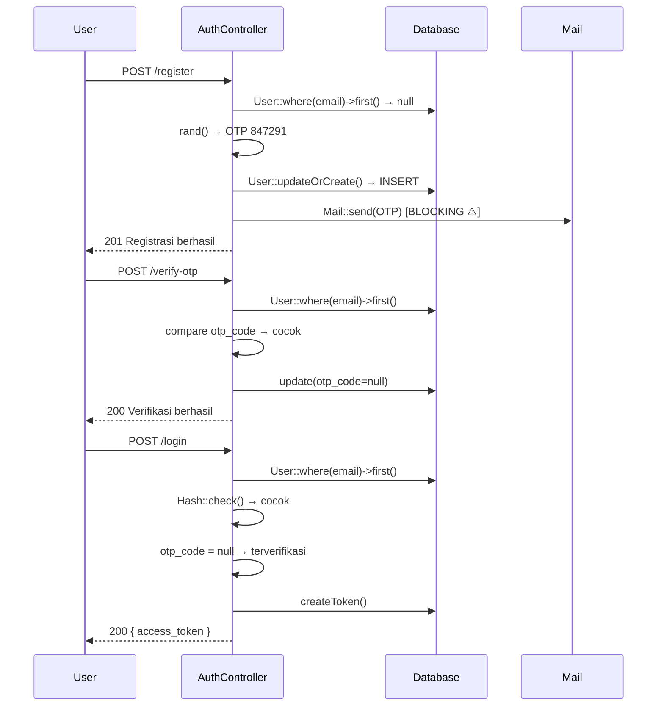
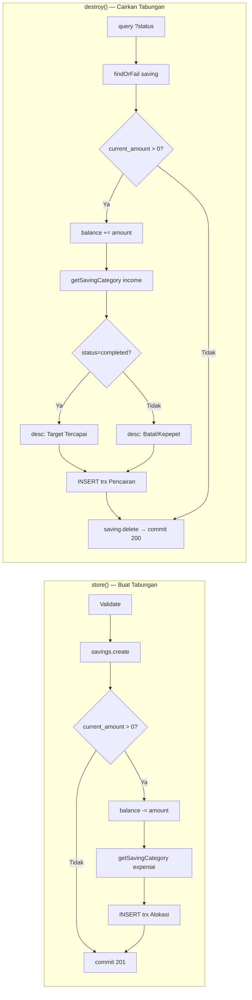

# White Box Testing — 02 Code Walkthrough
**Proyek:** SaPoPoe Finance  
**Teknik:** Code Walkthrough  
**Modul:** Auth · Transfer · Transaksi · Tabungan

---

## Definisi

> **Teknik review kode secara formal atau informal yang dilakukan bersama-sama antara developer dan tim terkait untuk memahami logika kode, kemudian mengidentifikasi potensi error, dan meningkatkan kualitas keseluruhan program.**
>
> — Materi Pertemuan 10, Software Quality, T Informatika UKRI

---

## Modul A — Autentikasi
### Walkthrough: `register()` → `verifyOtp()` → `login()`

**Skenario:** User baru mendaftar, menerima OTP via email, verifikasi, lalu login.

```
[STEP 1] POST /api/register
  Input : { name:"Dzaki", email:"dzaki@mail.com", password:"Midnight@2026" }

  → validate() → OK
  → User::where(email)->first() → null (belum ada)
  → checkCooldown(null) → return false (tidak ada cooldown)
  → $otp = rand(100000, 999999) → misal: 847291
  → User::updateOrCreate(
      ['email' => 'dzaki@mail.com'],
      ['name', 'password' => Hash::make(...), 'otp_code' => '847291', 'otp_expires_at' => +10min]
    ) → INSERT baris baru
  → Mail::send(..., ['otp' => 847291]) → email terkirim (BLOCKING ⚠️)
  → return 201 "Registrasi berhasil"

  STATE DB: users → { otp_code:'847291', otp_expires_at:+10min, status:'inactive' }

[STEP 2] POST /api/verify-otp
  Input : { email:"dzaki@mail.com", otp_code:"847291" }

  → validate() → OK
  → User::where(email)->first() → ada ✅
  → $user->otp_code !== "847291" → FALSE (cocok) → lanjut
  → now()->greaterThan(otp_expires_at) → FALSE (belum expired) → lanjut
  → $user->update([otp_code:null, otp_expires_at:null, email_verified_at:now()])
  → return 200 "Verifikasi berhasil"

  STATE DB: users → { otp_code:NULL, email_verified_at:timestamp, status:'inactive' }

[STEP 3] POST /api/login
  Input : { email:"dzaki@mail.com", password:"Midnight@2026" }

  → validate() → OK
  → User::where(email)->first() → ada ✅
  → !$user → FALSE → lanjut
  → !Hash::check("Midnight@2026", $user->password) → FALSE (cocok) → lanjut
  → $user->otp_code → NULL → FALSE (sudah verifikasi) → lanjut
  → $user->createToken('auth_token')->plainTextToken → "3|abc123..."
  → return 200 { access_token, user }
```



---

> ### 📋 Analisis SQA — Modul Auth
>
> **Kondisi Sistem Saat Ini**
> Alur register → verify → login sudah membentuk siklus yang koheren. Namun terdapat dua kelemahan teknis yang teridentifikasi saat walkthrough: (1) `Mail::send()` bersifat sinkron dan memblokir response hingga SMTP server merespons — jika koneksi SMTP lambat, user bisa menunggu hingga 10 detik; (2) `rand()` digunakan untuk membangkitkan OTP, bukan `random_int()` yang bersifat kriptografis aman (CSPRNG).
>
> **Dampak**
> Penggunaan `rand()` menjadi celah keamanan nyata — pada lingkungan 32-bit, nilai yang dihasilkan dapat diprediksi dengan seed yang terbatas. Attacker yang mengetahui timestamp registrasi dapat mempersempit kemungkinan nilai OTP. `Mail::send()` sinkron berpotensi menyebabkan timeout pada beban tinggi, meningkatkan kemungkinan user melakukan request ulang dan mengakibatkan duplikasi OTP di DB.
>
> **Cara Baca Diagram dan Walkthrough**
> Walkthrough dibaca sebagai simulasi eksekusi nyata — developer (atau reviewer) "memainkan peran" sebagai interpreter kode. Setiap `STATE DB` menunjukkan kondisi database setelah step tersebut selesai. Diagram sequence menggambarkan interaksi antar komponen secara kronologis dari atas ke bawah. Tanda ⚠️ menandai baris kode yang menjadi temuan selama review.

---

## Modul B — Transfer
### Walkthrough: `store()` dengan Admin Fee

**Skenario:** Transfer Rp 200.000 dari BCA ke Mandiri, admin fee Rp 5.000. Saldo BCA = Rp 600.000.

```
[store() Execution]

  → $adminFee = 5.000
  → $totalDeduction = 200.000 + 5.000 = 205.000

  → fromAccount = BCA { balance: 600.000 }    ← user_id diverifikasi ✅
  → toAccount   = Mandiri { balance: 100.000 } ← user_id diverifikasi ✅

  → 600.000 < 205.000 ? → FALSE → lanjut

  → transferCategory = Category::where('Transfer Internal')->first()
    → belum ada → CREATE baru ⚠️ (DI LUAR DB::beginTransaction()!)

  → adminFee > 0 → TRUE
    → adminCategory = Category::where('Biaya Admin Bank')->first()
    → belum ada → CREATE baru ⚠️ (DI LUAR DB::beginTransaction()!)

  → DB::beginTransaction()
    → BCA.balance  = 600.000 − 205.000 = 395.000 → save()
    → Mandiri.balance = 100.000 + 200.000 = 300.000 → save()
    → INSERT trx { type:transfer, desc:'Transfer Keluar ke Mandiri', amount:200.000, account:BCA }
    → INSERT trx { type:transfer, desc:'Transfer Masuk dari BCA', amount:200.000, account:Mandiri }
    → adminFee > 0 → INSERT trx { type:expense, desc:'Biaya admin...', amount:5.000, account:BCA }
  → DB::commit()

  STATE AKHIR:
    BCA:     600.000 → 395.000
    Mandiri: 100.000 → 300.000
    Transaksi baru: 3 record
```

---

> ### 📋 Analisis SQA — Modul Transfer
>
> **Kondisi Sistem Saat Ini**
> Method `store()` membagi logika ke dalam dua zona: zona persiapan (sebelum `beginTransaction`) dan zona atomik (di dalam transaction). Masalah kritis ditemukan: pembuatan `Category` terjadi di zona persiapan — di luar jangkauan rollback. Jika DB::rollBack() dipicu, dua kategori yang sudah dibuat tetap tersimpan di database.
>
> **Dampak**
> Setiap kali transfer gagal setelah kategori baru dibuat, tabel `categories` akan akumulasi record orphan. Dalam jangka panjang ini mencemari data master dan bisa menyebabkan data inconsistency. Lebih parah lagi, logika `where()->first()` akan menemukan kategori lama tersebut, sehingga bug mungkin tidak terdeteksi pada pandangan pertama.
>
> **Cara Baca Walkthrough**
> Setiap baris `→` adalah satu statement kode yang dieksekusi. Indentasi menunjukkan kita sedang berada di dalam blok `DB::beginTransaction()`. Tanda ⚠️ langsung menunjuk ke baris bermasalah. `STATE AKHIR` adalah kondisi database yang dapat diverifikasi setelah API selesai merespons.

---

## Modul C — Transaksi
### Walkthrough: `update()` — Ganti Tipe dan Akun

**Skenario:** Transaksi income Rp 100.000 di BCA diubah menjadi expense Rp 50.000 di Mandiri.

```
[update() Execution]

  STATE AWAL:
    BCA.balance bertambah 100.000 dari income sebelumnya
    Transaksi lama: { type:'income', amount:100.000, account:BCA }

  → validate() → OK
  → Transaction::where(id)->where(user_id)->firstOrFail() → transaksi lama ✅

  → DB::beginTransaction()

  FASE 1 — REVERT transaksi lama:
    → $oldAccount = FinancialAccount::findOrFail(BCA.id)  ⚠️ (TANPA filter user_id)
    → type lama = 'income' → $oldAccount.balance -= 100.000
    → BCA kembali ke kondisi sebelum income
    → $oldAccount.save()

  FASE 2 — APPLY transaksi baru:
    → $newAccount = FinancialAccount::findOrFail(Mandiri.id) ⚠️ (TANPA filter user_id)
    → type baru = 'expense' → $newAccount.balance -= 50.000
    → Mandiri.balance berkurang 50.000
    → $newAccount.save()

  FASE 3 — UPDATE histori:
    → $transaction->update({ type:'expense', amount:50.000, account:Mandiri })

  → DB::commit()
  → return 200 { transaksi baru }
```

---

> ### 📋 Analisis SQA — Modul Transaksi
>
> **Kondisi Sistem Saat Ini**
> Logika update dalam tiga fase (Revert → Apply → Update histori) adalah arsitektur yang tepat untuk mengubah transaksi finansial. Namun kedua `findOrFail()` di Fase 1 dan Fase 2 tidak menyertakan filter `user_id`. Akun diambil murni berdasarkan ID — tidak diverifikasi kepemilikannya.
>
> **Dampak**
> Dalam skenario normal, `financial_account_id` yang tersimpan di transaksi seharusnya sudah milik user yang sama. Namun jika data di tabel `transactions` pernah dimanipulasi (mis. via SQL injection di endpoint lain), method ini bisa mengubah saldo akun milik user lain. Ini adalah **Insecure Direct Object Reference (IDOR)** — salah satu kategori kerentanan OWASP Top 10.
>
> **Cara Baca Walkthrough**
> Tiga fase eksekusi (Revert, Apply, Update) mencerminkan prinsip **double-entry bookkeeping** dalam sistem keuangan: setiap perubahan harus membatalkan entri lama dan mencatat entri baru. Jika salah satu fase gagal dan tidak ada rollback, balance akan tidak seimbang. Blok `DB::beginTransaction()` memastikan ketiga fase berjalan all-or-nothing.

---

## Modul D — Tabungan
### Walkthrough: `destroy()` — Cairkan Tabungan

**Skenario:** User mencairkan tabungan "Liburan" senilai Rp 500.000 dengan status `completed`.

```
[destroy() Execution]

  Input: DELETE /api/savings/{id}?status=completed

  → $status = $request->query('status', 'canceled') → 'completed'

  → DB::beginTransaction()

  → $saving = user->savings()->findOrFail(id)
    → { name:'Liburan', current_amount:500.000, financial_account_id:BCA.id }

  → current_amount > 0 → TRUE
    → $account = FinancialAccount::findOrFail(BCA.id) ⚠️ (TANPA user_id)
    → $account.balance += 500.000  ← saldo dikembalikan
    → $account.save()

    → $category = getSavingCategory(user_id, 'income')
      → Category::where('Pencairan Tabungan')->first()
      → (dipanggil di dalam blok try yang ada beginTransaction → aman ✅)

    → $desc = 'completed' → 'Target Tercapai & Cair: Liburan'

    → INSERT trx { type:'income', amount:500.000, desc:'Target Tercapai & Cair: Liburan' }

  → $saving->delete()
  → DB::commit()
  → return 200 "Target diselesaikan/dihapus"

  STATE AKHIR:
    BCA: balance += 500.000
    Saving 'Liburan': terhapus dari DB
    Transaksi baru: 1 income record
```



---

> ### 📋 Analisis SQA — Modul Tabungan
>
> **Kondisi Sistem Saat Ini**
> `destroy()` memiliki alur yang baik: pencairan saldo, pencatatan transaksi income, lalu penghapusan data tabungan — semua dalam satu transaksi DB. `getSavingCategory()` dipanggil di dalam blok try yang sudah dimulai dengan `beginTransaction`, sehingga kategori yang dibuat fungsi ini ikut terproteksi rollback. Ini lebih aman dibanding Transfer.
>
> **Dampak**
> Kondisi saat ini sudah cukup andal untuk alur happy path. Risiko utama ada pada `FinancialAccount::findOrFail()` tanpa filter `user_id` — sama dengan Transaksi. Selain itu, `$status` dari query parameter (`?status=completed`) tidak divalidasi secara eksplisit, sehingga nilai apapun diterima dan hanya mempengaruhi string deskripsi. Ini tidak berbahaya tapi tidak bersih secara kode.
>
> **Cara Baca Diagram**
> Diagram flowchart menampilkan dua method berdampingan untuk mempermudah perbandingan alur store (simpan) vs destroy (cairkan). Kedua alur merupakan operasi inversi satu sama lain — store mengurangi saldo dan destroy mengembalikannya. Perhatikan bahwa `getSavingCategory` dipanggil di kedua alur tetapi dengan tipe berbeda: `expense` saat menabung, `income` saat mencairkan.
