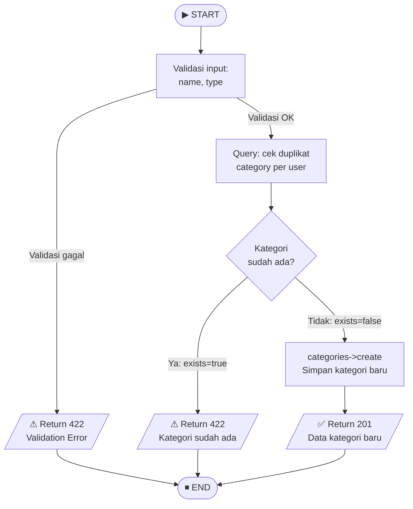

# 🌊 Control Flow Testing — Midnight Finance

**Mata Kuliah:** Software Quality Assurance  
**Model Pengujian:** White Box Testing — Control Flow Testing  
**Tim:** REMACode  
**Modul Target:** Fitur Buat Kategori Baru (`CategoryController@store`)  

---

## 📖 Definisi

**Control Flow Testing** adalah teknik White Box Testing yang berfokus pada pengujian **alur kontrol** program — bagaimana program bergerak dari satu pernyataan ke pernyataan lain melalui cabang, loop, dan kondisi. Tujuannya adalah memastikan semua **cabang (branch)** dan **kondisi** dalam kode telah dieksekusi minimal satu kali (Suprihadi, 2025).

---

## 🎯 Source Code yang Diuji

**Endpoint:** `POST /api/categories`

```php
public function store(Request $request)
{
    // Cabang 1: Validasi input
    $validated = $request->validate([
        'name' => 'required|string|max:50',
        'type' => 'required|in:income,expense'
    ]);

    // Cabang 2: Cek duplikat kategori
    $exists = $request->user()->categories()
        ->where('name', $validated['name'])
        ->where('type', $validated['type'])
        ->exists();

    if ($exists) {
        // Cabang 3a: Duplikat ditemukan
        return response()->json([
            'message' => 'Kategori sudah ada di portofolio Anda!'
        ], 422);
    }

    // Cabang 3b: Tidak ada duplikat — simpan
    $category = $request->user()->categories()->create($validated);

    return response()->json([
        'status' => 'success',
        'data' => $category
    ], 201);
}
```

---

## 🌊 Control Flow Graph



---

## 🧪 Identifikasi Cabang (Branch Coverage)

| Branch ID | Kondisi | Jalur | Keterangan |
|:---:|:---|:---:|:---|
| B1-TRUE | Validasi gagal | N2 → N3 → END | `name` kosong atau `type` bukan income/expense |
| B1-FALSE | Validasi sukses | N2 → N4 | Input lengkap dan valid |
| B2-TRUE | Kategori sudah ada | N5 → N6 → END | Nama + tipe sama sudah ada milik user |
| B2-FALSE | Kategori belum ada | N5 → N7 → N8 → END | Nama baru / belum pernah dibuat |

---

## 📝 Test Case Control Flow

| No | Test Case | Branch | Input `name` | Input `type` | Expected Output | Actual Output | Status |
|:--:|:---|:---:|:---:|:---:|:---|:---:|:---:|
| TC-CF-01 | Input name kosong | B1-TRUE | *(kosong)* | `income` | HTTP 422 — "The name field is required" | HTTP 422 | ✅ Valid |
| TC-CF-02 | Tipe tidak valid | B1-TRUE | `Gaji` | `salary` | HTTP 422 — "The type field must be income or expense" | HTTP 422 | ✅ Valid |
| TC-CF-03 | Kategori sudah ada (duplikat) | B2-TRUE | `Gaji` | `income` | HTTP 422 — "Kategori sudah ada di portofolio Anda!" | HTTP 422 | ✅ Valid |
| TC-CF-04 | Kategori baru berhasil dibuat | B2-FALSE | `Investasi` | `income` | HTTP 201 — data kategori baru | HTTP 201 | ✅ Valid |
| TC-CF-05 | Nama sama tapi tipe berbeda (bukan duplikat) | B2-FALSE | `Gaji` | `expense` | HTTP 201 — kategori baru berhasil (nama sama, tipe beda) | HTTP 201 | ✅ Valid |

---

## ✅ Hasil Pengujian

| Kategori | Nilai |
|:---|:---:|
| Total Branch | 4 |
| Branch Tercakup | 4 (100%) |
| Total Test Case | 5 |
| Test Case Passed | 5 |
| **Branch Coverage** | **100%** |

> **Kesimpulan:** Control Flow Testing pada `CategoryController@store` mencapai **branch coverage 100%**. Sistem berhasil menangani seluruh alur kontrol — validasi gagal, deteksi duplikat, dan pembuatan kategori baru — dengan respons yang tepat.

---

## 📚 Referensi

- Suprihadi, D. (2025). *Software Quality — White Box Testing*. T Informatika UKRI.
