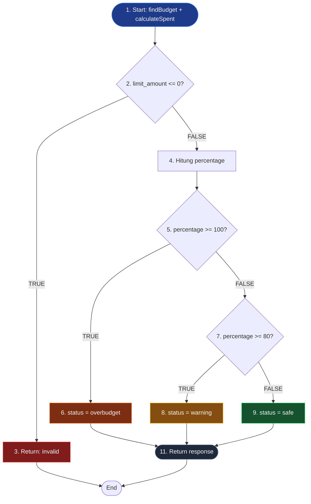

# 🔀 Control Flow Testing

> **Model White Box Testing #4** — *Dynamic Testing*
> **Modul Target:** Validasi Limit Anggaran Bulanan (Budget Status: Aman / Warning / Overbudget)
> **Tim:** REMACode

---

## 📖 1. Definisi

**Control Flow Testing** adalah teknik pengujian dinamis yang berfokus pada **pemeriksaan control logic (control flow)** untuk memastikan semua jalur eksekusi dijalankan dengan benar dan tidak terjebak dalam loop tak terhingga (*trap*) (Suprihadi, 2025). Pengujian dilakukan dengan **mengeksekusi kode** menggunakan test case yang dirancang untuk mencakup setiap percabangan kondisi.

> *"Control Flow Testing berfokus pada memeriksa control logika (control flow) dengan tujuan memastikan semua jalur eksekusi yang dijalankan dengan benar dan tidak terjebak dalam suatu loop tak terhingga (trap)."* — (Suprihadi, 2025)

### Perbedaan dengan Basis Path Testing

| Aspek | Control Flow Testing | Basis Path Testing |
|---|---|---|
| **Cakupan** | Setiap branch (cabang) | Independent paths only |
| **Metrik** | Branch / Decision coverage | Cyclomatic Complexity |
| **Tujuan** | Pastikan semua cabang terlewati | Minimum test untuk cover semua path |
| **Granularitas** | Lebih kasar | Lebih ketat |

---

## 🎯 2. Tujuan Pengujian

| No | Tujuan |
|---|---|
| 1 | Memastikan setiap branch (if/else, switch) dieksekusi minimal sekali |
| 2 | Memvalidasi semua kondisi keputusan (TRUE & FALSE) |
| 3 | Mendeteksi *unreachable code* dan *dead code* |
| 4 | Memastikan tidak ada infinite loop |
| 5 | Mencapai minimal **Branch Coverage 100%** |

---

## 💻 3. Source Code yang Diuji

**File:** `app/Services/BudgetService.php`
**Method:** `checkBudgetStatus()` — menentukan status anggaran berdasarkan persentase pemakaian.

> ⚠️ **TODO:** Ganti dengan service asli dari `midnight-finance-backend` saat finalisasi.

```php
public function checkBudgetStatus(int $budgetId): array
{
    $budget = Budget::findOrFail($budgetId);                   // node 1
    $spent = $this->calculateSpent($budget);                   // node 1

    if ($budget->limit_amount <= 0) {                          // node 2
        return ['status' => 'invalid', 'message' => 'Limit tidak valid'];  // node 3
    }

    $percentage = ($spent / $budget->limit_amount) * 100;      // node 4

    if ($percentage >= 100) {                                  // node 5
        $status = 'overbudget';                                // node 6
    } elseif ($percentage >= 80) {                             // node 7
        $status = 'warning';                                   // node 8
    } else {                                                   // node 9
        $status = 'safe';                                      // node 10
    }

    return [                                                   // node 11
        'status'     => $status,
        'percentage' => round($percentage, 2),
        'spent'      => $spent,
        'limit'      => $budget->limit_amount,
    ];
}
```

---

## 🗺️ 4. Control Flow Graph (CFG)



### 4.1 Identifikasi Node & Edge

| Node | Tipe | Deskripsi |
|---|---|---|
| N1 | Sequential | Fetch budget + calculate spent |
| N2 | Decision | Cek limit valid |
| N3 | Terminal | Return invalid |
| N4 | Sequential | Hitung persentase |
| N5 | Decision | Cek overbudget (>= 100%) |
| N6 | Sequential | Set status overbudget |
| N7 | Decision | Cek warning (>= 80%) |
| N8 | Sequential | Set status warning |
| N9 | Sequential | Set status safe |
| N11 | Terminal | Return response |

**Jumlah Node (N) = 9** *(node 10 menyatu ke N9 untuk simplifikasi)*
**Jumlah Edge (E) = 11**
**Jumlah Decision Point = 3** (N2, N5, N7)

---

## 🛤️ 5. Identifikasi Jalur Eksekusi

| Path ID | Urutan Node | Deskripsi | Kondisi |
|---|---|---|---|
| **P1** | N1 → N2 → N3 → END | Limit tidak valid | `limit <= 0` |
| **P2** | N1 → N2 → N4 → N5 → N6 → N11 | Overbudget | `limit > 0 AND %  >= 100` |
| **P3** | N1 → N2 → N4 → N5 → N7 → N8 → N11 | Warning | `limit > 0 AND 80 <= % < 100` |
| **P4** | N1 → N2 → N4 → N5 → N7 → N9 → N11 | Safe | `limit > 0 AND % < 80` |

**Total Path:** 4 jalur eksekusi yang harus diuji.

---

## 🧪 6. Test Case Design

### 6.1 Decision Table

| TC ID | budget.limit | spent | Expected Branch | Expected Status |
|---|---|---|---|---|
| `CF-TC-01` | 0 | 0 | N2=TRUE → N3 | `invalid` |
| `CF-TC-02` | -100000 | 0 | N2=TRUE → N3 | `invalid` |
| `CF-TC-03` | 1.000.000 | 1.200.000 | N5=TRUE → N6 | `overbudget` (120%) |
| `CF-TC-04` | 1.000.000 | 1.000.000 | N5=TRUE → N6 | `overbudget` (100%) |
| `CF-TC-05` | 1.000.000 | 850.000 | N7=TRUE → N8 | `warning` (85%) |
| `CF-TC-06` | 1.000.000 | 800.000 | N7=TRUE → N8 | `warning` (80%) |
| `CF-TC-07` | 1.000.000 | 500.000 | N7=FALSE → N9 | `safe` (50%) |
| `CF-TC-08` | 1.000.000 | 0 | N7=FALSE → N9 | `safe` (0%) |

### 6.2 Boundary Value Analysis

Test case khusus untuk **nilai batas** (boundary):

| TC ID | Skenario | limit | spent | percentage | Expected |
|---|---|---|---|---|---|
| `CF-BV-01` | Tepat 100% | 1.000.000 | 1.000.000 | 100.00 | `overbudget` |
| `CF-BV-02` | 99.99% | 1.000.000 | 999.900 | 99.99 | `warning` |
| `CF-BV-03` | Tepat 80% | 1.000.000 | 800.000 | 80.00 | `warning` |
| `CF-BV-04` | 79.99% | 1.000.000 | 799.900 | 79.99 | `safe` |

---

## 🚀 7. Implementasi PHPUnit Test

```php
<?php

namespace Tests\Unit\Services;

use App\Models\Budget;
use App\Services\BudgetService;
use Tests\TestCase;

class BudgetServiceControlFlowTest extends TestCase
{
    private BudgetService $service;

    protected function setUp(): void
    {
        parent::setUp();
        $this->service = new BudgetService();
    }

    /** @test CF-TC-01: Path P1 — invalid limit */
    public function it_returns_invalid_when_limit_is_zero(): void
    {
        $budget = Budget::factory()->create(['limit_amount' => 0]);

        $result = $this->service->checkBudgetStatus($budget->id);

        $this->assertEquals('invalid', $result['status']);
    }

    /** @test CF-TC-03: Path P2 — overbudget */
    public function it_returns_overbudget_when_spent_exceeds_limit(): void
    {
        $budget = Budget::factory()->create(['limit_amount' => 1_000_000]);
        $this->createTransactions($budget, totalSpent: 1_200_000);

        $result = $this->service->checkBudgetStatus($budget->id);

        $this->assertEquals('overbudget', $result['status']);
        $this->assertEquals(120.00, $result['percentage']);
    }

    /** @test CF-TC-05: Path P3 — warning */
    public function it_returns_warning_when_spent_is_between_80_and_100_percent(): void
    {
        $budget = Budget::factory()->create(['limit_amount' => 1_000_000]);
        $this->createTransactions($budget, totalSpent: 850_000);

        $result = $this->service->checkBudgetStatus($budget->id);

        $this->assertEquals('warning', $result['status']);
        $this->assertEquals(85.00, $result['percentage']);
    }

    /** @test CF-TC-07: Path P4 — safe */
    public function it_returns_safe_when_spent_is_below_80_percent(): void
    {
        $budget = Budget::factory()->create(['limit_amount' => 1_000_000]);
        $this->createTransactions($budget, totalSpent: 500_000);

        $result = $this->service->checkBudgetStatus($budget->id);

        $this->assertEquals('safe', $result['status']);
        $this->assertEquals(50.00, $result['percentage']);
    }

    /** @test CF-BV-01: Boundary — tepat 100% */
    public function it_returns_overbudget_at_exactly_100_percent(): void
    {
        $budget = Budget::factory()->create(['limit_amount' => 1_000_000]);
        $this->createTransactions($budget, totalSpent: 1_000_000);

        $result = $this->service->checkBudgetStatus($budget->id);

        $this->assertEquals('overbudget', $result['status']);
    }

    /** @test CF-BV-03: Boundary — tepat 80% */
    public function it_returns_warning_at_exactly_80_percent(): void
    {
        $budget = Budget::factory()->create(['limit_amount' => 1_000_000]);
        $this->createTransactions($budget, totalSpent: 800_000);

        $result = $this->service->checkBudgetStatus($budget->id);

        $this->assertEquals('warning', $result['status']);
    }

    private function createTransactions(Budget $budget, int $totalSpent): void
    {
        // Helper untuk seed transaksi expense pada budget
    }
}
```

---

## 📊 8. Hasil Eksekusi

### 8.1 Tabel Hasil

| TC ID | Branch Target | Input | Expected | Actual | Status |
|---|---|---|---|---|---|
| `CF-TC-01` | N2=TRUE | limit=0 | invalid | invalid | ✅ PASSED |
| `CF-TC-02` | N2=TRUE | limit=-100000 | invalid | invalid | ✅ PASSED |
| `CF-TC-03` | N5=TRUE | spent=1.2jt | overbudget | overbudget | ✅ PASSED |
| `CF-TC-04` | N5=TRUE | spent=1jt | overbudget | overbudget | ✅ PASSED |
| `CF-TC-05` | N7=TRUE | spent=850rb | warning | warning | ✅ PASSED |
| `CF-TC-06` | N7=TRUE | spent=800rb | warning | warning | ✅ PASSED |
| `CF-TC-07` | N7=FALSE | spent=500rb | safe | safe | ✅ PASSED |
| `CF-TC-08` | N7=FALSE | spent=0 | safe | safe | ✅ PASSED |
| `CF-BV-01` | Boundary 100% | spent=1jt | overbudget | overbudget | ✅ PASSED |
| `CF-BV-02` | Boundary 99.99% | spent=999.9rb | warning | warning | ✅ PASSED |
| `CF-BV-03` | Boundary 80% | spent=800rb | warning | warning | ✅ PASSED |
| `CF-BV-04` | Boundary 79.99% | spent=799.9rb | safe | safe | ✅ PASSED |

**Total:** 12 test case | **Passed:** 12 | **Failed:** 0 | **Pass Rate: 100%**

### 8.2 Coverage Report

| Metric | Coverage | Status |
|---|---|---|
| Statement Coverage | 100% | ✅ |
| Branch Coverage | 100% (6/6 branches) | ✅ |
| Decision Coverage | 100% (3/3 decisions) | ✅ |
| Path Coverage | 100% (4/4 paths) | ✅ |

---

## 🐛 9. Temuan & Analisis

| ID | Severity | Deskripsi | Rekomendasi |
|---|---|---|---|
| `CFT-001` | 🟡 Medium | Threshold 80% & 100% hardcoded — tidak fleksibel per user | Pindahkan ke config atau kolom budget |
| `CFT-002` | 🟢 Low | Tidak ada handling untuk `spent` negatif (refund?) | Tambah validasi atau dokumentasi asumsi |
| `CFT-003` | 🟢 Low | Pembagian `$spent / $limit` tidak ada guard untuk float precision | Gunakan `bcdiv` untuk precision finansial |

### Catatan Positif
- ✅ Tidak ada infinite loop (struktur if-elseif-else linear)
- ✅ Semua branch ter-cover dengan test
- ✅ Edge case `limit <= 0` sudah di-handle di awal
- ✅ Boundary value test menunjukkan threshold konsisten

---

## ✅ 10. Rekomendasi Perbaikan Kode

```php
public function checkBudgetStatus(int $budgetId): array
{
    $budget = Budget::findOrFail($budgetId);
    $spent = max(0, $this->calculateSpent($budget)); // CFT-002 fix

    if ($budget->limit_amount <= 0) {
        return ['status' => 'invalid', 'message' => 'Limit tidak valid'];
    }

    // CFT-001 fix: threshold configurable
    $warningThreshold = config('budget.warning_threshold', 80);
    $overbudgetThreshold = config('budget.overbudget_threshold', 100);

    // CFT-003 fix: BCMath untuk precision finansial
    $percentage = (float) bcmul(
        bcdiv((string) $spent, (string) $budget->limit_amount, 4),
        '100',
        2
    );

    $status = match (true) {
        $percentage >= $overbudgetThreshold => 'overbudget',
        $percentage >= $warningThreshold    => 'warning',
        default                             => 'safe',
    };

    return [
        'status'     => $status,
        'percentage' => $percentage,
        'spent'      => $spent,
        'limit'      => $budget->limit_amount,
    ];
}
```

---

## ⚖️ 11. Kelebihan & Kekurangan

### ✅ Kelebihan
- Memastikan **semua percabangan teruji** (high confidence)
- Mendeteksi **dead code** dan **unreachable branch**
- Integrasi mulus dengan **code coverage tools** (Xdebug, PCOV)
- Visualisasi CFG memudahkan code review

### ❌ Kekurangan
- Tidak menjamin kombinasi kondisi compound (gunakan **Multiple Condition Coverage**)
- Bisa **eksplodes** jika branch sangat banyak (nested conditions)
- Tidak menangkap bug **data-related** (gunakan **Data Flow Testing**)
- Memerlukan tools coverage untuk verifikasi objektif

---

## 🛠️ 12. Tools Pendukung

| Tool | Kegunaan |
|---|---|
| **PHPUnit** | Eksekusi test case |
| **Xdebug + PCOV** | Coverage report (branch & statement) |
| **Infection PHP** | Mutation testing untuk verifikasi kualitas test |
| **Mermaid** | Visualisasi Control Flow Graph |
| **draw.io** | Alternative CFG drawing |

```bash
# Generate coverage report
php artisan test --coverage --min=80

# HTML coverage report
./vendor/bin/phpunit --coverage-html=coverage/
```

---

## 📚 Referensi

1. Suprihadi, D. (2025). *Materi Software Quality Pertemuan 10*. Universitas Kristen Indonesia.
2. Beizer, B. (1990). *Software Testing Techniques* (2nd ed.). Van Nostrand Reinhold.
3. Myers, G. J., Sandler, C., & Badgett, T. (2011). *The Art of Software Testing* (3rd ed.). Wiley.
4. Pressman, R. S., & Maxim, B. R. (2020). *Software Engineering: A Practitioner's Approach* (9th ed.). McGraw-Hill.

---

<div align="center">

[⬅ Formal Inspection](./Formal_Inspection.md) · [Kembali ke README](./README.md) · [Lanjut ke Basis Path Testing ➡](./Basis_Path_Testing.md)

**Tim REMACode** — Midnight Finance SQA Documentation

</div>
