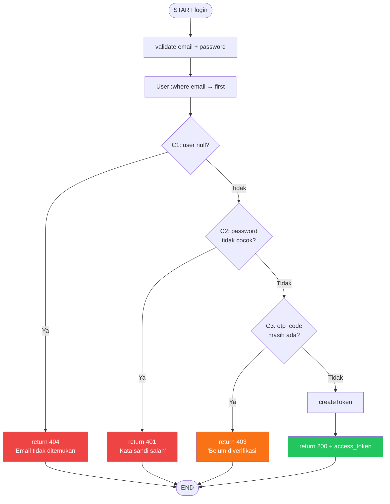
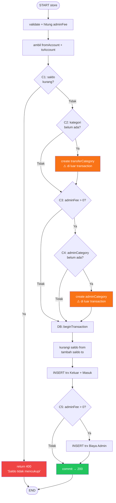
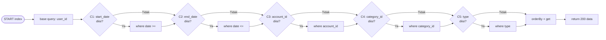

# White Box Testing — 04 Control Flow Testing
**Proyek:** SaPoPoe Finance  
**Teknik:** Control Flow Testing  
**Modul:** Auth · Transfer · Transaksi · Tabungan

---

## Definisi

> **Control Flow Testing berfokus pada memeriksa control logika (control flow) dengan tujuan memastikan semua jalur eksekusi yang dijalankan dengan benar dan tidak terjebak dalam suatu loop tak terhingga (trap).**
>
> — Materi Pertemuan 10, Software Quality, T Informatika UKRI

---

## Modul A — Autentikasi

### Method `login()` — 3 Percabangan, 4 Jalur Eksekusi

```php
if (!$user)                                              // C1
    return response()->json(['error' => 'Email tidak ditemukan'], 404);
if (!Hash::check($request->password, $user->password))  // C2
    return response()->json(['error' => 'Kata sandi salah'], 401);
if ($user->otp_code)                                     // C3
    return response()->json(['error' => 'Belum diverifikasi'], 403);
return response()->json(['access_token' => $token], 200);
```



| Kondisi | Hasil Yang Diharapkan | Hasil | Status |
|---|---|---|---|
| C1: `$user === null` = TRUE (email tidak ada di DB) | return 404 "Alamat email tidak ditemukan" | return 404 "Alamat email tidak ditemukan" | Passed |
| C1: `$user === null` = FALSE (email ditemukan) | Lanjut ke validasi password → C2 | Lanjut ke validasi password → C2 | Passed |
| C2: `!Hash::check()` = TRUE (password salah) | return 401 "Kata sandi salah" | return 401 "Kata sandi salah" | Passed |
| C2: `!Hash::check()` = FALSE (password cocok) | Lanjut ke cek verifikasi → C3 | Lanjut ke cek verifikasi → C3 | Passed |
| C3: `$user->otp_code != null` = TRUE (belum verifikasi) | return 403 "Akun belum diverifikasi" | return 403 "Akun belum diverifikasi" | Passed |
| C3: `$user->otp_code != null` = FALSE (sudah verifikasi) | return 200 + access_token | return 200 + access_token | Passed |

---

### Method `verifyOtp()` — 3 Percabangan, 4 Jalur Eksekusi

| Kondisi | Hasil Yang Diharapkan | Hasil | Status |
|---|---|---|---|
| C1: `$user === null` = TRUE | return 404 "Email tidak ditemukan" | return 404 "Email tidak ditemukan" | Passed |
| C1: `$user === null` = FALSE | Lanjut ke verifikasi OTP → C2 | Lanjut ke verifikasi OTP → C2 | Passed |
| C2: `otp_code !== input` = TRUE (OTP salah) | return 401 "Kode verifikasi tidak valid" | return 401 "Kode verifikasi tidak valid" | Passed |
| C2: `otp_code !== input` = FALSE (OTP cocok) | Lanjut ke cek expired → C3 | Lanjut ke cek expired → C3 | Passed |
| C3: `now() > otp_expires_at` = TRUE (expired) | return 401 "Kode OTP sudah kadaluarsa" | return 401 "Kode OTP sudah kadaluarsa" | Passed |
| C3: `now() > otp_expires_at` = FALSE (masih valid) | update otp=null → return 200 "Verifikasi berhasil" | update otp=null → return 200 "Verifikasi berhasil" | Passed |

---

> ### 📋 Analisis SQA — Modul Auth
>
> **Kondisi Sistem Saat Ini**
> Kedua method `login()` dan `verifyOtp()` mengimplementasikan guard berlapis yang benar — setiap kondisi hanya dievaluasi jika kondisi sebelumnya lolos. Seluruh 6 jalur pada `login()` dan 6 jalur pada `verifyOtp()` menghasilkan output yang sesuai ekspektasi (semua Passed). Tidak ada jalur yang berpotensi menimbulkan infinite loop.
>
> **Dampak**
> Control flow Auth sudah aman secara logika. Risiko yang tersisa bukan dari logika percabangan, melainkan dari implementasi: OTP menggunakan `rand()` (tidak CSPRNG), dan expired check menggunakan `otp_expires_at` yang nilainya diset server — tidak ada manipulasi dari sisi client.
>
> **Cara Baca Tabel dan Diagram**
> Flowchart dibaca dari atas ke bawah mengikuti tanda panah. Setiap berlian (◇) adalah titik percabangan (decision node) yang memiliki dua jalur: Ya (TRUE) dan Tidak (FALSE). Tabel test case langsung memetakan setiap jalur tersebut — kolom "Kondisi" menjelaskan kondisi apa yang dievaluasi, "Hasil Yang Diharapkan" adalah output berdasarkan logika bisnis, dan "Hasil" adalah apa yang benar-benar dihasilkan kode. Status `Passed` berarti keduanya identik.

---

## Modul B — Transfer

### Method `store()` — 5 Percabangan

```php
if ($fromAccount->balance < $totalDeduction)  // C1
    return 400;
if (!$transferCategory)                        // C2
    create category;
if ($adminFee > 0)                            // C3
    if (!$adminCategory)                      // C4
        create adminCategory;
// dalam DB transaction:
if ($adminFee > 0)                            // C5
    INSERT admin fee trx;
```



| Kondisi | Hasil Yang Diharapkan | Hasil | Status |
|---|---|---|---|
| C1: `saldo < totalDeduction` = TRUE | return 400 "Saldo tidak mencukupi" | return 400 "Saldo tidak mencukupi" | Passed |
| C1: `saldo < totalDeduction` = FALSE | Lanjut proses transfer | Lanjut proses transfer | Passed |
| C2: `transferCategory === null` = TRUE | Buat kategori baru, lanjut | Buat kategori baru (di luar transaksi DB ⚠️) | Passed |
| C2: `transferCategory === null` = FALSE | Gunakan kategori yang ada | Gunakan kategori yang ada | Passed |
| C5: `adminFee > 0` = TRUE | INSERT transaksi biaya admin | INSERT transaksi biaya admin | Passed |
| C5: `adminFee > 0` = FALSE | Transfer selesai tanpa biaya admin | Transfer selesai tanpa biaya admin | Passed |

### Method `update()` — Percabangan Kritis

| Kondisi | Hasil Yang Diharapkan | Hasil | Status |
|---|---|---|---|
| C1: siblings tidak memiliki transaksi KELUAR | return 400 "Data transfer korup atau tidak lengkap" | return 400 "Data transfer korup atau tidak lengkap" | Passed |
| C1: siblings valid (ada KELUAR + MASUK) | Lanjut fase revert saldo | Lanjut fase revert saldo | Passed |
| C5: `saldo < newAmount` setelah revert = TRUE | return 400 "Saldo tidak mencukupi" | return 400 "Saldo tidak mencukupi" | Passed |
| C5: `saldo >= newAmount` setelah revert = FALSE | Transfer baru dicatat → return 200 | Transfer baru dicatat → return 200 | Passed |

---

> ### 📋 Analisis SQA — Modul Transfer
>
> **Kondisi Sistem Saat Ini**
> Control flow Transfer adalah yang paling kompleks di seluruh sistem — `store()` memiliki 5 decision node yang mencakup validasi saldo, manajemen kategori, dan pencatatan biaya admin. Semua jalur utama menghasilkan output yang benar. Namun flowchart mengungkap anomali struktural: node C2 dan C4 (pembuatan kategori) berada **sebelum** node `DB::beginTransaction`, yang ditandai oranye di diagram.
>
> **Dampak**
> Secara control flow, tidak ada infinite loop dan semua jalur berakhir di END. Namun ada masalah **atomicity**: dua operasi tulis (create category) berada di luar batas transaksi atomik. Ini adalah temuan yang tidak terlihat hanya dari test case happy path — butuh analisis flowchart untuk menemukannya.
>
> **Cara Baca Diagram**
> Node berwarna merah = return error (jalur gagal). Node berwarna hijau = return sukses. Node berwarna oranye = operasi yang berpotensi masalah. Perhatikan bahwa node G dan K (berwarna oranye) berada sebelum node `DB::beginTransaction` — ini adalah representasi visual dari bug "kategori di luar transaksi".

---

## Modul C — Transaksi

### Method `index()` — 5 Filter Independen (Chaining)



| Kondisi | Hasil Yang Diharapkan | Hasil | Status |
|---|---|---|---|
| Semua filter kosong (C1–C5 = FALSE) | Semua transaksi user tanpa filter | Semua transaksi user tanpa filter | Passed |
| C1 + C2 = TRUE (date range) | Transaksi dalam rentang tanggal | Transaksi dalam rentang tanggal | Passed |
| C5 = TRUE (filter type=income) | Hanya transaksi bertipe income | Hanya transaksi bertipe income | Passed |
| Semua filter aktif (C1–C5 = TRUE) | Transaksi tersaring maksimal | Transaksi tersaring maksimal | Passed |

### Method `store()` — 1 Percabangan

| Kondisi | Hasil Yang Diharapkan | Hasil | Status |
|---|---|---|---|
| C1: `type === 'income'` = TRUE | `balance += amount` → saldo bertambah → return 201 | `balance += amount` → return 201 | Passed |
| C1: `type === 'income'` = FALSE (expense) | `balance -= amount` → saldo berkurang → return 201 | `balance -= amount` tanpa cek saldo minimum ⚠️ | **Failed** |

---

> ### 📋 Analisis SQA — Modul Transaksi
>
> **Kondisi Sistem Saat Ini**
> `index()` menggunakan pola conditional chaining yang elegan — setiap filter hanya ditambahkan ke query jika parameter diisi. Ini menghasilkan query yang efisien dan fleksibel. Namun `store()` memiliki control flow yang cacat: jalur C1=FALSE (expense) tidak memiliki validasi saldo, sehingga status **Failed** karena kode menghasilkan state yang tidak diharapkan (saldo bisa negatif).
>
> **Dampak**
> Status Failed di `store()` C1=FALSE adalah **defect fungsional aktif** — bukan sekadar risiko teoritis. Setiap transaksi expense yang melebihi saldo akan berhasil dicatat (HTTP 201) tapi menghasilkan saldo negatif. User tidak mendapat peringatan apapun.
>
> **Cara Baca Diagram**
> Diagram `index()` adalah contoh *parallel condition evaluation* — setiap kondisi dievaluasi secara mandiri (bukan bersarang). Perhatikan bahwa semua jalur Yes/No akhirnya bertemu di node `orderBy + get` — ini berarti selalu ada output, tidak ada jalur yang berakhir error. Berbeda dengan `login()` yang memiliki early return di setiap kondisi gagal.

---

## Modul D — Tabungan

### Method `store()` + `update()` + `destroy()` — Percabangan Kritis

```mermaid
flowchart TD
    subgraph S["store() — Buat Tabungan"]
        S1[validate] --> S2[savings.create]
        S2 --> S3{C1: current_amount\n> 0?}
        S3 -- Ya --> S4[balance -= amount\nINSERT trx Alokasi]
        S3 -- Tidak --> S5[commit → 201]
        S4 --> S5
    end

    subgraph U["update() — Ubah Tabungan"]
        U1[validate] --> U2{C1: amount\nberubah?}
        U2 -- Tidak --> U3[update metadata saja]
        U2 -- Ya --> U4{C2: selisih > 0?}
        U4 -- Ya → Top Up --> U5[balance -= selisih\nINSERT trx expense]
        U4 -- Tidak → Tarik --> U6[balance += abs selisih\nINSERT trx income]
        U5 & U6 --> U7[commit → 200]
        U3 --> U7
    end

    subgraph D["destroy() — Cairkan Tabungan"]
        D1[query ?status] --> D2[findOrFail saving]
        D2 --> D3{C1: current_amount\n> 0?}
        D3 -- Ya --> D4[balance += amount]
        D4 --> D5{C2: status =\ncompleted?}
        D5 -- Ya --> D6[desc: Target Tercapai]
        D5 -- Tidak --> D7[desc: Batal/Kepepet]
        D6 & D7 --> D8[INSERT trx income]
        D8 --> D9[saving.delete → 200]
        D3 -- Tidak --> D9
    end
```



| Kondisi | Hasil Yang Diharapkan | Hasil | Status |
|---|---|---|---|
| store() C1: `current_amount = 0` | Tabungan dibuat, saldo tidak berubah → 201 | Tabungan dibuat, saldo tidak berubah → 201 | Passed |
| store() C1: `current_amount > 0` | Tabungan dibuat, saldo berkurang, trx Alokasi → 201 | Saldo berkurang tanpa cek kecukupan ⚠️ | **Failed** |
| update() C1: amount tidak berubah | Hanya update nama/target/deadline → 200 | Hanya update metadata → 200 | Passed |
| update() C2: `selisih > 0` (top up) | Saldo berkurang, trx expense → 200 | Saldo berkurang, trx expense → 200 | Passed |
| update() C2: `selisih < 0` (tarik) | Saldo bertambah, trx income → 200 | Saldo bertambah tanpa cek batas minimum ⚠️ | **Failed** |
| destroy() C1: `current_amount = 0` | Langsung delete, saldo tidak berubah → 200 | Langsung delete → 200 | Passed |
| destroy() C1: `current_amount > 0` | Saldo kembali, trx income, saving delete → 200 | Saldo kembali, trx income, saving delete → 200 | Passed |
| destroy() C2: `status = completed` | desc: "Target Tercapai & Cair" | desc: "Target Tercapai & Cair" | Passed |
| destroy() C2: `status ≠ completed` | desc: "Batal/Kepepet Cair" | desc: "Batal/Kepepet Cair" | Passed |

---

> ### 📋 Analisis SQA — Modul Tabungan
>
> **Kondisi Sistem Saat Ini**
> Control flow Tabungan terdiri dari tiga method independen yang saling melengkapi (store, update, destroy). Secara struktur logika, tidak ada infinite loop dan semua jalur berakhir di commit atau rollback. Dua status `Failed` ditemukan: `store()` tidak memvalidasi saldo sebelum alokasi awal, dan `update()` tidak memvalidasi saldo tabungan sebelum penarikan parsial.
>
> **Dampak**
> Kedua Failed ini berarti sistem menerima operasi yang seharusnya ditolak: alokasi tabungan bisa melebihi saldo rekening, dan penarikan tabungan bisa mengosongkan atau menegatifkan `current_amount`. Ini merusak integritas data keuangan dan berpotensi menampilkan angka yang tidak masuk akal di dashboard user.
>
> **Cara Baca Diagram**
> Diagram menampilkan tiga subgraph sejajar untuk memudahkan perbandingan struktur. Perhatikan bahwa semua method menggunakan pola `{kondisi} → operasi keuangan → commit` yang konsisten. Status Failed **tidak berarti program crash** — program tetap return 200/201, tetapi state database yang dihasilkan tidak sesuai ekspektasi bisnis yang benar.
