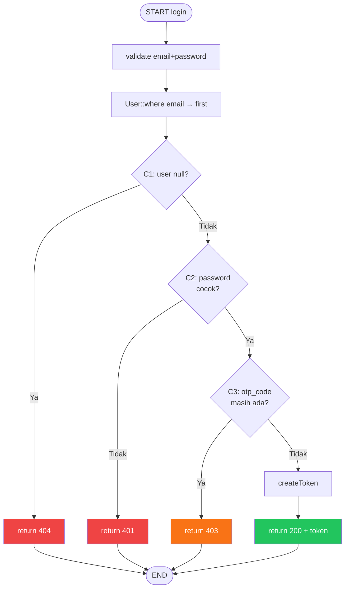
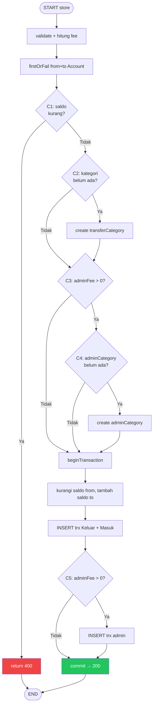
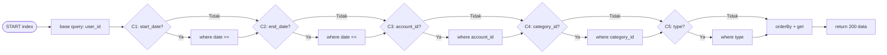

# White Box Testing — 04 Control Flow Testing
**Proyek:** SaPoPoe Finance  
**Teknik:** Control Flow Testing  
**Modul:** Auth · Transfer · Transaksi · Tabungan  
**Screenshot:** ✅ Ada — format nama: `CF-[MODUL]-[nomor].png`

---

## Definisi

> **Control Flow Testing berfokus pada memeriksa control logika (control flow) dengan tujuan memastikan semua jalur eksekusi yang dijalankan dengan benar dan tidak terjebak dalam suatu loop tak terhingga (trap).**
>
> — Materi Pertemuan 10, Software Quality, T Informatika UKRI

---

## Modul A — Autentikasi

### Method `login()` — 3 percabangan, 4 jalur

```php
if (!$user)                               // C1
    return 404;
if (!Hash::check($request->password, $user->password))  // C2
    return 401;
if ($user->otp_code)                      // C3
    return 403;
return 200 + access_token;               // sukses
```



| TC | Jalur | Input | Expected | HTTP | Screenshot |
|---|---|---|---|---|---|
| CF-AUTH-01 | C1=TRUE | email tidak ada di DB | "Alamat email tidak ditemukan" | 404 | `CF-AUTH-01.png` |
| CF-AUTH-02 | C1=F, C2=TRUE | email ada, password salah | "Kata sandi salah" | 401 | `CF-AUTH-02.png` |
| CF-AUTH-03 | C1=F, C2=F, C3=TRUE | email+pw benar, belum verify | "Akun belum diverifikasi" + need_otp:true | 403 | `CF-AUTH-03.png` |
| CF-AUTH-04 | C1=F, C2=F, C3=F | email+pw benar, sudah verify | access_token + user | 200 | `CF-AUTH-04.png` |

### Method `verifyOtp()` — 3 percabangan, 4 jalur

| TC | Jalur | Input | Expected | HTTP | Screenshot |
|---|---|---|---|---|---|
| CF-AUTH-05 | user null | email tidak ada | "Email tidak ditemukan" | 404 | `CF-AUTH-05.png` |
| CF-AUTH-06 | otp salah | otp_code: 000000 | "Kode verifikasi tidak valid" | 401 | `CF-AUTH-06.png` |
| CF-AUTH-07 | otp expired | otp benar tapi > 10 menit | "Kode kadaluarsa" | 401 | `CF-AUTH-07.png` |
| CF-AUTH-08 | sukses | otp benar, belum expired | "Verifikasi berhasil" | 200 | `CF-AUTH-08.png` |

**Total screenshot AUTH: 8** (`CF-AUTH-01.png` s.d. `CF-AUTH-08.png`)

---

## Modul B — Transfer

### Method `store()` — 5 percabangan

```php
if ($fromAccount->balance < $totalDeduction)   // C1
    return 400;
if (!$transferCategory)                         // C2
    create category;
if ($adminFee > 0)                             // C3
    if (!$adminCategory)                       // C4
        create adminCategory;
// dalam DB transaction:
if ($adminFee > 0)                             // C5
    INSERT admin fee trx;
```



| TC | Jalur | Input | Expected | HTTP | Screenshot |
|---|---|---|---|---|---|
| CF-TRF-01 | C1=TRUE | amount > saldo | "Saldo tidak mencukupi" | 400 | `CF-TRF-01.png` |
| CF-TRF-02 | semua F, C5=F | amount valid, tanpa admin_fee | "Transfer berhasil! Bebas biaya admin." | 200 | `CF-TRF-02.png` |
| CF-TRF-03 | semua F, C5=T | amount valid, admin_fee: 5000 | "Transfer berhasil! Biaya admin Rp 5.000 dicatat." | 200 | `CF-TRF-03.png` |

### Method `update()` — C1: data korup, C5: saldo kurang setelah revert

| TC | Jalur | Input | Expected | HTTP | Screenshot |
|---|---|---|---|---|---|
| CF-TRF-04 | C1=TRUE | siblings tanpa KELUAR/MASUK | "Data transfer korup" | 400 | `CF-TRF-04.png` |
| CF-TRF-05 | C5=TRUE | new amount > saldo setelah revert | "Saldo tidak mencukupi" | 400 | `CF-TRF-05.png` |
| CF-TRF-06 | sukses | new amount valid | "Transfer berhasil direvisi" | 200 | `CF-TRF-06.png` |

**Total screenshot Transfer: 6** (`CF-TRF-01.png` s.d. `CF-TRF-06.png`)

---

## Modul C — Transaksi

### Method `index()` — 5 filter independen

```php
if ($request->filled('start_date'))           // C1
if ($request->filled('end_date'))             // C2
if ($request->filled('financial_account_id')) // C3
if ($request->filled('category_id'))          // C4
if ($request->filled('type'))                 // C5
```



| TC | Jalur | Input | Expected | HTTP | Screenshot |
|---|---|---|---|---|---|
| CF-TRX-01 | semua filter kosong | GET /transactions (tanpa param) | semua transaksi user | 200 | `CF-TRX-01.png` |
| CF-TRX-02 | C1+C2=TRUE | start_date + end_date | transaksi dalam range | 200 | `CF-TRX-02.png` |
| CF-TRX-03 | C5=TRUE | type=income | hanya transaksi income | 200 | `CF-TRX-03.png` |

### Method `store()` — 1 percabangan (income vs expense)

| TC | Jalur | Input | Expected | HTTP | Screenshot |
|---|---|---|---|---|---|
| CF-TRX-04 | type=income | amount: 100000, type: income | balance += 100000 | 201 | `CF-TRX-04.png` |
| CF-TRX-05 | type=expense | amount: 50000, type: expense | balance -= 50000 | 201 | `CF-TRX-05.png` |

**Total screenshot Transaksi: 5** (`CF-TRX-01.png` s.d. `CF-TRX-05.png`)

---

## Modul D — Tabungan

### Method `store()` — 1 percabangan (current_amount > 0)

```php
if ($validated['current_amount'] > 0)   // C1
    kurangi saldo + catat trx
```

### Method `update()` — 2 percabangan

```php
if (isset($validated['current_amount']) && $oldAmount !== $validated['current_amount'])  // C1
    if ($selisih > 0)      // C2: top up
    else                   // C2: tarik
```

### Method `destroy()` — 1 percabangan

```php
if ($saving->current_amount > 0)   // C1
    kembalikan saldo + catat trx
```

| TC | Jalur | Input | Expected | HTTP | Screenshot |
|---|---|---|---|---|---|
| CF-SAV-01 | store C1=FALSE | current_amount: 0 (tanpa alokasi awal) | tabungan dibuat, saldo tidak berubah | 201 | `CF-SAV-01.png` |
| CF-SAV-02 | store C1=TRUE | current_amount: 100000 | saldo berkurang, trx Alokasi dibuat | 201 | `CF-SAV-02.png` |
| CF-SAV-03 | update C1=T, C2=T (top up) | current_amount naik | saldo berkurang + trx expense | 200 | `CF-SAV-03.png` |
| CF-SAV-04 | update C1=T, C2=F (tarik) | current_amount turun | saldo bertambah + trx income | 200 | `CF-SAV-04.png` |
| CF-SAV-05 | destroy C1=T (ada dana) | saving ada dananya | saldo kembali + trx Pencairan | 200 | `CF-SAV-05.png` |
| CF-SAV-06 | destroy C1=F (kosong) | current_amount: 0 | langsung delete, saldo tidak berubah | 200 | `CF-SAV-06.png` |

**Total screenshot Tabungan: 6** (`CF-SAV-01.png` s.d. `CF-SAV-06.png`)

---

## Ringkasan Screenshot Control Flow

| Modul | Jumlah File | Nama File |
|---|---|---|
| AUTH | 8 | `CF-AUTH-01.png` s.d. `CF-AUTH-08.png` |
| Transfer | 6 | `CF-TRF-01.png` s.d. `CF-TRF-06.png` |
| Transaksi | 5 | `CF-TRX-01.png` s.d. `CF-TRX-05.png` |
| Tabungan | 6 | `CF-SAV-01.png` s.d. `CF-SAV-06.png` |
| **Total** | **25** | |
