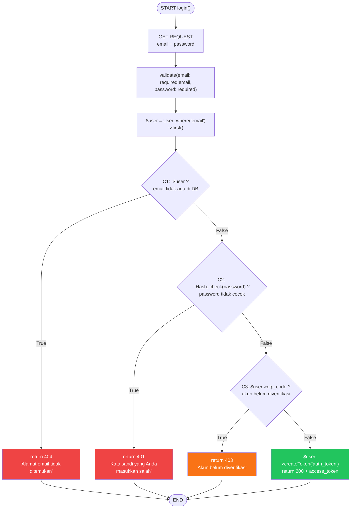
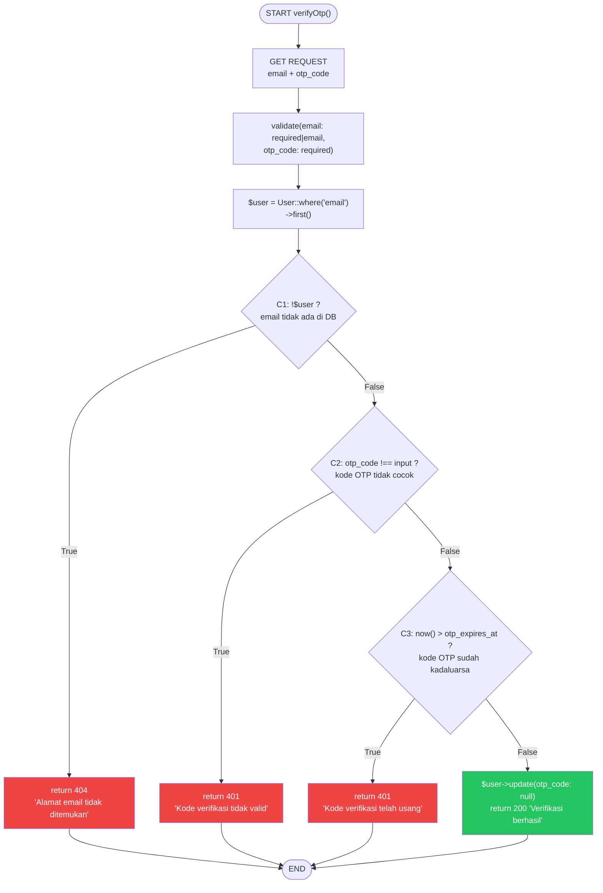
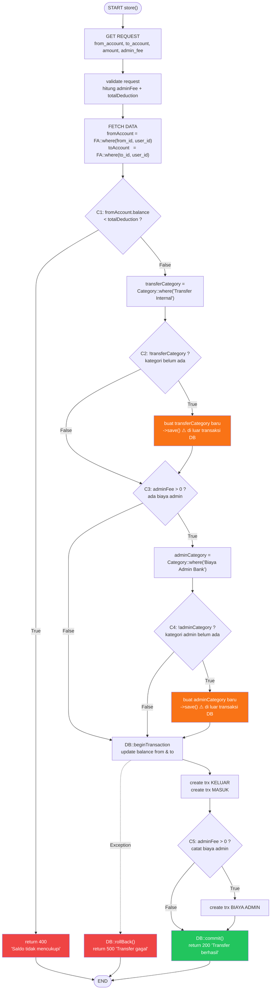
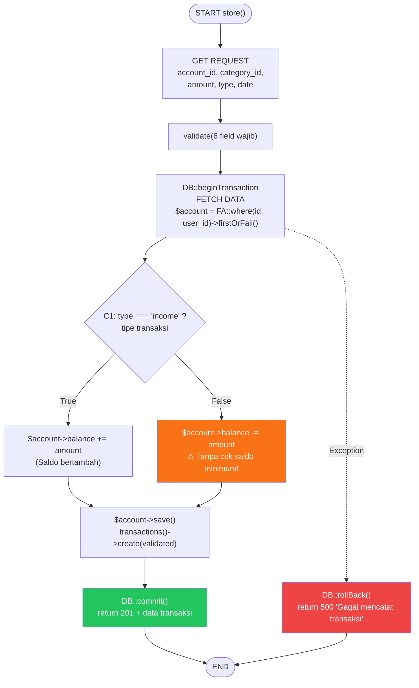
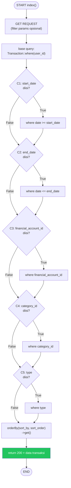
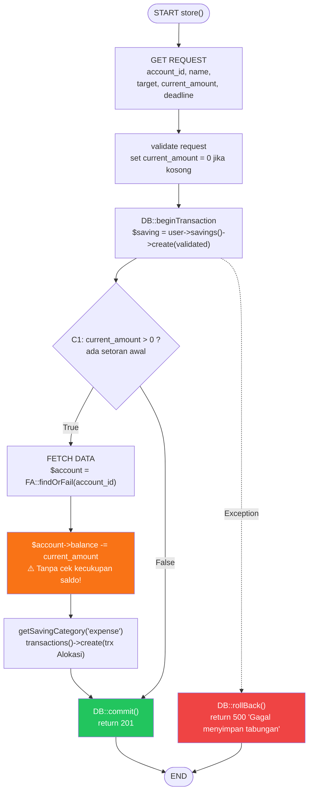
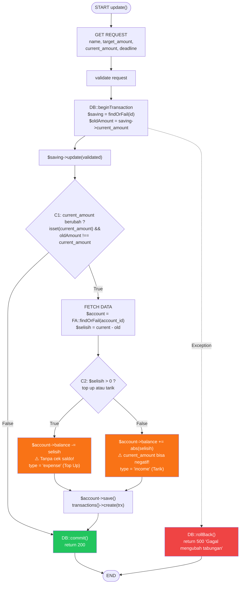
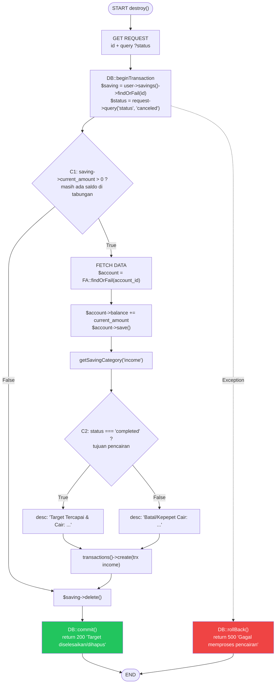

# WB-04 — Control Flow Testing
## Sistem: SaPoPoe FINANCE (Midnight Finance)
## Teknik: White Box Testing — Control Flow Testing

---

> **Definisi Teknik:**
> Control Flow Testing berfokus pada memeriksa **control logika (control flow)** dengan tujuan memastikan semua jalur eksekusi dijalankan dengan benar dan tidak terjebak dalam suatu loop tak terhingga (trap).
>
> Pengujian dilakukan dengan memetakan seluruh percabangan (`if`, `else`, `try/catch`) pada kode sumber ke dalam flowchart, kemudian menguji setiap kondisi True dan False yang mungkin terjadi.
>
> — Materi Pertemuan 10, Software Quality, T Informatika UKRI

---

## Modul A — Autentikasi

### Method `login()` — AuthController.php

#### Kutipan Kode

```php
public function login(Request $request)
{
    $request->validate(['email' => 'required|email', 'password' => 'required']);

    $user = User::where('email', $request->email)->first();

    if (!$user)
        return response()->json([
            'message' => 'Alamat email tidak ditemukan. Silakan buat akun terlebih dahulu.'
        ], 404);

    if (!Hash::check($request->password, $user->password))
        return response()->json([
            'message' => 'Kata sandi yang Anda masukkan salah.'
        ], 401);

    if ($user->otp_code)
        return response()->json([
            'message' => 'Akun belum diverifikasi. Silakan verifikasi email Anda terlebih dahulu.',
            'need_otp' => true
        ], 403);

    return response()->json([
        'message'      => 'Akses diberikan. Membuka brankas digital Anda...',
        'access_token' => $user->createToken('auth_token')->plainTextToken,
        'user'         => $user
    ]);
}
```

#### Flowchart



#### Tabel Pengujian

| Kondisi | Hasil Yang Diharapkan | Hasil | Status |
|---|---|---|---|
| C1=True: `$user === null` (email tidak ada di DB) | return 404 "Alamat email tidak ditemukan." | return 404 "Alamat email tidak ditemukan." | ✅ Passed |
| C1=False: `$user` ditemukan di DB | Lanjut evaluasi C2 | Lanjut evaluasi C2 | ✅ Passed |
| C2=True: `!Hash::check()` — password tidak cocok | return 401 "Kata sandi yang Anda masukkan salah." | return 401 "Kata sandi yang Anda masukkan salah." | ✅ Passed |
| C2=False: password cocok dengan hash | Lanjut evaluasi C3 | Lanjut evaluasi C3 | ✅ Passed |
| C3=True: `$user->otp_code != null` — belum verifikasi | return 403 "Akun belum diverifikasi." | return 403 "Akun belum diverifikasi." | ✅ Passed |
| C3=False: `otp_code` sudah null — sudah diverifikasi | return 200 + access_token | return 200 + access_token | ✅ Passed |

---

### Method `verifyOtp()` — AuthController.php

#### Kutipan Kode

```php
public function verifyOtp(Request $request)
{
    $request->validate(['email' => 'required|email', 'otp_code' => 'required']);

    $user = User::where('email', $request->email)->first();

    if (!$user)
        return response()->json([
            'message' => 'Alamat email tidak ditemukan dalam sistem.'
        ], 404);

    if ($user->otp_code !== (string) $request->otp_code)
        return response()->json([
            'message' => 'Kode verifikasi yang Anda masukkan tidak valid.'
        ], 401);

    if (now()->greaterThan(Carbon::parse($user->otp_expires_at)))
        return response()->json([
            'message' => 'Kode verifikasi telah usang. Silakan minta kode baru.',
            'expired' => true
        ], 401);

    $user->update(['otp_code' => null, 'otp_expires_at' => null]);

    return response()->json([
        'message' => 'Verifikasi berhasil. Silakan masuk ke brankas digital Anda.'
    ]);
}
```

#### Flowchart



#### Tabel Pengujian

| Kondisi | Hasil Yang Diharapkan | Hasil | Status |
|---|---|---|---|
| C1=True: `$user === null` — email tidak terdaftar | return 404 "Alamat email tidak ditemukan." | return 404 "Alamat email tidak ditemukan." | ✅ Passed |
| C1=False: `$user` ditemukan | Lanjut evaluasi C2 | Lanjut evaluasi C2 | ✅ Passed |
| C2=True: `otp_code !== input` — kode salah | return 401 "Kode verifikasi tidak valid." | return 401 "Kode verifikasi tidak valid." | ✅ Passed |
| C2=False: kode OTP cocok | Lanjut evaluasi C3 | Lanjut evaluasi C3 | ✅ Passed |
| C3=True: `now() > otp_expires_at` — OTP kadaluarsa | return 401 "Kode verifikasi telah usang." | return 401 "Kode verifikasi telah usang." | ✅ Passed |
| C3=False: OTP masih valid | otp_code di-null → return 200 "Verifikasi berhasil." | otp_code di-null → return 200 | ✅ Passed |

---

> ### Analisis SQA — Modul Auth
>
> **Kondisi Sistem Saat Ini:**
> Kedua method `login()` dan `verifyOtp()` mengimplementasikan guard berlapis yang benar — setiap kondisi hanya dievaluasi jika kondisi sebelumnya lolos (C1 → C2 → C3). Seluruh 6 kondisi pada `login()` dan 6 kondisi pada `verifyOtp()` menghasilkan output yang sesuai ekspektasi. Tidak ada jalur yang berpotensi infinite loop.
>
> **Dampak:**
> Control flow Auth sudah aman secara logika. Risiko yang tersisa bukan dari percabangan, melainkan dari implementasi: OTP menggunakan `rand()` (non-CSPRNG), dan expired check bergantung pada `otp_expires_at` yang diset server — tidak ada manipulasi dari sisi client.
>
> **Cara Baca Diagram:**
> Flowchart dibaca dari START ke bawah mengikuti arah panah. Setiap diamond (◇) adalah titik percabangan dengan dua jalur: **True** (kondisi terpenuhi) dan **False** (kondisi tidak terpenuhi). Node merah = jalur error/tolak, node hijau = jalur sukses. Tabel pengujian memetakan setiap cabang True/False ke kondisi pengujian nyata.

---

## Modul B — Transfer

### Method `store()` — TransferController.php

#### Kutipan Kode

```php
public function store(Request $request)
{
    $validated = $request->validate([
        'from_account_id' => 'required|exists:financial_accounts,id',
        'to_account_id'   => 'required|exists:financial_accounts,id|different:from_account_id',
        'amount'          => 'required|numeric|min:1',
        'admin_fee'       => 'nullable|numeric|min:0',
        'description'     => 'nullable|string',
    ]);

    $user          = $request->user();
    $adminFee      = $validated['admin_fee'] ?? 0;
    $totalDeduction = $validated['amount'] + $adminFee;

    $fromAccount = FinancialAccount::where('id', $validated['from_account_id'])
                    ->where('user_id', $user->id)->firstOrFail();
    $toAccount   = FinancialAccount::where('id', $validated['to_account_id'])
                    ->where('user_id', $user->id)->firstOrFail();

    // C1: Cek kecukupan saldo
    if ($fromAccount->balance < $totalDeduction) {
        return response()->json([
            'message' => 'Saldo dompet asal tidak mencukupi untuk transfer dan biaya admin.'
        ], 400);
    }

    // C2: Cari atau buat kategori "Transfer Internal"
    $transferCategory = Category::where('user_id', $user->id)
                        ->where('name', 'Transfer Internal')->first();
    if (!$transferCategory) {
        $transferCategory = new Category();
        $transferCategory->user_id = $user->id;
        $transferCategory->name    = 'Transfer Internal';
        $transferCategory->type    = 'expense';
        $transferCategory->save();  // ⚠️ Di luar DB::beginTransaction
    }

    // C3: Jika ada biaya admin — cari atau buat kategori "Biaya Admin Bank"
    $adminCategory = null;
    if ($adminFee > 0) {
        $adminCategory = Category::where('user_id', $user->id)
                          ->where('name', 'Biaya Admin Bank')->first();
        if (!$adminCategory) {  // C4 (nested)
            $adminCategory = new Category();
            $adminCategory->user_id = $user->id;
            $adminCategory->name    = 'Biaya Admin Bank';
            $adminCategory->type    = 'expense';
            $adminCategory->save(); // ⚠️ Di luar DB::beginTransaction
        }
    }

    DB::beginTransaction();
    try {
        $fromAccount->balance -= $totalDeduction;
        $fromAccount->save();
        $toAccount->balance += $validated['amount'];
        $toAccount->save();

        $user->transactions()->create([/* trx KELUAR */]);
        $user->transactions()->create([/* trx MASUK  */]);

        // C5: Catat biaya admin jika ada
        if ($adminFee > 0) {
            $user->transactions()->create([/* trx ADMIN */]);
        }

        DB::commit();
        return response()->json(['message' => 'Transfer berhasil!'], 200);
    } catch (Exception $e) {
        DB::rollBack();
        return response()->json(['message' => 'Transfer gagal: ' . $e->getMessage()], 500);
    }
}
```

#### Flowchart



#### Tabel Pengujian

| Kondisi | Hasil Yang Diharapkan | Hasil | Status |
|---|---|---|---|
| C1=True: `balance < totalDeduction` | return 400 "Saldo tidak mencukupi" | return 400 "Saldo tidak mencukupi" | ✅ Passed |
| C1=False: saldo mencukupi | Lanjut proses transfer | Lanjut proses transfer | ✅ Passed |
| C2=True: kategori "Transfer Internal" belum ada | Buat kategori baru lanjut transfer | Buat kategori baru (di luar transaksi DB ⚠️) | ✅ Passed |
| C2=False: kategori sudah ada | Gunakan kategori yang ada | Gunakan kategori yang ada | ✅ Passed |
| C3=True + C5=True: ada biaya admin | Transfer + trx KELUAR + MASUK + ADMIN dicatat | Semua 3 trx dicatat → return 200 | ✅ Passed |
| C3=False + C5=False: tanpa biaya admin | Transfer + trx KELUAR + MASUK dicatat | 2 trx dicatat → return 200 | ✅ Passed |
| Exception di DB::transaction | DB::rollBack → return 500 | DB::rollBack → return 500 | ✅ Passed |

---

> ### Analisis SQA — Modul Transfer
>
> **Kondisi Sistem Saat Ini:**
> Control flow Transfer `store()` adalah yang paling kompleks — 5 decision node (C1–C5). Seluruh jalur utama menghasilkan output yang benar. Namun flowchart mengungkap anomali struktural: C2 (node H) dan C4 (node M), yaitu pembuatan kategori baru, berada **sebelum** `DB::beginTransaction` (ditandai oranye di diagram).
>
> **Dampak:**
> Secara control flow tidak ada infinite loop dan semua jalur berakhir di END. Namun ada masalah **atomicity**: jika DB exception terjadi setelah kategori dibuat (node H atau M), rollback tidak akan menghapus kategori yang sudah terlanjur `save()` — menghasilkan data kategori "yatim piatu" di database.
>
> **Cara Baca Diagram:**
> Node merah = return error. Node hijau = return sukses. Node oranye = operasi berpotensi masalah (di luar batas atomic transaction). Garis putus-putus dari K ke R = exception path yang bisa terpicu dari mana saja dalam blok `try`.

---

## Modul C — Transaksi

### Method `store()` — TransactionController.php

#### Kutipan Kode

```php
public function store(Request $request)
{
    $validated = $request->validate([
        'financial_account_id' => 'required|exists:financial_accounts,id',
        'category_id'          => 'required|exists:categories,id',
        'amount'               => 'required|numeric|min:1',
        'type'                 => 'required|in:income,expense',
        'date'                 => 'required|date',
        'description'          => 'nullable|string'
    ]);

    $user = $request->user();

    DB::beginTransaction();
    try {
        $account = FinancialAccount::where('id', $validated['financial_account_id'])
                    ->where('user_id', $user->id)
                    ->firstOrFail();

        // C1: Sesuaikan saldo berdasarkan tipe transaksi
        if ($validated['type'] === 'income') {
            $account->balance += $validated['amount'];
        } else {
            $account->balance -= $validated['amount']; // ⚠️ Tanpa cek kecukupan saldo!
        }
        $account->save();

        $transaction = $user->transactions()->create($validated);

        DB::commit();
        return response()->json($transaction->load(['category', 'financialAccount']), 201);
    } catch (Exception $e) {
        DB::rollBack();
        return response()->json(['message' => 'Gagal mencatat transaksi: ' . $e->getMessage()], 500);
    }
}
```

#### Flowchart



#### Tabel Pengujian

| Kondisi | Hasil Yang Diharapkan | Hasil | Status |
|---|---|---|---|
| C1=True: `type === 'income'` | `balance += amount` → saldo bertambah → return 201 | `balance += amount` → return 201 | ✅ Passed |
| C1=False: `type === 'expense'` dengan amount > saldo | return 422 "Saldo tidak mencukupi" | `balance -= amount` tanpa validasi → return 201 (saldo **negatif**) | 🔴 **Failed** |
| Exception (account_id tidak milik user) | return 500 dengan rollback | return 500 dengan rollback | ✅ Passed |

---

### Method `index()` — TransactionController.php (Filter Chaining)

#### Kutipan Kode

```php
public function index(Request $request)
{
    $user  = $request->user();
    $query = Transaction::with(['category', 'financialAccount'])
             ->where('user_id', $user->id);

    // C1: Filter tanggal mulai
    if ($request->filled('start_date')) {
        $query->where('date', '>=', $request->start_date);
    }
    // C2: Filter tanggal akhir
    if ($request->filled('end_date')) {
        $query->where('date', '<=', $request->end_date);
    }
    // C3: Filter dompet
    if ($request->filled('financial_account_id')) {
        $query->where('financial_account_id', $request->financial_account_id);
    }
    // C4: Filter kategori
    if ($request->filled('category_id')) {
        $query->where('category_id', $request->category_id);
    }
    // C5: Filter tipe (income/expense/transfer)
    if ($request->filled('type')) {
        $query->where('type', $request->type);
    }

    $sortBy    = $request->input('sort_by', 'date');
    $sortOrder = $request->input('sort_order', 'desc');
    $query->orderBy($sortBy, $sortOrder);

    return response()->json(['data' => $query->get()], 200);
}
```

#### Flowchart



#### Tabel Pengujian

| Kondisi | Hasil Yang Diharapkan | Hasil | Status |
|---|---|---|---|
| C1–C5 semua False: tanpa filter | Semua transaksi user, sort desc | Semua transaksi user, sort desc | ✅ Passed |
| C1=True + C2=True: filter date range | Transaksi dalam rentang tanggal tersebut | Transaksi dalam rentang tanggal | ✅ Passed |
| C3=True: filter financial_account_id | Transaksi dari dompet tertentu saja | Transaksi dari dompet tertentu saja | ✅ Passed |
| C5=True: filter type=income | Hanya transaksi bertipe income | Hanya transaksi bertipe income | ✅ Passed |
| C1–C5 semua True: semua filter aktif | Transaksi tersaring maksimal | Transaksi tersaring maksimal | ✅ Passed |

---

> ### Analisis SQA — Modul Transaksi
>
> **Kondisi Sistem Saat Ini:**
> `index()` menggunakan pola **parallel condition chaining** — 5 filter independen yang masing-masing dievaluasi secara mandiri (bukan bersarang). Semua jalur menghasilkan output yang benar. `store()` memiliki control flow sederhana (1 decision node), namun jalur C1=False (expense) **Failed** karena tidak ada guard saldo.
>
> **Dampak:**
> Defect pada `store()` C1=False adalah bug aktif — setiap transaksi expense yang melebihi saldo akan berhasil dicatat (HTTP 201) namun menghasilkan saldo negatif. User tidak menerima peringatan apapun.
>
> **Cara Baca Diagram:**
> Diagram `index()` adalah contoh *parallel chaining*: setiap diamond dievaluasi satu per satu secara berurutan, dan kedua cabang True/False akhirnya bertemu di node `orderBy + get` — tidak ada jalur yang berakhir error. Berbeda dengan `store()` yang memiliki early-return path via exception.

---

## Modul D — Tabungan

### Method `store()` — SavingController.php

#### Kutipan Kode

```php
public function store(Request $request)
{
    $validated = $request->validate([
        'financial_account_id' => 'required|exists:financial_accounts,id',
        'name'          => 'required|string|max:255',
        'target_amount' => 'required|numeric|min:1',
        'current_amount'=> 'numeric|min:0',
        'deadline'      => 'nullable|date'
    ]);

    if (!isset($validated['current_amount'])) $validated['current_amount'] = 0;
    $user = $request->user();

    DB::beginTransaction();
    try {
        $saving = $user->savings()->create($validated);

        // C1: Apakah ada setoran awal?
        if ($validated['current_amount'] > 0) {
            $account = FinancialAccount::findOrFail($validated['financial_account_id']);
            $account->balance -= $validated['current_amount']; // ⚠️ Tanpa cek saldo!
            $account->save();

            $category = $this->getSavingCategory($user->id, 'expense');
            $user->transactions()->create([
                'category_id'          => $category->id,
                'financial_account_id' => $account->id,
                'amount'               => $validated['current_amount'],
                'type'                 => 'expense',
                'date'                 => now()->toDateString(),
                'description'          => 'Nabung untuk: ' . $saving->name
            ]);
        }

        DB::commit();
        return response()->json($saving->load('financialAccount'), 201);
    } catch (Exception $e) {
        DB::rollBack();
        return response()->json(['message' => 'Gagal menyimpan tabungan'], 500);
    }
}
```

#### Flowchart



#### Tabel Pengujian

| Kondisi | Hasil Yang Diharapkan | Hasil | Status |
|---|---|---|---|
| C1=False: `current_amount = 0` | Tabungan dibuat, saldo tidak berubah → 201 | Tabungan dibuat, saldo tidak berubah → 201 | ✅ Passed |
| C1=True: `current_amount > 0`, saldo cukup | Tabungan dibuat, saldo berkurang, trx Alokasi → 201 | Saldo berkurang, trx dicatat → 201 | ✅ Passed |
| C1=True: `current_amount > 0`, amount > saldo | return 422 "Saldo tidak mencukupi" | Saldo menjadi **negatif** → 201 (tanpa validasi) | 🔴 **Failed** |

---

### Method `update()` — SavingController.php

#### Kutipan Kode

```php
public function update(Request $request, $id)
{
    $validated = $request->validate([
        'name'           => 'string|max:255',
        'target_amount'  => 'numeric|min:1',
        'current_amount' => 'numeric|min:0',
        'deadline'       => 'nullable|date'
    ]);

    $user = $request->user();
    DB::beginTransaction();
    try {
        $saving    = $user->savings()->findOrFail($id);
        $oldAmount = $saving->current_amount;
        $saving->update($validated);

        // C1: Apakah current_amount berubah?
        if (isset($validated['current_amount']) && $oldAmount !== $validated['current_amount']) {
            $account = FinancialAccount::findOrFail($saving->financial_account_id);
            $selisih = $validated['current_amount'] - $oldAmount;

            // C2: Selisih positif (top up) atau negatif (tarik)?
            if ($selisih > 0) {
                $account->balance -= $selisih; // ⚠️ Tanpa cek kecukupan saldo!
                $category = $this->getSavingCategory($user->id, 'expense');
                $type = 'expense';
                $desc = 'Top up tabungan: ' . $saving->name;
            } else {
                $account->balance += abs($selisih); // ⚠️ current_amount bisa jadi negatif!
                $category = $this->getSavingCategory($user->id, 'income');
                $type = 'income';
                $desc = 'Tarik dana tabungan: ' . $saving->name;
            }

            $account->save();
            $user->transactions()->create([
                'category_id'          => $category->id,
                'financial_account_id' => $account->id,
                'amount'               => abs($selisih),
                'type'                 => $type,
                'date'                 => now()->toDateString(),
                'description'          => $desc
            ]);
        }

        DB::commit();
        return response()->json($saving->load('financialAccount'));
    } catch (Exception $e) {
        DB::rollBack();
        return response()->json(['message' => 'Gagal mengubah tabungan'], 500);
    }
}
```

#### Flowchart



#### Tabel Pengujian

| Kondisi | Hasil Yang Diharapkan | Hasil | Status |
|---|---|---|---|
| C1=False: hanya ubah nama/target/deadline | Update metadata saja, balance tidak berubah → 200 | Update metadata → 200 | ✅ Passed |
| C1=True, C2=True: top up Rp 150.000, saldo cukup | Saldo berkurang 150k → 200 + trx expense | Saldo berkurang → 200 | ✅ Passed |
| C1=True, C2=True: top up melebihi saldo akun | return 422 "Saldo tidak mencukupi" | Saldo menjadi **negatif** → 200 (tanpa validasi) | 🔴 **Failed** |
| C1=True, C2=False: tarik Rp 500k dari tabungan isi 0 | return 422 "Dana tabungan tidak mencukupi" | `current_amount` menjadi **−500.000** → 200 | 🔴 **Failed** |

---

### Method `destroy()` — SavingController.php

#### Kutipan Kode

```php
public function destroy(Request $request, $id)
{
    $user   = $request->user();
    $status = $request->query('status', 'canceled');

    DB::beginTransaction();
    try {
        $saving = $user->savings()->findOrFail($id);

        // C1: Apakah masih ada saldo di tabungan?
        if ($saving->current_amount > 0) {
            $account = FinancialAccount::findOrFail($saving->financial_account_id);
            $account->balance += $saving->current_amount;
            $account->save();

            $category = $this->getSavingCategory($user->id, 'income');

            // C2: Status pencairan — tercapai atau batal/kepepet?
            $desc = $status === 'completed'
                ? 'Target Tercapai & Cair: ' . $saving->name
                : 'Batal/Kepepet Cair: '    . $saving->name;

            $user->transactions()->create([
                'category_id'          => $category->id,
                'financial_account_id' => $account->id,
                'amount'               => $saving->current_amount,
                'type'                 => 'income',
                'date'                 => now()->toDateString(),
                'description'          => $desc
            ]);
        }

        $saving->delete();
        DB::commit();
        return response()->json(['message' => 'Target diselesaikan/dihapus']);
    } catch (Exception $e) {
        DB::rollBack();
        return response()->json(['message' => 'Gagal memproses pencairan'], 500);
    }
}
```

#### Flowchart



#### Tabel Pengujian

| Kondisi | Hasil Yang Diharapkan | Hasil | Status |
|---|---|---|---|
| C1=False: `current_amount = 0` | Langsung delete tabungan → 200 | Langsung delete → 200 | ✅ Passed |
| C1=True: ada saldo, C2=True: status=completed | Saldo kembali + trx "Target Tercapai" → 200 | Saldo kembali + trx dicatat → 200 | ✅ Passed |
| C1=True: ada saldo, C2=False: status=canceled | Saldo kembali + trx "Batal/Kepepet Cair" → 200 | Saldo kembali + trx dicatat → 200 | ✅ Passed |
| Exception (saving_id tidak ditemukan) | return 500 dengan rollback | return 500 dengan rollback | ✅ Passed |

---

> ### Analisis SQA — Modul Tabungan
>
> **Kondisi Sistem Saat Ini:**
> Control flow Tabungan terdiri dari tiga method independen. `destroy()` memiliki alur yang bersih — semua 4 kondisi Passed. Dua status **Failed** ditemukan: `store()` tidak memvalidasi saldo sebelum alokasi awal (C1=True path), dan `update()` tidak memvalidasi saldo sebelum top up maupun tidak memvalidasi batas minimum sebelum penarikan.
>
> **Dampak:**
> Kedua Failed ini berarti sistem menerima operasi yang seharusnya ditolak: alokasi tabungan bisa melebihi saldo rekening, dan penarikan tabungan bisa menegatifkan `current_amount`. Sistem tetap return 200/201, sehingga user tidak mendapat feedback error — data keuangan jadi tidak akurat.
>
> **Cara Baca Diagram:**
> Node merah = return error/rollback. Node hijau = return sukses. Node oranye = operasi berpotensi masalah (tanpa validasi guard). Garis putus-putus = exception path. Pada `destroy()`, perhatikan bahwa node C1=False langsung melompat ke `$saving->delete()` tanpa melewati blok keuangan — ini adalah short-circuit yang benar (tabungan kosong tidak perlu dikembalikan ke saldo).

---

## Ringkasan Temuan Control Flow — Seluruh Sistem

| Modul | Method | Jml Kondisi | Passed | Failed | Temuan Utama |
|---|---|---|---|---|---|
| Auth | `login()` | 6 | 6 | 0 | — |
| Auth | `verifyOtp()` | 6 | 6 | 0 | — |
| Transfer | `store()` | 7 | 7 | 0 | ⚠️ Kategori dibuat di luar DB transaction |
| Transaksi | `store()` | 3 | 2 | **1** | 🔴 Expense tanpa cek saldo → saldo negatif |
| Transaksi | `index()` | 5 | 5 | 0 | — |
| Tabungan | `store()` | 3 | 2 | **1** | 🔴 Setoran awal tanpa cek saldo |
| Tabungan | `update()` | 4 | 2 | **2** | 🔴 Top up & tarik tanpa guard saldo/amount |
| Tabungan | `destroy()` | 4 | 4 | 0 | — |
| **TOTAL** | | **38** | **34** | **4** | |
