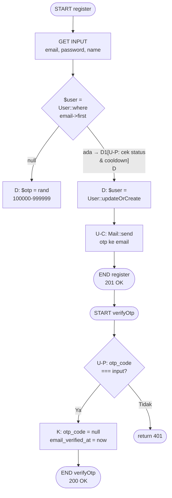
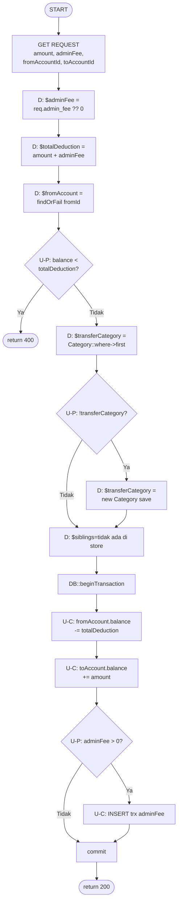
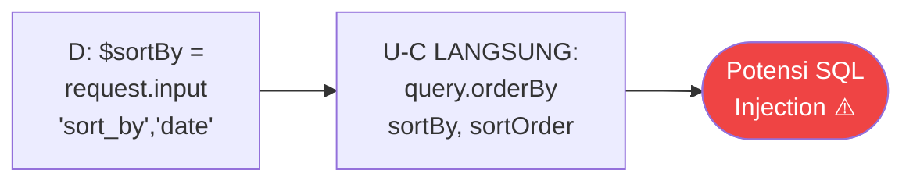
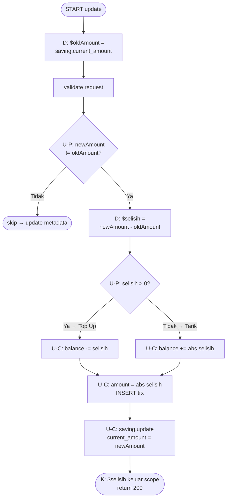

# White Box Testing — 06 Data Flow Testing
**Proyek:** SaPoPoe Finance  
**Teknik:** Data Flow Testing  
**Modul:** Auth · Transfer · Transaksi · Tabungan

---

## Definisi

> **Teknik yang berfokus pada aliran data diklarifikasi dengan ketatapan bagaimana variabel sistem dikarakterisasi dan digunakan serta teridentifikasi skenario yang telah ditetapkan, sehingga diketahui program apa menangani data dengan benar, dan menyebabkan error atau perilaku tidak terduga.**
>
> — Materi Pertemuan 10, Software Quality, T Informatika UKRI

**Notasi yang digunakan:**
- **D** (Define) = variabel diberi nilai / didefinisikan
- **U-C** (Use-Computation) = variabel digunakan dalam kalkulasi / ekspresi
- **U-P** (Use-Predicate) = variabel digunakan dalam kondisi if / while
- **K** (Kill) = variabel keluar scope atau di-null-kan

---

## Modul A — Autentikasi (`AuthController.php`)

### Alur Data: Proses Registrasi dan Verifikasi OTP

| Komponen | Definisi | Penggunaan | Deskripsi |
|---|---|---|---|
| Input Pengguna | `email` (string), `password` (string), `name` (string) | `validate()`, `User::where(email)`, `Hash::make(password)` | Data yang dikirim user melalui form registrasi. Email menjadi kunci unik pencarian user. |
| `$otp` | `$otp = rand(100000, 999999)` — integer 6 digit | `'otp_code' => (string)$otp`, `Mail::send(['otp' => $otp])` | Kode verifikasi sementara. Didefinisikan sekali, digunakan dua kali (simpan ke DB dan kirim email), lalu di-kill saat scope selesai. |
| `$user` | D1: `User::where(email)->first()` (bisa null) | U-P: cek `$user->status`, U-C: `checkCooldown($user)` | Anomali DD: `$user` didefinisikan ulang di D2: `User::updateOrCreate()`. Ini intentional — D1 untuk validasi, D2 untuk simpan. |
| `$user->otp_code` | D: di-set saat register dengan nilai OTP | U-P: di `login()` → blokir jika tidak null; U-P: di `verifyOtp()` → bandingkan dengan input | K: di-null-kan setelah verifikasi berhasil. Ini adalah variabel lintas-request yang paling kritis di sistem Auth. |
| Output Sistem | `access_token` (Sanctum token string) | Return 200 di `login()` setelah semua kondisi lolos | Token ini menjadi credentials untuk semua endpoint yang dilindungi `auth:sanctum`. |

---

> ### 📋 Analisis SQA — Modul Auth
>
> **Kondisi Sistem Saat Ini**
> Aliran data di Auth mengikuti pola yang baik: input diterima → divalidasi → diolah → disimpan → digunakan → di-kill. Variabel `$user->otp_code` adalah variabel paling kompleks karena hidupnya melintas beberapa HTTP request dan method berbeda. Anomali yang ditemukan: `$user` didefinisikan dua kali (DD) dalam satu method `register()` — ini intentional tapi membingungkan bagi reviewer baru.
>
> **Dampak**
> Anomali DD pada `$user` tidak berbahaya secara fungsional, tetapi meningkatkan cognitive load reviewer. Risiko nyata ada di `$otp`: menggunakan `rand()` berarti variabel ini memiliki **entropi rendah** — predictable dalam skenario tertentu. Jika attacker dapat menduga nilai `$otp`, mereka bisa memverifikasi akun orang lain.
>
> **Cara Baca Tabel dan Diagram**
> Tabel menampilkan **komponen** (bukan hanya variabel tunggal) beserta lifecycle-nya. Kolom "Penggunaan" menunjukkan di mana dalam kode komponen tersebut dikonsumsi. Diagram flowchart menunjukkan aliran data secara visual — kotak berwarna gelap adalah titik Define (D), berlian adalah titik Use-Predicate (U-P). Tanda K pada otp_code menunjukkan titik di mana variabel "dibunuh" (di-null-kan).

---

## Modul B — Transfer (`TransferController.php`)

### Alur Data: Method `store()` dengan Admin Fee

| Komponen | Definisi | Penggunaan | Deskripsi |
|---|---|---|---|
| Input Transfer | `amount`, `admin_fee`, `from_account_id`, `to_account_id` | Validasi, kalkulasi totalDeduction, lookup akun | Data inti transaksi yang menentukan seluruh alur pemrosesan. |
| `$adminFee` | `$adminFee = $validated['admin_fee'] ?? 0` | U-C: `$totalDeduction = amount + $adminFee`; U-P: `if ($adminFee > 0)` — 2x | Digunakan sebagai predikat dua kali (C3 dan C5) tanpa perubahan nilai di antara keduanya — redundan tapi tidak berbahaya. |
| `$totalDeduction` | `$totalDeduction = amount + $adminFee` | U-P: `$fromAccount->balance < $totalDeduction`; U-C: `$fromAccount->balance -= $totalDeduction` | Variabel agregat yang menggabungkan dua komponen biaya. Jika `$adminFee = 0`, nilainya sama dengan `amount`. |
| `$transferCategory` | D1: `Category::where()->first()` (bisa null) | U-P: `if (!$transferCategory)` | Anomali DD: jika null, di-define ulang dengan `new Category()`. Kode di luar scope transaction — berpotensi orphan jika rollback. |
| `$siblings` (update/destroy) | `Transaction::where(created_at)->get()` | U-P: cek ada KELUAR/MASUK; U-C: foreach revert saldo | Variabel koleksi kritis. Didefinisikan menggunakan `created_at` sebagai key — rawan race condition. |
| Output | `fromAccount.balance` baru, 2–3 record transaksi | Return 200 + pesan konfirmasi | State akhir yang harus diverifikasi: saldo berkurang tepat sebesar `totalDeduction`, saldo tujuan bertambah sebesar `amount`. |

---

> ### 📋 Analisis SQA — Modul Transfer
>
> **Kondisi Sistem Saat Ini**
> Aliran data Transfer melibatkan banyak komponen yang berinteraksi: dua akun, dua atau tiga record transaksi, satu atau dua kategori. Variabel `$adminFee` mengalami anomali U-P redundan — dicek dua kali dengan kondisi identik tanpa perubahan nilai di antaranya. Variabel `$siblings` menggunakan `created_at` sebagai discriminator, yang merupakan anomali keamanan data.
>
> **Dampak**
> Race condition pada `$siblings` bisa terjadi ketika dua transfer diproses dalam detik yang sama: sistem akan salah mengidentifikasi sibling dan me-revert saldo yang salah. Ini adalah bug concurrency yang sangat sulit direproduksi di development tapi bisa terjadi di production dengan traffic tinggi.
>
> **Cara Baca Tabel**
> Tabel menampilkan komponen sebagai unit aliran data — bukan hanya variabel primitif. Perhatikan kolom "Penggunaan": komponen yang muncul di U-P adalah yang menentukan jalur eksekusi (decision-maker), sedangkan U-C adalah yang menentukan nilai output. Anomali yang paling perlu diperhatikan adalah komponen yang memiliki lebih dari satu titik Define (D) — ini menandakan variabel yang di-overwrite.

---

## Modul C — Transaksi (`TransactionController.php`)

### Alur Data: Variable `$sortBy` — Anomali Keamanan

| Komponen | Definisi | Penggunaan | Deskripsi |
|---|---|---|---|
| Input Filter | `start_date`, `end_date`, `financial_account_id`, `category_id`, `type` | U-P: `$request->filled()` di index() | Semua filter divalidasi keberadaannya (`filled`) sebelum ditambahkan ke query. Aman. |
| `$sortBy` | `$sortBy = $request->input('sort_by', 'date')` — langsung dari user | U-C: `$query->orderBy($sortBy, $sortOrder)` | **ANOMALI KRITIS:** D langsung ke U-C tanpa validasi whitelist. Nama kolom tidak di-binding oleh Eloquent. |
| `$sortOrder` | `$sortOrder = $request->input('sort_order', 'desc')` | U-C: `$query->orderBy($sortBy, $sortOrder)` | Sama dengan `$sortBy` — tidak ada whitelist validasi. |
| `$account` (store) | `FinancialAccount::where(id)->where(user_id)->firstOrFail()` | U-C: `$account->balance +=/-=` | Sudah memfilter `user_id` — aman. |
| `$oldAccount` (update) | `FinancialAccount::findOrFail($transaction->financial_account_id)` | U-C: `$oldAccount->balance -=/+=` | **ANOMALI:** findOrFail tanpa filter user_id. Berpotensi IDOR. |
| Output Transaksi | `$account->balance` baru, 1 record transaksi | Return 200/201 | Saldo berubah sesuai tipe transaksi — tanpa guard minimum saldo untuk expense. |

---

> ### 📋 Analisis SQA — Modul Transaksi
>
> **Kondisi Sistem Saat Ini**
> Transaksi memiliki dua anomali data flow yang paling kritis di seluruh sistem: (1) `$sortBy` langsung dari request ke `orderBy()` tanpa whitelist, dan (2) `$oldAccount` diambil tanpa verifikasi `user_id`. Ini adalah dua kerentanan yang dapat dieksploitasi secara aktif.
>
> **Dampak**
> Anomali `$sortBy` → SQL Injection: attacker bisa mengirim `sort_by=(SELECT%20password%20FROM%20users%20LIMIT%201)` dan jika query error terekspos, password bisa terbaca. Anomali `$oldAccount` → IDOR: attacker yang berhasil memanipulasi `transaction.financial_account_id` bisa mengubah saldo akun user lain. Kedua kerentanan ini masuk kategori **OWASP Top 10**.
>
> **Cara Baca Diagram**
> Diagram anomali `$sortBy` sengaja dibuat sederhana (dua node saja) untuk memperjelas betapa pendeknya jalur data dari input user ke query SQL — tanpa filter apapun di antara keduanya. Node merah menunjukkan titik kerentanan. Dalam data flow yang sehat, seharusnya ada node validasi/whitelist di antara D dan U-C.

---

## Modul D — Tabungan (`SavingController.php`)

### Alur Data: `$selisih` di Method `update()`

| Komponen | Definisi | Penggunaan | Deskripsi |
|---|---|---|---|
| Input Pengguna | `current_amount` (baru), `name`, `target_amount`, `deadline` | validate(), perbandingan dengan oldAmount | `current_amount` adalah satu-satunya field yang mempengaruhi saldo rekening. |
| `$oldAmount` | `$oldAmount = $saving->current_amount` — nilai sebelum update | U-P: `isset($newAmount) && $oldAmount !== $newAmount`; U-C: `$selisih = newAmount - oldAmount` | Dibaca dari DB sebelum update — snapshot kondisi sebelum perubahan. |
| `$selisih` | `$selisih = $validated['current_amount'] - $oldAmount` | U-P: `if ($selisih > 0)` (top up/tarik); U-C: `balance -= $selisih`; U-C: `balance += abs($selisih)`; U-C: `'amount' => abs($selisih)` | Variabel pivotal — menentukan arah dan besaran perubahan. Digunakan 4x setelah didefinisikan. `abs()` memastikan amount transaksi selalu positif. |
| `$account` | `FinancialAccount::findOrFail(saving->financial_account_id)` | U-C: `$account->balance` dikurangi/ditambah | **ANOMALI:** findOrFail tanpa user_id filter — berpotensi IDOR. |
| `getSavingCategory()` | Private method yang return Category object | U-C: `'category_id' => $category->id` di INSERT trx | Method idempoten: dipanggil berkali-kali tidak membuat duplikat kategori. Aman. |
| Output | `saving.current_amount` baru, `account.balance` baru, 1 trx | Return 200 | Dua tabel terupdate secara atomik dalam satu DB transaction. |

---

> ### 📋 Analisis SQA — Modul Tabungan
>
> **Kondisi Sistem Saat Ini**
> Aliran data Tabungan menggunakan pendekatan yang elegan dengan variabel `$selisih` sebagai "pivot" yang menentukan arah eksekusi. Variabel ini didefinisikan sekali dan digunakan empat kali berbeda — tidak ada anomali DD atau DU. Satu-satunya anomali kritis adalah `$account` yang diambil tanpa filter `user_id`.
>
> **Dampak**
> `getSavingCategory()` bersifat idempoten — ini adalah praktik yang baik dan tidak menghasilkan anomali data flow. Namun tidak adanya validasi batas pada `$selisih` berarti kalkulasi saldo yang dihasilkan bisa menghasilkan nilai negatif di kedua tabel (`balance` di `financial_accounts` dan `current_amount` di `savings`).
>
> **Cara Baca Diagram**
> Diagram menunjukkan `$selisih` sebagai variabel yang "mengalir" melalui beberapa tahap penggunaan. Perhatikan bahwa nilai `$selisih` tidak pernah diubah setelah definisi (tidak ada re-assignment) — ini adalah pola aliran data yang bersih. `abs($selisih)` di dua tempat terakhir adalah transformasi satu arah untuk memastikan nilai positif. Kill (K) terjadi secara implisit saat method selesai dan scope berakhir.

---

## Ringkasan Anomali Data Flow Seluruh Sistem

| ID | Modul | Variabel | Tipe Anomali | Severity | Keterangan |
|---|---|---|---|---|---|
| DF-AUTH-01 | Auth | `$user` di `register()` | DD (define dua kali) | 🟢 Rendah | Intentional: D1=cek, D2=simpan |
| DF-AUTH-02 | Auth | `$user->otp_code` | D→K lintas method | 🟢 Normal | By design: register D, verifyOtp K |
| DF-TRF-01 | Transfer | `$transferCategory` | DD | 🟢 Rendah | Null-coalescing pattern |
| DF-TRF-02 | Transfer | `$adminFee` | U-P redundan (2x) | 🟢 Rendah | Dicek dua kali identik tanpa reassign |
| DF-TRF-03 | Transfer | `$siblings` | D via `created_at` | 🔴 Tinggi | Race condition — harus pakai UUID |
| DF-TRX-01 | Transaksi | `$sortBy` | D→U-C tanpa validasi | 🔴 Tinggi | SQL Injection via column name |
| DF-TRX-02 | Transaksi | `$oldAccount` | D tanpa user_id | 🟡 Sedang | Berpotensi IDOR |
| DF-SAV-01 | Tabungan | `$account` | D tanpa user_id | 🟡 Sedang | Sama dengan DF-TRX-02 |
| DF-SAV-02 | Tabungan | `$selisih` | Tidak ada validasi batas | 🔴 Tinggi | Saldo bisa negatif |
