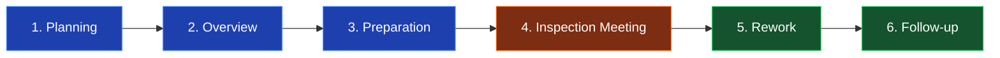

# 🔍 Formal Inspection

**Model White Box Testing \#3** — *Static Testing*  
**Modul Target:** Form Input Transaksi (Validasi Kelengkapan & Format Data)  
**Tim:** REMACode

---

## 📖 1. Definisi

**Formal Inspection** adalah teknik pengujian yang berfokus untuk **memeriksa kelengkapan, ketepatan, dan format data** yang ditampilkan dan diterima oleh aplikasi (Suprihadi, 2025). Model ini lebih terstruktur dibanding Code Walkthrough karena mengikuti **prosedur formal** yang diperkenalkan oleh Michael Fagan (IBM, 1976), dengan tahapan, peran, dan dokumen yang baku.

*"Pengujian format inspection adalah teknik pengujian yang berfokus untuk memeriksa kelengkapan, ketepatan, dan format data yang ditampilkan dan diterima oleh aplikasi."* — (Suprihadi, 2025)

### Perbedaan dengan Walkthrough

| Aspek | Code Walkthrough | Formal Inspection |
| :---- | :---- | :---- |
| **Tingkat formalitas** | Informal/Semi-formal | Sangat formal |
| **Pemimpin** | Author | Moderator independen (bukan author) |
| **Dokumen** | Notulen opsional | Wajib: Inspection Report |
| **Tujuan** | Pemahaman \+ temukan bug | Audit kualitas \+ metrik defect |
| **Output** | Action items | Defect Density \+ Severity Report |
| **Fagan Method** | Tidak wajib | Mengikuti 6 tahap Fagan |

---

## 🎯 2. Tujuan Pengujian

| No | Tujuan |
| :---- | :---- |
| 1 | Memvalidasi kelengkapan field input (required fields) |
| 2 | Memastikan ketepatan tipe data (type, range, format) |
| 3 | Memverifikasi format tampilan output sesuai spesifikasi |
| 4 | Menghitung *defect density* sebagai metrik kualitas |
| 5 | Menghasilkan dokumentasi formal untuk audit trail |

---

## 🔄 3. Tahapan Fagan Inspection



| Tahap | Aktivitas | Output |
| :---- | :---- | :---- |
| **1. Planning** | Pilih artifact, tentukan tim inspector | Inspection schedule |
| **2. Overview** | Author jelaskan kode ke tim | Shared understanding |
| **3. Preparation** | Reviewer baca kode independen | Daftar issue per reviewer |
| **4. Inspection Meeting** | Diskusi & konfirmasi issue | Defect list |
| **5. Rework** | Author perbaiki defect | Updated code |
| **6. Follow-up** | Verifikasi perbaikan | Sign-off |

---

## 👥 4. Tim Inspeksi (REMACode)

| Peran | Nama | Tanggung Jawab |
| :---- | :---- | :---- |
| **Moderator** | Muhammad Fajar Munandar | Memimpin meeting, ensure prosedur diikuti |
| **Author** | Muhammad Dzaki Awaludin | Penulis kode, **tidak boleh** memimpin |
| **Reader** | Mochamad Fikri Ghifari | Membaca kode line-by-line dalam meeting |
| **Inspector** | Raka Zilva Inggia | Mencari defect berdasarkan checklist |
| **Recorder** | Muhammad Fajar Munandar | Mencatat seluruh defect ditemukan |

---

## 💻 5. Source Code yang Diinspeksi

**File:** `app/Http/Requests/StoreTransactionRequest.php`  
**Konteks:** Form Request validation untuk endpoint `POST /api/transactions`

> ⚠️ **TODO:** Ganti dengan Form Request asli dari `midnight-finance-backend` saat finalisasi.


```php
<?php

namespace App\Http\Requests;

use Illuminate\Foundation\Http\FormRequest;

class StoreTransactionRequest extends FormRequest
{
    public function authorize(): bool
    {
        return auth()->check();
    }

    public function rules(): array
    {
        return [
            'account_id'       => 'required|exists:accounts,id',
            'category_id'      => 'required|exists:categories,id',
            'type'             => 'required|in:income,expense',
            'amount'           => 'required|numeric|min:0.01',
            'description'      => 'nullable|string|max:255',
            'transaction_date' => 'required|date',
        ];
    }

    public function messages(): array
    {
        return [
            'amount.min' => 'Nominal transaksi minimal Rp 0,01',
            'type.in'    => 'Tipe transaksi harus income atau expense',
        ];
    }
}
```

---

## 🔍 6. Inspection Checklist & Hasil

### 6.1 Kelengkapan Field (Completeness)

| Field | Required? | Validation Rule | Status | Catatan |
| :---- | :---- | :---- | :---- | :---- |
| `account_id` | ✅ Yes | `required\|exists` | ✅ PASSED | — |
| `category_id` | ✅ Yes | `required\|exists` | ✅ PASSED | — |
| `type` | ✅ Yes | `required\|in:income,expense` | ✅ PASSED | — |
| `amount` | ✅ Yes | `required\|numeric\|min:0.01` | ⚠️ ISSUE | Tidak ada batas atas (max) |
| `description` | ❌ No | `nullable\|string\|max:255` | ✅ PASSED | — |
| `transaction_date` | ✅ Yes | `required\|date` | ⚠️ ISSUE | Tidak validasi tanggal masa depan |
| `user_id` | — | (tidak ada) | ❌ FAILED | Tidak dipastikan ownership account\_id |

### 6.2 Ketepatan Tipe Data (Correctness)

| Field | Expected Type | Validation Sufficient? | Catatan |
| :---- | :---- | :---- | :---- |
| `account_id` | integer | ✅ Yes | `exists` validates existence |
| `amount` | decimal(15,2) | ⚠️ Partial | `numeric` accepts string "100" too |
| `type` | enum string | ✅ Yes | Restricted via `in` rule |
| `transaction_date` | date Y-m-d | ⚠️ Partial | Format ISO accepted, format lain bisa lolos |

### 6.3 Format Data (Format Verification)

| Aspek | Standar | Implementasi | Status |
| :---- | :---- | :---- | :---- |
| Currency precision | 2 desimal | Tidak di-enforce | ❌ FAILED |
| Date format | `Y-m-d H:i:s` | `date` generic | ⚠️ ISSUE |
| Description sanitization | XSS-safe | Tidak ada | ❌ FAILED |
| Error message language | Bahasa Indonesia | Sebagian saja | ⚠️ ISSUE |

---

## 🐛 7. Defect Log

| ID | Severity | Tipe | Deskripsi | Lokasi | Owner |
| :---- | :---- | :---- | :---- | :---- | :---- |
| `FI-001` | 🔴 Critical | Security | `account_id` tidak divalidasi ownership — user bisa transaksi di akun orang lain | Line: rules() | Dzaki |
| `FI-002` | 🔴 High | Validation | `amount` tidak punya batas atas, rentan integer overflow | Line: `'amount'` | Dzaki |
| `FI-003` | 🟡 Medium | Validation | `transaction_date` bisa di-set ke masa depan tanpa batas | Line: `'transaction_date'` | Dzaki |
| `FI-004` | 🟡 Medium | Security | `description` tidak di-sanitize, rentan XSS saat di-render frontend | Line: `'description'` | Dzaki |
| `FI-005` | 🟢 Low | i18n | Custom messages hanya untuk 2 field, lainnya pakai default English | Line: messages() | Dzaki |
| `FI-006` | 🟢 Low | Code Quality | Tidak ada PHPDoc untuk class | Line: 1-5 | Dzaki |

### Klasifikasi Severity

| Severity | Kriteria | Action |
| :---- | :---- | :---- |
| 🔴 **Critical** | Data corruption, security breach, system crash | Fix sebelum merge |
| 🔴 **High** | Functional bug, data validation gap | Fix dalam sprint ini |
| 🟡 **Medium** | UX issue, edge case | Fix dalam 2 sprint |
| 🟢 **Low** | Code style, dokumentasi | Backlog |

---

## 📊 8. Metrik Inspeksi

### Defect Density

```
Defect Density = Jumlah Defect / KLOC (Kilo Lines of Code)
               = 6 defect / 0.025 KLOC (25 baris)
               = 240 defect/KLOC
```

> ⚠️ **Catatan:** Angka ini tinggi karena code base sangat kecil. Untuk artifact kecil seperti Form Request, gunakan **defect per artifact** sebagai metrik alternatif.

### Distribusi Severity

| Severity | Count | Persentase |
| :---- | :---- | :---- |
| 🔴 Critical | 1 | 16.7% |
| 🔴 High | 1 | 16.7% |
| 🟡 Medium | 2 | 33.3% |
| 🟢 Low | 2 | 33.3% |
| **Total** | **6** | **100%** |

### Distribusi Tipe Defect

| Tipe | Count |
| :---- | :---- |
| Security | 2 |
| Validation | 2 |
| i18n | 1 |
| Code Quality | 1 |

---

## ✅ 9. Rekomendasi Perbaikan Kode

```php
<?php

namespace App\Http\Requests;

use Illuminate\Foundation\Http\FormRequest;
use Illuminate\Validation\Rule;

/**
 * Validates input for creating a transaction.
 * Enforces ownership check and data format consistency.
 */
class StoreTransactionRequest extends FormRequest
{
    public function authorize(): bool
    {
        return auth()->check();
    }

    public function rules(): array
    {
        return [
            // FI-001 fix: enforce ownership via Rule::exists scope
            'account_id' => [
                'required',
                Rule::exists('accounts', 'id')
                    ->where('user_id', auth()->id()),
            ],

            'category_id' => 'required|exists:categories,id',
            'type'        => 'required|in:income,expense',

            // FI-002 fix: batas atas amount (1 miliar)
            'amount' => 'required|numeric|min:0.01|max:1000000000|decimal:0,2',

            // FI-004 fix: strip HTML tags + max length
            'description' => 'nullable|string|max:255',

            // FI-003 fix: tidak boleh tanggal masa depan
            'transaction_date' => 'required|date|before_or_equal:today',
        ];
    }

    public function messages(): array
    {
        return [
            'account_id.required'               => 'Akun wajib dipilih',
            'account_id.exists'                 => 'Akun tidak valid atau bukan milik Anda',
            'category_id.required'              => 'Kategori wajib dipilih',
            'type.required'                     => 'Tipe transaksi wajib diisi',
            'type.in'                           => 'Tipe transaksi harus income atau expense',
            'amount.required'                   => 'Nominal transaksi wajib diisi',
            'amount.min'                        => 'Nominal transaksi minimal Rp 0,01',
            'amount.max'                        => 'Nominal transaksi maksimal Rp 1 miliar',
            'amount.decimal'                    => 'Nominal hanya boleh 2 angka desimal',
            'transaction_date.required'         => 'Tanggal transaksi wajib diisi',
            'transaction_date.before_or_equal'  => 'Tanggal tidak boleh di masa depan',
        ];
    }

    // FI-004 fix: sanitize description sebelum validasi
    protected function prepareForValidation(): void
    {
        if ($this->has('description')) {
            $this->merge([
                'description' => strip_tags($this->description),
            ]);
        }
    }
}
```

---

## 🖼️ 10. Verifikasi Tampilan Form (UI Inspection)

Sesuai konsep slide, Formal Inspection juga memeriksa **tampilan data** di UI. Berikut hasil inspeksi tampilan form input transaksi:

| Skenario | Input | Expected UI | Actual UI | Status |
| :---- | :---- | :---- | :---- | :---- |
| Empty field | Form kosong, submit | Pesan: "Akun wajib dipilih" | Pesan tampil | ✅ PASSED |
| Invalid amount | `amount = "abc"` | Pesan: "Nominal harus angka" | Pesan tampil | ✅ PASSED |
| Negative amount | `amount = -100` | Pesan: "Minimal 0.01" | Pesan tampil | ✅ PASSED |
| Future date | `date = 2099-01-01` | Pesan: "Tanggal tidak valid" | **No error** | ❌ FAILED |
| Long description | 300 karakter | Pesan: "Max 255" | Pesan tampil | ✅ PASSED |
| XSS attempt | `<script>alert(1)</script>` | Sanitize | **Disimpan as-is** | ❌ FAILED |

**Total UI Inspection:** 6 skenario | Passed: 4 | Failed: 2 | **Pass Rate: 66.7%**

---

## ⚖️ 11. Kelebihan & Kekurangan

### ✅ Kelebihan

- **Sangat sistematis** — defect tertangkap dengan disiplin
- Menghasilkan **metrik kuantitatif** (defect density, severity distribution)
- Cocok untuk **sistem kritis** (finance, healthcare, aerospace)
- Track record terbukti: Fagan Inspection menurunkan defect rate hingga 50-90% (IBM Studies)
- Audit trail untuk **compliance** (ISO 9000, CMMI)

### ❌ Kekurangan

- **Mahal & lambat** — butuh waktu meeting \+ dokumen formal
- Memerlukan **moderator terlatih**
- Bisa terasa birokratis untuk tim kecil/startup
- Diminishing return setelah beberapa iterasi
- Tidak menggantikan testing dinamis

---

## 🛠️ 12. Tools Pendukung

| Tool | Kegunaan |
| :---- | :---- |
| **PHPStan / Larastan** | Static analysis untuk type checking |
| **Laravel Pint** | Auto-format code sesuai PSR-12 |
| **PHP_CodeSniffer** | Detect coding standard violation |
| **SonarQube** | Defect density tracking jangka panjang |
| **GitHub Issues** | Tracking defect log dengan label severity |

---

## 📋 13. Template Inspection Report

```markdown
# Inspection Report — [Tanggal]

**Artifact:** [path/to/file]
**Inspection Type:** Code / Design / Requirement
**Duration:** [X menit]
**LOC Inspected:** [N baris]

## Tim Inspeksi

| Peran     | Nama |
|-----------|------|
| Moderator |      |
| Author    |      |
| Reader    |      |
| Inspector |      |

## Defect Log

| ID | Severity | Tipe | Deskripsi | Lokasi |
|----|----------|------|-----------|--------|

## Metrik

- Defect Density: [X / KLOC]
- Total Critical: [N]
- Total High: [N]

## Keputusan

- [ ] Accept (no rework)
- [x] Conditional accept (rework minor)
- [ ] Reject (major rework + re-inspect)

## Sign-off

- [ ] Moderator
- [ ] Author
```

---

## 📚 Referensi

1. Suprihadi, D. (2025). *Materi Software Quality Pertemuan 10*. Universitas Kristen Indonesia.
2. Fagan, M. E. (1976). *Design and code inspections to reduce errors in program development*. IBM Systems Journal, 15(3), 182-211.
3. Gilb, T., & Graham, D. (1993). *Software Inspection*. Addison-Wesley.
4. OWASP Foundation. (2021). *OWASP Top 10:2021 — A03: Injection*. https://owasp.org/Top10/

---

[⬅ Code Walkthrough](./Code_Walkthrough.md) · [Kembali ke README](./README.md) · [Lanjut ke Control Flow Testing ➡](./Control_Flow_Testing.md)

**Tim REMACode** — Midnight Finance SQA Documentation
