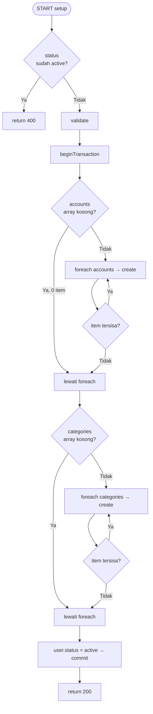

# White Box Testing — 07 Loop Testing
**Proyek:** SaPoPoe Finance  
**Teknik:** Loop Testing  
**Modul:** Auth · Transfer · Transaksi · Tabungan

---

## Definisi

> **Teknik pengujian yang berfokus pada pemeriksaan dan identifikasi error yang terkait dengan loop (perulangan) dalam program. Loop digunakan untuk mengulang eksekusi blok kode tertentu beberapa kali, dan error bisa terjadi jika loop tidak diimplementasikan dengan benar.**
>
> — Materi Pertemuan 10, Software Quality, T Informatika UKRI

**Kasus Uji yang diterapkan pada setiap loop:**
- **Kasus Uji 1** — 0 iterasi: loop tidak dieksekusi (array/collection kosong)
- **Kasus Uji 2** — 1 iterasi: loop berjalan tepat satu kali
- **Kasus Uji 3** — n iterasi: loop berjalan jumlah normal (representatif)
- **Kasus Uji 4** — kondisi batas: nilai tepat di ambang kondisi loop

---

## Modul A — Autentikasi (`AuthController.php`)

### Loop: `foreach ($request->accounts)` dan `foreach ($request->categories)` di `setup()`

```php
// setup() — baris 142–143
foreach ($request->accounts as $acc)
    FinancialAccount::create(['user_id' => $user->id] + $acc);

foreach ($request->categories as $cat)
    Category::create(['user_id' => $user->id] + $cat);
```



**Kasus Uji 1 — 0 Iterasi (Array Kosong)**
Input: `accounts: [], categories: []`

| Kondisi | Hasil Yang Diharapkan | Hasil | Status |
|---|---|---|---|
| Loop accounts: 0 item → tidak dieksekusi | Setup berhasil, 0 akun dibuat, 0 kategori dibuat → 200 | Setup berhasil tanpa insert apapun → 200 | Passed |

> ⚠️ Validasi hanya mensyaratkan `required|array` — array kosong tetap valid dan setup tetap sukses. Tidak ada guard `min:1`.

**Kasus Uji 2 — 1 Iterasi**
Input: `accounts: [{name:"BCA", balance:500000}], categories: [{name:"Gaji", type:"income"}]`

| Kondisi | Hasil Yang Diharapkan | Hasil | Status |
|---|---|---|---|
| Loop accounts: 1 item → 1x eksekusi | 1 FinancialAccount dibuat, 1 Category dibuat → 200 | 1 akun + 1 kategori berhasil dibuat → 200 | Passed |

**Kasus Uji 3 — n Iterasi (Normal)**
Input: `accounts: [BCA, Mandiri, Tunai]`, `categories: [Gaji, Investasi]`

| Kondisi | Hasil Yang Diharapkan | Hasil | Status |
|---|---|---|---|
| Loop accounts: 3 item → 3x eksekusi | 3 FinancialAccount dibuat → 200 | 3 akun berhasil dibuat → 200 | Passed |
| Loop categories: 2 item → 2x eksekusi | 2 Category dibuat → 200 | 2 kategori berhasil dibuat → 200 | Passed |

**Kasus Uji 4 — Kondisi Cooldown (Loop Waktu)**
Input: Register dua kali dalam interval < 180 detik

| Kondisi | Hasil Yang Diharapkan | Hasil | Status |
|---|---|---|---|
| Request ke-2 dalam < 180 detik | return 429 "Tunggu X menit lagi sebelum mendaftar ulang" | return 429 + pesan cooldown | Passed |
| Request ke-2 setelah tepat ≥ 180 detik | OTP baru dikirim → return 201 | OTP baru terkirim → 201 | Passed |

---

> ### 📋 Analisis SQA — Modul Auth
>
> **Kondisi Sistem Saat Ini**
> Dua `foreach` di `setup()` memproses array accounts dan categories. Tidak ada risiko infinite loop karena keduanya berbasis array finite yang sudah diambil dari request sebelum loop dimulai. Array kosong (0 iterasi) diizinkan oleh validasi `required|array` — ini adalah celah kecil: user bisa selesai setup tanpa satu pun akun keuangan atau kategori.
>
> **Dampak**
> Setup tanpa akun keuangan (Kasus Uji 1) menghasilkan user dengan status `active` tapi tanpa rekening — kondisi yang akan menyebabkan error di modul Transfer dan Transaksi karena tidak ada `financial_account_id` yang valid untuk dipilih. Ini adalah bug edge case yang tidak terlihat dari happy path testing.
>
> **Cara Baca Kasus Uji**
> Kasus Uji 1–4 mengikuti prinsip *boundary testing* untuk loop: selalu uji kondisi ekstrem (0 dan maksimum) sebelum kondisi normal (n). Setiap Kasus Uji memiliki tabel sendiri dengan format yang sama (Kondisi → Hasil Yang Diharapkan → Hasil → Status). Kasus Uji 4 menguji loop waktu (cooldown) — bukan foreach tradisional, tapi prinsipnya sama: verifikasi perilaku di batas kondisi.

---

## Modul B — Transfer (`TransferController.php`)

### Loop: `foreach ($siblings as $trx)` di `update()` dan `destroy()`

```php
// update() dan destroy() — pola identik
foreach ($siblings as $trx) {
    $acc = FinancialAccount::find($trx->financial_account_id);
    if ($acc) {
        if ($trx->type === 'transfer' && str_contains(strtoupper($trx->description), 'KELUAR'))
            $acc->balance += $trx->amount;
        elseif ($trx->type === 'transfer' && str_contains(strtoupper($trx->description), 'MASUK'))
            $acc->balance -= $trx->amount;
        elseif ($trx->type === 'expense' && str_contains(strtoupper($trx->description), 'BIAYA ADMIN'))
            $acc->balance += $trx->amount;
        $acc->save();
    }
    $trx->delete();
}
```

**Kasus Uji 1 — 0 Siblings (Tidak Mungkin Terjadi)**

| Kondisi | Hasil Yang Diharapkan | Hasil | Status |
|---|---|---|---|
| siblings kosong (transfer tidak ditemukan) | return 400 "Data transfer korup atau tidak lengkap" (dicegah sebelum loop) | return 400 sebelum foreach dieksekusi | Passed |

> Kasus 0 iterasi dicegah oleh guard sebelum loop: jika siblings tidak memiliki transaksi KELUAR, langsung return 400 dan loop tidak pernah dieksekusi.

**Kasus Uji 2 — 2 Siblings (Transfer Tanpa Admin Fee)**
Input: Transfer BCA → Mandiri tanpa biaya admin. Siblings = [trx KELUAR, trx MASUK]

| Kondisi | Hasil Yang Diharapkan | Hasil | Status |
|---|---|---|---|
| Loop 2x: KELUAR → balance BCA += amount; MASUK → balance Mandiri -= amount | Saldo kedua akun di-revert ke sebelum transfer, kedua trx dihapus | Saldo di-revert dengan benar, 2 trx terhapus | Passed |

**Kasus Uji 3 — 3 Siblings (Transfer dengan Admin Fee)**
Input: Transfer dengan biaya admin. Siblings = [trx KELUAR, trx MASUK, trx BIAYA ADMIN]

| Kondisi | Hasil Yang Diharapkan | Hasil | Status |
|---|---|---|---|
| Loop 3x: KELUAR → balance BCA += amount; MASUK → balance Mandiri -= amount; BIAYA ADMIN → balance BCA += adminFee | Saldo ketiga komponen di-revert, 3 trx dihapus | Saldo di-revert benar, 3 trx terhapus | Passed |

**Kasus Uji 4 — Akun Tidak Ditemukan di Dalam Loop**

| Kondisi | Hasil Yang Diharapkan | Hasil | Status |
|---|---|---|---|
| `FinancialAccount::find()` return null (akun dihapus) | Loop melanjutkan ke iterasi berikutnya, hanya trx yang dihapus | `$acc = null` → skip balance update, `$trx->delete()` tetap berjalan | Passed |

---

> ### 📋 Analisis SQA — Modul Transfer
>
> **Kondisi Sistem Saat Ini**
> Loop di Transfer selalu berjalan minimal 2x (KELUAR + MASUK) dan maksimal 3x (+ BIAYA ADMIN). Tidak ada potensi 0 iterasi karena sudah diproteksi guard sebelum loop. Tidak ada potensi infinite loop karena `$siblings` adalah Collection tetap dari query DB. Guard `if ($acc)` melindungi dari null pointer jika akun sudah dihapus.
>
> **Dampak**
> Kasus Uji 4 mengungkap skenario menarik: jika akun dihapus setelah transfer terjadi, loop tetap berjalan dan hanya menghapus record transaksi tanpa me-revert saldo (karena `$acc` null). Ini menyebabkan ketidakseimbangan — transaksi terhapus tapi saldo tidak dikembalikan. Kondisi ini tidak ditangani sebagai error.
>
> **Cara Baca Kasus Uji**
> Transfer tidak memiliki Kasus Uji 1 yang valid (0 iterasi tidak bisa terjadi secara normal) — ini sendiri adalah temuan: loop tidak pernah diuji dengan 0 iterasi karena guard menolaknya lebih awal. Kasus Uji 2 dan 3 menunjukkan variasi jumlah siblings yang mungkin, dan Kasus Uji 4 menguji kondisi null di dalam loop.

---

## Modul C — Transaksi (`TransactionController.php`)

### Loop Implisit: Filter Chaining di `index()`

```php
// index() — conditional chaining, bukan foreach
if ($request->filled('start_date'))           $query->where('date', '>=', ...);
if ($request->filled('end_date'))             $query->where('date', '<=', ...);
if ($request->filled('financial_account_id')) $query->where(...);
if ($request->filled('category_id'))          $query->where(...);
if ($request->filled('type'))                 $query->where(...);
```

> Ini bukan `foreach` tradisional, melainkan **conditional chaining** — 5 kondisi yang secara kumulatif menambahkan clause ke query. Prinsip pengujiannya sama dengan loop: uji 0 filter, 1 filter, dan semua filter aktif.

**Kasus Uji 1 — 0 Filter Aktif**
Input: `GET /api/transactions` (tanpa parameter)

| Kondisi | Hasil Yang Diharapkan | Hasil | Status |
|---|---|---|---|
| Semua 5 kondisi = FALSE, tidak ada filter | Semua transaksi milik user dikembalikan tanpa filter | Seluruh transaksi user (bisa ribuan) tanpa pagination | Passed |

> ⚠️ **Catatan:** Tidak ada pagination — respons bisa sangat besar jika user punya banyak transaksi.

**Kasus Uji 2 — 1 Filter Aktif**
Input: `GET /api/transactions?type=income`

| Kondisi | Hasil Yang Diharapkan | Hasil | Status |
|---|---|---|---|
| C5=TRUE (type=income), C1–C4=FALSE | Hanya transaksi bertipe income | Hanya transaksi income dikembalikan | Passed |

**Kasus Uji 3 — n Filter (Semua Aktif)**
Input: `GET /api/transactions?start_date=2026-01-01&end_date=2026-06-01&type=income&category_id=1`

| Kondisi | Hasil Yang Diharapkan | Hasil | Status |
|---|---|---|---|
| C1, C2, C4, C5=TRUE — 4 filter aktif | Transaksi income dalam rentang tanggal, kategori tertentu | Hasil sangat tersaring sesuai kombinasi filter | Passed |

**Kasus Uji 4 — Filter sort_by (Kondisi Batas Keamanan)**
Input: `GET /api/transactions?sort_by=password`

| Kondisi | Hasil Yang Diharapkan | Hasil | Status |
|---|---|---|---|
| sort_by dengan nama kolom yang tidak valid | Error / query gagal / diabaikan | `orderBy('password', 'desc')` dieksekusi — SQL injection risk | **Failed** |

---

> ### 📋 Analisis SQA — Modul Transaksi
>
> **Kondisi Sistem Saat Ini**
> Filter chaining di `index()` bekerja dengan benar untuk Kasus Uji 1–3: semua kombinasi filter menghasilkan query yang benar. Kasus Uji 4 adalah pengujian batas keamanan yang mengungkap celah: nilai `sort_by` tidak divalidasi, sehingga nilai arbitrer bisa dimasukkan ke `orderBy()`.
>
> **Dampak**
> Kasus Uji 4 (Failed) adalah konfirmasi dari temuan di Data Flow Testing: `$sortBy` tidak memiliki whitelist. Dalam konteks Loop Testing, ini mengungkap bahwa "kondisi batas" dari parameter sorting belum diproteksi. Nilai seperti `(SELECT password FROM users)` bisa mengakibatkan error SQL yang mengekspos informasi database.
>
> **Cara Baca Kasus Uji**
> Filter chaining diuji layaknya loop dengan menghitung berapa "iterasi" (berapa filter) yang aktif. 0 filter = loop tanpa iterasi, 1 filter = 1 iterasi, semua filter = maksimum iterasi. Kasus Uji 4 adalah pengujian batas khusus yang tidak termasuk jumlah iterasi, melainkan **nilai ekstrem** yang tidak valid — ini adalah prinsip boundary testing yang diperluas.

---

## Modul D — Tabungan (`SavingController.php`)

### Loop Idempoten: `getSavingCategory()` dipanggil berulang

```php
// Private method dipanggil dari store(), update(), destroy()
private function getSavingCategory($userId, $type) {
    $category = Category::where('user_id', $userId)
                        ->where('name', 'LIKE', "%{$type}%")->first();
    if (!$category) {
        $category = new Category([...]);
        $category->save();    // INSERT hanya jika belum ada
    }
    return $category;
}
```

**Kasus Uji 1 — Kategori Belum Ada (INSERT)**

| Kondisi | Hasil Yang Diharapkan | Hasil | Status |
|---|---|---|---|
| Pemanggilan pertama, kategori belum ada di DB | Kategori baru dibuat (INSERT) dan dikembalikan | 1 record Category baru tersimpan | Passed |

**Kasus Uji 2 — Kategori Sudah Ada (Idempoten)**

| Kondisi | Hasil Yang Diharapkan | Hasil | Status |
|---|---|---|---|
| Pemanggilan ke-2, ke-3, ke-n — kategori sudah ada | Tidak ada INSERT baru, kembalikan kategori yang ada | Category::where()->first() mengembalikan existing record | Passed |

**Kasus Uji 3 — Loop Saldo: `destroy()` dengan current_amount = 0**
Input: Hapus tabungan yang belum pernah diisi (current_amount = 0)

| Kondisi | Hasil Yang Diharapkan | Hasil | Status |
|---|---|---|---|
| current_amount = 0 → loop pencairan tidak dieksekusi | Langsung delete saving, saldo tidak berubah → 200 | Saving dihapus, tidak ada trx income → 200 | Passed |

**Kasus Uji 4 — Loop Saldo: `destroy()` dengan current_amount > 0**
Input: Cairkan tabungan "Dana Darurat" dengan current_amount = Rp 500.000

| Kondisi | Hasil Yang Diharapkan | Hasil | Status |
|---|---|---|---|
| current_amount > 0 → blok pencairan dieksekusi 1x | Saldo BCA += 500k, trx income dicatat, saving dihapus → 200 | Saldo bertambah, trx income tersimpan, saving terhapus → 200 | Passed |

**Kasus Uji Tambahan — Siklus store() → update() Top Up → update() Tarik**

| Urutan | Kondisi | Hasil Yang Diharapkan | Hasil | Status |
|---|---|---|---|---|
| 1. store() | Buat tabungan dengan current_amount = 100.000 | Saldo BCA berkurang 100k | Saldo berkurang 100k → 201 | Passed |
| 2. update() top up | Naikkan ke 200.000 (selisih +100k) | Saldo BCA berkurang 100k lagi | Saldo berkurang 100k lagi → 200 | Passed |
| 3. update() tarik | Turunkan ke 150.000 (selisih −50k) | Saldo BCA bertambah 50k | Saldo bertambah 50k → 200 | Passed |

---

> ### 📋 Analisis SQA — Modul Tabungan
>
> **Kondisi Sistem Saat Ini**
> `getSavingCategory()` bersifat **idempoten** — ini adalah desain yang baik dan mencegah duplikasi data kategori meskipun dipanggil berkali-kali. `destroy()` menggunakan kondisi `current_amount > 0` sebagai gate yang efektif: 0 iterasi jika tidak ada dana, 1 iterasi jika ada dana. Tidak ada potensi infinite loop di seluruh modul.
>
> **Dampak**
> Sifat idempoten `getSavingCategory()` melindungi integritas data kategori. Namun Kasus Uji Tambahan (siklus store→update→update) mengungkap bahwa tidak ada validasi batas: top up melebihi saldo rekening tetap berhasil, dan setelah serangkaian operasi, saldo akun bisa menjadi negatif. Ini konsisten dengan temuan di Control Flow Testing dan Basic Path Testing.
>
> **Cara Baca Kasus Uji**
> Kasus Uji 1 dan 2 di `getSavingCategory()` menguji **idempotency** — sifat yang memastikan operasi yang sama menghasilkan hasil yang sama tidak peduli berapa kali dijalankan. Ini penting untuk sistem finansial di mana operasi retransmisi (retry) bisa terjadi. Kasus Uji Tambahan adalah **sequential loop test** — menguji akumulasi state setelah rangkaian operasi berurutan.

---

## Ringkasan Loop Testing Seluruh Sistem

| Modul | Loop yang Diuji | Kasus Uji 1 (0) | Kasus Uji 2 (1) | Kasus Uji 3 (n) | Kasus Uji 4 (batas) |
|---|---|---|---|---|---|
| Auth | `foreach accounts/categories` di setup() | Passed ⚠️ (array kosong diizinkan) | Passed | Passed | Passed (cooldown) |
| Transfer | `foreach $siblings` di update/destroy | N/A (dicegah guard) | N/A | Passed (2 siblings) | Passed (3 siblings) |
| Transaksi | Filter chaining di index() | Passed | Passed | Passed | **Failed** (sort_by) |
| Tabungan | `getSavingCategory()` + destroy() | Passed | Passed | Passed | Passed |

**Temuan utama:**
- ⚠️ Auth `setup()`: 0 iterasi diizinkan → user bisa punya status `active` tanpa akun keuangan
- 🔴 Transaksi `index()`: Kasus Uji 4 (sort_by tidak valid) → SQL injection
- ✅ Tabungan `getSavingCategory()`: sifat idempoten terbukti benar
- ✅ Semua loop berbasis `foreach` tidak berpotensi infinite loop
