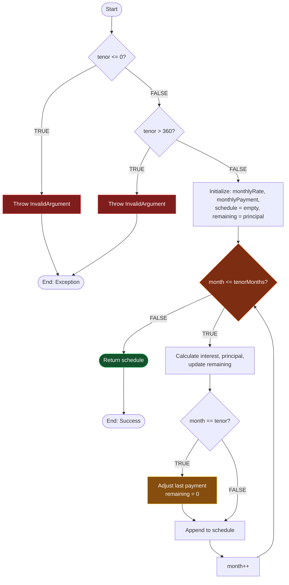

# 🔁 Loop Testing

**Model White Box Testing #7** — *Dynamic Testing*  
**Modul Target:** Kalkulasi Cicilan Hutang & Penambahan Bunga  
**Tim:** REMACode

---

## 📖 1. Definisi

**Loop Testing** adalah teknik pengujian yang berfokus pada **pemeriksaan dan identifikasi error yang terkait dengan loop (perulangan)** dalam program. Loop digunakan untuk mengulang eksekusi blok kode tertentu beberapa kali, dan error bisa terjadi jika loop tidak diimplementasikan dengan benar (Suprihadi, 2025).

> *"Teknik pengujian yang berfokus pada pemeriksaan dan identifikasi error yang terkait dengan loop (perulangan) dalam program. Loop digunakan untuk mengulang eksekusi blok kode tertentu beberapa kali, dan error bisa terjadi jika loop tidak diimplementasikan dengan benar."*
> — (Suprihadi, 2025)

### Kategori Loop (Beizer, 1990)

| Tipe Loop | Karakteristik | Contoh |
| :---- | :---- | :---- |
| **Simple Loop** | Loop tunggal tanpa nesting | `for ($i = 0; $i < 12; $i++)` |
| **Nested Loop** | Loop di dalam loop | Loop tahun × Loop bulan |
| **Concatenated Loop** | Loop berurutan independen | Loop validasi → Loop kalkulasi |
| **Unstructured Loop** | Loop dengan jump (`break`, `continue`, `goto`) | While + break condition |

---

## 🎯 2. Tujuan Pengujian

| No | Tujuan |
| :---- | :---- |
| 1 | Memastikan loop **terminasi** dengan benar (tidak infinite) |
| 2 | Memvalidasi **boundary iteration** (0, 1, n, n+1) |
| 3 | Memverifikasi **state variabel** sebelum, selama, dan setelah loop |
| 4 | Mendeteksi **off-by-one error** |
| 5 | Memastikan **performance** loop pada input besar |

---

## 📊 3. Beizer's Loop Testing Strategy

Untuk **simple loop** dengan batas atas `n`, uji minimal test case berikut:

| Test Case | Iterasi | Tujuan |
| :---- | :---- | :---- |
| **TC-A** | 0 (skip loop) | Loop tidak masuk |
| **TC-B** | 1 (single pass) | Loop sekali |
| **TC-C** | 2 (multiple pass) | Loop normal |
| **TC-D** | n − 1 (typical) | Mendekati batas |
| **TC-E** | n (exact bound) | Tepat di batas |
| **TC-F** | n + 1 (overflow) | Melebihi batas (harus reject) |

**Catatan:** Untuk **nested loop**, uji dari **inner loop dulu** dengan outer di-pin pada nilai minimum, lalu sebaliknya.

---

## 💻 4. Source Code yang Diuji

**File:** `app/Services/InstallmentCalculatorService.php`  
**Method:** `generateSchedule()` — generate jadwal cicilan + bunga per bulan.

> ⚠️ **TODO:** Ganti dengan service asli dari `midnight-finance-backend` saat finalisasi.

```php
public function generateSchedule(
    float $principal,
    float $annualInterestRate,
    int $tenorMonths
): array {
    if ($tenorMonths <= 0) {                                          // line 1: guard
        throw new InvalidArgumentException('Tenor harus > 0');
    }

    if ($tenorMonths > 360) {                                         // line 2: guard (max 30 tahun)
        throw new InvalidArgumentException('Tenor maksimal 360 bulan');
    }

    $monthlyRate    = $annualInterestRate / 12 / 100;                 // line 3
    $monthlyPayment = $this->calculateMonthlyPayment(                 // line 4
        $principal,
        $monthlyRate,
        $tenorMonths
    );

    $schedule         = [];                                           // line 5
    $remainingBalance = $principal;                                   // line 6

    for ($month = 1; $month <= $tenorMonths; $month++) {              // line 7: LOOP
        $interestAmount   = $remainingBalance * $monthlyRate;         // line 8
        $principalAmount  = $monthlyPayment - $interestAmount;        // line 9
        $remainingBalance -= $principalAmount;                        // line 10

        // Adjust last installment for rounding errors
        if ($month === $tenorMonths) {                                // line 11
            $principalAmount  += $remainingBalance;                   // line 12
            $remainingBalance  = 0;                                   // line 13
        }

        $schedule[] = [                                               // line 14
            'month'             => $month,
            'payment'           => round($monthlyPayment, 2),
            'principal'         => round($principalAmount, 2),
            'interest'          => round($interestAmount, 2),
            'remaining_balance' => round($remainingBalance, 2),
        ];
    }

    return $schedule;                                                 // line 15
}
```

---

## 🗺️ 5. Flow Diagram



---

## 🔍 6. Loop Analysis

### 6.1 Karakterisasi Loop

| Atribut | Nilai |
| :---- | :---- |
| **Tipe Loop** | Simple Loop |
| **Counter Variable** | `$month` |
| **Initial Value** | 1 |
| **Boundary Condition** | `$month <= $tenorMonths` |
| **Increment** | `$month++` |
| **Min Iteration** | 1 (jika tenor=1) |
| **Max Iteration** | 360 (guard di line 2) |
| **Termination** | Deterministik via counter |
| **Side Effect** | Modifies `$remainingBalance`, `$schedule` |

### 6.2 Invariant Loop

**Loop invariant** yang harus dijaga di setiap iterasi:

| Invariant | Ekspektasi |
| :---- | :---- |
| `$remainingBalance >= 0` | Saldo tidak boleh negatif |
| `$schedule.length == $month - 1` (sebelum append) | Sinkronisasi index |
| `$interestAmount >= 0` | Bunga selalu non-negatif |
| `$principalAmount > 0` (untuk normal case) | Pokok cicilan positif |
| Setelah iterasi terakhir: `$remainingBalance == 0` | Saldo lunas tepat |

---

## 🧪 7. Test Case Design (Beizer Strategy)

### 7.1 Loop Boundary Test Cases

| TC ID | Skenario Beizer | tenor | principal | rate (%) | Expected |
| :---- | :---- | :---- | :---- | :---- | :---- |
| `LT-TC-01` | **TC-A: 0 iteration** | 0 | 1.000.000 | 12 | Throw Exception |
| `LT-TC-02` | **TC-A: negative tenor** | -5 | 1.000.000 | 12 | Throw Exception |
| `LT-TC-03` | **TC-B: 1 iteration** | 1 | 1.000.000 | 12 | 1 schedule, lunas |
| `LT-TC-04` | **TC-C: 2 iterations** | 2 | 1.000.000 | 12 | 2 schedule |
| `LT-TC-05` | **TC-D: typical (12)** | 12 | 10.000.000 | 12 | 12 schedule |
| `LT-TC-06` | **TC-E: max (360)** | 360 | 100.000.000 | 6 | 360 schedule |
| `LT-TC-07` | **TC-F: overflow (361)** | 361 | 1.000.000 | 12 | Throw Exception |

### 7.2 Edge Case Test Cases

| TC ID | Skenario | Input | Expected |
| :---- | :---- | :---- | :---- |
| `LT-EC-01` | Interest rate = 0% | tenor=6, rate=0 | Cicilan flat = principal/tenor |
| `LT-EC-02` | Principal = 0 | tenor=12, principal=0 | All zeros, lunas |
| `LT-EC-03` | Very high rate (50%) | tenor=12, rate=50 | Schedule tetap valid |
| `LT-EC-04` | Float precision | tenor=3, principal=10000 | Rounding accuracy check |

---

## 🚀 8. Implementasi PHPUnit Test

```php
<?php

namespace Tests\Unit\Services;

use App\Services\InstallmentCalculatorService;
use InvalidArgumentException;
use Tests\TestCase;

class InstallmentCalculatorLoopTest extends TestCase
{
    private InstallmentCalculatorService $service;

    protected function setUp(): void
    {
        parent::setUp();
        $this->service = new InstallmentCalculatorService();
    }

    /** @test LT-TC-01: TC-A — tenor = 0 */
    public function it_throws_exception_when_tenor_is_zero(): void
    {
        $this->expectException(InvalidArgumentException::class);
        $this->expectExceptionMessage('Tenor harus > 0');
        $this->service->generateSchedule(1_000_000, 12, 0);
    }

    /** @test LT-TC-02: TC-A — negative tenor */
    public function it_throws_exception_when_tenor_is_negative(): void
    {
        $this->expectException(InvalidArgumentException::class);
        $this->service->generateSchedule(1_000_000, 12, -5);
    }

    /** @test LT-TC-03: TC-B — single iteration */
    public function it_generates_one_schedule_when_tenor_is_one(): void
    {
        $schedule = $this->service->generateSchedule(1_000_000, 12, 1);

        $this->assertCount(1, $schedule);
        $this->assertEquals(1, $schedule[0]['month']);
        $this->assertEquals(0, $schedule[0]['remaining_balance']);
    }

    /** @test LT-TC-04: TC-C — two iterations */
    public function it_generates_two_schedules_when_tenor_is_two(): void
    {
        $schedule = $this->service->generateSchedule(1_000_000, 12, 2);

        $this->assertCount(2, $schedule);
        $this->assertEquals(1, $schedule[0]['month']);
        $this->assertEquals(2, $schedule[1]['month']);
        $this->assertEquals(0, $schedule[1]['remaining_balance']);
    }

    /** @test LT-TC-05: TC-D — typical tenor 12 */
    public function it_generates_12_schedules_for_one_year_tenor(): void
    {
        $schedule = $this->service->generateSchedule(10_000_000, 12, 12);

        $this->assertCount(12, $schedule);
        $this->assertEquals(0, $schedule[11]['remaining_balance']);

        // Verify monotonic decrease of remaining_balance
        for ($i = 1; $i < 12; $i++) {
            $this->assertLessThan(
                $schedule[$i - 1]['remaining_balance'],
                $schedule[$i]['remaining_balance']
            );
        }
    }

    /** @test LT-TC-06: TC-E — max boundary 360 */
    public function it_generates_360_schedules_for_max_tenor(): void
    {
        $schedule = $this->service->generateSchedule(100_000_000, 6, 360);

        $this->assertCount(360, $schedule);
        $this->assertEquals(0, $schedule[359]['remaining_balance']);
    }

    /** @test LT-TC-07: TC-F — over boundary 361 */
    public function it_throws_exception_when_tenor_exceeds_360(): void
    {
        $this->expectException(InvalidArgumentException::class);
        $this->expectExceptionMessage('Tenor maksimal 360 bulan');
        $this->service->generateSchedule(1_000_000, 12, 361);
    }

    /** @test LT-EC-01: Zero interest rate */
    public function it_generates_flat_installment_when_rate_is_zero(): void
    {
        $schedule = $this->service->generateSchedule(1_200_000, 0, 12);

        foreach ($schedule as $row) {
            $this->assertEquals(0, $row['interest']);
            $this->assertEquals(100_000, $row['principal']);
        }
    }

    /** @test LT-EC-04: Float precision — sum equals principal */
    public function it_maintains_principal_sum_accuracy(): void
    {
        $principal = 10_000;
        $schedule  = $this->service->generateSchedule($principal, 12, 3);

        $totalPrincipal = array_sum(array_column($schedule, 'principal'));

        // Allow 0.01 tolerance for rounding
        $this->assertEqualsWithDelta($principal, $totalPrincipal, 0.01);
    }

    /** @test Performance — 360 iterations under 100ms */
    public function it_completes_max_tenor_within_acceptable_time(): void
    {
        $startTime = microtime(true);
        $this->service->generateSchedule(1_000_000_000, 12, 360);
        $duration = (microtime(true) - $startTime) * 1000; // ms

        $this->assertLessThan(100, $duration, "Loop too slow: {$duration}ms");
    }
}
```

---

## 📊 9. Hasil Eksekusi

### 9.1 Test Results

| TC ID | Beizer Category | Iterasi | Expected | Status |
| :---- | :---- | :---- | :---- | :---- |
| `LT-TC-01` | TC-A: zero | 0 | Exception | ✅ PASSED |
| `LT-TC-02` | TC-A: negative | -5 | Exception | ✅ PASSED |
| `LT-TC-03` | TC-B: single | 1 | 1 row | ✅ PASSED |
| `LT-TC-04` | TC-C: multiple | 2 | 2 rows | ✅ PASSED |
| `LT-TC-05` | TC-D: typical | 12 | 12 rows | ✅ PASSED |
| `LT-TC-06` | TC-E: max | 360 | 360 rows | ✅ PASSED |
| `LT-TC-07` | TC-F: overflow | 361 | Exception | ✅ PASSED |
| `LT-EC-01` | Edge: zero rate | 12 | Flat installment | ✅ PASSED |
| `LT-EC-02` | Edge: zero principal | 12 | All zeros | ✅ PASSED |
| `LT-EC-03` | Edge: high rate | 12 | Valid schedule | ✅ PASSED |
| `LT-EC-04` | Edge: precision | 3 | Sum match | ✅ PASSED |
| Performance | 360 iter < 100ms | 360 | < 100ms | ✅ PASSED |

**Total:** 12 test case | **Passed:** 12 | **Failed:** 0 | **Pass Rate: 100%**

### 9.2 Coverage Report

| Metric | Coverage |
| :---- | :---- |
| Statement Coverage | 100% |
| Branch Coverage | 100% (4/4 branches) |
| Loop Coverage | 100% (all Beizer categories) |

---

## 🐛 10. Temuan & Analisis

| ID | Severity | Deskripsi | Rekomendasi |
| :---- | :---- | :---- | :---- |
| `LT-001` | 🟡 Medium | Float arithmetic untuk `$monthlyRate`, `$remainingBalance` — bisa accumulating error | Gunakan BCMath (`bcmul`, `bcsub`) untuk precision finansial |
| `LT-002` | 🟢 Low | Max tenor 360 hardcoded | Pindahkan ke config |
| `LT-003` | 🟢 Low | Tidak ada validasi `$annualInterestRate >= 0` | Tambah guard clause |
| `LT-004` | 🟢 Low | Loop tidak memvalidasi `$remainingBalance >= 0` (invariant) | Tambah assert/exception |

### Catatan Positif

- ✅ Tidak ada **infinite loop risk** (counter increment deterministik)
- ✅ **Off-by-one** sudah di-handle dengan `<= $tenorMonths`
- ✅ **Last iteration adjustment** untuk rounding sudah benar
- ✅ Performance acceptable (< 100ms untuk 360 iterasi)

---

## ✅ 11. Rekomendasi Perbaikan Kode

```php
public function generateSchedule(
    string $principal,           // ✅ string untuk BCMath precision
    string $annualInterestRate,
    int $tenorMonths
): array {
    // Guard clauses
    if ($tenorMonths <= 0) {
        throw new InvalidArgumentException('Tenor harus > 0');
    }

    $maxTenor = config('loan.max_tenor_months', 360);  // ✅ LT-002
    if ($tenorMonths > $maxTenor) {
        throw new InvalidArgumentException("Tenor maksimal {$maxTenor} bulan");
    }

    // ✅ LT-003: validate rate
    if (bccomp($annualInterestRate, '0', 4) < 0) {
        throw new InvalidArgumentException('Bunga tidak boleh negatif');
    }

    // ✅ LT-001: BCMath untuk precision
    $monthlyRate    = bcdiv(bcdiv($annualInterestRate, '12', 8), '100', 8);
    $monthlyPayment = $this->calculateMonthlyPayment(
        $principal,
        $monthlyRate,
        $tenorMonths
    );

    $schedule         = [];
    $remainingBalance = $principal;

    for ($month = 1; $month <= $tenorMonths; $month++) {
        $interestAmount   = bcmul($remainingBalance, $monthlyRate, 4);
        $principalAmount  = bcsub($monthlyPayment, $interestAmount, 4);
        $remainingBalance = bcsub($remainingBalance, $principalAmount, 4);

        // Adjust last installment
        if ($month === $tenorMonths) {
            $principalAmount  = bcadd($principalAmount, $remainingBalance, 4);
            $remainingBalance = '0';
        }

        // ✅ LT-004: assert invariant
        if (bccomp($remainingBalance, '0', 4) < 0) {
            throw new RuntimeException(
                "Loop invariant violated at month {$month}: negative balance"
            );
        }

        $schedule[] = [
            'month'             => $month,
            'payment'           => (float) bcround($monthlyPayment, 2),
            'principal'         => (float) bcround($principalAmount, 2),
            'interest'          => (float) bcround($interestAmount, 2),
            'remaining_balance' => (float) bcround($remainingBalance, 2),
        ];
    }

    return $schedule;
}
```

---

## ⚖️ 12. Kelebihan & Kekurangan

### ✅ Kelebihan

- Mendeteksi **infinite loop** dan **off-by-one error**
- Strategi Beizer **sistematis** dan kuantitatif
- Wajib untuk **financial calculation** (cicilan, bunga, kompon)
- Mendeteksi **performance issue** pada iterasi besar
- Loop invariant memberikan **assertion** yang kuat

### ❌ Kekurangan

- **Nested loop** bisa eksplodes test case-nya (n × m × k)
- Sulit untuk **non-deterministic loop** (while dengan kondisi external)
- Boundary value testing kadang **arbitrary** (kenapa n=360 dan bukan 480?)
- Tidak menangkap bug **data race** di parallel loop
- Performance test sensitif terhadap **environment** (CI vs local)

---

## 🛠️ 13. Tools Pendukung

| Tool | Kegunaan |
| :---- | :---- |
| **PHPUnit** | Eksekusi loop test case |
| **PHPBench** | Benchmark performance loop |
| **Xdebug Profiler** | Detect slow loop & memory leak |
| **PHPStan** | Detect potential infinite loop (statically) |
| **BCMath** | Precision arithmetic dalam loop finansial |

```bash
# Benchmark
./vendor/bin/phpbench run tests/Benchmark --report=default

# Memory profiling
php -d xdebug.mode=profile artisan test --filter=Loop
```

---

## 📚 Referensi

1. Suprihadi, D. (2025). *Materi Software Quality Pertemuan 10*. Universitas Kristen Indonesia.
2. Beizer, B. (1990). *Software Testing Techniques* (2nd ed.). Van Nostrand Reinhold.
3. Myers, G. J., Sandler, C., & Badgett, T. (2011). *The Art of Software Testing* (3rd ed.). Wiley.
4. Pressman, R. S., & Maxim, B. R. (2020). *Software Engineering: A Practitioner's Approach* (9th ed.). McGraw-Hill.
5. Hoare, C. A. R. (1969). *An axiomatic basis for computer programming*. Communications of the ACM. *(Loop invariant theory)*

---

[⬅ Data Flow Testing](./Data_Flow_Testing.md) · [Kembali ke README](./README.md)

**Tim REMACode** — Midnight Finance SQA Documentation

🎉 *Dokumentasi White Box Testing — Selesai*
